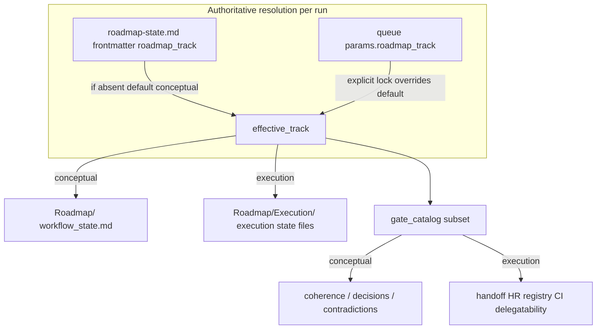

# Conceptual vs execution roadmap distinction

## Problem (current behavior)

- **Documentation** already defines dual tracks: [Dual-Roadmap-Track.md](3-Resources/Second-Brain/Docs/Dual-Roadmap-Track.md), [Vault-Layout.md](3-Resources/Second-Brain/Vault-Layout.md) (optional `roadmap_track` on `roadmap-state.md`, `Roadmap/Execution/` + `workflow_state-execution.md` / `roadmap-state-execution.md`).
- **Runtime** often infers track from **queue** (`params.roadmap_track: conceptual`) and narrative in [roadmap-state.md](1-Projects/genesis-mythos-master/Roadmap/roadmap-state.md) while **conceptual `roadmap-state.md` frontmatter may omit `roadmap_track`** — so Layer 1, validators, and follow-ups disagree on "which map" is active.
- `**roadmap_handoff_auto**` and rollup language (HR, REGISTRY-CI, `missing_roll_up_gates`) still run on **conceptual** runs ([Watcher-Result.md](3-Resources/Watcher-Result.md) examples), which drives **execution-shaped** repair loops (`handoff-audit`, `recal`) even when `track_lock_explicit: true` blocks pivot — i.e. **same gate story, no exit**.

## Target architecture

**Rule:** Every RESUME_ROADMAP / ROADMAP_MODE run computes `**effective_track`** once (document the precedence in one place): e.g. explicit `params.roadmap_track` when `track_lock_explicit` **or** user intent; else `roadmap-state.md` `roadmap_track`; else `**conceptual`**.

---

## Workstream A — Authoritative state and queue contract

| Change                                                                                                                                                                      | Where                                                                                                                                                                                                                           |
| --------------------------------------------------------------------------------------------------------------------------------------------------------------------------- | ------------------------------------------------------------------------------------------------------------------------------------------------------------------------------------------------------------------------------- |
| Require or strongly recommend `**roadmap_track`** on `roadmap-state.md` (default `conceptual` when absent — document as explicit default in resolver, not silent ambiguity) | [Vault-Layout.md](3-Resources/Second-Brain/Vault-Layout.md), [Parameters.md](3-Resources/Second-Brain/Parameters.md), project `roadmap-state.md` templates / existing projects (data migration note, not code)                  |
| Document `**effective_track` resolution order** (single table)                                                                                                              | [Queue-Sources.md](3-Resources/Second-Brain/Queue-Sources.md) RESUME_ROADMAP section, [Dual-Roadmap-Track.md](3-Resources/Second-Brain/Docs/Dual-Roadmap-Track.md)                                                              |
| Ensure **Prompt crafter / schema** surfaces `roadmap_track` with clear semantics (lock vs default)                                                                          | [User-Questions-and-Options-Reference.md](3-Resources/Second-Brain/User-Questions-and-Options-Reference.md) if roadmap branch lists it; [Prompt-Crafter-Param-Table.md](3-Resources/Second-Brain/Prompt-Crafter-Param-Table.md) |

**Layer 1:** [queue.mdc](.cursor/rules/agents/queue.mdc) — when building `layer1_resolver_hints`, set `**blocked_track`** / default track from `**effective_track`** derived from **state file first**, then merged queue params (align with existing `track_lock_explicit` behavior).

---

## Workstream B — Skills and Roadmap subagent file targeting

| Change                                                                                                                                                                                                                          | Where                                                                                                                        |
| ------------------------------------------------------------------------------------------------------------------------------------------------------------------------------------------------------------------------------- | ---------------------------------------------------------------------------------------------------------------------------- |
| **roadmap-deepen**, **roadmap-resume**, **roadmap-audit**, **roadmap-advance-phase**, **hand-off-audit**: confirm read/write paths switch on `**effective_track`** (`Roadmap/` vs `Roadmap/Execution/` + execution state files) | Skills under [.cursor/skills/](.cursor/skills/) (e.g. [roadmap-deepen/SKILL.md](.cursor/skills/roadmap-deepen/SKILL.md))     |
| **Roadmap subagent** instructions mirror the same resolution and forbid writing execution files when `effective_track === conceptual`                                                                                           | [.cursor/agents/roadmap.md](.cursor/agents/roadmap.md), [.cursor/rules/agents/roadmap.mdc](.cursor/rules/agents/roadmap.mdc) |

---

## Workstream C — Gate catalog and validator behavior by track

| Change                                                                                                                                                                                                                                                      | Where                                                                                                                                                                                                                 |
| ----------------------------------------------------------------------------------------------------------------------------------------------------------------------------------------------------------------------------------------------------------- | --------------------------------------------------------------------------------------------------------------------------------------------------------------------------------------------------------------------- |
| Add a **documented gate catalog** split: **Conceptual** (e.g. contradictions, stale cursor vs workflow_state, open decision gaps) vs **Execution** (HR thresholds, REGISTRY-CI, roll-up tables, junior handoff bundle)                                      | New or extended doc under [3-Resources/Second-Brain/Docs/](3-Resources/Second-Brain/Docs/) + cross-link from [Validator-Tiered-Blocks-Spec](3-Resources/Second-Brain/Docs/Validator-Tiered-Blocks-Spec.md) if present |
| **Validator subagent / roadmap_handoff_auto**: accept `roadmap_track` or `effective_track` in params; **downgrade or skip** execution-only checks when `conceptual` (e.g. treat `missing_roll_up_gates` as informational / different `primary_code` family) | [.cursor/agents/validator.md](.cursor/agents/validator.md) + [agents/validator.mdc](.cursor/rules/agents/validator.mdc) + hand-off from [queue.mdc](.cursor/rules/agents/queue.mdc)                                   |
| **Queue post-L1 / A.5b repair policy**: do not append **repair-first** `handoff-audit` / `recal` for **conceptual** when the only failures are **execution-gate** codes unless operator opts in                                                             | [queue.mdc](.cursor/rules/agents/queue.mdc)                                                                                                                                                                           |

**Deterministic gate script:** [scripts/queue-gate-compute.py](scripts/queue-gate-compute.py) (if present) — tag streak keys with `**track`** so conceptual and execution streaks do not collide; filter applicable gates by track.

---

## Workstream D — Follow-ups and smart-dispatch

| Change                                                                                                                                                                                                                                                         | Where                                                                                                                             |
| -------------------------------------------------------------------------------------------------------------------------------------------------------------------------------------------------------------------------------------------------------------- | --------------------------------------------------------------------------------------------------------------------------------- |
| **Smart dispatch** "target reached" / handoff gate: branch on `**effective_track`** (conceptual completion = outline/decision stability; execution = existing handoff_readiness / min_handoff_conf)                                                            | [.cursor/rules/agents/roadmap.mdc](.cursor/rules/agents/roadmap.mdc) (and [.cursor/agents/roadmap.md](.cursor/agents/roadmap.md)) |
| `**queue_followups` defaults**: conceptual — cap deepen/recal spirals, prefer `queue_next: false` or wrapper after N same `gate_signature`; execution — retain current repair chains                                                                           | Same + [Queue-Sources.md](3-Resources/Second-Brain/Queue-Sources.md) `effective_followup_required` notes                          |
| **Gate-block pivot** ([queue.mdc](.cursor/rules/agents/queue.mdc) A.5c): when `track_lock_explicit` and `need_class: gate_block`, emit **human Decision Wrapper** instead of same-track repair loop (today pivot is suppressed but execution gates still fire) | queue.mdc + [Roadmap-Decisions](Ingest/Decisions/Roadmap-Decisions/) pattern                                                      |

---

## Workstream E — Explicit transition (conceptual to execution)

| Change                                                                                                                                                                                                                                                                   | Where                                                                                                                                                         |
| ------------------------------------------------------------------------------------------------------------------------------------------------------------------------------------------------------------------------------------------------------------------------ | ------------------------------------------------------------------------------------------------------------------------------------------------------------- |
| Optional `**RESUME_ROADMAP` action** (e.g. `bootstrap-execution-track`) or documented **queue mode** that: creates `Roadmap/Execution/` from template, sets `roadmap_track: execution` on conceptual `roadmap-state.md`, stamps freeze on conceptual notes per checklist | [Queue-Sources.md](3-Resources/Second-Brain/Queue-Sources.md), [Vault-Layout.md](3-Resources/Second-Brain/Vault-Layout.md) flip checklist, roadmap agent enum |
| Keeps **dual-roadmap-track.mdc** freeze rules intact (no destructive edits to frozen conceptual without unfreeze)                                                                                                                                                        | [.cursor/rules/context/dual-roadmap-track.mdc](.cursor/rules/context/dual-roadmap-track.mdc)                                                                  |

---

## Workstream F — Backbone sync

Per [backbone-docs-sync.mdc](.cursor/rules/always/backbone-docs-sync.mdc): update [Pipelines.md](3-Resources/Second-Brain/Pipelines.md), [Cursor-Skill-Pipelines-Reference.md](3-Resources/Cursor-Skill-Pipelines-Reference.md), and mirror [.cursor/sync/](.cursor/sync/) rules for queue/roadmap/validator changes; append [.cursor/sync/changelog.md](.cursor/sync/changelog.md).

---

## Verification (manual)

1. Project with `**roadmap_track: conceptual`** on `roadmap-state.md`: run RESUME_ROADMAP deepen — **no** execution-only validator codes as hard blockers (or mapped to advisory).
2. Flip to **execution** (checklist): deepen writes under `**Roadmap/Execution/`** only; conceptual notes unchanged.
3. Layer 1 continuation line includes `**effective_track`** and **gate_catalog_id** (or equivalent) for traceability.

## Out of scope (unless you expand later)

- Rewriting existing genesis phase notes (content migration).
- Changing Obsidian MCP server code.

