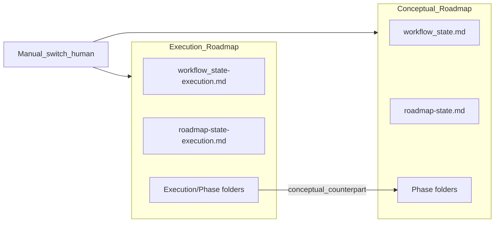

# Conceptual vs execution roadmaps (parallel tree + advisory flags)

## Goals (from you)

- **Manual only**: switching from conceptual mapping to “actual” execution is a deliberate human action (no auto-flip).
- **Advisory diminishing returns**: the system **flags** when further iteration is likely low value; it does not need to hard-block deepen (aligns with existing “guidance only” iteration ranges in [3-Resources/Second-Brain-Config.md](3-Resources/Second-Brain-Config.md) `iteration_guidance_ranges`).
- **Frozen conceptual maps without `.cursorignore`**: conceptual notes stay **readable** in Cursor/Obsidian; protection is **contractual** (frontmatter + agent rules + skill gates), not filesystem hiding.
- **Parallel execution tree**: new files/folders **beside** the conceptual tree, each execution note **linked** to its conceptual counterpart.

## Recommended layout (single convention to document)

Keep today’s tree as the **conceptual** canonical location under `[1-Projects/<project_id>/Roadmap/](3-Resources/Second-Brain/Vault-Layout.md)` (phase folders, `workflow_state.md`, `roadmap-state.md`, etc.).

Add a **parallel root** for execution:

- `1-Projects/<project_id>/Roadmap/Execution/` — mirrors **folder depth** under `Roadmap/` (e.g. `Execution/Phase-1-<Name>/…`) using the same naming discipline as [Roadmap Structure.md](Roadmap%20Structure.md) where possible, with an explicit **Execution** segment so paths are unambiguous.

**Linking contract (frontmatter)**

- On **execution** notes: `conceptual_counterpart: "Roadmap/Phase-1-…/…md"` (wikilink or path string per your existing convention).
- On **conceptual** notes (optional, set when execution mirror exists): `execution_mirror: "Roadmap/Execution/Phase-1-…/…md"`.

**State files**

- **Conceptual** state remains: `workflow_state.md`, `roadmap-state.md` (frozen in place when execution starts; see below).
- **Execution** state (new): `Roadmap/Execution/workflow_state-execution.md` and `Roadmap/Execution/roadmap-state-execution.md` (or shorter names if you prefer, but **two distinct files** avoid mixing Log tables and `current_subphase_index` across tracks).

Rationale: duplicate state avoids accidental writes to conceptual logs during execution deepen/recal and keeps rollback story simple (“delete Execution subtree” vs “diff conceptual”).

## Manual switch (product behavior)

Define a **single project-level switch** (choose one place and document it as canonical):

- **Option A (preferred)**: frontmatter on `roadmap-state.md`: e.g. `roadmap_track: conceptual | execution` plus `conceptual_frozen_at: YYYY-MM-DDTHHMM` when flipped.
- **Option B**: dedicated small note `Roadmap/track-switch.md` with the same fields (easier to find for humans).

**Flip checklist (docs + optional Commander macro)**

1. Snapshot conceptual artifacts (already required before state writes per [mcp-obsidian-integration](.cursor/rules/always/mcp-obsidian-integration.mdc)).
2. Set `roadmap_track: execution` (and timestamp).
3. Stamp **all conceptual roadmap notes** under `Roadmap/` (excluding the new `Execution/` subtree) with `roadmap_track: conceptual` + `frozen: true` (bulk pass can be a one-time queue mode or manual script **via MCP only** per vault rules—no shell `mv`).
4. Bootstrap `Roadmap/Execution/` structure + execution state files from new templates (see below).
5. Seed execution tree: either mirror-on-demand (first deepen creates counterpart) or upfront clone of skeleton with links only (your choice; plan should default to **mirror-on-demand** to reduce duplication).

## Immutability (no ignore files)

**Agent contract** (add to roadmap-related rules + [core-guardrails](.cursor/rules/always/core-guardrails.mdc) or a focused context rule):

- If a note has `frozen: true` and `roadmap_track: conceptual`, pipelines **must not** perform destructive MCP writes (`obsidian_update_note` overwrite of body, `obsidian_move_note`, `obsidian_rename_note`, split/distill that rewrites) **except**:
  - user-explicit **override** queue mode (documented name, e.g. `ROADMAP_UNFREEZE_CONCEPTUAL` with `approved: true` on a wrapper), or
  - **append-only audit** lines if you ever allow a narrow exception (default: no).

Reads (`obsidian_read_note`, search, Dataview) stay unrestricted—no `.cursorignore`.

**Optional Obsidian-side**: “Frozen” is still visible; plugins don’t enforce this—**Cursor rules + skill checks** are the enforcement layer.

## Diminishing returns (advisory only)

Leverage data you already log in `[workflow_state` ## Log](3-Resources/Second-Brain/Vault-Layout.md): Target, Confidence, Util Delta %, repeated `current_subphase_index`, `iterations_per_phase`.

**Config** (in [Second-Brain-Config.md](3-Resources/Second-Brain-Config.md) under `roadmap:` or `prompt_defaults.roadmap:`):

- `diminishing_returns_advisory_enabled: true`
- `diminishing_returns_window_runs: 5` (parse last N log rows)
- Triggers (examples—all **soft**):
  - same `Target` / same `current_subphase_index` for **W** consecutive successful deepens **and**
  - Confidence not increasing by more than **epsilon** (e.g. 3 points) run-over-run **or**
  - iterations for depth exceed `iteration_guidance_ranges` **ceiling** (already “guidance only”—use as **signal**, not block).

**Outputs** (pick one or combine):

- Append to **Status / Next** on the next log row: e.g. `advisory: diminishing-returns-suspected (reason: …)`
- Short entry in [3-Resources/Mobile-Pending-Actions.md](3-Resources/Mobile-Pending-Actions.md) linking to `workflow_state` (optional)
- Run-Telemetry `internals` field (already used for roadmap runs)

**Important**: do not tie this to auto phase-advance or auto-freeze; it is **informational** for the human deciding whether to flip to execution or retarget the queue.

## Cross-pipeline interlinking (conceptual + execution)

**Principle:** `roadmap-deepen` (per track) owns **creating** the execution mirror row and setting `**conceptual_counterpart` / `execution_mirror`** once per pair. Other pipelines **heal, enrich, and navigate** the graph over time—especially after renames under `Roadmap/Execution/`—without relying on a single skill.

### Execution track (ongoing)

| Pipeline / agent                       | Role for interlinking                                                                                                                                                                                                  |
| -------------------------------------- | ---------------------------------------------------------------------------------------------------------------------------------------------------------------------------------------------------------------------- |
| **Ingest / frontmatter-enrich**        | New notes under `Roadmap/Execution/`: set `roadmap_track: execution`, `project-id`, `conceptual_counterpart` (from path rules or manifest from roadmap run), populate `links` (master, PMG, distilled-core as needed). |
| **Organize**                           | Validate execution subtree placement; fix **broken or missing** counterpart links; moves/renames **execution only** (conceptual frozen notes untouched).                                                               |
| **Distill**                            | Optional lens (e.g. “diff vs conceptual”) so TL;DR/highlights **semantically** tie back to the frozen source, not only the wikilink.                                                                                   |
| **Express / related-content-pull**     | Pull **conceptual counterpart** (+ optional sibling conceptual phase notes) into Related so “why this execution note exists” stays one click away.                                                                     |
| **Research-agent-run**                 | Vault-first prioritizes conceptual mirror path + phase notes; synthesized ingest notes link back to **both** execution and conceptual anchors.                                                                         |
| **Validator**                          | Optional pass (e.g. `roadmap_mirror_integrity`): valid `conceptual_counterpart`, matching `subphase-index` / folder shape, optional reverse link; tier advisory vs block-for-handoff per config.                       |
| **Internal Repair / little-val**       | Structured gaps: `missing_conceptual_counterpart`, `stale_execution_mirror` → queue follow-up; **no** silent fixes on frozen conceptual.                                                                               |
| **Garden review**                      | Scope: orphans, broken links in **Execution/**; conceptual notes that reference missing execution mirrors.                                                                                                             |
| **CURATE CLUSTER**                     | Cluster by `project-id` + `roadmap_track` to spot missing mirrors or lopsided density.                                                                                                                                 |
| **next-action-extract / task-reroute** | Tasks extracted from execution notes carry upward links (parent execution + conceptual counterpart) in frontmatter or first-line convention.                                                                           |
| **Hub / MOC / Dataview**               | Project roadmap MOC: two blocks (conceptual tree vs execution tree), `SORT subphase-index`, so navigation reinforces the dual graph.                                                                                   |

### Conceptual track (symmetric, lifecycle-aware)

| Phase                                | Interlinking behavior                                                                                                                                                                                                                                                                                                                                                                                                                         |
| ------------------------------------ | --------------------------------------------------------------------------------------------------------------------------------------------------------------------------------------------------------------------------------------------------------------------------------------------------------------------------------------------------------------------------------------------------------------------------------------------- |
| **Pre-freeze (conceptual editable)** | Same intensity as execution: **Ingest** normalizes `roadmap_track: conceptual`, `links` to master/PMG/siblings; **Organize** fixes conceptual tree paths and internal wikilinks; **Distill / express** improve MOC clarity and Related; **Research** links vault sources into phase notes; **Garden / curate** on conceptual-only scope; **Validator** structural checks (coverage, upward links) **before** calling the map ready to freeze. |
| **Post-freeze**                      | Pipelines still **read** conceptual notes for context, Related, research seeds, validation. **Destructive** MCP on frozen conceptual notes stays **blocked** (distill rewrite, organize move, bulk frontmatter). Safe enhancements: **advisory** only (wrapper, Errors.md, Mobile-Pending-Actions, validator report) or edits on **non-frozen** notes (execution mirrors, hubs, ingest outputs) that **point into** conceptual sources.       |

### Documentation wiring

- Extend [Cursor-Skill-Pipelines-Reference](3-Resources/Cursor-Skill-Pipelines-Reference.md) (and per-pipeline context rules where touchpoints exist) with a short **“Dual roadmap graph”** subsection: frozen conceptual read rules, execution write rules, and which pipeline owns link repair.
- Optional: Parameters.md table of frontmatter keys (`roadmap_track`, `frozen`, `conceptual_counterpart`, `execution_mirror`) and **pre-freeze vs post-freeze** pipeline matrix (read-only row for frozen conceptual destructive ops).

## Skill / pipeline changes (high level)

- `**[.cursor/skills/roadmap-deepen/SKILL.md](.cursor/skills/roadmap-deepen/SKILL.md)`**: branch on active track (read conceptual `roadmap-state` or execution `roadmap-state-execution`). Apply pre-mint / handoff gates to execution track per your prior design discussion; keep conceptual path either read-only when frozen or unused when `roadmap_track: execution`. Re-point “create folder/note” roots to `Roadmap/Execution/…` when in execution mode. On first creation of an execution counterpart, set `**conceptual_counterpart`** (and optionally queue a follow-up for conceptual `**execution_mirror**` via a non-destructive ingest-style pass if reverse links are desired and conceptual is not yet frozen).
- `**[.cursor/agents/roadmap.md](.cursor/agents/roadmap.md)`** (and queue normalization if needed): pass `roadmap_track` into hand-off blocks; document RESUME-ROADMAP params override for `track: execution | conceptual` when you need rare conceptual edits post-flip.
- **Templates**: add under `Templates/Roadmap/Execution/` (or `Templates/Roadmap/Artifacts/Execution/`) for execution phase notes + execution state bootstraps, mirroring fields from existing [Templates/Roadmap/Artifacts/](Templates/Roadmap/Artifacts/) but with `roadmap_track: execution` and `conceptual_counterpart`.
- **Other pipelines**: implement touchpoints listed in **Cross-pipeline interlinking** (above); no single mega-skill—distributed hooks + docs.

## Documentation and sync (required by your backbone)

- Update [3-Resources/Second-Brain/Vault-Layout.md](3-Resources/Second-Brain/Vault-Layout.md) § Roadmap state artifacts: conceptual vs execution paths, frozen semantics, dual state files.
- Update [Roadmap Structure.md](Roadmap%20Structure.md) Mermaid + nesting section for `Execution/` subtree and link fields.
- Update [3-Resources/Second-Brain/Parameters.md](3-Resources/Second-Brain/Parameters.md) with new frontmatter keys and queue override name(s).
- Update [Pipelines.md](3-Resources/Second-Brain/Pipelines.md) / [Cursor-Skill-Pipelines-Reference](3-Resources/Cursor-Skill-Pipelines-Reference.md) if new queue mode for unfreeze.
- **backbone-docs-sync**: mirror rule changes to `[.cursor/sync/](.cursor/sync/)` per [backbone-docs-sync.mdc](.cursor/rules/always/backbone-docs-sync.mdc).

## Testing / rollout

- One pilot `project_id`: flip switch once, verify (1) conceptual note opens in Cursor, (2) agent refuses edit on frozen conceptual without override, (3) execution deepen creates only under `Roadmap/Execution/`, (4) diminishing-returns advisory appears in Log after scripted repeated targets.

## Open choice (you can decide during implementation)

- **Mirror-on-demand** vs **bulk skeleton clone** at flip time for the execution tree. Default in this plan: **mirror-on-demand** to minimize duplicate maintenance.

