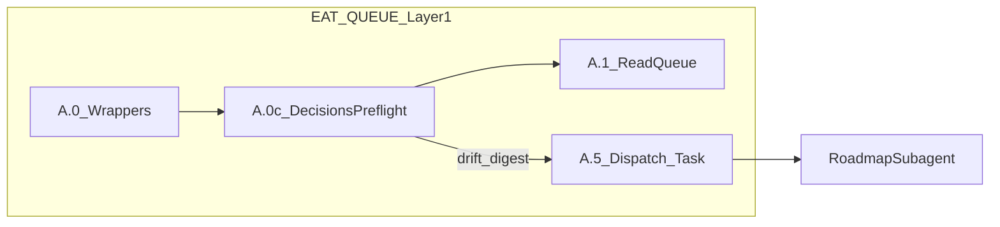

# Decision usage: preflight skill + queue integration

## Goal

When you lock picks in `[decisions-log.md](1-Projects/genesis-mythos-master/Roadmap/decisions-log.md)`, the system should **notice** and **act** without one queue entry per `D-`*. The minimal safe design is: **detect drift** (decisions-log vs stale rollup/state text) and **feed that into the next roadmap run**; **automatic multi-file reconciliation** is a separate, higher-risk phase.

## Current gap (as-is)

- `[roadmap-deepen/SKILL.md](.cursor/skills/roadmap-deepen/SKILL.md)` only injects a **tail** of `decisions-log.md` (truncated first if over cap)—no structured “resolved D-044 / D-032 / …” digest.
- `[agents/queue.mdc](.cursor/rules/agents/queue.mdc)` **A.0** runs **Ingest/Decisions** wrappers only; nothing runs for **Roadmap/decisions-log.md** before dispatch.
- No grep-stable **contract** for “operator pick logged” beyond narrative rows in [decisions-log](1-Projects/genesis-mythos-master/Roadmap/decisions-log.md).

## Architecture (v1 — read-only preflight + inject)

1. **Convention doc** (short): document **operator-pick line patterns** for machine-assisted scans, e.g. `Operator pick logged (YYYY-MM-DD):`, `RegenLaneTotalOrder_v0 — Option A|B`, `ARCH-FORK-01|ARCH-FORK-02`, `D-032 — Option A|B`, and “D-037 defer / confirm” phrasing. Place under `[3-Resources/Second-Brain/Docs/](3-Resources/Second-Brain/Docs/)` (e.g. `Decisions-Log-Operator-Pick-Convention.md`) and link from `[Queue-Sources.md](3-Resources/Second-Brain/Queue-Sources.md)` + [decisions-log template](Templates/Roadmap/Artifacts/decisions-log.md) if applicable.
2. **New skill** `[.cursor/skills/decisions-preflight/SKILL.md](.cursor/skills/decisions-preflight/SKILL.md)` (read-only):
  - **Inputs:** `project_id`, `roadmap_dir` (default `1-Projects/<project_id>/Roadmap/`), optional `tracked_decision_ids` from Config.
  - **Steps:** Read `decisions-log.md`; extract **structured** map of tracked picks (regex per convention doc). Read **selected** downstream surfaces (configurable, default: `roadmap-state.md` consistency / HOLD paragraphs, optional `distilled-core.md` `core_decisions` excerpt)—**no writes**.
  - **Output (stable YAML or JSON block):** `decisions_fingerprint`, `resolved_ids`, `stale_surfaces[]` (each: `path`, `reason`, `suggested_action`: e.g. `recal` | `deepen_with_guidance` | `manual`), `recommendation`: `proceed` | `warn` | `block_dispatch` (v1 default `warn` only).
3. **Queue rule change** in `[agents/queue.mdc](.cursor/rules/agents/queue.mdc)` — new **A.0c** immediately **after A.0** and **before A.1** (mirror same insertion in `[context/auto-eat-queue.mdc](.cursor/rules/context/auto-eat-queue.mdc)` §0 for rollback parity):
  - Gate on **Second-Brain-Config** (new keys under `queue.decisions_preflight`: `enabled`, `apply_to_modes` default `["RESUME_ROADMAP","ROADMAP_MODE"]`, `tracked_decision_ids`, `stale_scan_paths`, `on_drift`: `inject_handoff` | `inject_only` | `off`).
  - When **enabled** and the **next dispatchable** entry (per existing per-project serialism / ordering) is a gated roadmap mode with resolvable `project_id`, run **decisions-preflight** in the **Queue subagent context** (orchestration + file reads—no `Task` for this step).
  - **Merge** the skill’s `drift_digest` / full structured block into the **hand-off** for that entry’s upcoming `Task(roadmap)` under a dedicated key, e.g. `dependency_decisions_preflight:` or `handoff_addendum.decisions_preflight`, so Roadmap always sees it even if deepen truncates the log tail.
  - **Optional:** append a single **Watcher-Result** meta line (`requestId: decisions-preflight-<run>`) when `stale_surfaces` non-empty (best-effort per `[watcher-result-append](.cursor/rules/always/watcher-result-append.mdc)`).
4. **Roadmap subagent** `[agents/roadmap.md](.cursor/agents/roadmap.md)` (and sync’d `[roadmap.mdc](.cursor/rules/agents/roadmap.mdc)`): one short § instructing: when `handoff_addendum.decisions_preflight` present, **surface** it at top of internal context for deepen/recal and **prefer** reconciling narrative (update roadmap-state bullets, phase note dual-track warnings) **in that same run** when `user_guidance` / params ask for it—still within normal Roadmap MCP rules and snapshots.
5. **Config** `[3-Resources/Second-Brain-Config.md](3-Resources/Second-Brain-Config.md)` + `[Parameters.md](3-Resources/Second-Brain/Parameters.md)`: document new `queue.decisions_preflight.`* keys and defaults (`enabled: false` for safe rollout).
6. **Docs + sync** (per `[backbone-docs-sync](.cursor/rules/always/backbone-docs-sync.mdc)`): update `[Queue-Sources.md](3-Resources/Second-Brain/Queue-Sources.md)`, `[Skills.md](3-Resources/Second-Brain/Skills.md)`, `[Pipelines.md](3-Resources/Second-Brain/Pipelines.md)` (EAT-QUEUE Step 0c); copy `[queue.mdc](.cursor/rules/agents/queue.mdc)` → `[.cursor/sync/rules/context/](.cursor/sync/rules/context/)` if your sync map includes agents (follow existing pattern for `queue`).

## Phase 2 (optional — bounded reconcile)

Only if you want **automatic edits** without a separate RESUME_ROADMAP line:

- Add `[decisions-reconcile/SKILL.md](.cursor/skills/decisions-reconcile/SKILL.md)` with **allow-listed paths** (e.g. `roadmap-state.md` only), **snapshot-before-write**, and Config `queue.decisions_preflight.auto_reconcile: false` default.
- **Either** call it from **Roadmap** start-of-run (preferred: stays inside roadmap snapshot discipline) **or** from Queue A.0c with explicit MCP calls (blurs “orchestration only”—not recommended unless documented as exception).

## Explicit non-goals (v1)

- New prompt-queue `mode` (not required if hand-off injection suffices).
- Parsing **entire** vault for contradictions (keep scan bounded).
- Replacing `[roadmap_handoff_auto](.cursor/agents/validator.md)` logic—optional later: add `reason_codes` / rubric lines for “decisions resolved but rollup stale” (separate small validator doc update).

## Rollout

1. Land convention doc + skill + Config (default **off**).
2. Enable for `genesis-mythos-master` in Config; run EAT-QUEUE with a RESUME line; confirm hand-off contains digest and Watcher meta line.
3. Tune `tracked_decision_ids` to **D-044, D-032, D-037, D-059** (and grow as needed).

