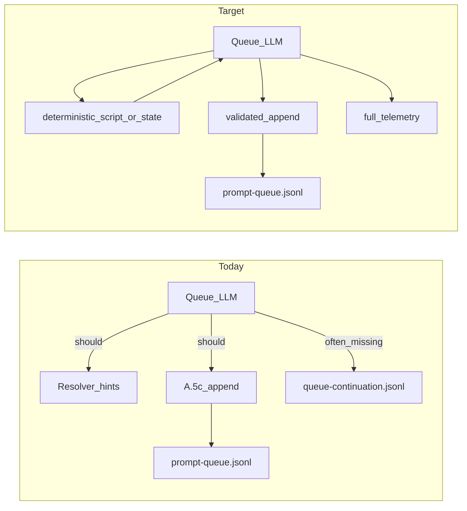

# Deterministic anti-spin and track pivot (draft changes)

## Problem statement

- **Observation path:** Chat agents read `[.technical/prompt-queue.jsonl](.technical/prompt-queue.jsonl)`, `[workflow_state.md](1-Projects/genesis-mythos-master/Roadmap/workflow_state.md)`, and `[.technical/queue-continuation.jsonl](.technical/queue-continuation.jsonl)` directly.
- **Automation path:** EAT-QUEUE runs the **Queue subagent**, which is instructed to compute resolver hints, streaks, and A.5c overrides in `[.cursor/rules/agents/queue.mdc](.cursor/rules/agents/queue.mdc)` (lines ~132–141, 207–222, 247–249, 281–282). [Second-Brain-Config](3-Resources/Second-Brain-Config.md) already sets `roadmap_next_need_enabled`, `gate_block_detection_enabled`, `prefer_track_shift_on_gate_block`, etc.
- **Gap:** There is **no executable implementation**—only prose. Continuation rows often omit `gate_block_signal` / `spin_signal` / `resolver_alignment` despite A.5e merge text. Streak counting is **in-memory** in the spec, so it does not survive inconsistent LLM runs.




## 1. Durable gate-streak state (deterministic memory)

**Add** a small append-friendly or atomic-update JSON file, e.g. `.technical/queue-gate-state.json` (or JSONL if you prefer audit trail).

- **Keys:** per `(project_id, gate_signature)` where `gate_signature` is normalized from `primary_code` / `post_little_val_summary` / `suppress_reason` (same precedence as queue.mdc ~138).
- **Fields:** `gate_streak`, `last_queue_entry_id`, `last_completed_iso`, `blocked_track` (inferred from `params.roadmap_track` or default), `pivot_to_track`.
- **Update rules:** After each roadmap entry is fully dispositioned (same moment as A.5e):
  - **Increment** streak on post–little-val **hard block** for RESUME_ROADMAP (align with A.5b hard-block definition in queue.mdc ~172).
  - **Decay/reset** on non-hard-block success per `queue.gate_block_same_track_cooldown_runs`.
- **Reader:** Layer 1 (and optional script) read this file **before** building the roadmap Task hand-off and **before** A.5c/A.5c.1 append.

**Docs:** Document schema and invariants in [Queue-Continuation-Spec](3-Resources/Second-Brain/Docs/Queue-Continuation-Spec.md) or a new short doc under `3-Resources/Second-Brain/Docs/` (e.g. `Queue-Gate-State-Spec.md`), and add a pointer from [Queue-Sources](3-Resources/Second-Brain/Queue-Sources.md) / [Parameters](3-Resources/Second-Brain/Parameters.md).

## 2. Deterministic helper script (optional but recommended)

**Add** a small script (Python 3, stdlib-only) e.g. `scripts/queue-gate-compute.py` (path negotiable; keep outside PARA ingest paths):

- **Inputs:** `--vault-root`, optional `--tail N` for continuation log, `--state-path` for gate state file.
- **Output:** JSON on stdout: `{ "gate_streak", "gate_signature", "need_class", "pivot_to_track", "blocked_track", "threshold_met": bool }` using Config thresholds (read YAML minimally or duplicate defaults with comment to sync with Config).
- **Modes:**
  - `report` — read-only (for operators).
  - `validate-line` — read a single proposed JSONL line from stdin; if `threshold_met` and line is same-track `deepen`/`recal`, print **mutated** line with `params.roadmap_track` set to `pivot_to_track` and add `user_guidance` suffix noting `layer1_gate_pivot_override`.

**Queue integration:** In [queue.mdc](.cursor/rules/agents/queue.mdc) A.5 / A.5c, add a **config-gated** step: when `queue.deterministic_gate_script_enabled: true` (new key in Second-Brain-Config), Layer 1 **must** run the script after post–little-val verdict and **must** use its JSON for override decisions (append still read-then-append JSONL only—script does not write vault except via optional separate `--write-state` if you want the script to own state updates instead of duplicating logic in prose).

*Alternative:* Implement state updates **only** in the script (single source of truth); Queue LLM calls script with `--record-outcome` after each dispatch. Pick one owner to avoid double-increment bugs.

## 3. Mandatory hand-off block (Layer 1 → Layer 2)

**Extend** [queue.mdc](.cursor/rules/agents/queue.mdc) resolver bullet (~137) with a **fixed markdown section** every RESUME_ROADMAP hand-off must include:

```markdown
## layer1_resolver_hints
```yaml
need_class: ...
effective_action: ...
effective_target: ...
pivot_to_track: ...   # null if N/A
gate_streak: N
gate_signature: "..."
track_lock_explicit: true|false  # from params
```

```

**Update** `[.cursor/agents/roadmap.md](.cursor/agents/roadmap.md)` (resolver section ~91–95): require parsing this block **first**; if `need_class: gate_block` and `pivot_to_track` set and not `track_lock_explicit`, **must** set `params.roadmap_track` on emitted `queue_followups.next_entry` and avoid same-track `deepen`/`recal` unless user-locked.

## 4. A.5e continuation telemetry (non-optional when flags on)

**Tighten** [queue.mdc](.cursor/rules/agents/queue.mdc) A.5e (~280–282):

- When `queue.gate_block_detection_enabled` or `queue.spin_detection_enabled` is true and mode is RESUME_ROADMAP, the continuation JSONL line **must** include keys:
  - `spin_signal` (object or explicit `{}` if computed empty)
  - `gate_block_signal` (object or `{}`)
  - `resolver_alignment` when post-dispatch comparison is possible; else `"skipped": true` with reason
- Extend [Queue-Continuation-Spec](3-Resources/Second-Brain/Docs/Queue-Continuation-Spec.md) table with these optional fields and version note (`schema_version` stays 1; document additive fields).

## 5. A.5c / A.5c.1 append guard (same-track loop)

**Clarify** in queue.mdc (already partially at ~222, ~247–249):

- **Order of operations:** Compute final `need_class` / `pivot_to_track` **after** reading durable gate state (and optional script), **then** apply override to **both** Layer-2-provided `next_entry` and Layer-1-synthesized A.5c.1 line.
- **Explicit test:** Before append, if `action in (deepen, recal)` and `params.roadmap_track == blocked_track` and `gate_streak >= threshold`, **reject** line and substitute pivoted line (deterministic template).

## 6. Config keys

In [Second-Brain-Brain-Config.md](3-Resources/Second-Brain-Config.md) under `queue:`:

- `deterministic_gate_script_enabled: false` (default off until script exists)
- `deterministic_gate_script_path: scripts/queue-gate-compute.py` (or chosen path)
- `gate_state_path: .technical/queue-gate-state.json` (optional; if absent, script/rule uses default)

## 7. Backbone sync

Per [backbone-docs-sync](.cursor/rules/always/backbone-docs-sync.mdc):

- Mirror `[.cursor/rules/agents/queue.mdc](.cursor/rules/agents/queue.mdc)` → `[.cursor/sync/rules/agents/queue.md](.cursor/sync/rules/agents/queue.md)`
- Update [Pipelines](3-Resources/Second-Brain/Pipelines.md) or [Cursor-Skill-Pipelines-Reference](3-Resources/Cursor-Skill-Pipelines-Reference.md) one short paragraph: “Layer 1 may run `queue-gate-compute` when enabled.”
- Append [.cursor/sync/changelog.md](.cursor/sync/changelog.md) one line.

## 8. Testing / acceptance

- **Fixture:** Seed `.technical/queue-gate-state.json` with `gate_streak: 2` for a fake signature; pass a synthetic `next_entry` deepen conceptual; confirm script outputs execution pivot.
- **Live:** After one EAT-QUEUE, grep last continuation line for non-empty `gate_block_signal` when `missing_roll_up_gates` repeats.

## Out of scope (explicit)

- Replacing the Queue subagent with a non-LLM queue processor (larger project).
- Changing Obsidian MCP or frozen conceptual roadmap notes.
```

