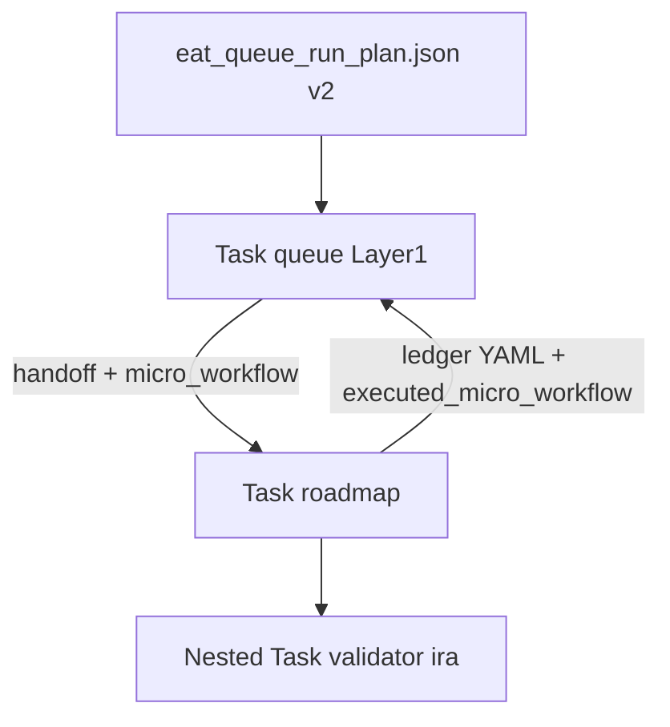

# Deterministic micro-workflows (eat_queue_core + rules)

## Reality boundary (must be explicit in docs)

- **Cursor `Task(roadmap)` / `Task(validator)` are still LLM subagents.** Python can emit an exact `**micro_workflow`** list and rules can require compliance, but **enforcement** is: (1) rule text + hand-off, (2) **post-hoc** validation of emitted YAML (golden tests + optional CLI), not compile-time guarantees.
- **Conflict:** `[.cursor/rules/agents/roadmap.mdc](.cursor/rules/agents/roadmap.mdc)` currently documents **Validator→IRA→apply→little val→final validator** (longer than your **three** repair steps). The implementation will follow **your** repair list for `micro_workflow` when `strict_mode: true` and add a short **“orchestrator-strict overrides narrative protocol”** note in roadmap.mdc so the two contracts do not silently diverge without explanation.

## 1. Package: models + workflows + emission

**Files:** `[scripts/eat_queue_core/models.py](scripts/eat_queue_core/models.py)`, `[scripts/eat_queue_core/plan.py](scripts/eat_queue_core/plan.py)`, optionally small new `[scripts/eat_queue_core/workflows.py](scripts/eat_queue_core/workflows.py)` if `plan.py` would exceed the project’s LOC budget.

- `**DispatchIntent`** (extend):
  - `micro_workflow: list[str]` — **required** (non-empty).
  - `allowed_sub_steps: dict[str, list[str]] | None = None`
  - `strict_mode: bool = True`
- `**EatQueueRunPlan`:** bump `**schema_version` to `2`** (breaking for old JSON without `micro_workflow`; document in `[Python-Queue-Orchestrator.md](3-Resources/Second-Brain/Docs/Python-Queue-Orchestrator.md)`).
- **Central table** in Python (single source of truth), e.g.:

  | Key                                   | `micro_workflow`                                                                                             |
  | ------------------------------------- | ------------------------------------------------------------------------------------------------------------ |
  | `resume_roadmap_deepen_forward`       | `["roadmap_core", "nested_validator_first", "ira", "nested_validator_second", "l1_post_lv"]` (per your spec) |
  | `resume_roadmap_repair_handoff_audit` | `["validator", "ira", "final_validator"]` (per your spec)                                                    |
  | Fallback / unknown action             | explicit default list from table (e.g. `other_roadmap`) — **no** empty workflow                              |

- `**build_plan`:** when constructing each `DispatchIntent`, set `**micro_workflow`** (and optional `**allowed_sub_steps`**) from `**queue_pass_phase`** + repair vs forward + `**params.action**` (e.g. `deepen` vs `handoff-audit`) parsed from `**QueueEntry**`.
- `**validate_ledger_steps_executed(expected: list[str], ledger_yaml: str) -> bool**` (or return structured errors): parse fenced YAML for `nested_subagent_ledger` / `steps` (minimal subset aligned with [Nested-Subagent-Ledger-Spec](3-Resources/Second-Brain/Docs/Nested-Subagent-Ledger-Spec.md) field names) and check **order** of executed steps matches `**expected`** (prefix or exact match — **specify exact match** in tests). Used by tests and optionally a `**validate-ledger`** CLI later.

## 2. Cursor rules (orchestrator path only)

**When:** `python_orchestrator_enabled: true` **and** `.technical/eat_queue_run_plan.json` exists and matches `**parent_run_id`** (per existing **A.0.5**).

**Files to touch (narrow inserts, no full refactors):**

- `[.cursor/rules/agents/queue.mdc](.cursor/rules/agents/queue.mdc)` — **A.0.5**: pass full `**DispatchIntent`** (including `micro_workflow`, `strict_mode`) into each `**Task`** hand-off; **hard fail** on deviation: append Watcher-Result `**status: failure`**, message tag `**orchestrator_micro_workflow_violation`**, return control to Queue.
- `[.cursor/rules/agents/roadmap.mdc](.cursor/rules/agents/roadmap.mdc)` — When hand-off includes `**micro_workflow**` (and optional `**strict_mode: true**`): execute **only** those steps **in order**; **skip** legacy nested IRA/validator branches that are not listed; **no** “extra” L1 post-LV inside roadmap if not in list (L1 remains Queue’s job unless listed). After last step, return once with **required** fenced YAML: `**nested_subagent_ledger`** + `**executed_micro_workflow`** (array echoing completed step ids in order).
- `[.cursor/rules/agents/validator.mdc](.cursor/rules/agents/validator.mdc)` — When invoked as part of orchestrator chain: **must not** spawn additional validators; **single** pass per `Task(validator)` call.
- **IRA:** `[.cursor/agents/internal-repair-agent.md](.cursor/agents/internal-repair-agent.md)` (and/or add `**.cursor/rules/agents/internal-repair-agent.mdc`** only if one exists; if not, **agents** file only per your repo) — same: if `strict_mode` in hand-off, **no** extra cycles.

**Fallback:** `python_orchestrator_enabled: false` **or** plan missing → **legacy** behavior; add **stderr or Watcher-Result “loud” advisory** when Config says orchestrator on but plan missing (align with existing `[warn_orchestrator_plan_missing](scripts/queue-gate-compute.py)` and `[queue.mdc](.cursor/rules/agents/queue.mdc)` **A.0.5**).

**Sync:** mirror `[queue.mdc](.cursor/rules/agents/queue.mdc)` changes to `[.cursor/sync/rules/agents/queue.md](.cursor/sync/rules/agents/queue.md)`; update `[.cursor/sync/changelog.md](.cursor/sync/changelog.md)` per backbone-docs-sync.

## 3. Tests

**Files:** `[3-Resources/Second-Brain/tests/unit/test_eat_queue_core_golden.py](3-Resources/Second-Brain/tests/unit/test_eat_queue_core_golden.py)`, new fixtures under `[3-Resources/Second-Brain/tests/fixtures/eat_queue/](3-Resources/Second-Brain/tests/fixtures/eat_queue/)`.

- **Test 1 — normal deepen:** fixture with forward **RESUME_ROADMAP deepen**; assert each intent’s `**micro_workflow`** equals the **deepen** row from the central table.
- **Test 2 — repair:** fixture with repair line; assert `**micro_workflow == ["validator", "ira", "final_validator"]`** (exact).
- **Test 3 — ledger validation:** sample YAML fixture with `steps` matching `micro_workflow`; call `**validate_ledger_steps_executed`**; assert pass/fail.
- **Test 4 — deviation:** sample ledger missing a step → assert validation fails.

## 4. Docs

- Update `[Python-Queue-Orchestrator.md](3-Resources/Second-Brain/Docs/Python-Queue-Orchestrator.md)`: schema v2, `**micro_workflow`** semantics, repair vs deepen lists, limitation paragraph.

## 5. Diagram (runtime)

## Risk / follow-ups (out of scope for this pass)

- Persisting every Task return to disk for **automatic** “next plan run” validation (unless you add a convention path, e.g. `.technical/eat_queue_last_ledger.yaml`).
- Rewriting **all** pipeline modes (ingest, distill, …) — you asked roadmap-focused flows; table can be extended later.

