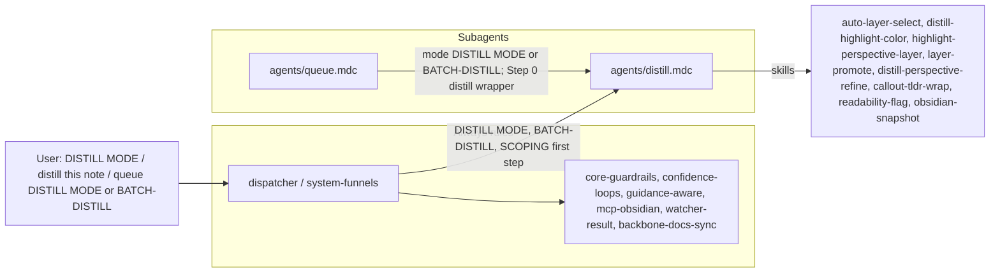

# DistillSubagent Refactor Plan

This plan follows the pattern in [queue-dispatcher-subagent-refactor](.cursor/plans/Rule-Refactor/queue-dispatcher-subagent-refactor_54b07695.plan.md), [queueprocessorsubagent_refactor](.cursor/plans/Rule-Refactor/queueprocessorsubagent_refactor_793d8e05.plan.md), and [ingestsubagent_refactor](.cursor/plans/Rule-Refactor/ingestsubagent_refactor_a0cadca0.plan.md), and aligns with the subagent architecture from the Grok output (dispatcher + dedicated subagents under `.cursor/rules/agents/`).

---

## 1. Goals

- **Isolate distill logic** into a single **DistillSubagent** so only that context + shared core guardrails are loaded when processing DISTILL MODE, "distill this note", BATCH-DISTILL, or queue entries with `mode: "DISTILL MODE"` / `"BATCH-DISTILL"`.
- **Preserve behavior**: No change to autonomous-distill pipeline order, confidence bands (high/mid/low, distill_conf, depth loop), Decision Wrapper creation (mid-band-refinement, low-confidence), **distill-apply-from-wrapper** (Step 0 re-run with approved_option as distill_lens), snapshot/backup gates, exclusions, or logging (Distill-Log.md, Backup-Log.md).
- **Introduce a single subagent context rule** `agents/distill.mdc` that encapsulates auto-distill, auto-distill-perspective (DISTILL LENS), and auto-highlight-perspective (HIGHLIGHT PERSPECTIVE); the dispatcher routes DISTILL MODE and related triggers to this subagent.
- **Forward-compatible**: When the dispatcher and QueueProcessorSubagent exist, DISTILL MODE and BATCH-DISTILL from the queue will be dispatched to DistillSubagent; Step 0 (wrapper apply) remains in the queue processor, which invokes **distill-apply-from-wrapper** and thus re-runs the pipeline defined in DistillSubagent.

---

## 2. Current state (source of truth)

- **Main pipeline rule**: [.cursor/rules/context/auto-distill.mdc](.cursor/rules/context/auto-distill.mdc) — Triggers: DISTILL MODE – safe batch autopilot, distill this note, refine this note; pipeline: backup → optional garden_review (batch >5) → optional auto-layer-select → distill layers → distill-highlight-color → layer-promote → callout-tldr-wrap → readability-flag; confidence bands (distill_conf, mid-band depth loop); Decision Wrappers (Refinements, Low-Confidence); snapshot triggers; exclusions (4-Archives, Backups, Logs, Hub).
- **Lens/perspective rules**: [.cursor/rules/context/auto-distill-perspective.mdc](.cursor/rules/context/auto-distill-perspective.mdc) — DISTILL LENS: [angle] → set `distill_lens` frontmatter, run autonomous-distill; [.cursor/rules/context/auto-highlight-perspective.mdc](.cursor/rules/context/auto-highlight-perspective.mdc) — HIGHLIGHT PERSPECTIVE: [lens] → set context (frontmatter or queue payload), run distill/highlight pass with `perspective`.
- **Queue dispatch**: [.cursor/rules/context/auto-eat-queue.mdc](.cursor/rules/context/auto-eat-queue.mdc) — DISTILL MODE → autonomous-distill (auto-distill); BATCH-DISTILL → autonomous-distill on scope (batch snapshot when > batch_size_for_snapshot); SCOPING MODE → DISTILL then EXPRESS on same note. Step 0: pipeline `distill` → **distill-apply-from-wrapper** (re-run autonomous-distill with approved_option as distill_lens).
- **Pipeline reference**: [3-Resources/Second-Brain/Cursor-Skill-Pipelines-Reference.md](3-Resources/Second-Brain/Cursor-Skill-Pipelines-Reference.md) — autonomous-distill order, snapshot triggers (before first structural rewrite, ~every 3 notes batch), skill table (auto-layer-select, distill-highlight-color, highlight-perspective-layer, layer-promote, distill-perspective-refine, callout-tldr-wrap, readability-flag), apply-from-wrapper (distill-apply-from-wrapper).
- **Funnel**: [.cursor/rules/always/system-funnels.mdc](.cursor/rules/always/system-funnels.mdc) — DISTILL MODE – safe batch autopilot, distill this note, refine this note → auto-distill.

All behavior to preserve lives in the three context rules above and the pipeline reference; the refactor moves that behavior into the DistillSubagent and leaves the dispatcher routing DISTILL MODE (and related phrases/queue modes) to it.

---

## 3. Target architecture

- **Dispatcher (always-on)**  
When trigger is DISTILL MODE, "distill this note", "refine this note", DISTILL LENS: [angle], HIGHLIGHT PERSPECTIVE: [lens], or queue entry `mode: "DISTILL MODE"` or `"BATCH-DISTILL"` (or SCOPING first step) → route to **DistillSubagent** (`agents/distill.mdc`). No distill logic in the dispatcher; only routing and shared core.
- **DistillSubagent (context)**  
New file: `.cursor/rules/agents/distill.mdc`.  
Encapsulates:
  1. **Trigger / entry**: Run when (a) user says DISTILL MODE, distill this note, refine this note, DISTILL LENS: [angle], HIGHLIGHT PERSPECTIVE: [lens], or (b) queue processor dispatches DISTILL MODE or BATCH-DISTILL, or (c) Step 0 invokes distill-apply-from-wrapper (re-run autonomous-distill on original_path with approved_option as distill_lens).
  2. **Flow**: Backup → optional garden_review (batch >5) → (auto-layer-select when enabled; read distill_lens from frontmatter) → optional mid-band depth loop → distill layers → distill-highlight-color → highlight-perspective-layer (optional) → layer-promote → distill-perspective-refine → callout-tldr-wrap → readability-flag; confidence bands and Decision Wrapper creation (Refinements, Low-Confidence) per confidence-loops; snapshot before first structural rewrite, batch ~every 3 notes.
  3. **Preserve verbatim**: Pipeline order; distill_conf and depth loop; distill_lens / perspective from frontmatter or wrapper; snapshot/backup gates; exclusions; Error Handling Protocol; Distill-Log.md and Backup-Log.md; research_distilled marker for agent-research notes.
- **Shared core (unchanged)**  
core-guardrails, confidence-loops, guidance-aware, mcp-obsidian-integration, watcher-result-append, backbone-docs-sync. DistillSubagent depends on these; no duplication of safety logic.

---

## 4. Concrete refactor steps

### 4.1 Create DistillSubagent file

- Ensure `.cursor/rules/agents/` exists (from QueueProcessorSubagent or earlier refactor).
- Create `**.cursor/rules/agents/distill.mdc`** with:
  - **Header**: Title "DistillSubagent"; short description: responsible for autonomous-distill (progressive summarization, highlights, TL;DR, readability); handles DISTILL MODE, BATCH-DISTILL, DISTILL LENS, HIGHLIGHT PERSPECTIVE; depends on shared always rules for safety.
  - **Globs**: Loaded when dispatcher routes DISTILL MODE (and variants) or when queue entry is DISTILL MODE / BATCH-DISTILL or Step 0 runs distill-apply-from-wrapper; scope: `1-Projects/`**, `2-Areas/`**, `3-Resources/**` (exclude 4-Archives, Backups, Logs, Hub, watcher-protected) per current auto-distill exclusions.
  - **Content source**: Merge the full behavior of:
    - auto-distill.mdc (pipeline order, triggers, confidence bands, snapshot triggers, Decision Wrappers, logging, exclusions),
    - auto-distill-perspective.mdc (DISTILL LENS: [angle] → set distill_lens, run pipeline),
    - auto-highlight-perspective.mdc (HIGHLIGHT PERSPECTIVE: [lens] → set context, run pipeline with perspective).
  - **Preserve verbatim**: Pipeline order from Cursor-Skill-Pipelines-Reference § autonomous-distill; snapshot triggers (before first structural rewrite; batch ~every 3 notes); loop_type "distill-depth"; distill-apply-from-wrapper contract (Step 0 calls skill, which re-runs this pipeline with approved_option as distill_lens override).
  - **Safety section**: State that DistillSubagent obeys Error Handling Protocol, confidence bands, guidance-aware, and Watcher exclusions via shared always rules; no new safety logic.

### 4.2 Skills and MCP usage

- **Skills used by DistillSubagent** (unchanged; reference only): auto-layer-select, distill-highlight-color, highlight-perspective-layer, layer-promote, distill-perspective-refine, callout-tldr-wrap, readability-flag, obsidian-snapshot. These remain under `.cursor/skills/` (optional later: group under `skills/distill/` for clarity; not required for this refactor).
- **distill-apply-from-wrapper**: Invoked by QueueProcessorSubagent Step 0 when applying an approved refinement wrapper with `pipeline: distill`; the skill re-runs the pipeline defined in DistillSubagent on `original_path` with `approved_option` as distill_lens/depth override. No change to Step 0 ownership; pipeline definition lives in DistillSubagent.
- **MCP**: create_backup, distill_note (if applicable), update_note, etc. — all as today; DistillSubagent invokes them per the same order and gates as auto-distill.

### 4.3 Wire dispatcher routing

- **DISTILL MODE** / **distill this note** / **refine this note** (phrase or queue `mode: "DISTILL MODE"`) → DistillSubagent (`agents/distill.mdc`).
- **BATCH-DISTILL** (queue) → DistillSubagent; batch snapshot when batch size > batch_size_for_snapshot.
- **SCOPING MODE** / **SCOPING** → first step: run DistillSubagent on same note (then ExpressSubagent); queue processor still orchestrates the two-step sequence.
- **DISTILL LENS: [angle]** / **HIGHLIGHT PERSPECTIVE: [lens]** → DistillSubagent (with lens/perspective set in context or frontmatter).
- **Step 0 (distill wrapper)**: When queue processor processes an approved wrapper with `pipeline: distill`, it runs distill-apply-from-wrapper, which re-runs autonomous-distill; that pipeline is defined in DistillSubagent.
- Update system-funnels (or dispatcher) so all distill-related triggers map to "DistillSubagent (agents/distill.mdc)".

### 4.4 Retire or slim context rules (after validation)

- **auto-distill.mdc**: Remove or slim to a one-line redirect: "On DISTILL MODE / distill this note, see DistillSubagent (agents/distill.mdc)." So the dispatcher is the single place that routes to DistillSubagent; this rule no longer contains pipeline logic.
- **auto-distill-perspective.mdc**, **auto-highlight-perspective.mdc**: Keep as fallback (unused by routing) until DistillSubagent is validated; then remove or archive. Do not delete before manual testing.

### 4.5 Documentation and sync

- **Queue-Sources.md**: Note that DISTILL MODE and BATCH-DISTILL are handled by DistillSubagent; params (e.g. distill_lens, scope) unchanged.
- **Cursor-Skill-Pipelines-Reference.md**: Add a short "DistillSubagent" subsection: DISTILL MODE, BATCH-DISTILL, and distill-apply-from-wrapper (Step 0) are handled by `agents/distill.mdc`; pipeline order and snapshot/confidence rules unchanged.
- **Pipelines.md** (if present): Align trigger table with "DistillSubagent (agents/distill.mdc)".
- **.cursor/sync**: Add `.cursor/sync/rules/agents/distill.md` mirroring `agents/distill.mdc`. Changelog entry in `.cursor/sync/changelog.md` for DistillSubagent.

### 4.6 Backbone and Rules docs

- **Rules.md** (or equivalent in 3-Resources/Second-Brain): Update trigger table so DISTILL MODE, distill this note, BATCH-DISTILL, DISTILL LENS, HIGHLIGHT PERSPECTIVE point to "DistillSubagent (agents/distill.mdc)".

---

## 5. Validation and rollback

- **Manual tests**:
  - Run **DISTILL MODE** (or "distill this note") on a single note: confirm pipeline order (backup → optional auto-layer-select → distill layers → distill-highlight-color → layer-promote → callout-tldr-wrap → readability-flag), snapshot before first structural rewrite, Distill-Log.md and Backup-Log.md entries.
  - Run **EAT-QUEUE** with a queue containing DISTILL MODE and BATCH-DISTILL entries: confirm same behavior, overlap detection for BATCH-DISTILL when applicable, batch snapshot when batch size > threshold.
  - Run **EAT-QUEUE** with an approved Decision Wrapper (mid-band-refinement, pipeline distill): confirm Step 0 runs distill-apply-from-wrapper and re-runs autonomous-distill on original_path with approved_option as distill_lens; Watcher-Result and logs correct.
  - **DISTILL LENS: beginner** and **HIGHLIGHT PERSPECTIVE: combat**: confirm distill_lens/perspective set and pipeline runs with lens.
- **Rollback**: Point dispatcher/funnels back to auto-distill (+ auto-distill-perspective, auto-highlight-perspective) until `agents/distill.mdc` is validated.

---

## 6. Out of scope (later work)

- Moving skills into `.cursor/skills/distill/` (optional structural cleanup).
- Changing Decision Wrapper template or A–G semantics for distill.
- Changing queue Step 0 (wrapper scan and apply-mode trigger) — it stays in QueueProcessorSubagent; only the definition of "autonomous-distill pipeline" moves into DistillSubagent.
- SCOPING MODE orchestration: queue processor still runs DISTILL then EXPRESS in sequence; this plan only moves the distill pipeline into DistillSubagent.
- Garden review (obsidian_garden_review for distill_candidates): remains an optional pre-step invoked by the pipeline; no change to that contract.

---

## 7. Files to add or touch

| Action      | Path                                                                                                                                 |
| ----------- | ------------------------------------------------------------------------------------------------------------------------------------ |
| Create      | `.cursor/rules/agents/distill.mdc` (DistillSubagent)                                                                                 |
| Update      | `.cursor/rules/always/dispatcher.mdc` or `system-funnels.mdc` (route DISTILL MODE / BATCH-DISTILL / lens triggers → DistillSubagent) |
| Slim/remove | `.cursor/rules/context/auto-distill.mdc` (after validation: redirect or remove)                                                      |
| Update      | `3-Resources/Second-Brain/Queue-Sources.md` (DISTILL MODE, BATCH-DISTILL → DistillSubagent)                                          |
| Update      | `3-Resources/Second-Brain/Cursor-Skill-Pipelines-Reference.md` (DistillSubagent subsection)                                          |
| Update      | `3-Resources/Second-Brain/Pipelines.md` or Rules.md (trigger table)                                                                  |
| Add         | `.cursor/sync/rules/agents/distill.md`                                                                                               |
| Append      | `.cursor/sync/changelog.md`                                                                                                          |

Do not delete `auto-distill-perspective.mdc` or `auto-highlight-perspective.mdc` until validation is complete.