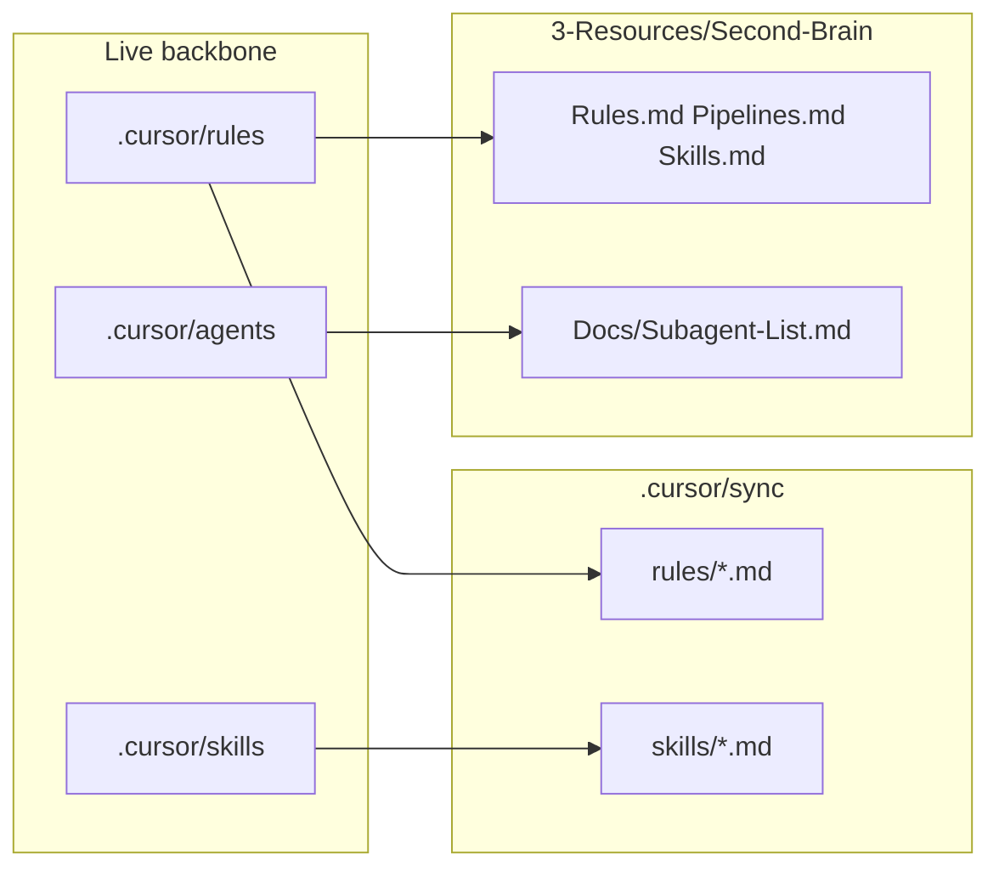

# Docs vs codebase alignment plan

## Current state (audit summary)

**Already well aligned**

- [Queue-Sources.md](3-Resources/Second-Brain/Queue-Sources.md), [Subagent-Safety-Contract.md](3-Resources/Second-Brain/Subagent-Safety-Contract.md), [Docs/Subagent-Layers-Reference.md](3-Resources/Second-Brain/Docs/Subagent-Layers-Reference.md), and [Cursor-Skill-Pipelines-Reference.md](3-Resources/Second-Brain/Cursor-Skill-Pipelines-Reference.md) describe dispatcher routing, `Task(queue)`, post–little-val **A.5b**, PromptCraft **A.5d** / **A.1b**, `little_val_ok` / `validator_context`, and queue continuation.
- [Docs/Always-Rules-Overview.md](3-Resources/Second-Brain/Docs/Rules/Always-Rules-Overview.md) and [Docs/Rules/Dispatcher-Rule.md](3-Resources/Second-Brain/Docs/Rules/Dispatcher-Rule.md) explicitly document [dispatcher.mdc](.cursor/rules/always/dispatcher.mdc).

**Gaps (docs not matching code / contract)**

| Area                                                                                | Issue                                                                                                                                                                                                                                                                                                                                                                                                                                                                                                                                                         |
| ----------------------------------------------------------------------------------- | ------------------------------------------------------------------------------------------------------------------------------------------------------------------------------------------------------------------------------------------------------------------------------------------------------------------------------------------------------------------------------------------------------------------------------------------------------------------------------------------------------------------------------------------------------------- |
| [Rules.md](3-Resources/Second-Brain/Rules.md) § Detailed Breakdown — Always-applied | **Missing row for `dispatcher.mdc`** (present on disk and cited elsewhere in the same file’s Quick Reference).                                                                                                                                                                                                                                                                                                                                                                                                                                                |
| [Rules.md](3-Resources/Second-Brain/Rules.md) § Examples                            | EAT-QUEUE example says the **agent** reads the queue and dispatches; canonical behavior is **Layer 0 → `Task(subagent_type: queue)`** per dispatcher + [Cursor-Skill-Pipelines-Reference.md](3-Resources/Second-Brain/Cursor-Skill-Pipelines-Reference.md). Wording should match.                                                                                                                                                                                                                                                                             |
| [Docs/Subagent-List.md](3-Resources/Second-Brain/Docs/Subagent-List.md)             | **Nested whitelist table** describes pipeline → Validator as *“Optional spot checks”* — this **contradicts** live [agents/*.mdc](.cursor/rules/agents/) (mandatory nested validator after little-val on Success) and [Subagent-Safety-Contract.md](3-Resources/Second-Brain/Subagent-Safety-Contract.md). Table should be rewritten to match contract: mandatory nested Validator with type-specific `validation_type` when `little_val_ok: true`; IRA per [internal-repair-agent.md](.cursor/agents/internal-repair-agent.md) when the repair cycle applies. |
| [Docs/Subagent-List.md](3-Resources/Second-Brain/Docs/Subagent-List.md)             | No **dedicated row** for **Internal Repair Agent** in the main table (IRA is only fully spelled out in Subagent-Layers-Reference / contract). Add a short row + pointer to `.cursor/agents/internal-repair-agent.md`.                                                                                                                                                                                                                                                                                                                                         |
| `[.cursor/sync/skills/](.cursor/sync/skills/)`                                      | Live vault has **51** `SKILL.md` files under `[.cursor/skills/](.cursor/skills/)`; sync has **49** mirrored `.md` files. **Missing mirrors:** `little-val-structural` and `todo-orchestrator` — violates [backbone-docs-sync.mdc](.cursor/rules/always/backbone-docs-sync.mdc) (“whenever … skills … changed, update … `.cursor/sync/`”).                                                                                                                                                                                                                     |
| [`.cursor/rules/agents/_template.mdc](.cursor/rules/agents/_template.mdc)           | Exists in repo; not mirrored under `.cursor/sync/rules/agents/`. Either add a brief note in [README](.cursor/sync/README.md) or Rules.md that templates are intentionally unsynced, or mirror once for completeness.                                                                                                                                                                                                                                                                                                                                          |
| `legacy-agents/*.mdc`                                                               | Eight files under `[.cursor/rules/legacy-agents/](.cursor/rules/legacy-agents/)` are **not** in `.cursor/sync` (sync scope is always + context per backbone). Optional: one sentence in Rules.md or sync README stating legacy rules are reference-only and not copied to sync.                                                                                                                                                                                                                                                                               |

## Safety and backup (before any edits)

Per [core-guardrails.mdc](.cursor/rules/always/core-guardrails.mdc) and [mcp-obsidian-integration.mdc](.cursor/rules/always/mcp-obsidian-integration.mdc), treat doc/sync work as **low-risk** (markdown only, no vault PARA moves), but honor “back up everything”:

1. **Git safety net:** `git status`, then commit or stash current work; optionally create a dated tag (e.g. `pre-docs-sync-YYYY-MM-DD`) so rollback is one command.
2. **Obsidian / MCP backup (if edits touch vault notes via MCP in a follow-up):** For any future batch that uses MCP on user notes, call `obsidian_ensure_backup` / `obsidian_create_backup` as required by the pipeline. For this pass, files are under `.cursor/` and `3-Resources/Second-Brain/` — **git is the primary backup**; optional: copy `3-Resources/Second-Brain` and `.cursor/rules` + `.cursor/skills` to a timestamped folder outside the repo if you want filesystem redundancy.

No destructive MCP operations are required for doc/sync updates.

## Implementation steps (after you approve execution)

1. **Mechanical sync (backbone-docs-sync)**
  - Copy [little-val-structural/SKILL.md](.cursor/skills/little-val-structural/SKILL.md) → `.cursor/sync/skills/little-val-structural.md`  
  - Copy [todo-orchestrator/SKILL.md](.cursor/skills/todo-orchestrator/SKILL.md) → `.cursor/sync/skills/todo-orchestrator.md`  
  - Re-verify: count `SKILL.md` under `.cursor/skills` equals `.md` count under `.cursor/sync/skills` (excluding any intentional exclusions).  
  - Append one line to `[.cursor/sync/changelog.md](.cursor/sync/changelog.md)`.
2. **Rules.md**
  - Add **dispatcher.mdc** to the always-applied table (route EAT-QUEUE / PROCESS TASK QUEUE → `Task(queue)`; defer detail to Dispatcher-Rule).  
  - Tighten the EAT-QUEUE example to say **dispatcher launches Queue subagent** (not inline queue logic in the parent).
3. **Docs/Subagent-List.md**
  - Replace “optional spot checks” with contract-accurate language: **mandatory** nested Validator on Success path with `little_val_ok: true` + matching `validation_type`; **IRA** when contract specifies (little-val failure cycles, `ira_after_first_pass`, etc.) — align bullet text with [Subagent-Safety-Contract.md](3-Resources/Second-Brain/Subagent-Safety-Contract.md) § Internal Repair Agent and pipeline return metadata.  
  - Add **Internal Repair Agent** row to the main table (triggers: nested from pipelines only; never Queue-dispatched).
4. **Optional consistency pass**
  - [Skills.md](3-Resources/Second-Brain/Skills.md): confirm **little-val-structural** appears in the full table if not already (Skills.md already references many roadmap/validator items; grep for `little-val` and add row if missing).  
  - [Pipelines.md](3-Resources/Second-Brain/Pipelines.md) / Mermaid: only adjust if any diagram still implies “main agent runs queue inline.”
5. **Verification checklist**
  - Grep `Optional spot` in Subagent-List after edit (should be gone or qualified).  
  - `ls .cursor/sync/skills | wc -l` vs skill count.  
  - Quick read of Rules.md always table for dispatcher.

## Out of scope (unless you want them)

- Reconciling every paragraph of **legacy-agents** with **agents** (intentional fork for rollback).  
- Editing untracked `.cursor/plans/`** (not backbone docs).  
- Automated diff script in CI (could be a later enhancement).

