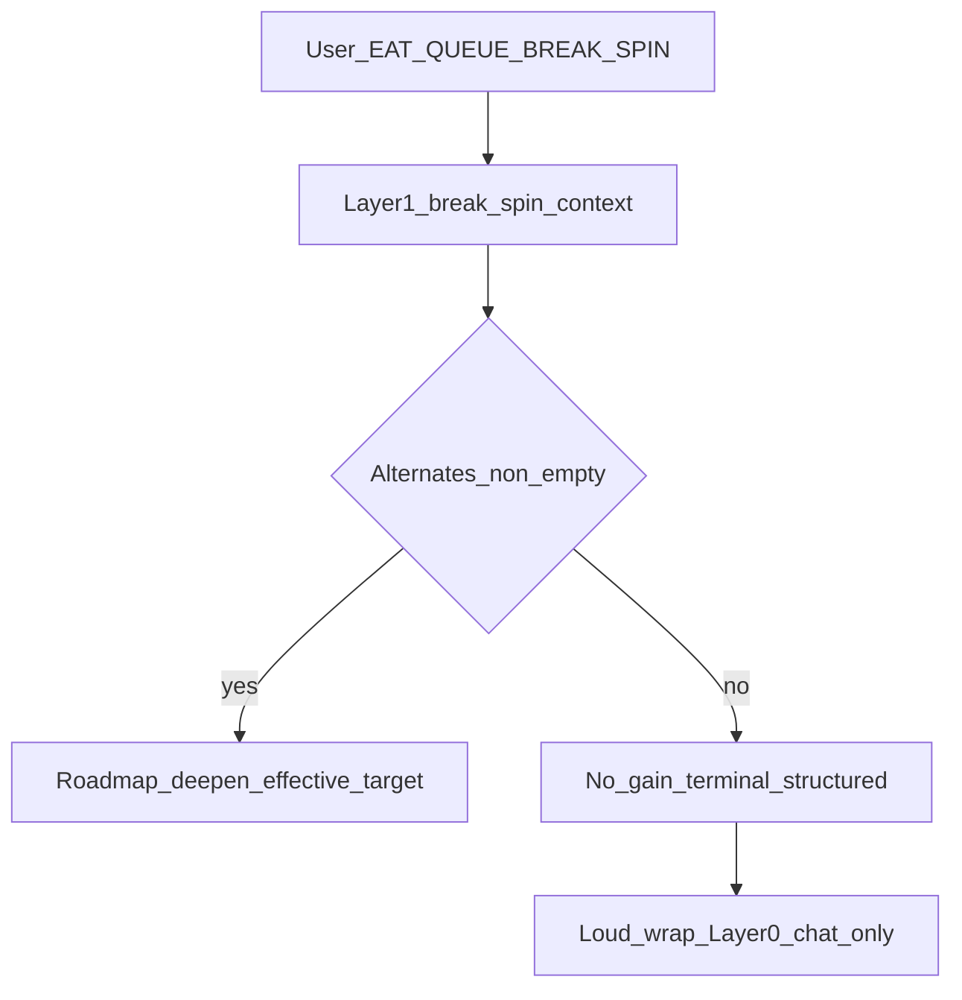

# EAT-QUEUE BREAK-SPIN — implementation plan

## Goal

**BREAK-SPIN** (user declares) feeds **alternate deepen** — **not** default **recal** or blind **pivot** as the primary “break” (those can **re-spin the same story**). **recal** is **fallback** only when **no alternate target** exists or the **operator overrides** in YAML.

Separately, the system must recognize the **no further gain** moment: continuing **without user-set gates** yields **no marginal value** — otherwise you only **move the spin** to a **new location**. Subagent returns **explicit** terminal facts (**queue_continuation**, flags) in **neutral** prose for logs.

**Loud / rude / aggressive copy is Layer 0 only:** after **Task(queue)** returns, the **chat agent** (dispatcher) may wrap the user-visible summary using Config/vault templates — **not** RoadmapSubagent, **not** Queue subagent bodies, **not** Watcher-Result **message** (keep parse-safe for Obsidian).

## No further gain vs new spin location

| Situation                                   | Meaning                                                                                                                                                                                                  |
| ------------------------------------------- | -------------------------------------------------------------------------------------------------------------------------------------------------------------------------------------------------------- |
| **Alternate deepen exists**                 | BREAK-SPIN can move work to **orthogonal** / under-touched subphases — real progress **if** those areas still have headroom.                                                                             |
| **No alternates + same structural ceiling** | Iteration **without** user-defined gates (thresholds, approvals, scope locks) is **marginal noise** — **no further gain**. Continuing anyway → **new spin location** (same pattern, different subphase). |
| **User sets gates**                         | Unblocks meaningful iteration (handoff thresholds, approvals, explicit scope) — **not** the same as “keep deepening.”                                                                                    |

**Implementation sketch:** Define **no_gain** predicates in **Parameters** / **Config** (e.g. empty `suggested_deepen_targets`, or **delta_basis** below floor for *k* runs, or resolver says **gate_block** with **no** pivot allowed and **no** alternate deepen). Roadmap/Queue returns `**queue_continuation.suppress_followup: true`** and `**suppress_reason`** (e.g. `**no_gain_pending_user_gates`** or spec-approved alias). Subagent prose stays **factual and neutral**.

## Escalation voice (loud / aggressive — Layer 0 only)

**Requirement:** Only **Layer 0** (chat agent after `**Task(queue)`** per dispatcher) may emit **rude, aggressive, attention-grabbing** text when summarizing outcomes (no-gain terminal, BREAK-SPIN zero alternates). **After** the Queue subagent returns, Layer 0 parses the structured outcome and **wraps** the user reply using templates.

**Do not** put siren copy in: RoadmapSubagent return, Queue subagent return, or **Watcher-Result** `message`.

**Copy ownership:** `**queue.layer0_no_gain_voice_lines[]`** or vault path — user-owned harshness; optional default blunt lines (no slurs / protected-class attacks).

**Deliverables:** **[dispatcher.mdc](.cursor/rules/always/dispatcher.mdc)** (+ sync): instruct Layer 0 post-`**Task(queue)`** loud wrap when signals match. **Config:** `**queue.layer0_escalation_enabled`**, voice source. **Do not** add tonal requirements to **[roadmap.md](.cursor/agents/roadmap.md)** beyond structured **no_gain** facts.

## Contract (short)

| Role        | Responsibility                                                                                                                               |
| ----------- | -------------------------------------------------------------------------------------------------------------------------------------------- |
| **You**     | Declare **EAT-QUEUE BREAK-SPIN**; **set gates** when terminal no-gain says so.                                                               |
| **Layer 1** | Build **break_spin_context**; default **effective_action: deepen** + **effective_target**; neutral machine-readable outcomes.                |
| **Layer 2** | Deepen alternate; if **no_gain** → **terminal** structured return (**queue_continuation**, facts only — **no** rude tone in subagent prose). |
| **Layer 0** | **Only layer** that may output **loud / aggressive** user-facing summary after **Task(queue)** returns, using Config/vault templates.        |

## Design (BREAK-SPIN path)

(Layer 0 loud wrap runs **after** queue Task completes; not inside NG node.)

### recal / pivot (secondary)

- `**recal`** / `**handoff-audit`** only when **no** alternate deepen target **or** operator `**break_spin_preferred_action`**.
- `**pivot_to_track`** only when operator requests or policy explicitly allows — **not** the default escape from “spin.”

### Layer 0 YAML (optional fields)

Same as prior revision: `operator_break_spin`, optional `break_spin_target_queue_entry_id`, `break_spin_preferred_action`, `break_spin_pivot_to_track`, `break_spin_rationale`.

### Files (cumulative)

- Dispatcher, queue, roadmap agents/rules, Config, Queue-Sources, **new or linked** vault note for **voice lines** (optional), sync, changelog.

## Verification

- **Alternate path:** Siblings exist → **deepen** on ≠ **circled_locus**.
- **No-gain path:** Subagent **queue_continuation** terminal + **suppress_followup**; **no** silent deepen append.
- **Tone:** **Layer 0** chat summary is **visibly** loud when escalation enabled; subagent returns unchanged in voice.

## Will it work?

**Alternate deepen:** Yes if **Layer 1** can list **suggested_deepen_targets**. **No-gain:** Yes with explicit predicates. **Loud UX:** Yes if **Layer 0** alone applies templates after **Task(queue)** — logs/plugins stay clean.