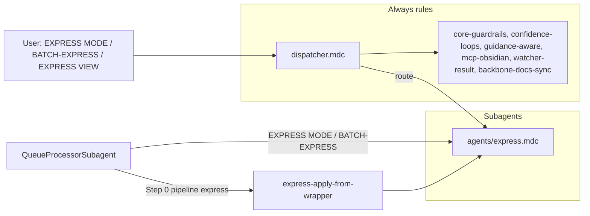

# ExpressSubagent Refactor Plan

This plan follows the pattern in [queue-dispatcher-subagent-refactor](.cursor/plans/Rule-Refactor/queue-dispatcher-subagent-refactor_54b07695.plan.md), [queueprocessorsubagent_refactor](.cursor/plans/Rule-Refactor/queueprocessorsubagent_refactor_793d8e05.plan.md), [ingestsubagent_refactor](.cursor/plans/Rule-Refactor/ingestsubagent_refactor_a0cadca0.plan.md), and [distillsubagent_refactor](.cursor/plans/Rule-Refactor/distillsubagent_refactor_e38df484.plan.md), and aligns with the subagent architecture from the Grok output (dispatcher + dedicated subagents under `.cursor/rules/agents/`).

---

## 1. Goals

- **Isolate express logic** into a single **ExpressSubagent** so only that context + shared core guardrails are loaded when processing EXPRESS MODE, "express this note", BATCH-EXPRESS, EXPRESS VIEW: [angle], or queue entries with `mode: "EXPRESS MODE"` / `"BATCH-EXPRESS"`.
- **Preserve behavior**: No change to autonomous-express pipeline order (version-snapshot → related-content-pull → research-scope → express-mini-outline → express-view-layer → call-to-action-append), confidence bands (express_conf, mid-band soft loop), Decision Wrapper creation (mid-band-refinement, low-confidence), **express-apply-from-wrapper** (Step 0 re-run with approved_option as express_view), snapshot/backup/version-snapshot gates, exclusions, or logging (Express-Log.md, Backup-Log.md).
- **Introduce a single subagent context rule** `agents/express.mdc` that encapsulates auto-express and auto-express-view; the dispatcher routes EXPRESS MODE, BATCH-EXPRESS, and EXPRESS VIEW (and related triggers) to this subagent.
- **Forward-compatible**: When the dispatcher and QueueProcessorSubagent exist, EXPRESS MODE and BATCH-EXPRESS from the queue will be dispatched to ExpressSubagent; Step 0 (wrapper apply) remains in the queue processor, which invokes **express-apply-from-wrapper** and thus re-runs the pipeline defined in ExpressSubagent. SCOPING MODE continues to run DISTILL then EXPRESS in sequence; the express step is handled by ExpressSubagent.

---

## 2. Current state (source of truth)

- **Main pipeline rule**: [.cursor/rules/context/auto-express.mdc](.cursor/rules/context/auto-express.mdc) — Triggers: EXPRESS MODE – safe batch autopilot, express this note, generate outline, create publishable summary; pipeline: backup → version-snapshot → related-content-pull (or obsidian_suggest_connections) → research-scope (PMG) → express-mini-outline → optional obsidian_append_to_moc → call-to-action-append; confidence bands (express_conf, mid-band soft express loop); Decision Wrappers (Refinements, Low-Confidence); version-snapshot and per-change snapshot triggers; exclusions (4-Archives, Backups, Logs, Hub, Versions).
- **View rule**: [.cursor/rules/context/auto-express-view.mdc](.cursor/rules/context/auto-express-view.mdc) — EXPRESS VIEW: [angle] → set `express_view` frontmatter, run autonomous-express; express-view-layer shapes Related section; ITERATE EXPRESS for feedback re-runs.
- **Queue dispatch**: [.cursor/rules/context/auto-eat-queue.mdc](.cursor/rules/context/auto-eat-queue.mdc) — EXPRESS MODE (13) → autonomous-express; SCOPING MODE (14) → DISTILL then EXPRESS on same note; BATCH-EXPRESS (20) → autonomous-express on scope; Step 0 path-apply: pipeline `express` → express-apply-from-wrapper (re-run autonomous-express with approved_option as express_view).
- **Pipeline reference**: [3-Resources/Second-Brain/Cursor-Skill-Pipelines-Reference.md](3-Resources/Second-Brain/Cursor-Skill-Pipelines-Reference.md) — §4 autonomous-express: backup → version-snapshot → related-content-pull → express-mini-outline → express-view-layer (when express_view set) → call-to-action-append; research-scope when PMG; Apply-from-wrapper table: pipeline express → express-apply-from-wrapper.
- **Funnel**: [.cursor/rules/always/system-funnels.mdc](.cursor/rules/always/system-funnels.mdc) — EXPRESS MODE – safe batch autopilot, express this note, generate outline, create publishable summary → context/auto-express.mdc.

**Skills used by autonomous-express** (unchanged; remain under `.cursor/skills/`): version-snapshot, related-content-pull, research-scope, express-mini-outline, express-view-layer, call-to-action-append; express-apply-from-wrapper (invoked by QueueProcessorSubagent Step 0 when applying approved refinement wrapper with pipeline: express).

---

## 3. Target architecture

- **Dispatcher (always-on)**: Routes EXPRESS MODE, express this note, generate outline, create publishable summary, EXPRESS VIEW: [angle], and (when queue is processed) EXPRESS MODE / BATCH-EXPRESS → ExpressSubagent (`agents/express.mdc`). SCOPING MODE remains a two-step queue sequence: DistillSubagent then ExpressSubagent.
- **ExpressSubagent (context)**: New file `.cursor/rules/agents/express.mdc`. Encapsulates full autonomous-express pipeline and EXPRESS VIEW behavior; depends on shared always rules for safety. No queue reading or Step 0 logic—only pipeline definition and view trigger handling.
- **QueueProcessorSubagent**: Continues to dispatch EXPRESS MODE and BATCH-EXPRESS to ExpressSubagent; Step 0 when `pipeline: express` runs express-apply-from-wrapper, which re-runs the pipeline defined in ExpressSubagent on `original_path` with `approved_option` as express_view.
- **Shared core**: Unchanged; ExpressSubagent obeys core-guardrails, confidence-loops, guidance-aware, mcp-obsidian-integration, watcher-result-append, backbone-docs-sync.

---

## 4. Concrete refactor steps

### 4.1 Create ExpressSubagent file

- Ensure `.cursor/rules/agents/` exists (from QueueProcessorSubagent or earlier refactor).
- Create `**.cursor/rules/agents/express.mdc`** with:
  - **Header**: Title "ExpressSubagent"; short description: responsible for autonomous-express (related content, outline, CTA, version snapshots); handles EXPRESS MODE, BATCH-EXPRESS, EXPRESS VIEW: [angle]; depends on shared always rules for safety.
  - **Globs**: Same as current auto-express: `1-Projects/**/*.md`, `2-Areas/**/*.md`, `3-Resources/**/*.md`; exclude 4-Archives, Backups, Templates, Logs, Hub, Versions, watcher-protected.
  - **Content source**: Merge the full behavior of:
    - auto-express.mdc (pipeline order, triggers, version-snapshot and per-change snapshot rules, confidence bands, express soft loop, Decision Wrappers, logging, exclusions, error handling, rollout guidance),
    - auto-express-view.mdc (EXPRESS VIEW: [angle] → set express_view, run pipeline; ITERATE EXPRESS for feedback).
  - **Preserve verbatim**: Pipeline order from Cursor-Skill-Pipelines-Reference § autonomous-express; version-snapshot (Versions/ path, mode create); research-scope (PMG, propose-first then commit when approved); express-apply-from-wrapper contract (Step 0 calls skill, which re-runs this pipeline with approved_option as express_view override).
  - **Safety section**: State that ExpressSubagent obeys Error Handling Protocol, confidence bands, guidance-aware, and Watcher exclusions via shared always rules; no new safety logic.

### 4.2 Skills and MCP usage

- **Skills used by ExpressSubagent** (unchanged; reference only): version-snapshot, related-content-pull, research-scope, express-mini-outline, express-view-layer, call-to-action-append, obsidian-snapshot. These remain under `.cursor/skills/` (optional later: group under `skills/express/` for clarity; not required for this refactor).
- **express-apply-from-wrapper**: Invoked by QueueProcessorSubagent Step 0 when applying an approved refinement wrapper with `pipeline: express`; the skill re-runs the pipeline defined in ExpressSubagent on `original_path` with `approved_option` as express_view. No change to Step 0 ownership; pipeline definition lives in ExpressSubagent.
- **MCP**: create_backup, update_note (version-snapshot create), suggest_connections (optional), etc. — all as today; ExpressSubagent invokes them per the same order and gates as auto-express.

### 4.3 Wire dispatcher routing

- **EXPRESS MODE** / **express this note** / **generate outline** / **create publishable summary** (phrase or queue `mode: "EXPRESS MODE"`) → ExpressSubagent (`agents/express.mdc`).
- **BATCH-EXPRESS** (queue) → ExpressSubagent; batch snapshot when applicable; overlap detection with BATCH-DISTILL as in current auto-eat-queue.
- **EXPRESS VIEW: [angle]** (phrase or queue with express_view in params) → ExpressSubagent; set express_view then run pipeline; express-view-layer applies when express_view set.
- **SCOPING MODE** / **SCOPING** → Queue processor runs DistillSubagent then ExpressSubagent on same note (no change to orchestration); express step is ExpressSubagent.
- **Step 0 (express wrapper)**: When queue processor processes an approved wrapper with `pipeline: express`, it runs express-apply-from-wrapper, which re-runs autonomous-express; that pipeline is defined in ExpressSubagent.
- Update system-funnels (or dispatcher) so all express-related triggers map to "ExpressSubagent (agents/express.mdc)".

### 4.4 Retire or slim context rules (after validation)

- **auto-express.mdc**: Remove or slim to a one-line redirect: "On EXPRESS MODE / express this note, see ExpressSubagent (agents/express.mdc)." So the dispatcher is the single place that routes to ExpressSubagent; this rule no longer contains pipeline logic.
- **auto-express-view.mdc**: Keep as fallback until ExpressSubagent is validated; then remove or archive. Do not delete before manual testing.

### 4.5 Documentation and sync

- **Queue-Sources.md**: Note that EXPRESS MODE and BATCH-EXPRESS are handled by ExpressSubagent; params (e.g. express_view, source_file, scope) unchanged.
- **Cursor-Skill-Pipelines-Reference.md**: Add a short "ExpressSubagent" subsection: EXPRESS MODE, BATCH-EXPRESS, EXPRESS VIEW, and express-apply-from-wrapper (Step 0) are handled by `agents/express.mdc`; pipeline order and snapshot/confidence rules unchanged.
- **Pipelines.md**, **Rules.md**, **Queue-Alias-Table.md** (in 3-Resources/Second-Brain): Align trigger tables with "ExpressSubagent (agents/express.mdc)".
- **.cursor/sync**: Add `.cursor/sync/rules/agents/express.md` mirroring `agents/express.mdc`. Changelog entry in `.cursor/sync/changelog.md` for ExpressSubagent.

### 4.6 Backbone and Rules docs

- **Rules.md** (or equivalent in 3-Resources/Second-Brain): Update trigger table so EXPRESS MODE, express this note, BATCH-EXPRESS, EXPRESS VIEW point to "ExpressSubagent (agents/express.mdc)".

---

## 5. Validation and rollback

- **Manual tests**:
  - Run **EXPRESS MODE** (or "express this note") on a single note: confirm pipeline order (backup → version-snapshot → related-content-pull → research-scope when PMG → express-mini-outline → express-view-layer when express_view set → call-to-action-append), version file in Versions/, per-change snapshot before large appends, Express-Log.md and Backup-Log.md entries.
  - Run **EAT-QUEUE** with a queue containing EXPRESS MODE and BATCH-EXPRESS entries: confirm same behavior, overlap detection for BATCH-EXPRESS when applicable, batch snapshot when applicable.
  - Run **EAT-QUEUE** with an approved Decision Wrapper (mid-band-refinement, pipeline express): confirm Step 0 runs express-apply-from-wrapper and re-runs autonomous-express on original_path with approved_option as express_view; Watcher-Result and logs correct.
  - **EXPRESS VIEW: stakeholder** and **SCOPING MODE** (PMG): confirm express_view set where applicable, and SCOPING runs distill then express on same note.
- **Rollback**: Point dispatcher/funnels back to auto-express and auto-express-view until `agents/express.mdc` is validated.

---

## 6. Out of scope (later work)

- Moving skills into `.cursor/skills/express/` (optional structural cleanup).
- Changing Decision Wrapper template or A–G semantics for express.
- Changing queue Step 0 (wrapper scan and apply-mode trigger) — it stays in QueueProcessorSubagent; only the definition of "autonomous-express pipeline" moves into ExpressSubagent.
- SCOPING MODE orchestration: queue processor still runs DISTILL then EXPRESS in sequence; this plan only moves the express pipeline into ExpressSubagent.
- Export modes (EXPORT-HIGHLIGHTS / EXPORT-ROADMAP) mentioned in auto-express-view; remain future queue modes.

---

## 7. Files to add or touch

| Action      | Path                                                                                                                                |
| ----------- | ----------------------------------------------------------------------------------------------------------------------------------- |
| Create      | `.cursor/rules/agents/express.mdc` (ExpressSubagent)                                                                                |
| Update      | `.cursor/rules/always/dispatcher.mdc` or `system-funnels.mdc` (route EXPRESS MODE / BATCH-EXPRESS / EXPRESS VIEW → ExpressSubagent) |
| Slim/remove | `.cursor/rules/context/auto-express.mdc` (after validation: redirect or remove)                                                     |
| Update      | `3-Resources/Second-Brain/Queue-Sources.md` (EXPRESS MODE, BATCH-EXPRESS → ExpressSubagent)                                         |
| Update      | `3-Resources/Second-Brain/Cursor-Skill-Pipelines-Reference.md` (ExpressSubagent subsection)                                         |
| Update      | `3-Resources/Second-Brain/Pipelines.md`, Rules.md, Queue-Alias-Table.md (trigger table)                                             |
| Add         | `.cursor/sync/rules/agents/express.md`                                                                                              |
| Append      | `.cursor/sync/changelog.md`                                                                                                         |

Do not delete `auto-express-view.mdc` until validation is complete.