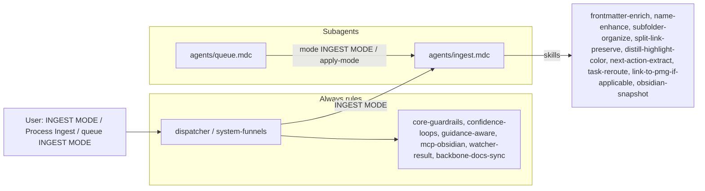

# IngestSubagent Refactor Plan

This plan follows the pattern in [queue-dispatcher-subagent-refactor](.cursor/plans/Rule-Refactor/queue-dispatcher-subagent-refactor_54b07695.plan.md) and [queueprocessorsubagent_refactor](.cursor/plans/Rule-Refactor/queueprocessorsubagent_refactor_793d8e05.plan.md), and aligns with the subagent architecture from the Grok output (dispatcher + dedicated subagents under `.cursor/rules/agents/`).

---

## 1. Goals

- **Isolate ingest logic** into a single **IngestSubagent** so only that context + shared core guardrails are loaded when processing INGEST MODE, Process Ingest, run ingests, or queue entries with `mode: "INGEST MODE"`.
- **Preserve behavior**: No change to two-phase full-autonomous-ingest (Phase 1 propose + Decision Wrapper, Phase 2 apply-mode via EAT-QUEUE Step 0), non-MD handling, embedded image normalization, confidence bands, Cursor-agent direct move, FORCE-WRAPPER, or safety (backups, snapshots, dry_run, Watcher exclusions).
- **Introduce a single subagent context rule** `agents/ingest.mdc` that encapsulates always-ingest-bootstrap, ingest-processing, para-zettel-autopilot, and non-markdown-handling; the dispatcher routes INGEST MODE (and related triggers) to this subagent.
- **Forward-compatible**: When the dispatcher and QueueProcessorSubagent exist, INGEST MODE from the queue will be dispatched to IngestSubagent; Step 0 (wrapper apply) remains in the queue processor, which invokes apply-mode ingest behavior (still defined in IngestSubagent).

---

## 2. Current state (source of truth)

- **Trigger bootstrap**: [.cursor/rules/always/always-ingest-bootstrap.mdc](.cursor/rules/always/always-ingest-bootstrap.mdc) — On "INGEST MODE" / "Process Ingest" / "run ingests": first run ingest-processing (non-MD + embedded normalization), then Phase 1 full-autonomous-ingest on `Ingest/**/*.md` per para-zettel-autopilot; move/rename only in Phase 2 apply-mode.
- **Ingest folder flow**: [.cursor/rules/context/ingest-processing.mdc](.cursor/rules/context/ingest-processing.mdc) — List Ingest; non-MD → non-markdown-handling (companion .md, embed, attempt auto-move to 5-Attachments); embedded image normalization for .md; then Phase 1 full-autonomous-ingest on .md; exclusions (Decisions, watcher); MCP safety and error handling.
- **Master ingest pipeline**: [.cursor/rules/context/para-zettel-autopilot.mdc](.cursor/rules/context/para-zettel-autopilot.mdc) — Two-phase pipeline; confidence bands (≥85%, 78%, 70–77%, <70%); Cursor-agent direct move; Decision Wrapper creation (A–G, propose_para_paths, CHECK_WRAPPERS requeue); apply-mode ingest (hard_target_path, move/rename, post-move frontmatter); skills chain and snapshot/backup rules.
- **Non-MD handling**: [.cursor/rules/context/non-markdown-handling.mdc](.cursor/rules/context/non-markdown-handling.mdc) — Companion .md creation, subtype mapping, embed, backup, attempt obsidian_move_note to 5-Attachments; #needs-manual-move on failure.
- **Pipeline reference**: [3-Resources/Second-Brain/Cursor-Skill-Pipelines-Reference.md](3-Resources/Second-Brain/Cursor-Skill-Pipelines-Reference.md) — full-autonomous-ingest order, snapshot triggers, confidence bands, Decision Wrapper apply-mode.
- **Queue contract**: [3-Resources/Second-Brain/Queue-Sources.md](3-Resources/Second-Brain/Queue-Sources.md) — INGEST MODE, tech_level injection, params.

All behavior to preserve lives in the four rules above; the refactor moves that behavior into the IngestSubagent and leaves the dispatcher routing INGEST MODE (and related phrases) to it.

---

## 3. Target architecture

- **Dispatcher (always-on)**  
When trigger is INGEST MODE, Process Ingest, run ingests, or queue entry `mode: "INGEST MODE"` → route to **IngestSubagent** (`agents/ingest.mdc`). No ingest logic in the dispatcher; only routing and shared core.
- **IngestSubagent (context)**  
New file: `.cursor/rules/agents/ingest.mdc`.  
Encapsulates:
  1. **Trigger / entry**: Run when (a) user says INGEST MODE / Process Ingest / run ingests, or (b) queue processor dispatches INGEST MODE or apply-mode ingest (Step 0 approved wrapper).
  2. **Flow**: List Ingest → non-MD handling (non-markdown-handling semantics) → embedded image normalization for .md → Phase 1 full-autonomous-ingest on `Ingest/**/*.md` (classify_para → frontmatter-enrich → name-enhance (propose) → subfolder-organize → [loop] → split_atomic → split-link-preserve → distill_note → distill-highlight-color → next-action-extract → task-reroute → append_to_hub → link-to-pmg-if-applicable → create/refresh Decision Wrapper) or Phase 2 apply-mode (feedback-incorporate → move/rename to hard_target_path, post-move frontmatter, wrapper update).
  3. **Preserve verbatim**: Confidence bands; Cursor-agent direct move; FORCE-WRAPPER; Decision Wrapper A–G creation (propose_para_paths wrapper mode, padding, CHECK_WRAPPERS requeue); apply-mode semantics; snapshot/backup gates; exclusions (Ingest/Decisions/**, watcher, etc.); error handling and Ingest-Log.md.
- **Shared core (unchanged)**  
core-guardrails, confidence-loops, guidance-aware, mcp-obsidian-integration, watcher-result-append, backbone-docs-sync. IngestSubagent depends on these; no duplication of safety logic.

---

## 4. Concrete refactor steps

### 4.1 Create agents folder and IngestSubagent file

- Ensure `.cursor/rules/agents/` exists (from QueueProcessorSubagent or earlier refactor).
- Create `**.cursor/rules/agents/ingest.mdc`** with:
  - **Header**: Title "IngestSubagent"; short description: responsible for Ingest/ processing (non-MD + embedded normalization + Phase 1 full-autonomous-ingest + Phase 2 apply-mode); depends on shared always rules for safety.
  - **Globs**: `Ingest/`** (and/or trigger-based: loaded when dispatcher routes INGEST MODE or when queue entry is INGEST MODE or apply-mode ingest).
  - **Content source**: Merge the full behavior of:
    - always-ingest-bootstrap.mdc (when to run ingest-processing then Phase 1),
    - ingest-processing.mdc (list, non-MD, embedded image norm, .md Phase 1, exclusions, error handling),
    - para-zettel-autopilot.mdc (two-phase pipeline, confidence bands, direct move, Decision Wrapper creation and apply-mode),
    - non-markdown-handling.mdc (companion .md, subtype, embed, backup, attempt move to 5-Attachments, #needs-manual-move).
  - **Preserve verbatim**: Phase 1 vs Phase 2 semantics; name-enhance propose-only in Phase 1; subfolder-organize committing name via move in apply-mode; CHECK_WRAPPERS append when wrapper created; Step 0 apply-mode (hard_target_path, move, post-move frontmatter, wrapper archive); tech_level and confidence_override for Cursor-agent direct move; FORCE-WRAPPER always create wrapper; all snapshot/backup triggers from Cursor-Skill-Pipelines-Reference.
  - **Safety section**: State that IngestSubagent obeys Error Handling Protocol, confidence bands, guidance-aware, and Watcher exclusions via shared always rules; no new safety logic.

### 4.2 Skills and MCP usage

- **Skills used by IngestSubagent** (unchanged; reference only): frontmatter-enrich, name-enhance, subfolder-organize, split-link-preserve, distill-highlight-color, next-action-extract, task-reroute, link-to-pmg-if-applicable, obsidian-snapshot. These remain under `.cursor/skills/` (optional later: group under `skills/ingest/` for clarity; not required for this refactor).
- **MCP**: classify_para, split_atomic, distill_note, append_to_hub, move_note, rename_note, ensure_structure, create_backup, propose_para_paths, etc. — all as today; IngestSubagent invokes them per the same order and gates as para-zettel-autopilot and ingest-processing.

### 4.3 Wire dispatcher routing

- **INGEST MODE** / **Process Ingest** / **run ingests** (phrase or queue `mode: "INGEST MODE"`) → IngestSubagent (`agents/ingest.mdc`).
- **Apply-mode ingest**: When QueueProcessorSubagent (Step 0) processes an approved Decision Wrapper under `Ingest/Decisions/`, it invokes apply-mode ingest; that behavior is defined in IngestSubagent (same file). No change to Step 0 ownership (queue processor still runs Step 0 and calls ingest apply-mode).
- Update system-funnels (or dispatcher) so INGEST MODE and related triggers map to "IngestSubagent (agents/ingest.mdc)".

### 4.4 Retire or slim always/context rules (after validation)

- **always-ingest-bootstrap.mdc**: Remove or slim to a one-line redirect: "On INGEST MODE, see IngestSubagent (agents/ingest.mdc)." So the dispatcher is the single place that routes to IngestSubagent; bootstrap no longer contains logic.
- **ingest-processing.mdc**, **para-zettel-autopilot.mdc**, **non-markdown-handling.mdc**: Keep as fallback (unused by routing) until IngestSubagent is validated; then remove or archive. Do not delete before manual testing.

### 4.5 Documentation and sync

- **Queue-Sources.md**: Note that INGEST MODE is handled by IngestSubagent; tech_level and params unchanged.
- **Cursor-Skill-Pipelines-Reference.md**: Add a short "IngestSubagent" subsection: INGEST MODE and apply-mode ingest are handled by `agents/ingest.mdc`; pipeline order and snapshot/confidence rules unchanged.
- **Pipelines.md** (if present): Align trigger table with "IngestSubagent (agents/ingest.mdc)".
- **.cursor/sync**: Add `.cursor/sync/rules/agents/ingest.md` mirroring `agents/ingest.mdc`. Changelog entry in `.cursor/sync/changelog.md` for IngestSubagent.

### 4.6 Backbone and Rules docs

- **Rules.md** (or equivalent in 3-Resources/Second-Brain): Update trigger table so INGEST MODE / Process Ingest / run ingests point to "IngestSubagent (agents/ingest.mdc)".

---

## 5. Validation and rollback

- **Manual tests**:
  - Run **INGEST MODE** (or Process Ingest) with a few notes in `Ingest/` (including one non-.md and one .md with embedded images). Confirm: non-MD companion + optional move, embedded normalization, Phase 1 pipeline (classify → enrich → path proposal → split/distill/hub/task-reroute) and Decision Wrapper creation (A–G), CHECK_WRAPPERS requeue; no move/rename in Phase 1 except Cursor-agent direct move when conditions hold.
  - Run **EAT-QUEUE** with an approved Decision Wrapper: confirm Step 0 runs apply-mode ingest (move to approved_path, post-move frontmatter, wrapper archived), Watcher-Result and Ingest-Log.md correct.
  - **FORCE-WRAPPER** and **Cursor-agent direct move** (Ingest/Agent-Output/ or agent-generated: true, high conf): confirm behavior unchanged.
- **Rollback**: Point dispatcher/funnels back to always-ingest-bootstrap + ingest-processing + para-zettel-autopilot (+ non-markdown-handling) until `agents/ingest.mdc` is validated.

---

## 6. Out of scope (later work)

- Moving skills into `.cursor/skills/ingest/` (optional structural cleanup).
- Changing Decision Wrapper template or A–G semantics.
- Changing queue Step 0 (wrapper scan and apply-mode trigger) — it stays in QueueProcessorSubagent; only the definition of "apply-mode ingest" moves into IngestSubagent.
- Prompt-Crafter or plan-mode-prompt-crafter: unchanged.

---

## 7. Files to add or touch

| Action      | Path                                                                                               |
| ----------- | -------------------------------------------------------------------------------------------------- |
| Create      | `.cursor/rules/agents/ingest.mdc` (IngestSubagent)                                                 |
| Update      | `.cursor/rules/always/dispatcher.mdc` or `system-funnels.mdc` (route INGEST MODE → IngestSubagent) |
| Slim/remove | `.cursor/rules/always/always-ingest-bootstrap.mdc` (after validation: redirect or remove)          |
| Update      | `3-Resources/Second-Brain/Queue-Sources.md` (INGEST MODE → IngestSubagent)                         |
| Update      | `3-Resources/Second-Brain/Cursor-Skill-Pipelines-Reference.md` (IngestSubagent subsection)         |
| Update      | `3-Resources/Second-Brain/Pipelines.md` or Rules.md (trigger table)                                |
| Add         | `.cursor/sync/rules/agents/ingest.md`                                                              |
| Append      | `.cursor/sync/changelog.md`                                                                        |

Do not delete `ingest-processing.mdc`, `para-zettel-autopilot.mdc`, or `non-markdown-handling.mdc` until validation is complete.