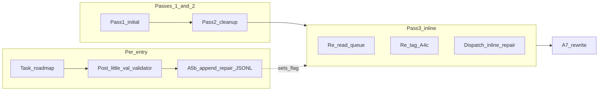

# Pass 3 inline repair drain (Approach A)

## Problem (current contract)

- `[.cursor/rules/agents/queue.mdc](.cursor/rules/agents/queue.mdc)` **A.7** says A.5b-appended repair lines stay for a **future** dispatch (lines 262–264).
- **A.5d** already says `recovery_auto_append` should **re-read** so new lines **participate in this run** (line 350), but there is no defined **second dispatch wave** for those lines in **A.5.0** (only `initial` + `cleanup`).
- **A.6** (lines 412–413) states Layer 1 does not **re-dispatch the same pipeline entry inline** — that remains true; we only dispatch **new** queue `id`s.

## Target behavior

1. **Passes 1–2** unchanged for the **snapshot** of entries tagged at first **A.4c** (before Pass 1).
2. Whenever **A.5b** successfully appends one or more repair lines **or** **A.5d** appends recovery lines that are roadmap/repair-class, set run memory (e.g. `inline_repair_pending = true`, record new `id`s / `parent_queue_entry_id` for audit per **A.5g**).
3. **After Pass 2 completes** (including no-op Pass 2 when `repair_first` has no cleanup slots): if `inline_repair_pending`:
  - **Re-read** `.technical/prompt-queue.jsonl`.
  - Re-run **A.2** validation filtering for the **full file** (or merge: keep `processed_success_ids` and `already_dispatched_ids_this_run` so nothing double-runs).
  - Re-run **A.3–A.4** ordering on the **current** valid set.
  - **A.4c extension — inline tagging only for new work:** For each line that is `**RESUME_ROADMAP`** (or chain primary `RESUME_ROADMAP`), **repair-class**, `**id` not in `already_dispatched_ids_this_run`**, and `**id` not in `processed_success_ids`**, assign `**dispatch_pass: inline**` (new enum value) up to per-project caps (see below). All other roadmap lines keep `dispatch_pass: none` for this sub-pass unless already consumed. **Do not** re-dispatch forward-class lines that were already run in Pass 1.
4. **Pass 3 — inline:** Single walk of the globally ordered list; dispatch **only** roadmap entries with `**dispatch_pass === inline`**, same Task(roadmap) + post–little-val + A.5b–A.5c pipeline as today. Set `**queue_pass_phase=inline`** in Watcher / dispatch_ledger (extend allowed token from `initial|cleanup`).
5. **Bounded recursion:** If Pass 3 dispatches trigger **another** A.5b append, either:
  - **Recommended:** Repeat **Pass 3 loop** (re-read → re-tag inline → dispatch) up to `**queue.max_inline_a5b_repair_generations_per_run`** (new Config, default **3**), then stop with repair lines left for **next** EAT-QUEUE if still pending; **or**
  - **Strict:** Single Pass 3 wave only (simpler; may leave chained repairs for next run). **Recommend the bounded loop** to match user expectation (“return when complete” for one repair hop is not always enough).

**Caps (avoid runaway):**

- Share or stack with existing `**queue.max_repair_roadmap_dispatches_per_project_per_run`**: document whether **cleanup** + **inline** share one budget per project per run (recommended: **shared** so total repair roadmap Tasks per project per run stay capped).
- Respect **stall-skip** and **hard_block_return_count** for repair-class lines as today.

## Spec / code touchpoints

| Area                                                                                                                             | Change                                                                                                                                                                                                                                                                                                                                                                                                                                                                                                                                                                                                                                                                   |
| -------------------------------------------------------------------------------------------------------------------------------- | ------------------------------------------------------------------------------------------------------------------------------------------------------------------------------------------------------------------------------------------------------------------------------------------------------------------------------------------------------------------------------------------------------------------------------------------------------------------------------------------------------------------------------------------------------------------------------------------------------------------------------------------------------------------------ |
| `[.cursor/rules/agents/queue.mdc](.cursor/rules/agents/queue.mdc)`                                                               | **Todo orchestration:** optional third top-level phase `queue-phase-inline-repair` (or fold under cleanup with explicit sub-steps). **A.4c:** document `dispatch_pass: inline` and tagging rules for mid-run appends. **A.5.0:** define Pass 3 after Pass 2; extend `queue_pass_phase`. **A.5b:** after successful append, set `inline_repair_pending` + track new ids; remove or narrow “future dispatch only” where Pass 3 applies. **A.6:** fix line 412–413 to allow **dispatch of new repair ids** in Pass 3. **A.5g:** add `queue_pass_phase: inline` and disposition `consumed_inline_repair_drain` (or reuse `consumed_repair_drain` with phase disambiguation). |
| `[.cursor/agents/queue.md](.cursor/agents/queue.md)`                                                                             | Mirror pass-3 summary and caps (dispatcher hand-off expectations).                                                                                                                                                                                                                                                                                                                                                                                                                                                                                                                                                                                                       |
| `[3-Resources/Second-Brain/Queue-Sources.md](3-Resources/Second-Brain/Queue-Sources.md)`                                         | Replace “future dispatch” for A.5b with “Pass 3 inline drain in same run when enabled”; document **A.7** still consumes parent **E**; child repair line consumed when Pass 3 succeeds.                                                                                                                                                                                                                                                                                                                                                                                                                                                                                   |
| `[3-Resources/Second-Brain/Docs/Validator-Tiered-Blocks-Spec.md](3-Resources/Second-Brain/Docs/Validator-Tiered-Blocks-Spec.md)` | Short subsection: Layer 1 pivot now includes **inline pass** after A.5b append.                                                                                                                                                                                                                                                                                                                                                                                                                                                                                                                                                                                          |
| `[3-Resources/Second-Brain-Config.md](3-Resources/Second-Brain-Config.md)`                                                       | Add `queue.inline_a5b_repair_drain_enabled` (default **true** after rollout, or **false** for conservative migration), `queue.max_inline_a5b_repair_generations_per_run` (default **3**).                                                                                                                                                                                                                                                                                                                                                                                                                                                                                |
| `[.cursor/sync/](.cursor/sync/)`                                                                                                 | Sync updated `queue.mdc` per backbone-docs-sync.                                                                                                                                                                                                                                                                                                                                                                                                                                                                                                                                                                                                                         |

## Optional follow-up (out of scope unless you want it in the same PR)

- **Defer post–little-val** on the **forward** slot when an inline repair is **known** to be queued in the same run (your earlier design note) — reduces double hostile validation; can be a separate Config flag after Pass 3 works.

## Testing / acceptance

- **Fixture queue:** One `RESUME_ROADMAP` forward entry that returns Success + validator_context such that post–little-val **hard block** triggers **A.5b** append.
- **Expect:** In one **EAT-QUEUE** run, Watcher shows **two** roadmap dispatches (or forward + inline repair) with `queue_pass_phase=initial` then `inline` (and `cleanup` if `forward_first`), **A.7** removes consumed ids, repair line not left for a **second** manual EAT-QUEUE unless caps/generations exhausted.
- **Regression:** `repair_first` with **no** A.5b append: Pass 3 is **no-op** (no extra Tasks). **Chain** `queue_items_appended` re-read path remains distinct but should not double-count inline ids.

