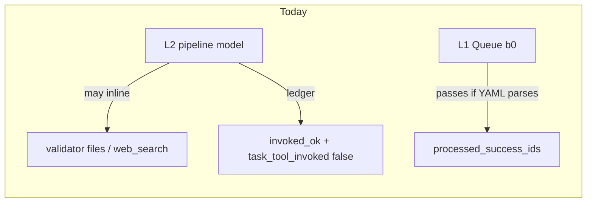
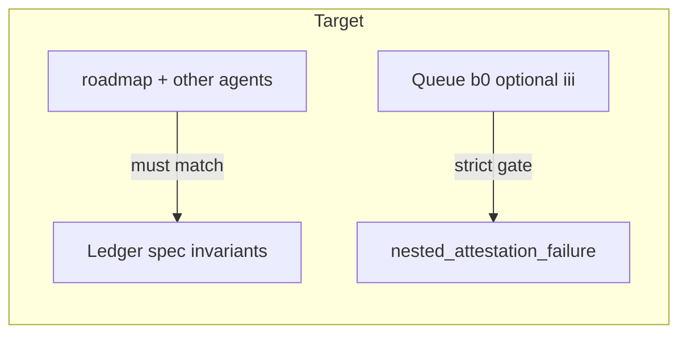

# Quit bullshitting: ledger + roadmap + queue enforcement

## Problem (frozen)

- [Subagent-Safety-Contract.md](3-Resources/Second-Brain/Subagent-Safety-Contract.md) requires Validator / IRA / (when applicable) Research as **nested `Task` helpers** inside the pipeline subagent.
- [Nested-Subagent-Ledger-Spec.md](3-Resources/Second-Brain/Docs/Nested-Subagent-Ledger-Spec.md) says `return_summary` is required for `invoked_ok` / `invoked_empty_ok` but does **not** forbid `invoked_ok` + `task_tool_invoked: false` on helper-shaped steps.
- `[.cursor/agents/roadmap.md](.cursor/agents/roadmap.md)` **explicitly allows** “run `research-agent-run` inline” for deepen (RESUME-ROADMAP § deepen), which **contradicts** the ledger line for `research_pre_deepen` (“nested Research `Task` when attempted”) and the safety contract’s Research nested-call exception.
- `[.cursor/rules/agents/queue.mdc](.cursor/rules/agents/queue.mdc)` **A.5 (b0)** validates `validator_context` and (when configured) **presence** of `nested_subagent_ledger`; it does **not** validate that ledger steps attest real nested `Task` usage for the mandated cycle.

The bad run (`[.technical/Run-Telemetry/Run-20260321-202530Z-genesis-mythos-master-roadmap.md](.technical/Run-Telemetry/Run-20260321-202530Z-genesis-mythos-master-roadmap.md)`) is the predictable outcome: model writes files + labels steps `inline_`* with `outcome: invoked_ok` and `task_tool_invoked: false`.

## Target behavior

---

## 1. Normative spec: invalid ledger patterns (source of truth)

**File:** [3-Resources/Second-Brain/Docs/Nested-Subagent-Ledger-Spec.md](3-Resources/Second-Brain/Docs/Nested-Subagent-Ledger-Spec.md)

Add a section **“Attestation invariants (mandated nested helpers)”** that states:

- For these `**step`** ids, when the row is **not** a documented skip/N/A path, the pipeline **must** have invoked the Cursor `**Task`** tool for the matching helper (`subagent_type` `validator` | `internal-repair-agent` | `research`):
  - `nested_validator_first`, `nested_validator_second` → `validator`
  - `ira_post_first_validator` → `internal-repair-agent`
  - `research_pre_deepen` → `research` **only when** pre-deepen research is attempted this run and the run is **not** consuming chain hand-off research (see below).
- **Forbidden combination (invalid attestation):** `outcome` in (`invoked_ok`, `invoked_empty_ok`) **and** `task_tool_invoked: false` **for those steps** when `nested_cycle_applicable: true` (or when that step is otherwise required by the branch). Operators should treat this as **non-compliant**, not “success.”
- **Allowed `task_tool_invoked: false` + non–`task_error` outcomes** for helper-shaped steps only in **documented** cases, e.g.:
  - `chain_research_consumed` (use this `**step` id**, not `research_pre_deepen`, when consumables came from chain hand-off).
  - `nested_validator_skipped_material_gate`, `nested_cycle_exempt`, legacy IRA skip rows, `not_applicable` / `skipped` with explicit `detail.reason_code` and `contract_citation`.
- When the model **cannot** call nested `Task` (tool missing, enum rejection, etc.): `**outcome: task_error`**, `**host_error_raw`**, `**host_error_class**`, and pipeline return must not be Success with `**little_val_ok: true**` if the contract still required that helper for this branch.
- Add `detail.reason_code` examples: `ledger_invalid_invoked_ok_without_task`, `nested_task_unavailable` (for `host_error_class`).

Bump **changelog** row / version note at bottom of spec (schema version can stay `1` if only normative text is added; if you add optional fields later, bump).

---

## 2. Roadmap agent: one story, no inline escape

**File:** `[.cursor/agents/roadmap.md](.cursor/agents/roadmap.md)`

- **Remove or replace** the deepen bullet that says pre-deepen may run `research-agent-run` **inline**. Replace with:
  - Pre-deepen research **on** → `**Task`** with `subagent_type: **research`** (ResearchSubagent hand-off per `[.cursor/agents/research.md](.cursor/agents/research.md)` / contract), **unless** the hand-off already includes `dependency_consumables.research` → then use `**chain_research_consumed`** ledger step (no Research `Task` this run).
  - Pre-deepen **off** / util-gated skip → `research_pre_deepen` row with `outcome: skipped` or `not_applicable`, **not** `invoked_ok`.
- **Nested validator / IRA:** Already say “call ValidatorSubagent” / “IRA via Task tool”; add one line: **each call must be an actual `Task` invocation**; ledger rows for `nested_validator_*` and `ira_post_first_validator` must satisfy Nested-Subagent-Ledger-Spec attestation invariants.
- `**nested_subagent_ledger` section:** Add a **pre-return honesty checklist**: if `nested_cycle_applicable: true`, assert no forbidden `invoked_ok` + `task_tool_invoked: false` on mandated steps; if work was done without `Task`, return `**#review-needed`** or `**failure`** with `detail.reason_code` / `host_error_class`, **not** Success.

**Mirror** the same roadmap nesting/ledger bullets in `[.cursor/rules/agents/roadmap.mdc](.cursor/rules/agents/roadmap.mdc)` (and `[.cursor/sync/](.cursor/sync/)` per [backbone-docs-sync](.cursor/rules/always/backbone-docs-sync.mdc)).

---

## 3. Other pipeline agents (short alignment)

For each of `[.cursor/agents/ingest.md](.cursor/agents/ingest.md)`, [archive](.cursor/agents/archive.md), [organize](.cursor/agents/organize.md), [distill](.cursor/agents/distill.md), [express](.cursor/agents/express.md), [research](.cursor/agents/research.md): in the `**nested_subagent_ledger (required)`** subsection, add **3–5 lines** pointing to the spec’s **Attestation invariants** and stating: **Success + `little_val_ok: true` is forbidden** if ledger rows for mandated nested helpers show `**invoked_ok` / `invoked_empty_ok` with `task_tool_invoked: false`** (except documented skip/N/A rows). Sync matching `.cursor/rules/agents/*.mdc` + `.cursor/sync/rules/agents/*.md` where those files duplicate the ledger block.

---

## 4. Subagent-Safety-Contract cross-link

**File:** [3-Resources/Second-Brain/Subagent-Safety-Contract.md](3-Resources/Second-Brain/Subagent-Safety-Contract.md)

In the IRA / Validator / Research nested-call bullets, add a **single sentence**: nested helper execution must be reflected honestly in `**nested_subagent_ledger`** per Nested-Subagent-Ledger-Spec **Attestation invariants**; false-green combinations are **invalid**.

---

## 5. Layer 1: optional hard refusal (config-gated)

**File:** `[.cursor/rules/agents/queue.mdc](.cursor/rules/agents/queue.mdc)`

Extend **A.5 (b0)** with a new sub-step **(iii) Ledger semantic attestation** (runs only when `**queue.strict_nested_return_gates`** is **true** — reuses existing flag to avoid config sprawl; document that semantic ledger checks are part of “strict nested return gates”):

- After parsing `nested_subagent_ledger` from the pipeline return, if `**nested_cycle_applicable`** is **true** (or when roadmap return implies material nested cycle per simple heuristics: e.g. `RESUME_ROADMAP` + action in `deepen|advance-phase|recal` + `little_val_ok`), scan `steps[]` for **forbidden** patterns from the spec (helper `step` ids + `invoked_ok`/`invoked_empty_ok` + `task_tool_invoked: false` without an allowed `detail.reason_code` whitelist if you want to reduce false positives).
- On violation: same disposition as other **(b0)** failures — `**nested_attestation_failure`**, `**queue_failed: true`**, Watcher-Result failure, Errors.md with `**error_type: ledger_semantic_attestation_failure**` (or similar), set `**disposition_nested_attestation_failure**` for **A.5e**.

**When `strict_nested_return_gates` is false:** optionally add **soft** logging to Errors.md or Feedback-Log when the same pattern is detected (does **not** refuse consumption) so you still see “hollow ledger” in forensic logs without breaking existing flows.

**Docs:** [3-Resources/Second-Brain-Config.md](3-Resources/Second-Brain-Config.md) — extend the description of `strict_nested_return_gates` to mention ledger semantic checks. [3-Resources/Second-Brain/Parameters.md](3-Resources/Second-Brain/Parameters.md) or [Queue-Sources.md](3-Resources/Second-Brain/Queue-Sources.md) — one-line note pointing operators to flip `**strict_nested_return_gates: true`** when they want Layer 1 to reject hollow ledgers.

**Sync:** Update `[.cursor/sync/rules/agents/queue.md](.cursor/sync/rules/agents/queue.md)` if present.

---

## 6. Scope / non-goals

- **No** change to post–little-val hostile validator behavior (still Layer 1); this plan fixes **lying nested ledger + roadmap inline research**, not duplicate validator passes.
- **No** automatic rewrite of past Run-Telemetry notes.
- Parser in queue **(b0)(iii)** should stay **shallow** (YAML → object walk); full JSON Schema validation is optional follow-up.

---

## Implementation order

1. Spec (Nested-Subagent-Ledger-Spec) — defines invalid/allowed patterns.
2. Roadmap agent + roadmap.mdc + sync — removes contradiction; adds checklist.
3. Other agents + rules + sync — short pointer + Success prohibition.
4. Subagent-Safety-Contract one-liner.
5. queue.mdc (b0)(iii) + Config/Queue-Sources/Parameters docs + queue sync.

