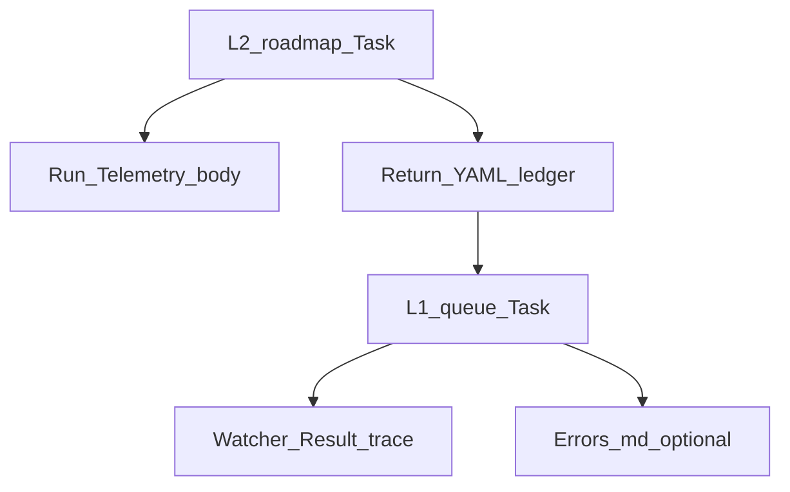

# Nested subagent observability (roadmap-first, **verbose logging**)

## Problem

Layer 1 never calls IRA; Layer 2 nested `Task` calls (validator / `internal-repair-agent` / research) often fail silently or are skipped without a **forensic** record. After Cursor restart, `subagent_type` enum mismatches and `resource_exhausted` need to be **obvious** in durable logs, not inferred from absence of validator files.

**Design principle:** **Verbosity and detail are friends** for this feature. Prefer **too much** structured data (truncated only where strictly necessary for size/safety) over minimal one-line summaries.

## Approach (two ledgers)

1. `**nested_subagent_ledger`** (Layer 2, **RoadmapSubagent**): one **ordered** list of **step records** covering every nested helper the contract could touch for this run, including explicit `**not_applicable`** / `**skipped**` rows with **rich** `detail` objects—not a single vague string.
2. `**dispatch_ledger`** (Layer 1, **Queue**, optional v1 but **recommended in same PR**): one row per **outbound** `Task` the Queue itself makes (`queue`, `roadmap`, `validator`, `prompt_craft`, …) with **host error text** when dispatch fails—so “subagents not firing” is separable into **L1 never launched** vs **L2 launched but nested Task failed**.

Outputs (all three when possible):

- Fenced `**yaml` `nested_subagent_ledger:`** at end of **roadmap return** (machine-parseable; include full `detail` maps).
- `**## Nested subagent ledger`** in the **roadmap** Run-Telemetry note body: **human + grep** (tables + optional bullet subsections per step).
- `**Watcher-Result.md`** `trace`: **full YAML serialization** of the same ledger for that `requestId` (if over ~4k chars, **head** the YAML in trace and set `trace_continues: [[.technical/Run-Telemetry/<path>]]` in message—document cap in queue rule).




---

## Schema — `**nested_subagent_ledger**` (per step record)

**Top-level (once per roadmap return, alongside the array):**

- `ledger_schema_version`: `1` (integer; bump when fields change).
- `pipeline`: `ROADMAP_MODE` | `RESUME_ROADMAP`.
- `params_action`: string (effective action after smart-dispatch).
- `material_state_change_asserted`: `true` | `false` | `unknown` — roadmap’s honest claim whether phase notes / state files were materially edited this run (feeds auditor).
- `little_val_final_ok`: boolean.
- `little_val_attempts`: integer.
- `ira_after_first_pass_effective`: boolean (merged from Config + `params.ira_after_first_pass`).
- `nested_cycle_applicable`: boolean — **false** when entire Validator→IRA→second pass is contractually out of scope; when false, ledger must still list rows with `outcome: not_applicable` and **verbose** `detail.skip_reason`.

**Each element of `steps:` (ordered array, execution order):**


| Field               | Type    | Required        | Purpose                                                                                                                                                                                                                   |
| ------------------- | ------- | --------------- | ------------------------------------------------------------------------------------------------------------------------------------------------------------------------------------------------------------------------- |
| `step`              | string  | yes             | Stable id: `research_pre_deepen`, `little_val_precheck`, `nested_validator_first`, `ira_post_first_validator`, `little_val_post_ira`, `nested_validator_second`, `nested_cycle_exempt`, `chain_research_dependency`, etc. |
| `ordinal`           | int     | yes             | 1-based order in this run (replay order).                                                                                                                                                                                 |
| `started_iso`       | string  | yes             | UTC ISO8601 when **attempt** began (best effort from model clock).                                                                                                                                                        |
| `ended_iso`         | string  | recommended     | When step finished or failed.                                                                                                                                                                                             |
| `duration_ms`       | int     | optional        | If estimable.                                                                                                                                                                                                             |
| `subagent_type`     | string  | yes             | `research` | `validator` | `internal-repair-agent` | `none` (for pure skill-only steps like little val, use `none` but keep `step` clear).                                                                                |
| `task_tool_invoked` | boolean | yes             | **true** iff Cursor `Task` was actually called for this step; **false** for skill-only or skipped-before-call.                                                                                                            |
| `outcome`           | string  | yes             | `invoked_ok` | `skipped` | `task_error` | `not_applicable` | `invoked_empty_ok` (e.g. IRA returned empty fixes).                                                                                                          |
| `host_error_raw`    | string  | when task_error | **Verbatim** (sanitized: strip API keys, tokens, env paths to home if policy requires) Cursor/tool error message—**do not** summarize to one word.                                                                        |
| `host_error_class`  | string  | when task_error | e.g. `invalid_enum`, `resource_exhausted`, `timeout`, `unknown` (parser heuristic ok).                                                                                                                                    |
| `handoff_summary`   | object  | recommended     | `{ "chars": , "subagent_type_requested": "", "validation_type": "", "compare_to_report_path": "", "linked_phase": "", "model_passed_to_task": "<omitted|fast|config-name>" }` — **no** full hand-off body in vault. **`model_passed_to_task`:** `omitted` = no Task `model` arg; `fast` = `model: "fast"`; `config-name` = Config explicit model; never literal `inherit` (invalid Task API). |
| `return_summary`    | object  | when invoked_ok | Validator: `{ severity, recommended_action, primary_code, report_path }`; IRA: `{ suggested_fixes_count, ira_report_path, status }`; Research: `{ synth_note_paths_count, injection_block_present: bool }`.               |
| `report_path`       | string  | optional        | Primary artifact path for this step.                                                                                                                                                                                      |
| `detail`            | object  | yes             | **Always** present; use structured keys instead of one opaque string. Examples below.                                                                                                                                     |


`**detail` object conventions (verbose):**

- Always include `reason_code` (machine): e.g. `contract_skip_material_gate`, `research_disabled_param`, `research_skipped_util_gate`, `legacy_clean_log_only_no_ira`, `little_val_failed_before_nested`, `task_enum_rejected`, `task_resource_exhausted`.
- Always include `human_readable` (1–3 sentences): what happened for a human skimming Run-Telemetry.
- Optional: `contract_citation` — short pointer to doc section (e.g. `roadmap.md §6 nested validator`, `Subagent-Safety-Contract § IRA exception`).
- Optional: `inputs_considered` — array of vault paths the step used (state files, phase note).
- Optional: `follow_up_effect` — e.g. `queue_followups_appended`, `errors_md_appended`.

**Example `task_error` row (illustrative):**

```yaml
- step: nested_validator_first
  ordinal: 4
  started_iso: "2026-03-22T01:02:03Z"
  ended_iso: "2026-03-22T01:02:04Z"
  subagent_type: validator
  task_tool_invoked: true
  outcome: task_error
  host_error_raw: "Invalid arguments: subagent_type: Invalid enum value. Expected 'generalPurpose' | 'explore' | 'shell' | 'browser-use', received 'validator'"
  host_error_class: invalid_enum
  handoff_summary:
    chars: 8420
    subagent_type_requested: validator
    validation_type: roadmap_handoff_auto
  report_path: "-"
  detail:
    reason_code: task_enum_rejected
    human_readable: "Cursor Task tool rejected subagent_type validator; nested hostile pass never ran."
    contract_citation: "agents/roadmap.md nested Validator"
```

**Example `skipped` row:**

```yaml
- step: ira_post_first_validator
  ordinal: 5
  started_iso: "2026-03-22T01:05:00Z"
  ended_iso: "2026-03-22T01:05:00Z"
  subagent_type: internal-repair-agent
  task_tool_invoked: false
  outcome: skipped
  detail:
    reason_code: legacy_clean_log_only_no_ira
    human_readable: "effective ira_after_first_pass false and first nested pass was log_only with no actionable gaps; IRA not invoked per contract."
    contract_citation: "Subagent-Safety-Contract § IRA exception legacy opt-out"
```

---

## Schema — `**dispatch_ledger**` (Layer 1 Queue, recommended)

One record per **Queue-initiated** `Task` in that EAT-QUEUE run (including `Task(queue)` if self-referential logging is useful—usually skip):


| Field                                 | Purpose                                                                                                               |
| ------------------------------------- | --------------------------------------------------------------------------------------------------------------------- |
| `ordinal`, `started_iso`, `ended_iso` | Same as above.                                                                                                        |
| `role`                                | `dispatch_pipeline` | `post_little_val_validator` | `prompt_craft_a5b` | `prompt_craft_a5d` | `empty_queue_bootstrap` |
| `queue_entry_id`                      | Target entry id or `-` for non-entry tasks.                                                                           |
| `subagent_type_requested`             | e.g. `roadmap`, `validator`                                                                                           |
| `outcome`                             | `invoked_ok` | `task_error`                                                                                           |
| `host_error_raw`, `host_error_class`  | As above when failed.                                                                                                 |
| `pipeline_return_excerpt`             | Optional: first 500 chars of subagent return for debugging **or** `return_had_nested_ledger: true`                    |


---

## Run-Telemetry body (roadmap primary note)

**Mandatory sections** (in order):

1. Existing summary table / context (keep current style).
2. `**## Nested subagent ledger`**
  - Subsection `**### Summary**` — bullet list: count of `task_error`, `skipped`, `invoked_ok`, whether nested cycle was applicable.  
  - Subsection `**### Steps (ordered)**` — for **each** step: a **level-4 heading** `#### ordinal — step` then a **key-value bullet list** of **all** non-empty fields from the YAML record (flatten `handoff_summary`, `return_summary`, `detail`).  
  - Subsection `**### Raw YAML (copy-paste)`** — fenced yaml block duplicating **full** `nested_subagent_ledger` top-level object for operators who want to copy without parsing chat.
3. If file size is a concern, cap **Raw YAML** at 12k chars with footer line `truncated: true` — **never** truncate the per-step **####** sections first (those are the human audit trail).

---

## Watcher-Result and Errors.md (queue behavior)

- **Default:** Embed **full** `nested_subagent_ledger` YAML in `trace` for successful roadmap dispatches.
- **Overflow:** If `trace` would exceed ~4000 characters, set `trace` to first ~3500 chars of YAML + `\n... truncated; full ledger: [[.technical/Run-Telemetry/<file>]]` and ensure that Run-Telemetry path is correct in the message field.
- **Missing ledger (soft gate v1):** When return claims **Success** + `little_val_ok: true` + `params.action` in `**deepen` | `advance-phase` | `recal`** (and **ROADMAP_MODE** setup path that runs nested validator per contract), and **no** parseable `nested_subagent_ledger` in return:
  - Append **Errors.md** with **full** heading + metadata table + `**#### Trace`** containing: queue entry JSON excerpt, **entire** subagent return tail (last 8000 chars if needed), and explicit `**error_type: nested_ledger_missing_or_unparseable`**.
  - Watcher **message** must say ledger missing; **trace** holds excerpt.
  - **Do not** change `processed_success_ids` policy in v1 (per earlier plan); **document** that strict refusal is v2.

---

## Files to change


| Area            | File                                                                                                                                  | Change                                                                                                                                                                                                                                                                                  |
| --------------- | ------------------------------------------------------------------------------------------------------------------------------------- | --------------------------------------------------------------------------------------------------------------------------------------------------------------------------------------------------------------------------------------------------------------------------------------- |
| Agent           | [.cursor/agents/roadmap.md](.cursor/agents/roadmap.md)                                                                                | Full **Return** contract: YAML `nested_subagent_ledger` with schema above; instruct to **populate during** the run after each nested Task; Run-Telemetry **three-part** body; tie `step` list to **every** branch (research on/off, legacy IRA skip, material gate, chain consumables). |
| Rule            | [.cursor/rules/agents/roadmap.mdc](.cursor/rules/agents/roadmap.mdc)                                                                  | Mirror agent file verbatim for ledger sections.                                                                                                                                                                                                                                         |
| Contract        | [3-Resources/Second-Brain/Subagent-Safety-Contract.md](3-Resources/Second-Brain/Subagent-Safety-Contract.md)                          | Normative schema (or link to new doc); RoadmapSubagent **must** emit ledger; recommend same for other L2 later; **sanitize** rules for `host_error_raw`.                                                                                                                                |
| Queue           | [.cursor/rules/agents/queue.mdc](.cursor/rules/agents/queue.mdc)                                                                      | After each `Task` return: extract ledger to Watcher/Errors per above; **optional** `dispatch_ledger` on Queue’s own Run-Telemetry for L1 Task failures/successes with **host_error_raw**.                                                                                               |
| Docs            | [3-Resources/Second-Brain/Logs.md](3-Resources/Second-Brain/Logs.md), [Vault-Layout.md](Vault-Layout.md)                              | Run-Telemetry **body** sections; Watcher trace convention; truncation policy.                                                                                                                                                                                                           |
| Docs            | [3-Resources/Second-Brain/Docs/Subagent-Layers-Reference.md](3-Resources/Second-Brain/Docs/Subagent-Layers-Reference.md)              | **Observability** subsection: L2 ledger, L1 dispatch ledger, Watcher, Errors.                                                                                                                                                                                                           |
| Docs (optional) | `3-Resources/Second-Brain/Docs/Nested-Subagent-Ledger-Spec.md`                                                                        | **Full** schema, examples, version history (preferred if Subagent-Safety-Contract would grow too long).                                                                                                                                                                                 |
| Sync            | [.cursor/sync/rules/agents/roadmap.md](.cursor/sync/rules/agents/roadmap.md), queue if edited, [changelog](.cursor/sync/changelog.md) | Per backbone-docs-sync.                                                                                                                                                                                                                                                                 |


---

## What this fixes vs what it does not

- **Fixes:** Forensic, **verbose** record of **each** nested `Task` attempt; **raw** host errors for enum/resource issues; clear **contract skip** reasons; single place in Run-Telemetry to answer “what the hell happened.”
- **Does not fix:** Cursor product limitations—only **surfaces** them with proof.
- **Strict consumption gate** (refuse to clear queue if ledger invalid): **v2** optional; v1 uses **Errors.md** + Watcher only.

## Rollout order

1. Optional **Nested-Subagent-Ledger-Spec.md** + Subagent-Safety-Contract pointer.
2. roadmap.md + roadmap.mdc (agent + rule).
3. Logs.md, Vault-Layout, Subagent-Layers-Reference.
4. queue.mdc Watcher/Errors/dispatch_ledger.
5. Sync + changelog.

## Follow-up

- Same verbosity for **ingest, distill, express, archive, organize, research** agents.  
- **Strict** gate + queue processor script to **validate** YAML ledger (future automation).

