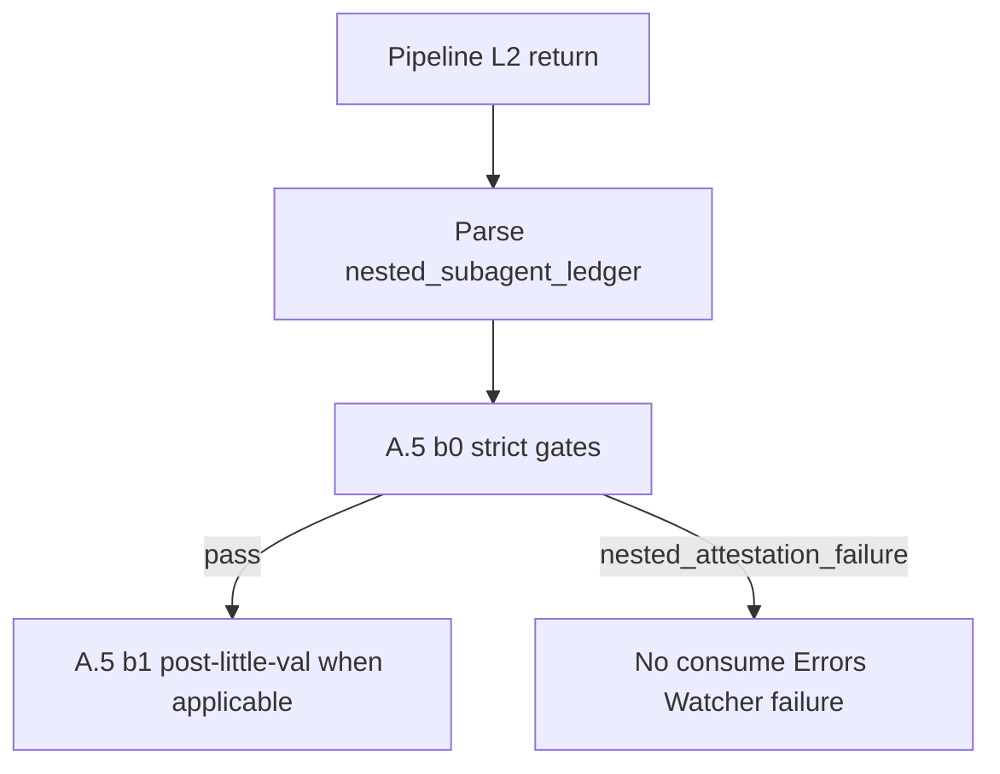

# Enforce nested Task attempt (all mandated helpers)

## Problem (validated against repo)

- `**[.cursor/agents/roadmap.md](.cursor/agents/roadmap.md)**` requires real nested `Task` for validator and IRA and has a **Pre-return honesty checklist** (~228–236) that focuses on hollow `**invoked_ok`** / `**nested_task_unavailable`**. It does not yet state explicitly that `**outcome: skipped` + `task_tool_invoked: false`** is forbidden on **any mandated helper step** when that step was **contractually required** (must be `**task_error`** + `host_error_raw` / `host_error_class`, or a documented exempt row such as `**not_applicable`** with allowlisted `**reason_code`**).
- The same failure mode applies to `**ira_post_first_validator`** and `**research_pre_deepen**` (when pre-deepen research is in scope and not satisfied by `**chain_research_consumed**`): models can “skip” without calling `**Task(internal-repair-agent)**` or `**Task(research)**` and still emit a plausible ledger.
- Other gated pipelines (**ingest, archive, organize, distill, express, research**) also emit `**nested_subagent_ledger`** and mandate nested helpers per their agent docs; they should follow the **same** attempt-or-**task_error** rule for whichever steps their contract marks mandatory.
- `**[.cursor/rules/agents/queue.mdc](.cursor/rules/agents/queue.mdc)` A.5 (b0)** (~205): parent condition is **Success** + `**little_val_ok: true`** — `**#review-needed`** with `**little_val_ok: true`** skips **(b0)**. **(b0)(iii)** only flags hollow `**invoked_ok` / `invoked_empty_ok`** + `**task_tool_invoked: false`**; it does not treat `**outcome: skipped`** + `**task_tool_invoked: false`** on mandated steps when those steps were **required**.
- Evidence: `**[3-Resources/Feedback-Log.md](3-Resources/Feedback-Log.md)`** `**ledger_semantic_attestation_soft`** lines describe multiple ledger steps with `**invoked_ok`** and `**task_tool_invoked: false`** (host Task unavailable), not only the first validator.

## Target behavior (generalized)

| Situation                                                                                                                                                                                                                                    | Required ledger                                                                                                                                                                                                                                                                                                                                 |
| -------------------------------------------------------------------------------------------------------------------------------------------------------------------------------------------------------------------------------------------- | ----------------------------------------------------------------------------------------------------------------------------------------------------------------------------------------------------------------------------------------------------------------------------------------------------------------------------------------------- |
| A **mandated nested helper** step was **required** for this run (per **[Nested-Subagent-Ledger-Spec](3-Resources/Second-Brain/Docs/Nested-Subagent-Ledger-Spec.md)** **Attestation invariants** + top-level flags + per-pipeline agent docs) | Real `**Task`** attempt for the matching `**subagent_type`** **or** `**outcome: task_error`** with non-empty sanitized `**host_error_raw`** and `**host_error_class`** (e.g. `nested_task_unavailable`, `invalid_enum`, `resource_exhausted`).                                                                                                  |
| Tool missing / call fails                                                                                                                                                                                                                    | `**task_error`**, not `**skipped**` without attempt.                                                                                                                                                                                                                                                                                            |
| Forbidden                                                                                                                                                                                                                                    | `**skipped**` + `**task_tool_invoked: false**` on a **required** step, unless `**detail.reason_code`** (and/or step id) is on an **explicit allowlist** (material gate, `**nested_cycle_exempt`**, `**chain_research_consumed`** instead of `**research_pre_deepen**`, unfreeze-only, idempotent/no-op paths, documented `**not_applicable**`). |

**Mandated helper `step` ids** (baseline from spec; exact “required this run” predicates come from ledger flags):

- `**nested_validator_first`**, `**nested_validator_second`** → `**validator**`
- `**ira_post_first_validator**` → `**internal-repair-agent**`
- `**research_pre_deepen**` → `**research**` (when chain hand-off did **not** already supply research — use `**chain_research_consumed`** otherwise)

**Applicability (normative intent — spell out in spec/queue):**

- **Validator / IRA steps:** Required when `**nested_cycle_applicable: true`** and the nested Validator→IRA→second-validator protocol applies for that pipeline/action (respect `**ira_after_first_pass_effective`**, material-gate skips, etc.).
- **Research step:** Required only when the pipeline contract for **this** run required pre-deepen research (e.g. enabled param + not satisfied by chain consumables); do **not** flag skip-without-attempt when research was genuinely out of scope (`**not_applicable`** with documented `**reason_code`**).

## Implementation

### 1. Roadmap subagent — attempt before skip (validator + IRA + research)

Edit `**[.cursor/agents/roadmap.md](.cursor/agents/roadmap.md)`** § **Nested validator** / nested cycle and § **Pre-return honesty checklist**:

- State the **general** invariant: for **each** mandated helper step that was **required**, never `**skipped`** + `**task_tool_invoked: false`**; use `**invoked_*`** with `**task_tool_invoked: true**` or `**task_error**` with `**host_error_raw**`.
- Cover `**nested_validator_first**`, `**nested_validator_second**`, `**ira_post_first_validator**`, and `**research_pre_deepen**` (when not `**chain_research_consumed**`).
- Explicitly forbid **inspecting `available_functions` (or equivalent) and skipping without calling `Task`** — failure mode is `**task_error**`, not `**skipped**`.

Mirror in `**[.cursor/rules/agents/roadmap.mdc](.cursor/rules/agents/roadmap.mdc)**` and `**[.cursor/sync/rules/agents/roadmap.md](.cursor/sync/rules/agents/roadmap.md)**`; `**[backbone-docs-sync.mdc](.cursor/rules/always/backbone-docs-sync.mdc)**` + optional `**[.cursor/sync/changelog.md](.cursor/sync/changelog.md)**` line.

### 2. Other pipeline subagents (scope expansion)

For **ingest, archive, organize, distill, express, research** agent prompts and matching `**.mdc`** + `**.cursor/sync/rules/agents/*.md`**:

- Add or tighten a **single** pre-return bullet: mandated nested `**Task(validator)`**, `**Task(internal-repair-agent)`**, `**Task(research)**` must follow the same **attempt or `task_error`** rule; no `**skipped**` + `**task_tool_invoked: false**` when the step was required.
- Keep pipeline-specific nuance (e.g. which `**validation_type**`, when research runs) in existing sections; do not duplicate the full roadmap nested cycle prose everywhere.

### 3. Nested-Subagent-Ledger-Spec

Update `**[3-Resources/Second-Brain/Docs/Nested-Subagent-Ledger-Spec.md](3-Resources/Second-Brain/Docs/Nested-Subagent-Ledger-Spec.md)**`:

- Add a **machine `detail.reason_code`** for invalid pattern, e.g. `**nested_helper_skip_without_task_attempt**` (optional `**detail.step**` or rely on step record), documented as **invalid** when the step was **required**.
- Extend **Attestation invariants**: forbidden `**skipped`** + `**task_tool_invoked: false`** on mandated helper `**step`** ids when required (not only hollow `**invoked_ok`**).
- Clarify `**nested_task_unavailable**` is a `**host_error_class**` on `**task_error**`, not a skip excuse for any helper type.
- Document **per-step applicability** (nested cycle vs research-only) so Layer 1 and operators can implement predicates consistently.
- Bump spec **changelog** version row.

### 4. Subagent-Safety-Contract

In `**[3-Resources/Second-Brain/Subagent-Safety-Contract.md](3-Resources/Second-Brain/Subagent-Safety-Contract.md)`** **Host nested Task failure**: extend to **validator, IRA, and research** — Layer 2 must **attempt** nested `**Task`** before asserting unavailability; record `**task_error` + `host_error_raw`**, not `**skipped`** without attempt when that helper was required.

### 5. Layer 1 hard/soft gate (queue)

**Strict gate — who does it apply to? (simple breakdown)**

1. **Today, A.5 (b0) only cares about certain queue modes** — the list already in **(b0)** (ingest, archive, organize, distill, express, roadmap setup/resume, research modes, etc.). That is the “gated modes” list: **if the dispatch is not one of these, (b0) does not run** for nested attestation today.
2. **This plan adds one new check inside that same world** — `(b0)(iv)` “skip without attempt”: only runs when **(a)** we are already in a **(b0)**-eligible dispatch, **(b)** the return has a parseable `nested_subagent_ledger`, **(c)** a mandated `step` was **required** this run (per flags + Nested-Subagent-Ledger-Spec), and **(d)** that row is `skipped` + `task_tool_invoked: false` without an allowlisted reason.
3. **Optional tightening (choose when implementing):**
  - **Option A — default / minimal change:** Keep **exactly** the current **(b0)** mode list. New check applies to **those same modes only**. Roadmap is not special in the rule text; it is just one line in the list.
  - **Option B — broader:** Any pipeline `Task` return that **includes a parseable ledger** gets the new skip-without-attempt scan, even if the mode is not on today’s **(b0)** list. Use this only if you discover edge queue modes that emit ledgers but are not in **(b0)** and you want zero gaps.

**Recommendation in this plan:** **Option A** unless you hit a real gap; document the choice in `queue.mdc` and Queue-Sources.

**What the new check does (mechanically)**

- Extend `**[.cursor/rules/agents/queue.mdc](.cursor/rules/agents/queue.mdc)`** **A.5 (b0)** (~205) with `**(b0)(iv)`**.
- Scan `steps[]` for the **same four `step` ids as (b0)(iii)**: `nested_validator_first`, `nested_validator_second`, `ira_post_first_validator`, `research_pre_deepen`.
- For each row: if `outcome: skipped`, `task_tool_invoked: false`, the step was **required** (from ledger flags + spec — e.g. `nested_cycle_applicable`, `material_state_change_asserted`, `ira_after_first_pass_effective`, research in scope vs `chain_research_consumed`), and `detail.reason_code` is **not** allowlisted → attestation failure (strict) or soft log (non-strict).

**When strict gates are on — widen the *return status* that enters (b0), not necessarily the mode list**

- For `**strict_nested_return_gates: true`**, run the new scan on Success or `**#review-needed`** when `little_val_ok: true` and the ledger parses — so a “review-needed but structurally green” return cannot bypass **(b0)(iv)**.
- Separately decide (and document in `queue.mdc`): widen **(b0)(i)–(iii)** the same way, or **only** widen **(iv)**. Smallest change: widen **(iv)** only.

**Naming**

- Prefer one `error_type` e.g. `ledger_nested_helper_skip_without_attempt` (strict) / `ledger_nested_helper_skip_without_attempt_soft`, **or** extend existing `ledger_semantic_attestation_*` messages to list offending `step` values — document in Config / Queue-Sources.

**Disposition**

- Strict → same `**nested_attestation_failure`** path as **(b0)(i)–(iii)**. Non-strict → soft Feedback-Log / Errors line.

Sync `**[.cursor/sync/rules/agents/queue.md](.cursor/sync/rules/agents/queue.md)`**.

Update `**[3-Resources/Second-Brain-Config.md](3-Resources/Second-Brain-Config.md)`**, `**[3-Resources/Second-Brain/Queue-Sources.md](3-Resources/Second-Brain/Queue-Sources.md)`**, `**[3-Resources/Second-Brain/Parameters.md](3-Resources/Second-Brain/Parameters.md)**` to state which option (A vs B) is in effect and list new `error_type` strings if any.

### 6. Optional: task-handoff-comms runbook

`**[Task-Handoff-Comms-Spec](3-Resources/Second-Brain/Docs/Task-Handoff-Comms-Spec.md)`** or Queue-Sources: note that compliant nested attempts may show `**handoff_out` / `return_in`** for **validator, internal-repair-agent, and research** with `**parent_task_correlation_id`** = pipeline `**pipeline_task_correlation_id`** where the spec defines `**from_actor`** for Layer 2. No automation required unless desired.

### 7. Out of scope

- **workflow_state** table formatting / unrelated little-val noise.
- **Cursor runtime** cannot be fixed from vault files — document operator requirement that pipeline subagents have nested `**Task`** available.

## Verification

- **Grep** for `**skipped`**, `**task_tool_invoked: false`**, `**nested_task_unavailable**` across Run-Telemetry / validator examples; update canonical examples to `**task_error` + `host_error_raw**` for **validator, IRA, and research** where appropriate.
- **Synthetic returns:** at least one fixture per failure class (first validator skipped, IRA skipped, research skipped) with strict gates **on** → `**nested_attestation_failure`**, id not in `**processed_success_ids`**.

