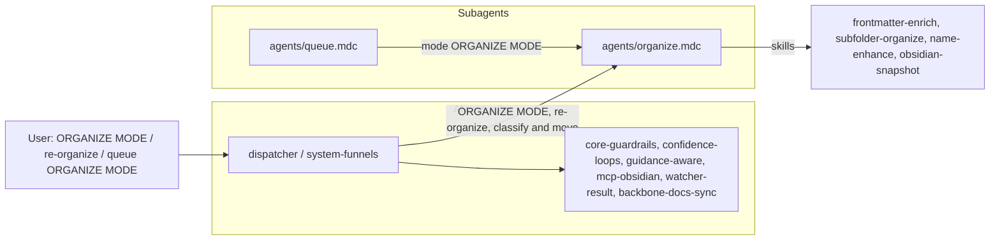

# OrganizeSubagent Refactor Plan

This plan follows the pattern in [queue-dispatcher-subagent-refactor](.cursor/plans/Rule-Refactor/queue-dispatcher-subagent-refactor_54b07695.plan.md), [queueprocessorsubagent_refactor](.cursor/plans/Rule-Refactor/queueprocessorsubagent_refactor_793d8e05.plan.md), and [archivesubagent_refactor](.cursor/plans/Rule-Refactor/archivesubagent_refactor_1922c9dd.plan.md), and aligns with the subagent architecture from the Grok output (dispatcher + dedicated subagents under `.cursor/rules/agents/`).

---

## 1. Goals

- **Isolate organize logic** into a single **OrganizeSubagent** so only that context + shared core guardrails are loaded when processing ORGANIZE MODE, "re-organize this note", "classify and move", or queue entries with `mode: "ORGANIZE MODE"`.
- **Preserve behavior**: No change to autonomous-organize pipeline order, confidence bands (high/mid/low, path_conf, organize-path loop), Decision Wrapper creation (Refinements, Low-Confidence), snapshot/backup gates (before rename and before move), exclusions, or logging (Organize-Log.md, Backup-Log.md).
- **Introduce a single subagent context rule** `agents/organize.mdc` that encapsulates [auto-organize.mdc](.cursor/rules/context/auto-organize.mdc); the dispatcher routes ORGANIZE MODE and related triggers to this subagent.
- **Forward-compatible**: When the dispatcher and QueueProcessorSubagent exist, ORGANIZE MODE from the queue will be dispatched to OrganizeSubagent. There is no organize-specific "apply-from-wrapper" skill (same as archive); organize mid-band/low wrappers are decision touchpoints; re-running organize after user approval is done by re-queueing ORGANIZE MODE with the note in scope. FORCE-WRAPPER with `source_file` under 1-Projects/2-Areas/3-Resources infers organize and creates a force-wrapper; apply remains via re-run.

---

## 2. Current state (source of truth)

- **Main pipeline rule**: [.cursor/rules/context/auto-organize.mdc](.cursor/rules/context/auto-organize.mdc) — Triggers: ORGANIZE MODE – safe batch autopilot (optionally "on [folder]"), Re-organize Projects and Resources, re-organize this note, reorganize current file, classify and move, put this note in the right folder; pipeline: backup → classify_para → frontmatter-enrich → subfolder-organize → name-enhance (context organize; opportunistic rename) → move_note (dry_run then commit) → post-move frontmatter (para-type, project-id when under 1-Projects/) → log_action; confidence bands (path_conf, mid-band organize-path loop); Decision Wrappers (Refinements, Low-Confidence); snapshot triggers (before obsidian_rename_note when name-enhance applies, before obsidian_move_note when ≥85%); batch checkpoint ~every 3 notes; exclusions (4-Archives, Backups, Logs, Hub, watcher-protected).
- **Queue dispatch**: [.cursor/rules/context/auto-eat-queue.mdc](.cursor/rules/context/auto-eat-queue.mdc) — ORGANIZE MODE at position 3 in canonical order → autonomous-organize (auto-organize). FORCE-WRAPPER infers pipeline from source_file; under 1-Projects/2-Areas/3-Resources → autonomous-organize (force_wrapper: true).
- **Pipeline reference**: [3-Resources/Second-Brain/Cursor-Skill-Pipelines-Reference.md](3-Resources/Second-Brain/Cursor-Skill-Pipelines-Reference.md) — autonomous-organize order, snapshot triggers (before rename and before move; batch ~every 3 notes), skill table (frontmatter-enrich, subfolder-organize, name-enhance in organize context).
- **Funnel**: [.cursor/rules/always/system-funnels.mdc](.cursor/rules/always/system-funnels.mdc) — ORGANIZE MODE – safe batch autopilot, re-organize this note → auto-organize.

All behavior to preserve lives in auto-organize.mdc and the pipeline reference; the refactor moves that behavior into the OrganizeSubagent and leaves the dispatcher routing ORGANIZE MODE (and related phrases/queue mode) to it.

---

## 3. Target architecture

- **Dispatcher (always-on)**  
When trigger is ORGANIZE MODE, "re-organize this note", "Re-organize Projects and Resources", "classify and move", "put this note in the right folder", or queue entry `mode: "ORGANIZE MODE"` → route to **OrganizeSubagent** (`agents/organize.mdc`). No organize logic in the dispatcher; only routing and shared core.
- **OrganizeSubagent (context)**  
New file: `.cursor/rules/agents/organize.mdc`.  
Encapsulates:
  1. **Trigger / entry**: Run when (a) user says ORGANIZE MODE (optionally "on [folder]"), re-organize this note, Re-organize Projects and Resources, classify and move, put this note in the right folder, or (b) queue processor dispatches ORGANIZE MODE (with optional scope/source_file). FORCE-WRAPPER with source_file under 1-Projects/2-Areas/3-Resources invokes organize with force_wrapper: true (create wrapper, skip destructive step).
  2. **Flow**: Backup → classify_para → frontmatter-enrich → subfolder-organize → (optional mid-band organize-path loop) → per-change snapshot before rename (when name-enhance applies, ≥85%) and before move (when path_conf ≥85%) → name-enhance (context organize; opportunistic rename) → obsidian_ensure_structure → obsidian_move_note (dry_run then commit) → post-move frontmatter (para-type, project-id when under 1-Projects/) → log_action; confidence bands and Decision Wrapper creation (Refinements, Low-Confidence) per confidence-loops; batch snapshot ~every 3 notes.
  3. **Preserve verbatim**: Pipeline order from Cursor-Skill-Pipelines-Reference § autonomous-organize; snapshot triggers (before rename, before move; batch ~every 3 notes); loop_type "organize-path"; Error Handling Protocol; Organize-Log.md and Backup-Log.md; propose_para_paths in mid-band with context_mode "organize"; MCP fallback table for move/rename.
- **Shared core (unchanged)**  
core-guardrails, confidence-loops, guidance-aware, mcp-obsidian-integration, watcher-result-append, backbone-docs-sync. OrganizeSubagent depends on these; no duplication of safety logic.

---

## 4. Concrete refactor steps

### 4.1 Create OrganizeSubagent file

- Ensure `.cursor/rules/agents/` exists (from QueueProcessorSubagent or earlier refactor).
- Create `**.cursor/rules/agents/organize.mdc`** with:
  - **Header**: Title "OrganizeSubagent"; short description: responsible for autonomous-organize (re-classify and re-path notes in 1-Projects, 2-Areas, 3-Resources; frontmatter-enrich, subfolder-organize, optional name-enhance, move when confidence ≥85%); handles ORGANIZE MODE and related phrases; depends on shared always rules for safety.
  - **Globs**: Loaded when dispatcher routes ORGANIZE MODE (and variants) or when queue entry is ORGANIZE MODE; scope: `1-Projects/`**, `2-Areas/`**, `3-Resources/**` (exclude 4-Archives, Backups, Logs, Hub, watcher-protected) per current auto-organize exclusions.
  - **Content source**: Merge the full behavior of auto-organize.mdc (pipeline order, triggers, confidence bands, snapshot triggers, Decision Wrappers, logging, exclusions, Error Handling Protocol, name-enhance context organize, re-org mode semantics).
  - **Preserve verbatim**: Pipeline order from Cursor-Skill-Pipelines-Reference § autonomous-organize; snapshot triggers; loop_type "organize-path"; post-move para-type and project-id; CHECK_WRAPPERS and Watcher-Result contract when run via queue; FORCE-WRAPPER inference for organize when source_file under 1/2/3.
  - **Safety section**: State that OrganizeSubagent obeys Error Handling Protocol, confidence bands, and Watcher exclusions via shared always rules; no new safety logic.

### 4.2 Skills and MCP usage

- **Skills used by OrganizeSubagent** (unchanged; reference only): frontmatter-enrich, subfolder-organize, name-enhance (context organize), obsidian-snapshot. These remain under `.cursor/skills/` (optional later: group under `skills/organize/` for clarity; not required for this refactor).
- **No organize-apply-from-wrapper**: Organize uses Decision Wrappers for mid-band and low-confidence; when the user approves a path/option, they re-queue ORGANIZE MODE or run organize again with the note in scope. No dedicated "organize-apply-from-wrapper" skill; Step 0 apply-from-wrapper is for ingest/distill/express only.
- **MCP**: create_backup, classify_para, ensure_structure, move_note, rename_note (when name-enhance applies), manage_frontmatter, log_action — all as today; OrganizeSubagent invokes them per the same order and gates as auto-organize.

### 4.3 Wire dispatcher routing

- **ORGANIZE MODE** / **re-organize this note** / **Re-organize Projects and Resources** / **classify and move** / **put this note in the right folder** (phrase or queue `mode: "ORGANIZE MODE"`) → OrganizeSubagent (`agents/organize.mdc`).
- Queue processor: when mode is ORGANIZE MODE, dispatch to OrganizeSubagent (same as other pipeline modes). FORCE-WRAPPER with source_file under 1-Projects/2-Areas/3-Resources continues to infer organize and pass force_wrapper: true into OrganizeSubagent.
- Update system-funnels (or dispatcher) so all organize-related triggers map to "OrganizeSubagent (agents/organize.mdc)".

### 4.4 Retire or slim context rule (after validation)

- **auto-organize.mdc**: Remove or slim to a one-line redirect: "On ORGANIZE MODE / re-organize this note / classify and move, see OrganizeSubagent (agents/organize.mdc)." Do not delete before manual testing.

### 4.5 Documentation and sync

- **Queue-Sources.md** (and Queue-Alias-Table if present): Note that ORGANIZE MODE is handled by OrganizeSubagent; params/scope unchanged.
- **Cursor-Skill-Pipelines-Reference.md**: Add a short "OrganizeSubagent" subsection: ORGANIZE MODE and related phrases are handled by `agents/organize.mdc`; pipeline order and snapshot/confidence rules unchanged.
- **Pipelines.md** / **README.md** (if present): Align trigger table with "OrganizeSubagent (agents/organize.mdc)".
- **.cursor/sync**: Add `.cursor/sync/rules/agents/organize.md` mirroring `agents/organize.mdc`. Changelog entry in `.cursor/sync/changelog.md` for OrganizeSubagent.

### 4.6 Backbone and Rules docs

- **Rules.md** (or equivalent in 3-Resources/Second-Brain): Update trigger table so ORGANIZE MODE, re-organize this note, classify and move, etc. point to "OrganizeSubagent (agents/organize.mdc)".

---

## 5. Validation and rollback

- **Manual tests**:
  - Run **ORGANIZE MODE** (or "re-organize this note") on a single note: confirm pipeline order (backup → classify → frontmatter-enrich → subfolder-organize → optional loop → snapshot → name-enhance if applied → ensure_structure → move dry_run then commit → post-move frontmatter → log_action), Organize-Log.md and Backup-Log.md entries.
  - Run **EAT-QUEUE** with a queue containing ORGANIZE MODE: confirm same behavior, Watcher-Result line, and log format.
  - Mid-band and low-confidence: confirm Decision Wrappers created under Refinements and Low-Confidence, and that no move/rename occurs until confidence ≥85% or user re-runs after approval.
  - FORCE-WRAPPER with a note under 1-Projects/2-Areas/3-Resources: confirm OrganizeSubagent runs with force_wrapper and creates wrapper without performing move/rename.
- **Rollback**: Point dispatcher/funnels back to auto-organize.mdc until `agents/organize.mdc` is validated.

---

## 6. Out of scope (later work)

- Moving skills into `.cursor/skills/organize/` (optional structural cleanup).
- Changing Decision Wrapper template or A–G semantics for organize.
- Adding an "organize-apply-from-wrapper" skill (not in current design; organize re-run after wrapper approval is sufficient).
- Changing name-enhance protection rules or organize-specific params.

---

## 7. Files to add or touch

| Action      | Path                                                                                                   |
| ----------- | ------------------------------------------------------------------------------------------------------ |
| Create      | `.cursor/rules/agents/organize.mdc` (OrganizeSubagent)                                                 |
| Update      | `.cursor/rules/always/dispatcher.mdc` or `system-funnels.mdc` (route ORGANIZE MODE → OrganizeSubagent) |
| Slim/remove | `.cursor/rules/context/auto-organize.mdc` (after validation: redirect or remove)                       |
| Update      | `3-Resources/Second-Brain/Queue-Sources.md` (ORGANIZE MODE → OrganizeSubagent)                         |
| Update      | `3-Resources/Second-Brain/Cursor-Skill-Pipelines-Reference.md` (OrganizeSubagent subsection)           |
| Update      | `3-Resources/Second-Brain/Pipelines.md` or Rules.md (trigger table)                                    |
| Add         | `.cursor/sync/rules/agents/organize.md`                                                                |
| Append      | `.cursor/sync/changelog.md`                                                                            |

Do not delete `auto-organize.mdc` until validation is complete.