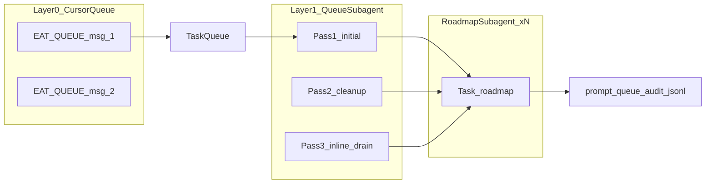

# Overnight-safe EAT-QUEUE (anti-circle hardening)

## Context (what already exists)

- **Layer 0:** One user message → one `Task(queue)` ([dispatcher.mdc](.cursor/rules/always/dispatcher.mdc)). Cursor’s **built-in message queue** = multiple sequential Layer 0 turns; each `EAT-QUEUE` still runs **one** Queue subagent session.
- **Layer 1** already tracks per-run state: `roadmap_tasks_invoked_this_eat_queue_run`, Pass 1/2/3 ([queue.mdc](.cursor/rules/agents/queue.mdc) **A.5.0**).
- **Roadmap circling** is driven by **conceptual refine-in-place** + **conditional slice exit** ([roadmap-deepen/SKILL.md](.cursor/skills/roadmap-deepen/SKILL.md) §3.1, §5; [roadmap.md](.cursor/agents/roadmap.md) **(3d)**).
- **Config:** `roadmap.conceptual_max_deepen_per_subphase` is currently `**0` (disabled)** in [Second-Brain-Config.md](3-Resources/Second-Brain-Config.md).
- **Audit:** [Queue-Audit-Log-Spec.md](3-Resources/Second-Brain/Docs/Queue-Audit-Log-Spec.md) `line_removed.disposition` — extend with overnight/partial dispositions.

## Design principles

1. **Do not** relax `little_val`, nested validator hard blocks, snapshots, or repair-first sort.
2. **Tighten, don’t overhaul:** numeric caps + stagnation flag + slice-exit predicate fix + audit + bootstrap dedup; optional `queue.dedupe_followup_append_by_idempotency_key` remains deferrable.
3. Stagnation is **computed in roadmap-deepen** (extend diminishing-returns), surfaced on **Roadmap return**; **not** required from ValidatorSubagent ([Validator-Tiered-Blocks-Spec.md](3-Resources/Second-Brain/Docs/Validator-Tiered-Blocks-Spec.md) §9 = computed/advisory only).

---

## Phase 1 (highest ROI) — implement first

### 1a. Config (canonical: Second-Brain-Config.md)

| Key                                                    | Value  | Notes                                  |
| ------------------------------------------------------ | ------ | -------------------------------------- |
| `roadmap.conceptual_max_deepen_per_subphase`           | **8**  | Tunable 6–10; **8** is default target. |
| `queue.max_roadmap_task_invocations_per_eat_queue_run` | **25** | Tunable 20–30; **25** default.         |

Active source of truth for numeric defaults is [Second-Brain-Config.md](3-Resources/Second-Brain-Config.md) (not Parameters alone). Parameters cross-references Config.

### 1b. Parameters.md — new section

Add **“Anti-Circling & Overnight Safety”** (new or expanded) documenting:

- Meaning of `conceptual_max_deepen_per_subphase` (max deepen/log iterations effectively targeting the same conceptual subphase before forcing structural forward).
- Meaning of `max_roadmap_task_invocations_per_eat_queue_run` (hard stop on `Task(roadmap)` count per single EAT-QUEUE session; remaining lines wait for next Cursor-queued EAT-QUEUE).
- Pointer to slice-exit / stagnation behavior and audit dispositions.

### 1c. queue.mdc **A.5.0** — strict enforcement

**Before dispatching any `Task(roadmap)`** (initial, cleanup, inline, chain segments that invoke roadmap):

- If `roadmap_tasks_invoked_this_eat_queue_run >= queue.max_roadmap_task_invocations_per_eat_queue_run` → **do not** invoke `Task(roadmap)` for further roadmap-class lines in this run.
- Log clearly (Feedback-Log / Run-Telemetry; optional Watcher line with stable machine prefix e.g. `overnight_cap: roadmap_invocations_exhausted`).
- Emit audit `line_removed` (or run-level audit event if no single line consumed) with disposition `**roadmap_invocation_cap_exceeded`** where applicable; remaining `prompt-queue.jsonl` lines **persist** for the **next** Layer 0 EAT-QUEUE.

Mirror the same rule in [.cursor/agents/queue.md](.cursor/agents/queue.md) if it duplicates queue.mdc prose.

### 1d. roadmap-deepen — per-subphase cap

- Count `**workflow_state ## Log`** rows (or equivalent contract) that target the same `**current_subphase_index`** (same project) within the cap window defined by Config.
- When count would exceed `**conceptual_max_deepen_per_subphase`**: **do not** enter extended refine-in-place loop for that subphase; **force** `next_structural_target_hint` toward **next sibling** / next structural node per Roadmap Structure; cooperate with slice-exit follow-up (see below).

---

## Stagnation (Work package B) — primary in roadmap-deepen

- Extend existing **Diminishing returns** logic in [roadmap-deepen/SKILL.md](.cursor/skills/roadmap-deepen/SKILL.md):
  - When **same Target / subphase** streak **≥ 3** consecutive log rows **and** **confidence delta < 5%** (Config-tunable: `stagnation_window_runs`, `stagnation_confidence_delta_max`) → set structured flag `**stagnation_suspected: true`** on skill return (and pass through RoadmapSubagent **Task return** metadata for Layer 1).
- [roadmap.md](.cursor/agents/roadmap.md) **(3d) slice-exit:** Treat `**stagnation_suspected: true`** as a **valid trigger** for `**subphase_slice_exit_applied: true`** and explicit `**params.next_subphase_index`** (plus `user_guidance` / `prompt` naming next target), **even when** `next_structural_target_hint` looks stale or fails to show a “different” subphase.
- **Remove / relax** any normative wording that **blocks** slice-exit rewrite until `next_structural_target_hint` proves a different subphase — stale hints must **not** prevent exit when cap or stagnation fired.

---

## Good-enough + move-on (Work package C)

When **subphase cap** OR `**stagnation_suspected`** (and no hard conceptual blocker: `incoherence`, `contradictions_detected`, `state_hygiene_failure`, `safety_critical_ambiguity` per existing precedence):

- **Always** emit a `**queue_followups.next_entry`** (unless `queue_next: false` / terminal) that is `**RESUME_ROADMAP` `deepen`** with:
  - `**params.subphase_slice_exit_applied: true`**
  - `**params.next_subphase_index`** set from **deterministic** next sibling / MOC order / Roadmap Structure when hint is missing or stale
  - `**next_structural_target_hint`** populated to that next node when available
- Do **not** append another anonymous “bounded same subphase” deepen without index motion.

---

## Queue / audit / bootstrap (Work package D)

### Audit — [Queue-Audit-Log-Spec.md](3-Resources/Second-Brain/Docs/Queue-Audit-Log-Spec.md)

Extend `**line_removed` disposition enum** with:

- `partial_success_consumed`
- `capped_mid_run_stopped`
- `roadmap_invocation_cap_exceeded`
- `stagnation_triggered` (use when disposition is driven primarily by stagnation-forced slice exit / partial consume, if distinct from generic success)

**Optional fields** on audit records (as appropriate to event):

- `blocked_subphase` (string, e.g. `4.1.5`)
- `iterations_this_run` (number — roadmap invocations or subphase-focused count, document which)
- `stagnation_triggered` (boolean)

Wire Layer 1 to populate these when caps/stagnation paths fire.

### Empty-queue bootstrap — A.1b dedup

Tighten [queue.mdc](.cursor/rules/agents/queue.mdc) **A.1b** so a candidate bootstrap `**RESUME_ROADMAP` deepen** is **not** appended when it would **respawn** the same `**last_auto_iteration` + `current_subphase_index`** pair as the **selected continuation record** (or last completed eligible row — exact comparison rule to be spelled in queue text). Goal: **no infinite respawn** of the same spine cursor via bootstrap.

---

## Risk mitigation (explicit)

- Forced advance can leave **NL checklist** thin: always allow `**#review-needed`** on the affected phase note when using `**partial_success_consumed`** / cap exit; next queue line **must** carry **explicit `user_guidance` / `prompt`** stating slice-exit reason (cap vs stagnation), prior subphase, and **mandated** next `next_subphase_index` / path so the next run is auditable and human-correctable.

---

## Rollout order (revised)

1. **Phase 1:** Config **8** + **25**, Parameters **Anti-Circling & Overnight Safety**, queue **strict** pre-`Task(roadmap)` cap, roadmap-deepen subphase log counting + force forward at cap.
2. **Phase 2 (same PR or immediate follow):** Stagnation flag + **(3d)** trigger + drop stale-hint blocker + audit dispositions/fields + bootstrap dedup.
3. **Phase 3 (optional):** `dedupe_followup_append_by_idempotency_key`; Validator-subagent stagnation codes only if desired.

---

## Tradeoff

Lower `Task(roadmap)` count per EAT-QUEUE means **more** Cursor-queued EAT-QUEUE messages to drain a large backlog — **intentional** so one session cannot monopolize overnight.