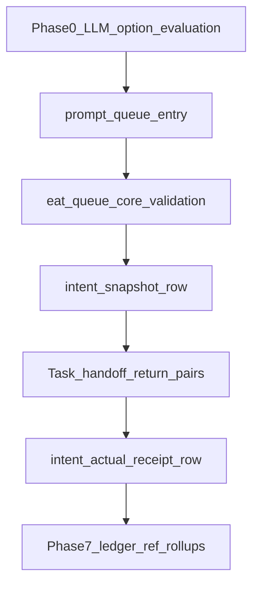

# Parallel Execution Tracking + Python Harness Strengthening

## Grok evaluation (incorporated)

**Aligned with goals:** Dual-track split (no Conceptual-Decision-Records for execution), lane-isolated bundles under `.technical/parallel/<track>/`, structured `status_class` + `divergence_codes[]` vs free-text-only watcher/telemetry, and traceability intent → outcome—all retained.

**Single JSONL for receipts:** Extend [Task-Handoff-Comms-Spec](3-Resources/Second-Brain/Docs/Task-Handoff-Comms-Spec.md) and per-track `task-handoff-comms.jsonl` with new `record_type` values (e.g. `intent_snapshot`, `intent_actual_receipt`) instead of a separate `intent-actual-ledger.jsonl`.

**Paths and commits:** Use vault-relative paths in docs (`3-Resources/Second-Brain/...`, `.cursor/rules/...`). Public-repo aliases (`Docs/Core/*`) may differ. `.technical/` is runtime-oriented; see [git-push-workflow-2026-04-02-0446](3-Resources/Second-Brain/Docs/git-push-workflow-2026-04-02-0446.md).

**Config:** `tracking.intent_receipts_enabled` — **default `true`** in [Second-Brain-Config](3-Resources/Second-Brain-Config.md) with explicit speed-mode opt-out (Grok bonus). `queue.rationale_enforcement_enabled` gates when `option_evaluation` is required.

**Execution visibility:** `ledger_ref[]` — Phase 7 elevates from optional guidance to **documented requirement** for execution-track phase rollups in `roadmap-state-execution.md` (per Dual-Roadmap-Track + Queue-Sources updates).

**Safety:** Contract-first per [Safety-Invariants](3-Resources/Second-Brain/Docs/Safety-Invariants.md); add **rationale honesty** invariant (substring quote + score sanity) in the Honesty gate section (Grok bonus). Receipt writes under `.technical/parallel/<track>/` only; [Dual-Roadmap-Track](3-Resources/Second-Brain/Docs/Dual-Roadmap-Track.md) hierarchy preserved.

## System master goal — what this plan closes vs what remains

**This plan closes (Grok-aligned):** The **nervous-system** gap for execution-track decisions—deterministic structural enforcement, traceable receipts, anti-fabrication checks on shape/codes/refs, and Layer 1 alignment with parallel bundles. With `queue.rationale_enforcement_enabled` + comms receipts, execution lanes can preserve intent and avoid hollow “whys” at the **structural** level.

**Not 100 % of full autopilot end-state:** The broader Second Brain goal (full PARA → ingest/organize/distill → roadmap execution with **junior-buildable** depth everywhere) still needs follow-on work after this plan.

**Remaining gaps after this plan (explicit backlog, not blockers for contract-first work):**


| Gap                                                           | Notes                                                                                                                                                                                            |
| ------------------------------------------------------------- | ------------------------------------------------------------------------------------------------------------------------------------------------------------------------------------------------ |
| LLM **generation** of `option_evaluation`                     | Harness validates; **Phase 0** mandates Layer 1 / queue rule emission when Config requires it—otherwise enforcement-only runs starve.                                                            |
| Execution-track **deepening + pseudocode** at tertiary leaves | Dual-Roadmap-Track today emphasizes mirroring + state; **no** committed contract in this plan forces pseudocode density or Phase 6 CI-shaped evidence everywhere.                                |
| **Full verification loop**                                    | Safety-Invariants honesty gate covers Task(); add rationale substring/score checks to docs + Python; extend [test_full_cycle_golden.py](scripts/eat_queue_core/tests/test_full_cycle_golden.py). |
| **Linkback completeness**                                     | Phase 7: require `ledger_ref[]` on execution phase rollups, not only optional guidance.                                                                                                          |
| **Backfill + speed-mode parity**                              | Document backfill from comms/audit; Config keys until present leave legacy runs without receipts unless reconstructed.                                                                           |


## Grok harness evaluation (incorporated)

**What already exists (this vault):** The Python “nervous system” lives under [scripts/eat_queue_core/](scripts/eat_queue_core/) — [full_cycle.py](scripts/eat_queue_core/full_cycle.py) (`run_full_eat_queue_cycle`, `queue_rewrite_ids`, `run_ledger_validation`), [pool_sync.py](scripts/eat_queue_core/pool_sync.py), [plan.py](scripts/eat_queue_core/plan.py), [workflows.py](scripts/eat_queue_core/workflows.py). Supporting: [scripts/queue-gate-compute.py](scripts/queue-gate-compute.py), [scripts/gitforge_lock.py](scripts/gitforge_lock.py). **Extend** `run_ledger_validation` / plan path rather than a parallel ledger concept.

**Gaps (structural):** Master-goal option evaluation → document `params.option_evaluation` + Python structure/sanity checks; anti-hallucination → deterministic quote/path checks only (no LLM in harness v1); forced recording → policy when enforcement on; `divergence_codes` → Python allowlist.

**Design principle:** Harness **enforces**; LLM **authors**. Phase 0 ensures the LLM side is contractually required to produce evaluable payloads before Python lands.

## Objectives

- Trace each queued execution action from declared intent to actual outcome (receipt rows in per-track `task-handoff-comms.jsonl`).
- Preserve lane isolation; deterministic joins.
- Deterministic Python validation for `option_evaluation` and divergence codes when Config enables it.
- Single comms JSONL schema (extend Task-Handoff-Comms-Spec).
- Phase 7: execution state **must** stamp `ledger_ref[]` on phase rollups per docs.

## Scope

- **Docs + Config:** Queue-Sources, Task-Handoff-Comms-Spec, Safety-Invariants, Second-Brain-Config, Dual-Roadmap-Track.
- **Python:** `scripts/eat_queue_core/` — extend [models.py](scripts/eat_queue_core/models.py), [full_cycle.py](scripts/eat_queue_core/full_cycle.py), [plan.py](scripts/eat_queue_core/plan.py) only for v1 (no new top-level package module unless later needed).
- **Cursor rules (Phase 0):** [queue.mdc](.cursor/rules/agents/queue.mdc) only for the `option_evaluation` mandate—**do not** change [guidance-aware.mdc](.cursor/rules/always/guidance-aware.mdc) for v1. Later phases: [watcher-result-append.mdc](.cursor/rules/always/watcher-result-append.mdc).
- **Templates:** Decision Wrapper under `Ingest/Decisions/` is **truly optional** in Phase 0—only if you deliberately add a new file there.
- **Execution state:** Frontmatter `ledger_ref[]` requirement for rollups (Phase 7); no conceptual frozen-note overwrites.

## Key Files To Change

- [.cursor/rules/agents/queue.mdc](.cursor/rules/agents/queue.mdc) (Phase 0 only); [.cursor/rules/always/watcher-result-append.mdc](.cursor/rules/always/watcher-result-append.mdc) (later phases)
- [3-Resources/Second-Brain/Queue-Sources.md](3-Resources/Second-Brain/Queue-Sources.md), [3-Resources/Second-Brain/Docs/Task-Handoff-Comms-Spec.md](3-Resources/Second-Brain/Docs/Task-Handoff-Comms-Spec.md), [3-Resources/Second-Brain/Docs/Safety-Invariants.md](3-Resources/Second-Brain/Docs/Safety-Invariants.md)
- [3-Resources/Second-Brain-Config.md](3-Resources/Second-Brain-Config.md)
- [3-Resources/Second-Brain/Docs/Dual-Roadmap-Track.md](3-Resources/Second-Brain/Docs/Dual-Roadmap-Track.md), [3-Resources/Second-Brain/Vault-Layout.md](3-Resources/Second-Brain/Vault-Layout.md)
- [scripts/eat_queue_core/models.py](scripts/eat_queue_core/models.py) (`OptionEvaluation` Pydantic), [scripts/eat_queue_core/full_cycle.py](scripts/eat_queue_core/full_cycle.py), [scripts/eat_queue_core/plan.py](scripts/eat_queue_core/plan.py) — **v1: no new top-level module** (e.g. no `rationale_gate.py`); integrate into existing validation flow
- [scripts/eat_queue_core/tests/test_full_cycle_golden.py](scripts/eat_queue_core/tests/test_full_cycle_golden.py) — Phase 7: full `RESUME_ROADMAP` deepen Phase 1 + rationale enforcement on dry-run path
- [.cursor/sync/](.cursor/sync/) after rule edits

## Design

### Final build tweaks — commit Phase 1 docs first (production-ready)

**Doc targets (vault):** [3-Resources/Second-Brain/Queue-Sources.md](3-Resources/Second-Brain/Queue-Sources.md) and [3-Resources/Second-Brain/Docs/Task-Handoff-Comms-Spec.md](3-Resources/Second-Brain/Docs/Task-Handoff-Comms-Spec.md). **Public-repo alias:** `Docs/Core/Queue-Sources.md`, `Docs/Task-Handoff-Comms-Spec.md`. **Config:** [3-Resources/Second-Brain-Config.md](3-Resources/Second-Brain-Config.md) (alias `Docs/Core/Second-Brain-Config.md` if mirrored).

**1) New `record_type` values** (explicit list in both docs):


| `record_type`           | Purpose                                                                                         |
| ----------------------- | ----------------------------------------------------------------------------------------------- |
| `intent_snapshot`       | Immutable-ish intent captured at dispatch boundary (mode, params hash/snapshot, queue context). |
| `intent_actual_receipt` | Final intent-vs-actual row after Task / Layer 1 completion for that entry.                      |


**2) Required fields on `intent_actual_receipt` rows** (Task-Handoff-Comms-Spec + Queue-Sources cross-reference):

- **Identity / join:** `timestamp` (ISO8601), `queue_entry_id`, `parent_run_id`, `task_correlation_id` (when known), `record_type: "intent_actual_receipt"`.
- **Parallel / lane:** `parallel_track`, `queue_lane` (explicit lane token; aligns with PQ `queue_lane` / filter).
- **Outcome:** `status_class` (`success`  `provisional_success`  `failure`), `status` (watcher-compatible where mirrored), `divergence_codes[]` (allowlist only), `planned_action`, `actual_action`, `retryable` (bool, optional).
- **Intent carry:** `mode`, `params_hash` or embedded `intent_snapshot` ref, optional `intent_snapshot_id` / line ref to prior row.
- **Phase 7 forward-ref:** `ledger_ref[]` — array of stable ids (e.g. receipt row id / correlation / synthetic ledger id) **expected** to be echoed back into execution state frontmatter when Phase 7 linkage is applied; may be empty until state is updated.
- **References:** `telemetry_path`, `validator_report_path`, `execution_state_refs[]` (optional).

**3) `RESUME_ROADMAP` — `params.option_evaluation` exact shape** (document verbatim in Queue-Sources § params; Python `OptionEvaluation` must match):

```json
{
  "master_goal_ref": "<vault-relative path or wiki-link target to PMG / goal section>",
  "alternatives": [
    { "id": "<string>", "summary": "<string>", "alignment_score": <number> }
  ],
  "chosen": "<id matching one alternative>",
  "rationale": "<string; must include verbatim quote substring from master_goal_ref when enforcement on—see Safety-Invariants>",
  "validator_ref": "<optional vault path or task-handoff correlation id>"
}
```

- **Normative rules in docs:** `chosen` must equal one `alternatives[].id`; if `alignment_score` is present on every alternative, `chosen` must tie for max or docs define tie-break; `divergence_codes` on the **receipt** row are allowlisted separately from this object.

**4) Config defaults** — In Second-Brain-Config (and doc mirror):

- `tracking.intent_receipts_enabled: true` **by default**.
- **Speed-mode opt-out:** document explicitly (e.g. set `tracking.intent_receipts_enabled: false` or profile key documented in Config § profiles / speed_mode) so operators know how to disable receipt rows without forking code.

### A. Task-handoff comms receipts (per track)

- Append-only `{technical_bundle_root}/task-handoff-comms.jsonl` uses the `record_type` table and `intent_actual_receipt` field list above.

### B. `option_evaluation` (queue payload)

- Same as §3; mirrored in RESUME_ROADMAP params in Queue-Sources.

### C. Python enforcement (Phase 2)

- Add `**OptionEvaluation`** Pydantic model in [models.py](scripts/eat_queue_core/models.py); validate in [full_cycle.py](scripts/eat_queue_core/full_cycle.py) / [plan.py](scripts/eat_queue_core/plan.py) inside **existing** `run_ledger_validation` (or adjacent helpers in the same package). **No new top-level module** (e.g. no `scripts/rationale_gate.py`) for v1.
- Policy for missing / invalid block: document in Queue-Sources (block vs `provisional_success` + repair).

## Rollout Phases (ordered)

**Phase 0 — LLM authoring contract (before Python behavior changes)**  

- **Only** [.cursor/rules/agents/queue.mdc](.cursor/rules/agents/queue.mdc): when `queue.rationale_enforcement_enabled`, mandate `params.option_evaluation` (shape § Design above) for `RESUME_ROADMAP` and other **decision-closing** modes (exact list in Queue-Sources).  
- **Skip** [guidance-aware.mdc](.cursor/rules/always/guidance-aware.mdc) for v1 (do not scope it unless you explicitly expand later).  
- Decision Wrapper under `Ingest/Decisions/`: **truly optional** — only if you add a **new** template file there.  
- *Closes the generation gap:* harness has something to validate.

**Phase 1 — Contract + docs (commit first)**  

- Implement the **Final build tweaks** section in Queue-Sources + Task-Handoff-Comms-Spec + Second-Brain-Config; Safety-Invariants rationale honesty; `queue.rationale_enforcement_enabled` documented.

**Phase 2 — Python rationale gate**  

- [models.py](scripts/eat_queue_core/models.py) `OptionEvaluation` + integration in [full_cycle.py](scripts/eat_queue_core/full_cycle.py) / [plan.py](scripts/eat_queue_core/plan.py) / `run_ledger_validation`; **no** new top-level `eat_queue` module for v1.

**Phase 3 — Receipt emission**  

- Append receipt rows to per-track `task-handoff-comms.jsonl` (single writer policy documented).

**Phase 4 — Rules alignment**  

- `queue.mdc` / watcher reference harness fields; stable binary watcher `status`.

**Phase 5 — Execution linkback guidance**  

- Intermediate: document `ledger_ref[]` pending Phase 7 hard requirement.

**Phase 6 — Backfill (optional)**  

- Document reconstruction from historical comms + audit.

**Phase 7 — Execution-track linkage + full verification (Grok)**  

- **Require** `ledger_ref[]` in `roadmap-state-execution.md` (and phase rollup conventions) per Dual-Roadmap-Track + Queue-Sources updates.  
- Add golden test: `RESUME_ROADMAP` deepen Phase 1 with rationale enforcement, dry-run path.  
- Verification: controlled `EAT-QUEUE lane sandbox` and `EAT-QUEUE lane godot` through Phase 6 rollup; confirm receipt → execution state linkage.

## Acceptance Criteria

- Phase 0 complete before merging Python-only behavior that requires `option_evaluation` payloads.
- Tracking on: intent → outcome from comms rows; `queue.rationale_enforcement_enabled` behaves per Queue-Sources policy.
- Phase 7: rollups include `ledger_ref[]` where docs require; new golden test passes; lane verification succeeds.
- Golden tests green; no conceptual destructive edits.

## Risks And Mitigations

- **False positives on quote checks:** Config-tunable warn-only vs hard-fail.
- **Harness vs Cursor:** Single writer for receipt append; document split.
- **Phase 0 / 7 doc churn:** Commit contract-first on integration branch; sync `.cursor/sync/` for rules.

## Verification Plan

- Phase 7: golden test + dual-lane EAT-QUEUE with rollup linkage check.
- Per-lane controlled entries with receipts + optional rationale enforcement.

## Mermaid — Data flow




