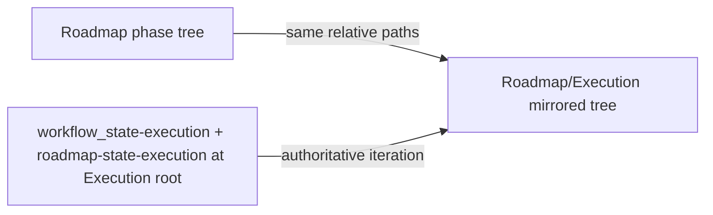

# Parallel execution spine (dual spines) — policy plan

## Locked decisions

- **Canon:** [Vault-Layout](3-Resources/Second-Brain/Vault-Layout.md) already describes a parallel tree under `Roadmap/Execution/`; the **flat heap** of `Phase-`* files **directly** at the `Roadmap/Execution/` root was an **enforcement slip**, not a design change.
- **In scope:** **Dual spines** — **identical** folder hierarchy and relative paths as the conceptual `Roadmap/` tree, prefixed with `Roadmap/Execution/`.
- **Out of scope (this iteration):** Nested `Roadmap/Phase-X/Execution/` folders — would require rewriting frozen-region and writable-path rules; defer to a formal **iteration-3** policy ticket if needed.
- **Control plane:** Global execution state remains `**Roadmap/Execution/workflow_state-execution.md`** + `**Roadmap/Execution/roadmap-state-execution.md`** (single **authoritative** cursor for `current_phase`, Log table, context tracking).




---

## 1. Execution track path rule (mandatory contract)

**Add or replace** in these locations (minor edits for vault path style OK):


| Location                                                                         | Purpose                                                 |
| -------------------------------------------------------------------------------- | ------------------------------------------------------- |
| [.cursor/skills/roadmap-deepen/SKILL.md](.cursor/skills/roadmap-deepen/SKILL.md) | Dual track + path resolution; `phaseTreeRoot` semantics |
| [.cursor/agents/roadmap.md](.cursor/agents/roadmap.md)                           | Roadmap subagent onboarding + deepen behavior           |
| [.cursor/sync/skills/roadmap-deepen.md](.cursor/sync/skills/roadmap-deepen.md)   | Backbone sync after skill edit                          |


**Contract text** (verbatim or with only path-style tweaks):

When `roadmap_track: execution` (or `roadmap-state-execution.md` is active):

1. Derive the **conceptual counterpart path** from `roadmap-state.md`, target frontmatter, and/or `conceptual_counterpart`.
2. **Execution target path** = `Roadmap/Execution/` + the **exact same relative path** as the conceptual note under `Roadmap/` (preserve **every** folder level; use `obsidian_ensure_structure` for missing parents).
3. **Never** mint execution notes as **flat files directly under `Roadmap/Execution/`** (or at **incorrect depth**) when the conceptual tree nests them under `Roadmap/Phase-A/Phase-B/...`. **Flattening is a policy violation.**
4. On every `deepen` / `recal` / `RESUME_ROADMAP` structural write, enforce this rule. After any moves, update wikilinks, MOCs, `conceptual_counterpart`, `execution_mirror`, and **all pointers inside execution state files** so they resolve to mirrored locations.

**Anti-pattern (explicit):** Skipping intermediate phase folders so a file lands at `Roadmap/Execution/Phase-3-2-UI-Integration-Roadmap-....md` (wrong — single segment at execution root) instead of `Roadmap/Execution/Phase-3-Systems/Phase-3-2-UI-Integration-Roadmap-....md` when conceptual lives under `Roadmap/Phase-3-Systems/...`. **Correct:** `Roadmap/Execution/<same folders as conceptual>/<same basename>.md`.

---

## 2. Operator / queue hand-off template

**Publish verbatim** (or as a fenced block) in [Queue-Sources](3-Resources/Second-Brain/Queue-Sources.md) or [Dual-Roadmap-Track](3-Resources/Second-Brain/Docs/Dual-Roadmap-Track.md) under a short “Execution path hand-off” subsection:

```
Deepen on execution track only.
Target root = Roadmap/Execution/
Mirror the exact conceptual phase folder hierarchy from the current roadmap-state.md.
Example mapping:
  Conceptual path → Roadmap/Execution/<same relative folders and filename>
Do NOT flatten under the Execution root.
Create any missing Phase-X/ subfolders.
After write, update all internal links, conceptual_counterpart frontmatter, and workflow_state-execution.md pointers.
Confirm new path in the hand-off log.
```

---

## 3. Backbone docs to align (policy wording only)

- **[Vault-Layout](3-Resources/Second-Brain/Vault-Layout.md)** — Update the `Roadmap/Execution/` table row: emphasize **mirror spine** (not a flat pool at the execution root for nested conceptual trees); link to the new example in [Roadmap Structure](Roadmap%20Structure.md).
- **[Roadmap Structure](Roadmap%20Structure.md)** — Add **“Execution Track – Parallel Spine”** worked example (ASCII trees for conceptual vs execution). **Explicitly note** state files remain **only** at `Roadmap/Execution/` root.
- **[Parameters](3-Resources/Second-Brain/Parameters.md)** — Add bullet: execution track paths under `Roadmap/Execution/...` must **mirror** the conceptual hierarchy (**do not flatten** at the `Execution/` root).
- **[dual-roadmap-track.mdc](.cursor/rules/context/dual-roadmap-track.mdc)** — Optional one-sentence clarification: execution writes belong under the **mirrored** `Roadmap/Execution/...` tree, **not** a flat dump. **Frozen guard unchanged:** `Roadmap/`** excluding `Roadmap/Execution/`** for conceptual freeze semantics.

**No change** to the frozen-region definition. Parallel spine stays **inside** `Roadmap/Execution/`.

---

## 4. One-time vault hygiene (operator checklist)

Document as a short operator runbook (Vault-Layout “Dual roadmap track” or a small `Docs/` note):

1. For each flat `Roadmap/Execution/Phase-*.md` at **wrong depth**, derive the target folder chain from `conceptual_counterpart` frontmatter, filename, or phase naming.
2. Use **sanctioned** moves: `obsidian_ensure_structure` + `obsidian_move_note` (or Obsidian UI) to place the file under `Roadmap/Execution/<mirrored folders>/` — **do not use raw shell `mv`** on vault paths.
3. Batch-fix wikilinks and search/replace references.
4. Update any embedded paths in `workflow_state-execution.md` / `roadmap-state-execution.md`.
5. Optional: ORGANIZE / backlink refresh pass.

---

## 5. Explicit non-goals (iteration boundary)

- **No** nested `Phase-X/Execution/` under conceptual `Roadmap/Phase-X/` without a separate policy + rule pass.
- **No** distributed per-phase `workflow_state` — **global pair** at `Roadmap/Execution/` root remains authoritative.
- Automated **lint** for “no flat execution files” is optional future work. This plan is **policy + docs + hygiene** only.

---

## 6. Post-change housekeeping

After editing rules/skills: [backbone-docs-sync](.cursor/rules/always/backbone-docs-sync.mdc) — update [.cursor/sync/](.cursor/sync/) counterparts and [changelog](.cursor/sync/changelog.md) per repo convention.

---

## Evaluation note (Grok “final polish”)

**Claim:** prose-only, no structural changes.

**Verdict:** **Incorrect.** The Grok paste included (1) **corrupted mermaid** (rendered CSS/HTML instead of a ` 

```mermaid  `source block), (2) a **broken markdown table**, (3) a **`textDeepen` artifact** in the hand-off block, and (4) **loss of file links**. Substantive wording improvements were **merged** above; unusable fragments were **discarded**. This file is the canonical plan text.