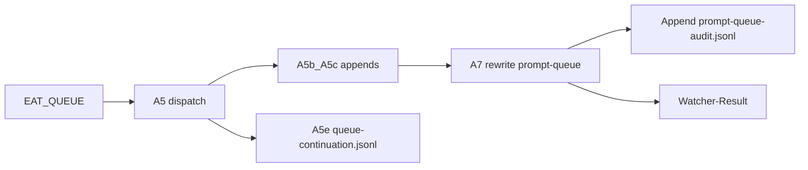

# Prompt queue audit log (movement trace)

## Current state

- **Active queue:** `[.technical/prompt-queue.jsonl](.technical/prompt-queue.jsonl)` is rewritten on each EAT-QUEUE pass (`**[queue.mdc` A.7](.cursor/rules/agents/queue.mdc)** — consumed ids dropped from file).
- **Existing trace:** `[3-Resources/Watcher-Result.md](3-Resources/Watcher-Result.md)` — one line per processed `requestId`, outcome-focused, **not** the full queue payload.
- **Continuation log:** `[.technical/queue-continuation.jsonl](.technical/queue-continuation.jsonl)` is already written when `[Second-Brain-Config.md](3-Resources/Second-Brain-Config.md)` has `queue_continuation.continuation_log_enabled: true` (it is **true** today). Per [Queue-Continuation-Spec](3-Resources/Second-Brain/Docs/Queue-Continuation-Spec.md), rows capture `**queue_entry_id`**, `**suppress_reason`**, `**post_little_val_summary**`, spin/gate telemetry, etc. — **not** a canonical copy of the removed JSONL line. Good for “why no follow-up / bootstrap,” weak for “exactly what left the queue.”

## Goal

**Append-only audit** so each **removal** (and optionally each **append** in the same run) is durable: full payload + disposition + links to spawned line ids + correlation ids.

## Design

**New file:** `.technical/prompt-queue-audit.jsonl` (JSONL, append-only, never rewrite in place).

**Config** (under existing `queue:` block in `[Second-Brain-Config.md](3-Resources/Second-Brain-Config.md)`):

- `queue.audit_log_enabled` (default **true**).
- `queue.audit_log_path` (default `.technical/prompt-queue-audit.jsonl`).
- `queue.audit_log_payload_mode`: `**full`** | `**metadata_only`** — default `**full`** for movement tracking; metadata-only stores `mode`, `id`, `project_id`, `source_file`, `params` keys only (smaller, less replay fidelity).

**Event types (schema_version 1):**

1. `**line_removed`** — emitted in **A.7** when building the rewritten queue: for every line whose `id` is in `processed_success_ids`, or is being dropped as success after tiered consume, append one audit object including:
  - `event`, `schema_version`, `eat_queue_run_id`, `disposition_completed_iso`, `queue_entry_id` (= line `id`) — plus timing fields in **Timing** section below
  - `disposition`: `success_consumed` | `consumed_post_little_val_with_repair` (when A.7 tiered policy consumed trigger entry) | `queue_failed_retained` (if you choose to log retained-failed separately — clarify: failed lines **stay** in file with `queue_failed`; optional audit on rewrite when flag changes)
  - `payload` or `payload_metadata` per mode
  - `parent_run_id` / Layer 1 correlation when known
  - `spawned_line_ids`: ids appended this run (A.5b repair, A.5c `next_entry`, merged follow-ups) for **graph** tracing
  - `watcher_linked`: bool (Watcher line expected same `requestId`)
2. `**line_appended`** (optional but high value for “movement”): one row per **new** line appended during the run (before A.7 merge), with `trigger`: `operator_read_append` | `layer1_a5b_repair` | `layer1_a5c_followup` | `layer1_a5c1_synthesized` | `roadmap_queue_followups` | `empty_queue_bootstrap` — so you see **where** lines came from. Include `**eat_queue_run_id`**, `**appended_iso`** (UTC when append landed), and optional `**parent_queue_entry_id**` when spawn is attributable (e.g. repair parent id).

**Ordering:** Implement **append after A.7 final write** (single batch) or **append per disposition** — spec should require **read-then-append** (same safety pattern as queue file).

## Timing (required for movement / latency)

Previously the design only called out `completed_iso` on each audit row. That is **not** enough for “when did it wait vs run.” The spec must require:

| Field                       | Required           | Purpose                                                                                                                                                                            |
| --------------------------- | ------------------ | ---------------------------------------------------------------------------------------------------------------------------------------------------------------------------------- |
| `eat_queue_run_id`          | yes                | Stable id for **one** EAT-QUEUE invocation (UUID or `queue-eat-<iso>`), repeated on **every** audit line in that pass so rows group in jq/Dataview.                                |
| `disposition_completed_iso` | yes                | UTC ISO8601 when Layer 1 **finished** disposition for this `queue_entry_id` (same role as prior `completed_iso`; rename in spec for clarity vs other clocks).                      |
| `payload_timestamp_utc`     | if present on line | Copy queue entry’s optional `timestamp` (UTC) from [Queue-Sources](3-Resources/Second-Brain/Queue-Sources.md) when the JSONL object includes it — **enqueue / craft time** signal. |
| `payload_local_timestamp`   | if present on line | Copy optional `local_timestamp` from the line when present.                                                                                                                        |
| `dispatch_started_iso`      | recommended        | When Layer 1 **began** dispatch for this entry (before `Task` pipeline). Enables queue wait + run duration.                                                                        |
| `dispatch_completed_iso`    | recommended        | When pipeline + post-LV steps for this entry **completed** (before A.7 drop).                                                                                                      |
| `duration_ms_dispatch`      | optional           | `dispatch_completed_iso - dispatch_started_iso` when both set; omit if clocks unreliable.                                                                                          |

**Cross-check:** Watcher-Result `completed` for the same `requestId` should match or closely follow `disposition_completed_iso`; spec notes operators can diff for lag.

**Implementation note:** Layer 1 must **stamp** `eat_queue_run_id` once at parse/start of A.2 and **record** dispatch start/end per entry in memory during A.5/A.6 so audit rows can be emitted in A.7 without guessing.

**Cursor visibility:** `[.cursorignore](.cursorignore)` currently whitelists `prompt-queue.jsonl` and `queue-continuation.jsonl`. Add `!.technical/prompt-queue-audit.jsonl` so agents can read the audit without listing all of `.technical/`**.

## Documentation / backbone updates

| Artifact | Change                                                                                                                                                        |
| -------- | ------------------------------------------------------------------------------------------------------------------------------------------------------------- |
| New      | `[3-Resources/Second-Brain/Docs/Queue-Audit-Log-Spec.md](3-Resources/Second-Brain/Docs/Queue-Audit-Log-Spec.md)` — schema, events, invariants, retention note |
| Update   | `[3-Resources/Second-Brain/Queue-Sources.md](3-Resources/Second-Brain/Queue-Sources.md)` — cross-link audit log vs continuation vs Watcher                    |
| Update   | `[3-Resources/Second-Brain/Logs.md](3-Resources/Second-Brain/Logs.md)` — destination table row for audit file                                                 |
| Update   | `[3-Resources/Second-Brain/Parameters.md](3-Resources/Second-Brain/Parameters.md)` — new `queue.audit_*` keys                                                 |
| Update   | `[.cursor/rules/agents/queue.mdc](.cursor/rules/agents/queue.mdc)` — **A.7** (and optionally **A.5b/A.5c** append hooks) procedural steps                     |
| Sync     | `[.cursor/sync/rules/agents/queue.md](.cursor/sync/rules/agents/queue.md)` + `[changelog.md](.cursor/sync/changelog.md)` per backbone-docs-sync               |

## Retention / ops (document only in v1)

- File grows unbounded; point to `[log-rotate](.cursor/skills/log-rotate/SKILL.md)` or manual archive monthly — no automation required in first pass unless you want a small note in Logs.md.

## Execution note

Layer 1 behavior is **specified in markdown** (`[queue.mdc](.cursor/rules/agents/queue.mdc)`); the Queue subagent / implementer must **actually** perform the appends when processing EAT-QUEUE. The plan delivers **contract + config + ignore rule** so runs are consistent.