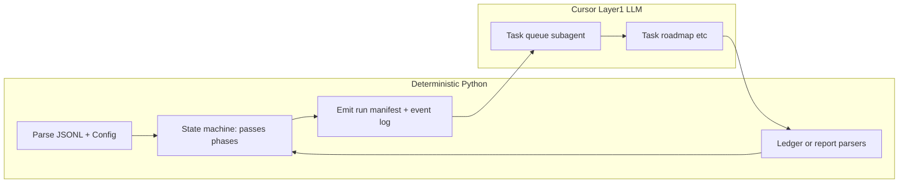

# Python “nervous system” for EAT-QUEUE (hybrid with Cursor)

## Problem statement (grounded in this repo)

Layer 1 behavior is specified as a long procedural contract in `[.cursor/rules/agents/queue.mdc](.cursor/rules/agents/queue.mdc)` (A.0–A.8, Pass 1–3, A.5b repair append, A.5d gatekeeper, A.7 consumption). That logic is executed by an LLM Queue subagent, so **phase tags** (`queue_pass_phase`), **repair drain**, and **hold clearing** can drift when the model skips or mis-orders steps. You already have **partial** determinism: `[scripts/queue-gate-compute.py](scripts/queue-gate-compute.py)` (gate streaks per [Queue-Gate-State-Spec](3-Resources/Second-Brain/Docs/Queue-Gate-State-Spec.md)) and `[3-Resources/Second-Brain/tests/sb_contracts/queue.py](3-Resources/Second-Brain/tests/sb_contracts/queue.py)` (parse/validate/dedup/sort for a **subset** of modes).

**Constraint:** [dispatcher.mdc](.cursor/rules/always/dispatcher.mdc) requires Layer 0 to invoke `**Task(subagent_type: queue)`**; there is **no in-repo API** to run roadmap/ingest pipelines from raw Python without going through Cursor/Task. So the right architecture is **hybrid**: Python owns **state-machine decisions and bookkeeping**; Cursor Task still performs **subagent dispatch and vault edits**.




## Target architecture (matches Grok table, adapted to this vault)


| Layer                  | Responsibility                                                                                                                 | In this repo                                                                                                                                                           |
| ---------------------- | ------------------------------------------------------------------------------------------------------------------------------ | ---------------------------------------------------------------------------------------------------------------------------------------------------------------------- |
| Central nervous system | Parse queue, ordering, pass-1/2/3 scheduling, repair-first flags, `processed_success_ids`, when to set `inline_repair_pending` | New Python package under e.g. `.technical/scripts/eat_queue_core/` or `scripts/eat-queue-core/`                                                                        |
| Rule engine            | Transitions: “hard block + A.5b.3 succeeded → consume E + schedule Pass 3 wave”                                                | Python functions + enums; optionally load thresholds from [Second-Brain-Config](3-Resources/Second-Brain-Config.md) (same keys `queue-gate-compute.py` already parses) |
| LLM sub-agents         | Mint text, run deepen, write validator **prose** reports                                                                       | Unchanged: `Task(roadmap)`, `Task(validator)`; inputs/outputs constrained by manifest + schemas                                                                        |
| Audit                  | Replay why a transition fired                                                                                                  | Append-only JSONL under `.technical/` (e.g. `eat-queue-decisions.jsonl`) + optional SQLite later                                                                       |


## Implementation phases

### Phase 1 — Contracts and models (foundation)

- Add **Pydantic v2** models for:
  - **Queue line** superset: `id`, `mode`, `params`, `queue_priority`, `validator_repair_followup`, `queue_failed`, tags, etc., aligned with [Queue-Sources](3-Resources/Second-Brain/Queue-Sources.md) / MCP-Tools queue contract.
  - `**ValidationResult`** (add **now**, so the FSM never depends on markdown prose for routing):

```python
class ValidationResult(BaseModel):
    primary_code: str                    # e.g. "contradictions_detected"
    severity: Literal["high", "medium", "low"]
    recommended_action: Literal["repair_append", "inline_repair", "hard_block"]
    report_path: str | None
    hygiene_issues: list[str] = Field(default_factory=list)
```

- **Run context**: `parent_run_id`, vault root, config snapshot (parsed queue block).
- **Orchestration state**: `queue_pass_phase` enum (`initial`, `cleanup`, `inline`, `inline_forward`, …), `dispatch_ordinal`, `inline_repair_pending`, `roadmap_pass_order`. For **repair dispatch** intents, manifest must carry `queue_pass_phase: "repair"` on the repair line’s dispatch (per golden test below).
- **Structured subagent return**: parse fenced YAML `nested_subagent_ledger` / `validator_context` from Task return text into typed objects where possible; L1 post–little-val path should feed `**ValidationResult`** (from structured fields or from report parser) so transitions are deterministic.
- Extend `[tests/sb_contracts/queue.py](3-Resources/Second-Brain/tests/sb_contracts/queue.py)` or replace with Pydantic validation: **reject** invalid lines early; expand `KNOWN_MODES` to match Queue-Sources (RESUME_ROADMAP, RECAL-ROAD aliases normalized in code).
- Unit tests in `[3-Resources/Second-Brain/tests/unit/](3-Resources/Second-Brain/tests/unit/)` for: repair-class detection (`queue_priority == "repair"` OR `validator_repair_followup`), pass ordering, consumption rules mirroring A.7 text.
- **Golden-file test (Phase 1):** Check in the **exact failing queue JSONL** from the incident (forward line + appended **repair** line). Assert the emitted `eat_queue_run_plan.json` contains:
  - A **Pass 3** intent for the **repair** queue entry.
  - `consumed_ids` includes the original forward entry id `**followup-deepen-phase5-511…`** (full id from the saved fixture).
  - The repair dispatch intent has `**queue_pass_phase: "repair"`** (not `"inline"` unless you later unify naming — test locks the intended contract).

### Phase 2 — Deterministic state machine (core)

- **First milestone: pure Python, minimal deps.** Use `**enum.Enum` for states/events** plus a **dict-of-dicts (or dict of tuples) transition table**, or small explicit `if`/`match` on `(state, event)`. **Do not** add `transitions` / `python-statemachine` unless that package is **already** a declared dependency in the environment you standardize on — default is **stdlib only**.
- **Size budget:** keep the **whole nervous system package ≤ ~400 LOC** at first milestone (models + FSM + plan emit + one integration path); grow only after golden tests pass.
- Encode:
  - **Pass 1** (initial forward slot per project), **Pass 2** (cleanup repair drain per A.4c), **Pass 3** (repair drain + optional inline forward when config flags match [queue.mdc A.5.0](.cursor/rules/agents/queue.mdc) / `queue-phase-inline-repair`).
  - Transitions driven by **events**: `entry_dispatched`, `roadmap_return_parsed`, `l1_post_lv_verdict` (carrying `**ValidationResult`**), `repair_line_appended`, `a5c_followup_appended`, `cap_reached`.
- Implement **pure functions** for:
  - **A.5b.3 repair line builder** (JSON object for append): deterministic `id`, `params.action` from `repair_action` table keyed by `ValidationResult.primary_code` / `recommended_action` (start with codes you actually see: `state_hygiene_failure`, `incoherence`, etc.).
  - **A.7 consumption set**: which ids move to `consumed_ids` / `processed_success_ids` given event history (repair appended for E → E consumed; new repair line scheduled for Pass 3).
- **Output:** `eat_queue_run_plan.json` under `.technical/` per `parent_run_id`, listing ordered **intents**: `{ "op": "dispatch", "subagent_type": "roadmap", "queue_entry_id": "...", "queue_pass_phase": "...", "dispatch_ordinal": N, ... }` plus `op: append_repair_line` when applicable. **Repair** dispatches use `queue_pass_phase: "repair"` (see golden test).

### Phase 3 — Bridge Layer 1 (rules + agent)

- **Config flag (exact name):** `python_orchestrator_enabled: bool` under the existing `queue:` block in [Second-Brain-Config](3-Resources/Second-Brain-Config.md). **Default `false`** so other team members are unchanged until you flip it.
- Update `[.cursor/agents/queue.md](.cursor/agents/queue.md)` and a **narrow** section of `[.cursor/rules/agents/queue.mdc](.cursor/rules/agents/queue.mdc)`: **if** `.technical/eat_queue_run_plan.json` exists for this run and `**python_orchestrator_enabled`** is **true**, the Queue subagent **must** execute intents in order and **must not** override `queue_pass_phase` / dispatch ordinal from the manifest (LLM only fills Task prompts from templates + vault paths).
- **Pre-run hook (high-ROI safety):** Document a **one-liner** so a failed or stale plan never silently pairs with EAT-QUEUE:

```bash
python -m eat_queue_core plan ... && echo "✅ Plan generated – now run EAT-QUEUE" || exit 1
```

  If `plan` exits non-zero, the shell stops — Cursor should not run against a missing or broken manifest.

- Wire existing `[scripts/queue-gate-compute.py](scripts/queue-gate-compute.py)`: Python FSM calls `record-outcome` with the same stdin contract already documented in queue.mdc (no duplicate streak logic in prose).

### Phase 4 — Validators and hygiene (incremental)

- **Short term:** Parser that maps validator report markdown in `.technical/Validator/` (or structured frontmatter) into the **Phase 1 `ValidationResult` model** — enough for **FSM routing** without re-implementing semantic audit; populate `hygiene_issues` from stable bullet lists when present.
- **Longer term:** Optional pure checks (e.g. load `workflow_state.md` / `roadmap-state.md` and diff specific fields) only where patterns are **fully specified**; keep novel coherence checks on Validator LLM.

### Phase 5 — Telemetry and replay

- Every FSM transition appends one line to `.technical/eat-queue-decisions.jsonl`: `{ "ts", "parent_run_id", "rule_id", "from_state", "to_state", "queue_entry_id", "reason" }`.
- Align Watcher-Result `trace` machine tags with manifest lines so grep + decision log replay match (`[3-Resources/Watcher-Result.md](3-Resources/Watcher-Result.md)` examples already use `queue_pass_phase=...`).

### Phase 6 — Optional graph runner (only if needed)

- **LangGraph / Temporal:** Defer until Phase 2–3 stable. Use only if you add an **external** runner that can call Cursor or MCP without the Queue LLM; otherwise YAGNI.

## Docs and sync (backbone)

- New user-facing doc under `[3-Resources/Second-Brain/Docs/](3-Resources/Second-Brain/Docs/)`: “Python queue orchestrator” — when to enable, file paths, failure modes.
- Update [Queue-Sources](3-Resources/Second-Brain/Queue-Sources.md), [Parameters](3-Resources/Second-Brain/Parameters.md) or Config for `**python_orchestrator_enabled`** (default **false**) and manifest path.
- Per [backbone-docs-sync.mdc](.cursor/rules/always/backbone-docs-sync.mdc): sync `.cursor/sync/` if queue rule/agent files change.

## Risks and mitigations

- **Drift** between Python FSM and queue.mdc: treat markdown spec as **authoritative until** manifest mode is on; add a “spec parity” checklist in tests (rule IDs ↔ code branches).
- **Task return parsing** fragility: require Roadmap/Validator subagents to emit **machine-readable YAML blocks** (already in Nested-Subagent-Ledger-Spec); add golden-file tests on sample returns.
- **Scope creep:** Ship **repair path + Pass 3 scheduling + consumption** first; defer full ROADMAP_MODE / INGEST dispatch in FSM.

## Success criteria (first milestone)

- With `python_orchestrator_enabled: true`, a run that appends A.5b.3 repair **always** produces a manifest whose Pass 3 includes the new repair line and marks triggering id consumed per A.7.
- `eat-queue-decisions.jsonl` shows a complete transition chain for that scenario.
- Existing `[queue-gate-compute.py](scripts/queue-gate-compute.py)` outcomes remain consistent with FSM `record-outcome` calls.

