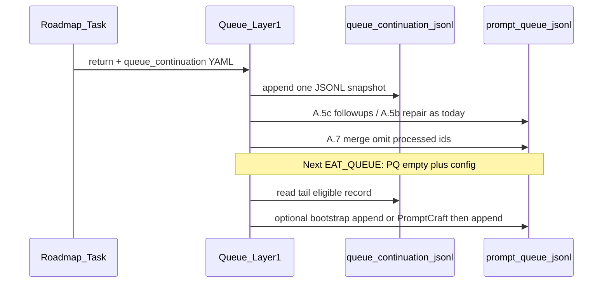

# Queue continuation (machine-readable) plan

## Problem

Today, “success” without `**queue_followups**` (e.g. `**queue_next: false**`) leaves `**prompt-queue.jsonl**` empty with no durable, parseable record of *why* follow-up was suppressed or whether an operator might safely auto-continue. Watcher-Result prose is not a reliable contract.

## Design principles

- **Policy vs craft:** Layer 1 (Queue) decides *if* a bootstrap append is allowed; **PromptCraft** (optional) only *wordsmiths* a suggested JSONL line from a **fixed hand-off schema**—never the source of truth for `project_id` or eligibility.
- **Explicit beats inferred:** Eligibility comes from a `**queue_continuation`** object emitted by the pipeline (Roadmap) and/or normalized by Queue after tiered repair—not from parsing English in `[Watcher-Result.md](3-Resources/Watcher-Result.md)`.
- **Separation of concerns:** New user-facing spec under `[3-Resources/Second-Brain/Docs/](3-Resources/Second-Brain/Docs/)`; thin hooks in `[.cursor/rules/agents/queue.mdc](.cursor/rules/agents/queue.mdc)` and `[.cursor/agents/roadmap.md](.cursor/agents/roadmap.md)`; config in `[3-Resources/Second-Brain-Config.md](3-Resources/Second-Brain-Config.md)`.

## Canonical artifact: `queue_continuation` object

Add `**[3-Resources/Second-Brain/Docs/Queue-Continuation-Spec.md](3-Resources/Second-Brain/Docs/Queue-Continuation-Spec.md)`** defining JSON fields (minimum viable):

| Field                   | Purpose                                                                                    |
| ----------------------- | ------------------------------------------------------------------------------------------ |
| `schema_version`        | e.g. `1`                                                                                   |
| `source`                | `roadmap_task_return`                                                                      |
| `queue_entry_id`        | Triggering entry `id`                                                                      |
| `project_id`            | Required when roadmap-scoped                                                               |
| `suppress_followup`     | bool — true when no `queue_followups` was emitted by policy                                |
| `suppress_reason`       | enum, e.g. `explicit_queue_next_false`                                                     |
| `continuation_eligible` | bool — **true** only when spec says auto-continue may apply (narrow); default **false**    |
| `suggested_next`        | optional object: `{ "mode": "RESUME_ROADMAP", "params": { ... } }` (Queue still validates) |
| `rationale_short`       | human-readable, for logs only                                                              |

**Invariants (document in spec):**

- `**continuation_eligible: true` MUST NOT** be set when `**suppress_reason === explicit_queue_next_false`** (user/crafter explicit stop wins).
- Roadmap must set `**continuation_eligible`** consistently with existing `[Queue-Sources.md](3-Resources/Second-Brain/Queue-Sources.md)` rules for `**queue_next*`* and termination (target reached, handoff gate, etc.).

## Durable copy (append-only, machine-readable)

Avoid overloading Watcher-Result line format (plugin parsing). Prefer **one JSONL line per processed queue entry**:

- **Path:** `.technical/queue-continuation.jsonl` (same exclusion pattern as prompt-queue; document in [Vault-Layout](3-Resources/Second-Brain/Vault-Layout.md) + [Logs](3-Resources/Second-Brain/Logs.md) “machine-only” table).

**Writer:** Queue subagent **after** each entry reaches a terminal state for that run (success path after post–little-val + A.5b branch, or recorded failure), merging:

- Parsed `**queue_continuation`** from pipeline return (if present), else a **Queue-computed** minimal object (e.g. after A.5b repair append).

**Reader:** Queue **A.1** (or new **A.1b** immediately after read): if `**prompt-queue.jsonl`** is empty and config allows bootstrap, **tail-read** last N lines of `queue-continuation.jsonl`, pick newest record matching filters (TTL, `continuation_eligible`, same project if user passed project context in hand-off—optional).

## Config (`[Second-Brain-Brain-Config.md](3-Resources/Second-Brain-Config.md)`)

Add a `**queue_continuation**` (or flat) block, all default **false** / conservative:

- `continuation_log_enabled` — write `.technical/queue-continuation.jsonl`
- `empty_queue_bootstrap_enabled` — when queue empty at **start** of EAT-QUEUE, may append one line from last eligible record
- `empty_queue_bootstrap_max_age_minutes` — TTL guard
- `empty_queue_bootstrap_prompt_craft` — if true, `Task(prompt_craft)` with `craft_source: empty_queue_bootstrap` before append (still requires `empty_queue_bootstrap_auto_append` or manual review pattern)
- `empty_queue_bootstrap_auto_append` — mirror semantics of `recovery_auto_append` (default false)

## Code / rule changes (implementation order)

1. **Spec only:** Create `[Queue-Continuation-Spec.md](3-Resources/Second-Brain/Docs/Queue-Continuation-Spec.md)`; link from `[Queue-Sources.md](3-Resources/Second-Brain/Queue-Sources.md)` (new subsection after PromptCraft or under “Re-queue / continuity”).
2. **Parameters + Logs + Vault-Layout:** Document optional Run-Telemetry keys mirroring `queue_continuation` (redundant convenience) and the new JSONL log path.
3. `**[roadmap.md](.cursor/agents/roadmap.md)`** (+ `[roadmap.mdc](.cursor/rules/agents/roadmap.mdc)` if needed): Require a fenced `**queue_continuation:`** YAML block at end of return for **RESUME_ROADMAP** / **ROADMAP_MODE** completions, aligned with actual `queue_followups` / `queue_next` behavior.
4. `**[queue.mdc](.cursor/rules/agents/queue.mdc)`:**
  - After each processed entry, append one line to `queue-continuation.jsonl` when `continuation_log_enabled`.
  - **A.1 empty-queue branch:** if file empty and `empty_queue_bootstrap_enabled`, read tail of continuation log; if eligible and fresh, build or craft one JSONL line; respect idempotency (e.g. `bootstrap_id` / hash of `queue_entry_id`+`completed` in continuation record).
5. **PromptCraft:** Extend `[.cursor/agents/prompt-craft.md](.cursor/agents/prompt-craft.md)` + `[.cursor/rules/agents/prompt-craft.mdc](.cursor/rules/agents/prompt-craft.mdc)` with `**craft_source: empty_queue_bootstrap`** hand-off (continuation record + vault root + telemetry)—same return contract as other craft sources.
6. `**[Subagent-Safety-Contract.md](3-Resources/Second-Brain/Subagent-Safety-Contract.md)`:** Optional “Pipeline return § queue_continuation” bullet so Layer 2 and Layer 1 agree.
7. **Sync + changelog:** Update `[.cursor/sync/rules/agents/queue.md](.cursor/sync/rules/agents/queue.md)`, `[.cursor/sync/rules/agents/prompt-craft.md](.cursor/sync/rules/agents/prompt-craft.md)` (if touched), `[.cursor/sync/changelog.md](.cursor/sync/changelog.md)`; index in `[Docs/README.md](3-Resources/Second-Brain/Docs/README.md)` / `[Pipelines.md](3-Resources/Second-Brain/Pipelines.md)` as needed.

## Related safety fix (same pass, small)

Tighten `[.cursor/rules/agents/queue.mdc](.cursor/rules/agents/queue.mdc)` **A.5b** “Repair append” `**If`** to **explicitly require post–little-val hard block** (per §124), so **A.5b.3** never runs on needs-work-only—aligns spec with intended behavior and avoids accidental repair lines.

## Non-goals (this phase)

- Changing Obsidian Watcher-Result line grammar.
- Unconditional empty-queue → PromptCraft without `continuation_eligible` + config gates.
- Auto-continue when `**explicit_queue_next_false`** or target-reached termination.

