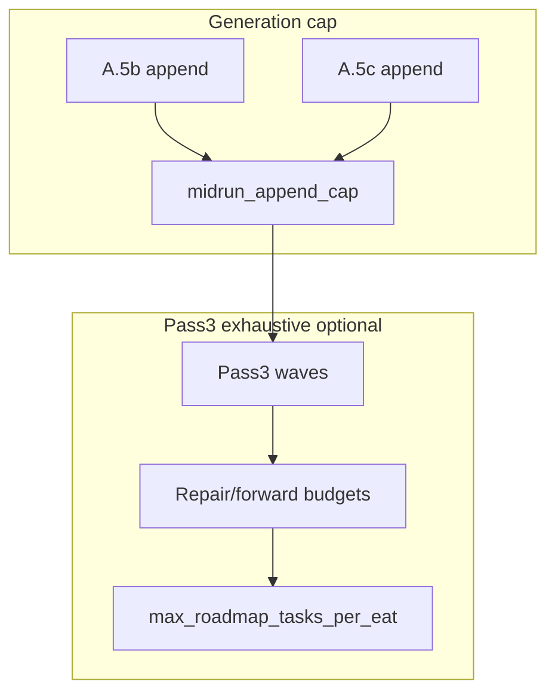

# Queue: eat every generated line (or bound generation)

## Problem (today)

- Layer 1 can **append** multiple lines per run (**A.5b** repair, **A.5c** follow-ups, **A.5d**, PromptCraft recovery).
- **Pass 3** dispatches `**inline`** / `**inline_forward`** only within:
  - `**repair_class_roadmap_dispatches_completed[project_id]`** vs `**queue.max_repair_roadmap_dispatches_per_project_per_run**` (shared across **cleanup + Pass 3** per `[.cursor/rules/agents/queue.mdc](.cursor/rules/agents/queue.mdc)` **A.4c** / **A.5.0**).
  - `**forward_followup_inline_dispatches_completed`** vs `**max_inline_forward_followup_dispatches_per_project_per_run`**.
  - `**inline_drain_generation < max(max_inline_a5b_repair_generations_per_run, max_inline_forward_followup_generations_per_run)`**.

So it is **intentional** that some appended ids can remain until the **next** EAT-QUEUE when caps or generations bind first. That conflicts with the invariant: **everything appended this run should be dispatched this run**.

## Target invariant (normative)

For a given EAT-QUEUE run, let **G** = set of ids successfully appended from **A.5b / A.5c / A.5c.1 / A.5c.2 / A.5d** (and recovery auto-append when used). Either:

1. **Dispatch-complete:** every id in **G** that is still **forward-class** or **repair-class** and eligible under stall-skip / gate rules receives a full roadmap disposition **in the same run** (or is explicitly `**queue_failed`** / stall-skipped with line retained—documented failure path), **or**
2. **Generation-bound:** Layer 1 **does not append** more lines than remaining **dispatch budget** allows (hard cap on appends per disposition / per run).

Practically you need **both** a **consumption** path and a **generation** path; consumption-only changes still fail if `**max_repair`** was already exhausted in Pass 1/2.

## Recommended approach (two layers)

### Layer A — Consumption: “exhaust Pass 3 for this run’s appends”

1. Add a **Config** flag, e.g. `**queue.pass3_drain_appended_until_empty`** (default `**false`**) in `[3-Resources/Second-Brain-Config.md](3-Resources/Second-Brain-Config.md)`.
2. When `**true`**, change **Pass 3** loop in `[queue.mdc](.cursor/rules/agents/queue.mdc)` **A.5.0** (mirrored in `[.cursor/agents/queue.md](.cursor/agents/queue.md)` + `[.cursor/sync/rules/agents/queue.md](.cursor/sync/rules/agents/queue.md)`):
  - **Generation bound:** use `**inline_drain_max_gen = max(config_pair, ceil(1 + k * |ids_appended_this_eat_queue_run|))`** (or `**max(config_pair, |G| + slack)`**) so waves are not the usual bottleneck when many lines append in one run.
  - **Repair budget:** introduce `**queue.max_pass3_inline_repair_dispatches_per_project_per_run`** (or `**pass3_repair_exempt_from_shared_budget: true`**) so Pass 3 inline repair dispatches are not starved when Pass 1/2 already consumed the shared `**max_repair_roadmap`** budget. Otherwise “eat everything we appended” is **impossible** if cleanup/initial used the shared cap.
  - **Forward budget:** similarly ensure `**max_inline_forward_followup_dispatches_per_project_per_run`** ≥ worst-case forward appends per run **or** add `**max_pass3_inline_forward_`*** aligned to `**max_followup_appends`** (Layer B).
3. Add a **global fuse** `**queue.max_roadmap_task_invocations_per_eat_queue_run`** (integer, e.g. **20**): increment once per `**Task(roadmap)`** invoked in this prompt-queue run across passes; if exceeded, **stop** Pass 3, log `**error_type: eat_queue_roadmap_task_cap`** to `[3-Resources/Errors.md](3-Resources/Errors.md)` / Feedback-Log, leave remaining lines for next eat. This preserves a safety bound even with “exhaust” semantics.
4. When the fuse fires or a line cannot be dispatched (stall-skip without consume), **audit** + Watcher must surface `**inline_drain_incomplete`** (or reuse existing generation-cap telemetry) so operators see **intentional** deferral vs bug.

### Layer B — Generation: cap appends to match budget

1. Add `**queue.max_midrun_jsonl_appends_per_eat_queue_run`** (default e.g. **5**) counting successful **read-then-append** from **A.5b, A.5c, A.5c.1, A.5c.2, A.5d** (and recovery append path). When at cap, **refuse** further appends (log `**queue_midrun_append_cap`**, prefer **Errors.md** + continuation row per existing continuation spec).
2. **Roadmap return contract** (documentation + optional enforcement in `[agents/roadmap.md](.cursor/agents/roadmap.md)` / `[roadmap.mdc](.cursor/rules/agents/roadmap.mdc)`): prefer **one** `**queue_followups.next_entry`** per successful deepen when `**pass3_drain_appended_until_empty`** is **true**; if multiple tails are needed, **merge** into one RESUME line (operator guidance) or queue second line only on **next** EAT-QUEUE.
3. **A.5c.1** already synthesizes a single line when `**queue_next`** contract breaks; extend docs in `[Queue-Sources.md](3-Resources/Second-Brain/Queue-Sources.md)` to state the **generate ≤ eat** invariant when the new flags are on.

## Documentation touchpoints

- `[3-Resources/Second-Brain/Queue-Sources.md](3-Resources/Second-Brain/Queue-Sources.md)` — Pass 3 + “mid-run append budget” + invariant.
- `[3-Resources/Second-Brain/Parameters.md](3-Resources/Second-Brain/Parameters.md)` — index new keys.
- `[.cursor/sync/changelog.md](.cursor/sync/changelog.md)` — one line.

## Mermaid (high level)

## Non-goals (explicit)

- Does not remove **stall-skip** or **A.5b.0** (no repair append); those paths legitimately produce **no** new line or **retain** line without consume.
- Does not guarantee draining **pre-existing** siblings when `**inline_forward_drain_appended_ids_only: true`**—that remains a separate policy.

## Implementation order

1. Config keys + Parameters index.
2. **queue.mdc** Pass 3 loop + append counter + global Task fuse + optional repair-budget split.
3. Sync **agents/queue.md** + **sync/rules/agents/queue.md**.
4. Queue-Sources + roadmap agent notes (generation discipline).
5. Changelog.

