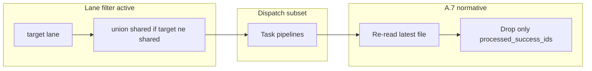

# Queue lanes for dual-track EAT-QUEUE (revised)

## Scope and corrections vs Grok draft

- **Source of truth** for orchestration is [.cursor/rules/agents/queue.mdc](.cursor/rules/agents/queue.mdc) (plus [.cursor/agents/queue.md](.cursor/agents/queue.md)), not `Roadmap/.technical/queue.mdc`.
- **Schema** extends [3-Resources/Second-Brain/Queue-Sources.md](3-Resources/Second-Brain/Queue-Sources.md): one JSON object per line; keep `mode`, `id`, `params`, etc.

## Lane names and explicit default

- **Canonical default lane** is the string **`default`**.
- **Authoring guidance**: New queue lines should set **`"queue_lane": "default"`** explicitly when they are general-track work, so logs, audits, and debugging show a lane without inferring from absence.
- **Backward compatibility**: Parsers still treat **missing** `queue_lane` as **`default`** internally (same effective lane for filtering), but docs and templates **prefer explicit** `"default"`.

## Shared lane (always unioned)

- **`shared`** is for common contracts, interfaces, and cross-track artifacts (e.g. Phase 6 conceptual items both sandbox and Godot need).
- **Filter semantics** when `queue_lane_filter` is **`sandbox`** or **`godot`** (or any non-`shared` target lane):
  - Include lines where **`effective_queue_lane === queue_lane_filter` OR `effective_queue_lane === shared`**.
- **When `queue_lane_filter` is `shared`**:
  - Include **only** lines where **`effective_queue_lane === shared`** (narrow drain of shared-only items; no sandbox/godot lines).
- **When `queue_lane_filter` is `default`**:
  - Include **only** lines where **`effective_queue_lane === default`** (shared is **not** auto-unioned here, so default-only runs do not pick up shared work unless you use no filter or a future multi-lane mode).

**Rationale**: Sandbox and Godot runs automatically see `shared`; a dedicated `lane shared` pass can clear shared backlog without touching track-specific lines.

## UX phrasing (standardize)

Document as the **only** supported Layer 0 patterns for lane-scoped EAT-QUEUE:

- **`EAT-QUEUE lane sandbox`** — process `sandbox ∪ shared`.
- **`EAT-QUEUE lane godot`** — process `godot ∪ shared`.
- **`EAT-QUEUE lane shared`** — process **`shared` only**.
- **`EAT-QUEUE lane default`** — process **`default` only** (explicit default drain).
- **`EAT-QUEUE`** (no `lane` token) — **no lane filter**; process **all** entries (legacy / full-queue behavior).

Dispatcher parses the token after `lane` and passes **`queue_lane_filter`** into the `Task(queue)` hand-off. Invalid or unknown lane names → log to Errors.md / refuse hand-off per config (see allowlist).

## A.7 rewrite — re-read merge (normative, not optional)

**Strong requirement**: Implement **re-read immediately before write** and **merge by removing only this run’s `processed_success_ids`** from the **latest** file snapshot (single retry if the file changed between first read and pre-write read).

- Do **not** offer “mutex only” as the primary path; mutex may be documented as an extra safeguard for wrappers/Step 0 if desired, but **queue rewrite safety** for parallel chats depends on this merge.

## Config allowlist (typo catching)

In [3-Resources/Second-Brain-Config.md](3-Resources/Second-Brain-Config.md), add e.g.:

- **`queue.allowed_lanes`**: `["default", "shared", "sandbox", "godot"]` with room to add **`core`** later.

**Use**:

- **Layer 0 / Layer 1**: If `queue_lane_filter` is not in allowlist → reject or advisory + skip filter (pick one; prefer **reject with clear error** for typos).
- **Append paths** (crafter, Layer 1 mid-run append): if `queue_lane` is set and **not** in allowlist → **do not append**; log validation error (align with existing “validate before append” in Queue-Sources).

## Other normative rules (unchanged intent from prior plan)

- **Ordering / A.4c / Pass 3**: Computed on the **filtered** subset (after `target_lane ∪ shared` when applicable).
- **Mid-run appends**: Layer 1 sets `queue_lane` on appended lines to match the **triggering** entry’s effective lane (shared follow-ups stay `shared`).
- **EAT-CACHE**: Same `queue_lane_filter` and same union rules on `queued_prompts`.
- **Step 0 wrappers**: Remain global; document possible contention on `Ingest/Decisions/**` separately from queue-lane partitioning.

## Files to change

| Area | Files |
|------|--------|
| Normative | [queue.mdc](.cursor/rules/agents/queue.mdc) — Queue lanes subsection; A.2 filter; A.7 re-read-merge; append inheritance |
| Agent | [agents/queue.md](.cursor/agents/queue.md) — hand-off: `queue_lane_filter`, union semantics |
| Layer 0 | [dispatcher.mdc](.cursor/rules/always/dispatcher.mdc) — `EAT-QUEUE lane <name>` parsing; allowlist check |
| Docs | [Queue-Sources.md](3-Resources/Second-Brain/Queue-Sources.md), [EAT-QUEUE-Flow.md](3-Resources/Second-Brain/Docs/User-Flows/EAT-QUEUE-Flow.md), [Python-Queue-Orchestrator.md](3-Resources/Second-Brain/Docs/Python-Queue-Orchestrator.md) |
| Config | [Second-Brain-Config.md](3-Resources/Second-Brain-Config.md) — `queue.allowed_lanes` |
| Python | [models.py](scripts/eat_queue_core/models.py), [plan.py](scripts/eat_queue_core/plan.py), [__main__.py](scripts/eat_queue_core/__main__.py), [full_cycle.py](scripts/eat_queue_core/full_cycle.py), [test_full_cycle_golden.py](scripts/eat_queue_core/tests/test_full_cycle_golden.py) |
| Sync | [.cursor/sync/rules/agents/queue.md](.cursor/sync/rules/agents/queue.md), [.cursor/sync/rules/always/dispatcher.md](.cursor/sync/rules/always/dispatcher.md) |

## Verification

- **Union**: File with `sandbox`, `godot`, `shared`, `default` lines — `lane sandbox` dispatches only sandbox+shared; `lane shared` only shared.
- **Explicit default**: Line with `"queue_lane":"default"` matches `lane default`; line with omitted key behaves as default for `lane default` and for full unfiltered run.
- **Parallel safety**: Two processes removing disjoint `processed_success_ids` from re-read snapshots do not drop each other’s remaining lines (test or scripted scenario).
- **Allowlist**: Unknown lane in filter or on append → error path documented.

