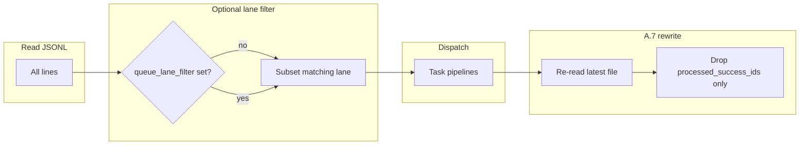

# Queue lanes for dual-track EAT-QUEUE

## Scope and corrections vs Grok draft

- **Source of truth for orchestration** is [.cursor/rules/agents/queue.mdc](.cursor/rules/agents/queue.mdc) (plus [.cursor/agents/queue.md](.cursor/agents/queue.md)), **not** `Roadmap/.technical/queue.mdc` (that path does not exist here).
- **Schema** should extend the existing contract in [3-Resources/Second-Brain/Queue-Sources.md](3-Resources/Second-Brain/Queue-Sources.md) (`mode`, `id`, `params`, …). Do **not** introduce Grok’s nested `type` / `payload` shape; keep one JSON object per line as today.
- **Default semantics**: If `queue_lane` is **absent**, treat effective lane as `**default`** (documentation default only; no need to rewrite historical lines). When `**queue_lane_filter` is omitted** on the hand-off, behavior stays **identical to today** (process all entries).

## Semantics (normative)

**Filtering (read / plan / dispatch)**

- After parse + `queue_failed` filter + normalization, if the Layer 1 hand-off includes `**queue_lane_filter`** (string, e.g. `sandbox`, `godot`):
  - **Include** only lines whose **effective** `queue_lane` equals that string.
  - **Exclude** all other lines from ordering, A.4c maps, caps, and dispatch for **that** run.
- **No filter**: include all lines (current behavior).
- **Ordering and per-`project_id` rules** (repair-first, A.4c, Pass 3) apply **within the filtered subset** only, so two lanes do not steal each other’s dispatch slots.

**A.7 queue rewrite**

- Remove lines only when their `**id`** is in `**processed_success_ids`** for this run (same as today). Lane filtering does not change the success set: only lane-eligible entries can be dispatched and thus cleared.
- **Critical — concurrent chats**: Two Layer 1 runs that both do read–filter–write can still hit **last-writer-wins** if each reads an old snapshot. Normative fix (pick one and document in queue.mdc):
  - **Preferred**: **Re-read immediately before write** (single retry if hash/line-count changed after dispatch loop); merge by dropping only this run’s `processed_success_ids` from the **latest** file contents; then apply any in-run appends already written by this run (same ordering rules as today).
  - **Alternative**: Document that **only one EAT-QUEUE may rewrite the queue at a time** (mutex / operator discipline) — weaker but minimal code change.

Without one of the above, “no races” is **not** fully true for parallel Cursor chats.

**Mid-run appends (`queue_followups`, A.5b/A.5c/A.5d)**

- New JSONL lines appended by Layer 1 **must** set `queue_lane` to the **same effective lane** as the **triggering** queue entry (or the entry being repaired), so follow-ups stay on the same track. Roadmap subagent returns should not need to duplicate lane if Layer 1 injects it on append (cleaner than trusting Layer 2).

**Step 0 (wrappers)**

- Remains **global** (not lane-scoped) unless you explicitly scope it later. Note in docs: two concurrent runs could still contend on `Ingest/Decisions/`**; queue lanes address **prompt-queue.jsonl** partitioning only.

**EAT-CACHE**

- Hand-off may include the same `**queue_lane_filter`**; apply the same filter to `**queued_prompts`** after parse.

## Files to change

| Area               | Files                                                                                                                                                                                                                                                                                                                                                                                                                   |
| ------------------ | ----------------------------------------------------------------------------------------------------------------------------------------------------------------------------------------------------------------------------------------------------------------------------------------------------------------------------------------------------------------------------------------------------------------------- |
| Normative behavior | [.cursor/rules/agents/queue.mdc](.cursor/rules/agents/queue.mdc) — new subsection under Part A (after read/parse): **Queue lanes** (effective lane, filter, A.7 merge, follow-up inheritance, EAT-CACHE). Touch **A.2** wording to “filter `queue_failed` then optional `queue_lane_filter`”.                                                                                                                           |
| Agent mirror       | [.cursor/agents/queue.md](.cursor/agents/queue.md) — hand-off contract bullet for `queue_lane_filter`.                                                                                                                                                                                                                                                                                                                  |
| Layer 0            | [.cursor/rules/always/dispatcher.mdc](.cursor/rules/always/dispatcher.mdc) — hand-off template: optional `queue_lane_filter` when user says e.g. **EAT-QUEUE lane sandbox** (exact UX phrase TBD in doc).                                                                                                                                                                                                               |
| Contract docs      | [3-Resources/Second-Brain/Queue-Sources.md](3-Resources/Second-Brain/Queue-Sources.md) — document optional `queue_lane`; [3-Resources/Second-Brain/Docs/User-Flows/EAT-QUEUE-Flow.md](3-Resources/Second-Brain/Docs/User-Flows/EAT-QUEUE-Flow.md) — one short subsection; [3-Resources/Second-Brain/Docs/Python-Queue-Orchestrator.md](3-Resources/Second-Brain/Docs/Python-Queue-Orchestrator.md) — `--lane` flag.     |
| Config (optional)  | [3-Resources/Second-Brain-Config.md](3-Resources/Second-Brain-Config.md) — e.g. `queue.lane_aliases` or allowed lanes for validation only (non-blocking v1).                                                                                                                                                                                                                                                            |
| Python bridge      | [scripts/eat_queue_core/models.py](scripts/eat_queue_core/models.py) — optional `queue_lane: str                                                                                                                                                                                                                                                                                                                        |
|                    | [scripts/eat_queue_core/plan.py](scripts/eat_queue_core/plan.py) — `build_plan(..., lane_filter: str                                                                                                                                                                                                                                                                                                                    |
|                    | [scripts/eat_queue_core/tests/test_full_cycle_golden.py](scripts/eat_queue_core/tests/test_full_cycle_golden.py) — fixture: mixed-lane file, plan only selected lane.                                                                                                                                                                                                                                                   |
| Sync / index       | [.cursor/sync/rules/agents/queue.md](.cursor/sync/rules/agents/queue.md), [.cursor/sync/rules/always/dispatcher.md](.cursor/sync/rules/always/dispatcher.md) per [backbone-docs-sync](.cursor/rules/always/backbone-docs-sync.mdc); [3-Resources/Second-Brain/Rules.md](3-Resources/Second-Brain/Rules.md) or [Pipelines.md](3-Resources/Second-Brain/Pipelines.md) one-line pointer if you track queue behavior there. |

## UX trigger (Layer 0)

Define a single, grep-friendly pattern so dispatcher can pass the filter without new Cursor UI:

- Example: `**EAT-QUEUE lane sandbox`** or `**EAT-QUEUE --lane godot`** in the user message → parse lane token → include in `Task(queue)` hand-off as `**queue_lane_filter: "sandbox"`**.

Exact phrase should be documented in dispatcher + EAT-QUEUE-Flow so humans and Commander macros stay consistent.

## Follow-up work (incremental, not blocking v1)

- Prompt Crafter: optional question or param to set `queue_lane` on append ([plan-mode-prompt-crafter](.cursor/rules/context/plan-mode-prompt-crafter.mdc) + [User-Questions-and-Options-Reference](3-Resources/Second-Brain/User-Questions-and-Options-Reference.md) if you want it in §1).
- Multi-lane filter (`sandbox` + `shared` in one run): defer unless needed.
- Task queue ([3-Resources/Task-Queue.md](3-Resources/Task-Queue.md)): separate decision; out of scope unless you want the same field on task JSON lines.

## Verification

- Manual: two-line `prompt-queue.jsonl` with different `queue_lane` values; run two sequential EAT-QUEUE invocations with different filters; confirm each pass removes only its line and leaves the other.
- Python: `python -m eat_queue_core plan --queue ... --lane sandbox` emits intents only for sandbox entries.
- If implementing A.7 re-read merge: add a short narrative test or script note describing interleaved write scenario.

