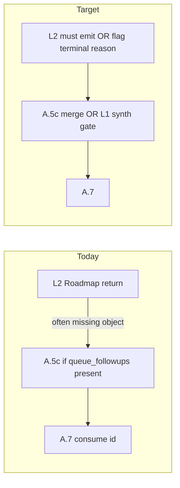

# Plan: Align `queue_next: true` with persisted JSONL

## Problem statement (confirmed in repo)

- **[3-Resources/Second-Brain/Parameters.md](3-Resources/Second-Brain/Parameters.md)** and **[3-Resources/Second-Brain/Queue-Sources.md](3-Resources/Second-Brain/Queue-Sources.md)** state that for **RESUME_ROADMAP**, `**queue_next` absent/undefined = true** and a follow-up is **required** unless **explicitly false** or one of the documented stop conditions (target reached, handoff gate, hard ceilings, etc.).
- **[.cursor/skills/roadmap-deepen/SKILL.md](.cursor/skills/roadmap-deepen/SKILL.md)** (step 7, “Required: Request next step”) already says the skill **must** return a `**queue_followups`** payload to its caller when `**params.queue_next !== false`**, with narrow exceptions (`**suppress_next**` when `**queue_next === false**`, hard ceiling, high-util **RECAL** path still emits a **recal** follow-up).
- **[.cursor/agents/roadmap.md](.cursor/agents/roadmap.md)** “Return” section today documents `**queue_followups`** prominently only for **incoherence bounded retry**; it also says `**suppress_followup: true`** whenever `**queue_followups.next_entry`** was not emitted—without tying that to **allowed** suppress reasons when `**queue_next !== false`**. That invites Success + suppress while `**queue_next: true`**, which contradicts Parameters / Queue-Sources.
- **[.cursor/rules/agents/queue.mdc](.cursor/rules/agents/queue.mdc) § A.5c** only appends follow-ups **if** `queue_followups` **is present**. There is **no** normative step that enforces “**queue_next true ⇒ at least one new JSONL line**” when Layer 2 omits the object.

So the “violation” is a **spec/orchestration hole**: docs and deepen skill promise a follow-up; **Layer 1 does not backfill** and **Layer 2 return guidance under-specifies** the happy path.

## Contract updates (normative)

### 1) Define **effective_followup_required** (single definition)

Add one canonical predicate (in **Queue-Sources** + short pointer in **Parameters**), e.g.:

- **true** when: entry is `**RESUME_ROADMAP`** (and normalized aliases), `**params.queue_next !== false`** (absent = true), and the run’s **final disposition** is **Success** or other statuses you explicitly list (e.g. success after tiered validator) **and** none of the **terminal suppress** reasons apply.
- **Terminal suppress** (no JSONL required): `**explicit_queue_next_false`**, `**target_reached`**, `**handoff_gate**` (when policy says stop), `**hard_ceiling**` / context-overflow when policy says no deepen (note: RECAL follow-up still counts as a line—already in deepen skill), `**repair_only**` if you keep it, `**pipeline_failure**` / `**nested_attestation_failure**`, **incoherence `R === 0`** without any other mandated follow-up, pre-deepen / material gates that **do not** complete the action (failure paths).

This removes ambiguity between “telemetry `**suppress_followup`**” and “operator `**queue_next`**”.

### 2) Layer 2 (Roadmap subagent) — **must** emit `queue_followups` when required

Update **[.cursor/agents/roadmap.md](.cursor/agents/roadmap.md)** and mirror in **[.cursor/rules/agents/roadmap.mdc](.cursor/rules/agents/roadmap.mdc)** (and **[.cursor/sync/rules/agents/roadmap.md](.cursor/sync/rules/agents/roadmap.md)** per backbone sync):

- After **deepen** (and any action where deepen skill returns a follow-up request), the **Task return must include** `queue_followups.next_entry` **whenever** `effective_followup_required` is true—**forward** the deepen skill’s payload; do not drop it in prose-only summaries.
- `**queue_continuation`**: `**suppress_followup`** must be `**false**` when a `**next_entry**` was emitted; when `**suppress_followup: true**`, `**suppress_reason**` must be one of the terminal enum values (extend [3-Resources/Second-Brain/Docs/Queue-Continuation-Spec.md](3-Resources/Second-Brain/Docs/Queue-Continuation-Spec.md) if you add e.g. `**layer1_synthesized_followup**` only on L1 path).
- Add a **pre-return checklist** bullet: “If `queue_next !== false` and Success, then `queue_followups.next_entry` present **or** document explicit terminal reason in `queue_continuation`.”

### 3) Layer 1 (Queue) — **safety net** when L2 violates the contract

Extend **[.cursor/rules/agents/queue.mdc](.cursor/rules/agents/queue.mdc)** § **A.5c** (and sync **[.cursor/sync/rules/agents/queue.md](.cursor/sync/rules/agents/queue.md)**):

- **After** parsing the roadmap Task return, **before** A.7: if `**effective_followup_required`** and **no** valid `**queue_followups.next_entry`** (and not duplicate-id suppressed—keep existing idempotency rules), then **synthesize** one **RESUME_ROADMAP** line:
  - Prefer `**queue_continuation.suggested_next`** if valid.
  - Else **clone** sticky fields from the consumed entry (`project_id`, `source_file`, profile, `enable_context_tracking`, `queue_next`, handoff params, etc.), set `**action: deepen`** (or **recal** if return explicitly indicates high-util / RECAL-only path—tie to structured hints if present), **fresh `id`**, and set `**params.user_guidance**` (or top-level prompt) to cite `**layer1_synthesized_followup**` + parent `**queue_entry_id**` for audit.
- Log a single **Feedback-Log / Errors.md** entry (`error_type: queue_next_contract_violation_recovered` or similar) so operators see L2 drops were patched—**not** silent success.

Optional **Second-Brain-Config** toggle: `**queue.synthesize_followup_when_queue_next_true`** default `**true`** so power users can disable synthesis and surface hard failures instead.

### 4) Documentation pass

- **[3-Resources/Second-Brain/Queue-Sources.md](3-Resources/Second-Brain/Queue-Sources.md)** — new subsection: **Layer 1 enforcement of `queue_next`** (L2 primary, L1 safety net, terminal list).
- **[3-Resources/Second-Brain/Docs/Queue-Continuation-Spec.md](3-Resources/Second-Brain/Docs/Queue-Continuation-Spec.md)** — invariant: `**suppress_followup` vs `queue_next`**; optional new `**suppress_reason`** for L1-only recovery if you want it filterable.
- **[3-Resources/Second-Brain/Subagent-Safety-Contract.md](3-Resources/Second-Brain/Subagent-Safety-Contract.md)** (if it defines return shapes) — one paragraph on mandatory `**queue_followups`** for roadmap Success when `queue_next !== false`.
- **Backbone sync**: [.cursor/sync/changelog.md](.cursor/sync/changelog.md) entry; [backbone-docs-sync](.cursor/rules/always/backbone-docs-sync.mdc) compliance.

## Out of scope / explicit non-goals

- **A.5b** remains **hard-block repair only**; do not map `**needs_work`** to automatic repair lines.
- **IRA** still does not append queue lines; only **L2 return** + **A.5c** (+ new synthesis) do.

## Acceptance checks (manual)

1. Queue entry: `**RESUME_ROADMAP`**, `**queue_next: true`**, deepen Success — prompt-queue.jsonl still has ≥1 line after A.7 (either L2 `**queue_followups**` or L1 synthesized line + log marker).
2. `**queue_next: false**` — **no** follow-up appended; `**suppress_reason: explicit_queue_next_false`**.
3. **Target reached / handoff_gate / hard_ceiling** — **no** deepen follow-up; `**suppress_reason`** matches enum; **no** synthesis.
4. **Duplicate `next_entry.id`** — existing A.5c behavior unchanged; synthesis must **not** duplicate ids already on disk.

