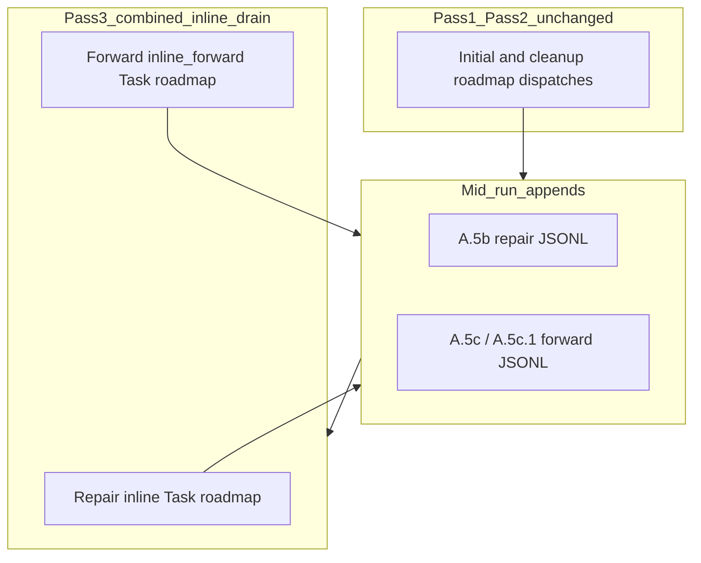

# Queue: inline forward follow-up drain (Patch D — primary goal)

## Goal

**One build, test via Config:** After a roadmap disposition, Layer 1 appends one or more **forward-class** `RESUME_ROADMAP` lines (A.5c / A.5c.1) and/or **repair-class** lines (A.5b / repair-class A.5d). **Same EAT-QUEUE invocation** must be able to **run `Task(roadmap)` on those new lines** before returning to Layer 0 — without requiring a second manual EAT-QUEUE.

**Master switch:** `queue.inline_forward_followup_drain_enabled` — **false** (default) = **current behavior** (forward appends wait for next EAT-QUEUE; only repair-class Pass 3 drain unchanged). **true** = enable forward inline drain per rules below.

---

## Config (single place — [3-Resources/Second-Brain-Config.md](3-Resources/Second-Brain-Config.md) `queue:` block)

**Required keys**

- `**inline_forward_followup_drain_enabled`** — default **false**. Master toggle. Off = no behavior change for forward inline.
- `**max_inline_forward_followup_dispatches_per_project_per_run`** — default **3**. Cap `Task(roadmap)` for **forward-class** lines in the Pass 3 extension, **per project_id**, **this EAT-QUEUE only**. Independent of Pass 1 `max_forward_roadmap_dispatches_per_project_per_run`.
- `**max_inline_forward_followup_generations_per_run`** — default **3**. Max **waves** of the **combined** inline drain loop; bounds re-read / re-tag when repair and forward pending flip mid-wave.

**Optional (ship in same pass)**

- `**inline_forward_drain_appended_ids_only`** — default **true**. When true, only lines whose `id` was **first appended during this EAT-QUEUE run** are eligible for `inline_forward` (avoids draining old skipped siblings).

Recommendation: keep `**inline_forward_drain_appended_ids_only: true`** so Pass 1 retained siblings never enter forward inline.

---

## Hardened mechanics ([.cursor/rules/agents/queue.mdc](.cursor/rules/agents/queue.mdc))

### 1) Run-scoped bookkeeping

- Maintain `**ids_appended_this_eat_queue_run`** (set): on every successful **read-then-append** from **A.5b, A.5c, A.5c.1, A.5c.2, A.5d** (any JSONL line added), add the new line's `**id`** after assign-if-missing.
- Maintain `**forward_followup_inline_dispatches_completed[project_id]`** (integer): increment when `**Task(roadmap)**` completes a **full disposition** for a line dispatched with `**dispatch_pass: inline_forward`** (same boundary as `processed_success_ids` / ordinal).

### 2) Pending flags

- Keep `**inline_repair_pending`** (existing): set true when A.5b / repair-class A.5d appends (unchanged).
- Add `**inline_forward_followup_pending**`: set **true** when `**inline_forward_followup_drain_enabled`** is **true** and **any** appended line (tracked in `ids_appended_this_eat_queue_run`) is **forward-class** `RESUME_ROADMAP` (or chain primary `RESUME_ROADMAP`), and either `**inline_forward_drain_appended_ids_only`** is false **or** that line's `id` is in the appended set (when the flag is true, only those ids count).

Clear `**inline_forward_followup_pending`** at the start of each inline wave (same pattern as repair: set false before wave; any new append during the wave sets true again).

### 3) Pass 3 loop (combined — replace isolated repair-only loop description)

**Enter loop when:**

- `**inline_a5b_repair_drain_enabled` ≠ false** and `**inline_repair_pending`**, **or**
- `**inline_forward_followup_drain_enabled` === true** and `**inline_forward_followup_pending`**.

**Generation bound:**

- `inline_drain_generation` from 0 while `**inline_drain_generation < max(max_inline_a5b_repair_generations_per_run, max_inline_forward_followup_generations_per_run)`** (recommend **max** to avoid doubling work; document choice in queue.mdc).

**Each wave:**

1. Re-read `.technical/prompt-queue.jsonl`.
2. Re-run **A.2 → A.3 → A.4** (existing).
3. **Clear** prior inline tags; rebuild **only** for this wave:
  - **Repair-class** lines: existing `**dispatch_pass: inline`** rules + `**repair_class_roadmap_dispatches_completed`** budget (unchanged).
  - **Forward-class** lines: assign `**dispatch_pass: inline_forward`** only if:
    - `inline_forward_followup_drain_enabled` **true**;
    - `id` not in `processed_success_ids`, not in `already_dispatched_ids_this_run`;
    - resolvable `project_id`;
    - if `inline_forward_drain_appended_ids_only`: `id` in `ids_appended_this_eat_queue_run`;
    - `forward_followup_inline_dispatches_completed[project_id] < max_inline_forward_followup_dispatches_per_project_per_run`.
4. Walk list in global order; for each entry with `**dispatch_pass: inline`** or `**inline_forward`**, dispatch `**Task(roadmap)**` (chains unchanged), run post-little-val, A.5b/A.5c as today; new appends update pending flags and appended-id set.
5. Increment `**inline_drain_generation**`.

**Ordering within wave:** Apply existing **repair-first sub-sort** among **inline** candidates: **repair-class (`inline`) before forward-class (`inline_forward`)**; within each group, timestamp order.

**Never** dispatch the same `**id`** twice: `**already_dispatched_ids_this_run`** semantics unchanged.

### 4) Watcher / observability

- Every disposition from `**dispatch_pass: inline_forward**` must include `**queue_pass_phase=inline_forward**` (new token) or reuse `**queue_pass_phase=inline**` plus `**inline_kind=forward_followup**` in trace — **pick one** and document in Queue-Sources / Logs.

### 5) Non-goals (explicit)

- Does **not** increase Pass 1 **initial** forward slots; those stay capped by `forward_first` / `max_forward_*`.
- Does **not** auto-run **ROADMAP_MODE** setup lines via forward inline.
- Does **not** bypass **stall-skip**, **A.5b.0**, or **gate_block** rules.

---

## Supporting patches (same implementation pass)

Ship together so one rule edit + one Config file gives testable behavior **and** readable logs:

- **A + B:** Mandatory `**segment: VALIDATE`** when (b1) runs; fix "one line per entry" doc conflict ([watcher-result-append.mdc](.cursor/rules/always/watcher-result-append.mdc), [Queue-Sources.md](3-Resources/Second-Brain/Queue-Sources.md)).
- **C:** `**queue_pass_phase=inline`** on repair-class Pass 3 dispatches; `**inline_forward`** tag for forward drain.
- **E:** After post-little-val **hard block** when A.5b repair must append, **assert** line on disk or block consumption + log.

---

## Files to touch

- [3-Resources/Second-Brain-Config.md](3-Resources/Second-Brain-Config.md) — new `queue.*` keys
- [.cursor/rules/agents/queue.mdc](.cursor/rules/agents/queue.mdc) — A.4c `inline_forward` tagging; A.5.0 combined loop; appended-id set; A.5b assert; A.6 Watcher
- [.cursor/agents/queue.md](.cursor/agents/queue.md) — prompt parity
- [.cursor/sync/rules/agents/queue.md](.cursor/sync/rules/agents/queue.md) — sync
- [3-Resources/Second-Brain/Queue-Sources.md](3-Resources/Second-Brain/Queue-Sources.md) — multi-dispatch + Watcher two-line note
- [.cursor/rules/always/watcher-result-append.mdc](.cursor/rules/always/watcher-result-append.mdc) — L1 two-line allowance
- [.cursor/sync/rules/always/watcher-result-append.md](.cursor/sync/rules/always/watcher-result-append.md) — if present
- [3-Resources/Second-Brain/Parameters.md](3-Resources/Second-Brain/Parameters.md) — optional index of new keys
- [.cursor/sync/changelog.md](.cursor/sync/changelog.md) — one-line entry

---

## Test plan (toggle-only)

1. `**inline_forward_followup_drain_enabled: false`** — run EAT-QUEUE on a queue that appends follow-up; confirm **no** second-wave forward dispatch (baseline).
2. `**true`** — same queue shape; confirm **new** `id`s from A.5c receive `**Task(roadmap)`** in the same run with `**queue_pass_phase=inline_forward`** (or chosen token) in Watcher/trace.
3. Hit `**max_inline_forward_followup_dispatches_per_project_per_run**` — excess lines remain for **next** EAT-QUEUE.

---

## What this plan does not do

- Does not rewrite historical Watcher lines.
- Does not change Obsidian Watcher plugin code; duplicate `requestId` lines remain a **display** caveat (documented in Patch B).

