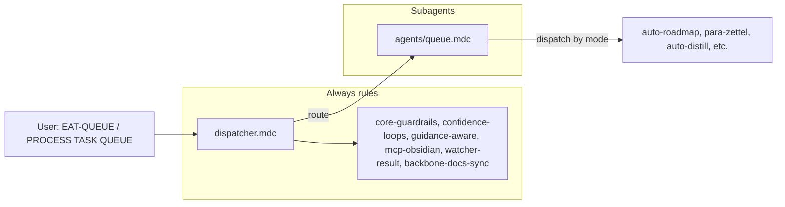

# QueueProcessorSubagent Refactor Plan

This plan follows the pattern in [.cursor/plans/Rule-Refactor/queue-dispatcher-subagent-refactor_54b07695.plan.md](.cursor/plans/Rule-Refactor/queue-dispatcher-subagent-refactor_54b07695.plan.md) and aligns with the subagent architecture described in the Grok output (dispatcher + dedicated subagents under `.cursor/rules/agents/`).

---

## 1. Goals

- **Isolate queue and dispatch logic** into a single **QueueProcessorSubagent** so only that context + shared core guardrails are loaded when processing EAT-QUEUE or PROCESS TASK QUEUE.
- **Preserve behavior**: No change to Step 0 (always-check wrappers), CHECK_WRAPPERS semantics, EAT-CACHE, mode normalization, params merge, ordering, Watcher-Result format, Task-Queue flow, or safety (backups, snapshots, confidence bands).
- **Introduce a minimal dispatcher** (always-on) that recognizes triggers and routes EAT-QUEUE / PROCESS TASK QUEUE to the QueueProcessorSubagent; other triggers (INGEST MODE, DISTILL MODE, etc.) continue to map to existing context rules until those are later extracted into their own subagents.
- **Forward-compatible**: When RoadmapSubagent (or IngestSubagent, etc.) exists, the Queue subagent will invoke that subagent’s context/skills instead of inlining logic; for this phase, it still calls the existing pipeline rules (auto-roadmap, para-zettel-autopilot, etc.).

---

## 2. Current state (source of truth)

- **Prompt queue**: [.cursor/rules/context/auto-eat-queue.mdc](.cursor/rules/context/auto-eat-queue.mdc) — Step 0 (always-check wrappers), read/dedup/order, dispatch by mode, clear passed / tag failed, Watcher-Result.
- **Task queue**: [.cursor/rules/context/auto-queue-processor.mdc](.cursor/rules/context/auto-queue-processor.mdc) — Read Task-Queue.md, dispatch by mode (TASK-ROADMAP, TASK-COMPLETE, ADD-ROADMAP-ITEM, etc.), Watcher-Result + Mobile-Pending-Actions.
- **Routing doc**: [.cursor/rules/always/system-funnels.mdc](.cursor/rules/always/system-funnels.mdc) — Declares which triggers map to which context rules; EAT-QUEUE and PROCESS TASK QUEUE currently point to the two rules above.
- **Contract**: [3-Resources/Second-Brain/Queue-Sources.md](3-Resources/Second-Brain/Queue-Sources.md) — Mode list, routing (prompt-queue vs Task-Queue), RESUME-ROADMAP stale-removal, params, validation.

All behavior to preserve is in auto-eat-queue.mdc (including the long Step 0 and CHECK_WRAPPERS sections) and auto-queue-processor.mdc; the refactor moves that behavior into the subagent and leaves a thin dispatcher that only routes.

---

## 3. Target architecture

- **Dispatcher (always-on)**  
  - New file: `.cursor/rules/always/dispatcher.mdc` (or extend system-funnels in place; see step 4).  
  - Responsibilities: Parse trigger (phrase or queue entry); resolve scope; **route** EAT-QUEUE / PROCESS TASK QUEUE → QueueProcessorSubagent; enforce that shared core invariants apply (no new logic, just “load core + subagent”).  
  - No queue reading, no Step 0, no dispatch logic—only routing and reference to shared guardrails.
- **QueueProcessorSubagent (context)**  
  - New file: `.cursor/rules/agents/queue.mdc`.  
  - Encapsulates: (1) **Prompt queue path**: Step 0 (always-check wrappers), read `.technical/prompt-queue.jsonl` or EAT-CACHE payload, parse/validate/dedup/order, mode normalization, dispatch by mode, clear passed / tag failed, Watcher-Result. (2) **Task queue path**: Read `3-Resources/Task-Queue.md`, dispatch by mode, Watcher-Result + Mobile-Pending-Actions, optional banner cleanup.  
  - Continues to call existing pipeline rules/skills (auto-roadmap, auto-distill, para-zettel-autopilot, task-complete-validate, add-roadmap-append, etc.); does not duplicate their logic.  
  - Safety: All destructive work remains in downstream pipelines; this subagent only orchestrates. Explicit “Safety” section: Error Handling Protocol, confidence bands, guidance-aware, Watcher-Result contract unchanged.
- **Shared core (unchanged)**  
  - Remain in `always/`: core-guardrails.mdc, confidence-loops.mdc, guidance-aware.mdc, mcp-obsidian-integration.mdc, watcher-result-append.mdc, backbone-docs-sync.mdc (and 00-always-core, second-brain-standards, etc.).  
  - Dispatcher and Queue subagent both depend on these; no duplication.

---

## 4. Concrete refactor steps

### 4.1 Create agents folder and dispatcher

- Add `.cursor/rules/agents/` if it does not exist.
- Add or update **dispatcher** in always:
  - **Option A**: New `always/dispatcher.mdc` that contains only: trigger recognition (EAT-QUEUE, PROCESS TASK QUEUE, INGEST MODE, DISTILL MODE, …), routing table (trigger → context rule or subagent), and “load shared core + target rule.” Then slim `system-funnels.mdc` to “documentation of trigger phrases and routing” or merge into dispatcher.
  - **Option B**: Keep a single always rule: extend `system-funnels.mdc` so that for EAT-QUEUE and PROCESS TASK QUEUE it explicitly routes to `agents/queue.mdc` (QueueProcessorSubagent) and states that queue processing runs there; no behavioral change in system-funnels beyond that declaration.
- Ensure Cursor loads `agents/queue.mdc` when the trigger is EAT-QUEUE or PROCESS TASK QUEUE (via globs/conditional includes or explicit “when this trigger, use this context rule” in the dispatcher/funnels doc).

### 4.2 Extract QueueProcessorSubagent into `agents/queue.mdc`

- **Content source**: Copy and adapt the full text of [.cursor/rules/context/auto-eat-queue.mdc](.cursor/rules/context/auto-eat-queue.mdc) and [.cursor/rules/context/auto-queue-processor.mdc](.cursor/rules/context/auto-queue-processor.mdc) into a single `agents/queue.mdc`.
- **Header**: Title “QueueProcessorSubagent”; short description: responsible for `.technical/prompt-queue.jsonl` (EAT-QUEUE, EAT-CACHE) and `3-Resources/Task-Queue.md` (PROCESS TASK QUEUE); Step 0, ordering, dispatch, Watcher-Result, Mobile-Pending-Actions; depends on shared always rules for safety.
- **Preserve verbatim** (no semantics change):
  - Step 0 “Always-check wrappers”: enumerate `Ingest/Decisions/`, Branch A (apply approved / re-wrap / re-try), Branch B (location check, archive or #orphan/#true-orphan), `approved_wrappers_remaining`, CHECK_WRAPPERS requeue semantics.
  - Queue flow: read (file or EAT-CACHE payload), parse/validate, filter past failures, dedup, canonical ordering (including CHECK_WRAPPERS at front), roadmap mode normalization, params merge (queue + user_guidance + Config), tech_level injection, validation against MCP-Tools, dispatch table (all modes in Queue-Sources).
  - Task-Queue flow: read Task-Queue.md, dispatch by mode (TASK-ROADMAP, TASK-COMPLETE, ADD-ROADMAP-ITEM, …), Watcher-Result + Mobile-Pending-Actions, banner cleanup, optional clear processed.
  - Queue-cleanup slot (after dedup, when config enabled), Watcher-Result one-line format, Errors.md on reject.
- **Safety section**: State that this subagent does not perform destructive ops on notes; it only selects and invokes pipelines; Error Handling Protocol, confidence bands, guidance-aware, Watcher-Result format remain governed by always rules.

### 4.3 Wire dispatcher routing

- **EAT-QUEUE** / **Process queue** / **EAT-CACHE** / **eat cache** → QueueProcessorSubagent (`agents/queue.mdc`), prompt-queue source (file or pasted payload).
- **PROCESS TASK QUEUE** → QueueProcessorSubagent, Task-Queue source.
- Other triggers (INGEST MODE, DISTILL MODE, ROADMAP MODE, etc.) unchanged: still map to current context rules (ingest-processing + para-zettel-autopilot, auto-distill, auto-roadmap, etc.) as today.
- Document this in system-funnels (or dispatcher) so “QueueProcessorSubagent” is the single entrypoint for both queues.

### 4.4 Keep old rules as fallback (optional)

- Leave `auto-eat-queue.mdc` and `auto-queue-processor.mdc` in place but **unused** for routing (dispatcher points to `agents/queue.mdc` only), or keep them behind a comment/feature flag so they can be reverted if needed. Do not delete until the new subagent has been validated.

### 4.5 Documentation and sync

- **Queue-Sources.md**: State that the **QueueProcessorSubagent** (`agents/queue.mdc`) is the single entrypoint for both prompt queue and Task-Queue; EAT-QUEUE and PROCESS TASK QUEUE trigger that subagent; it calls existing pipelines unchanged.
- **Cursor-Skill-Pipelines-Reference.md**: Add a short “Queue / dispatcher” subsection: dispatcher (or system-funnels) is the thin routing layer; QueueProcessorSubagent handles queue read, Step 0, ordering, and mode dispatch; pipelines (ingest, roadmap, distill, etc.) are invoked by the subagent.
- **.cursor/sync**: Add `.cursor/sync/rules/agents/queue.md` mirroring `agents/queue.mdc`; if a new `always/dispatcher.mdc` is created, add `.cursor/sync/rules/always/dispatcher.md`. Changelog entry in `.cursor/sync/changelog.md` for QueueProcessorSubagent and dispatcher.

### 4.6 Backbone and Rules docs

- **Rules.md** (or equivalent in 3-Resources/Second-Brain): Update trigger table so EAT-QUEUE and PROCESS TASK QUEUE point to “QueueProcessorSubagent (agents/queue.mdc)” and note that the dispatcher routes there.
- **Rules-Structure** docs: Include `agents/queue.mdc` under a “Subagents” or “Queue” section with same responsibilities as above.

---

## 5. Validation and rollback

- **Manual tests** (no code beyond the refactor):
  - **Prompt queue**: Run EAT-QUEUE with a test `.technical/prompt-queue.jsonl` (e.g. INGEST MODE, RESUME-ROADMAP, DISTILL MODE). Confirm: Step 0 runs first; CHECK_WRAPPERS ordering and requeue unchanged; entries parsed, ordered, dispatched to same pipelines; Watcher-Result lines correct; passed entries cleared, failed entries written back with `queue_failed: true`.
  - **EAT-CACHE**: Paste a YAML payload with `mode: EAT-CACHE` and `queued_prompts`; confirm same dispatch and Watcher-Result behavior.
  - **Task queue**: Run PROCESS TASK QUEUE with a few entries (e.g. TASK-COMPLETE, ADD-ROADMAP-ITEM). Confirm dispatch, Watcher-Result, and Mobile-Pending-Actions updates match current behavior.
  - **Wrappers**: Create an approved Decision Wrapper under `Ingest/Decisions/`, run EAT-QUEUE; confirm apply and archive behavior and that CHECK_WRAPPERS is re-queued when needed.
- **Rollback**: If issues appear, point routing in system-funnels (or dispatcher) back to `context/auto-eat-queue.mdc` and `context/auto-queue-processor.mdc` until `agents/queue.mdc` is fixed.

---

## 6. Out of scope (later work)

- Extracting **RoadmapSubagent** or other subagents (Ingest, Distill, etc.): this plan does not change how roadmap or other modes are implemented; it only moves queue processing into the QueueProcessorSubagent. When other subagents exist, the Queue subagent will “dispatch to” them (e.g. load roadmap context + skills) instead of calling auto-roadmap directly; that can be a one-line change in the dispatch table later.
- Changing **Prompt-Crafter** or **plan-mode-prompt-crafter**: still the preferred door for crafting queue entries; unchanged by this refactor.
- **Dispatcher as sole always rule**: Grok suggested the dispatcher be the only always-applied rule that does routing; that can be done in a follow-up (e.g. merge always-ingest-bootstrap and system-funnels into dispatcher) after this refactor is stable.

---

## 7. Files to add or touch

| Action           | Path                                                                                             |
| ---------------- | ------------------------------------------------------------------------------------------------ |
| Create           | `.cursor/rules/agents/queue.mdc` (QueueProcessorSubagent)                                        |
| Create or update | `.cursor/rules/always/dispatcher.mdc` (if Option A)                                              |
| Update           | `.cursor/rules/always/system-funnels.mdc` (routing to agents/queue.mdc; or fold into dispatcher) |
| Update           | `3-Resources/Second-Brain/Queue-Sources.md`                                                      |
| Update           | `3-Resources/Second-Brain/Cursor-Skill-Pipelines-Reference.md`                                   |
| Update           | `3-Resources/Second-Brain/Rules.md` (or equivalent)                                              |
| Add              | `.cursor/sync/rules/agents/queue.md`                                                             |
| Optional         | `.cursor/sync/rules/always/dispatcher.md`                                                        |
| Append           | `.cursor/sync/changelog.md`                                                                      |

No deletion of `auto-eat-queue.mdc` or `auto-queue-processor.mdc` until validation is complete.