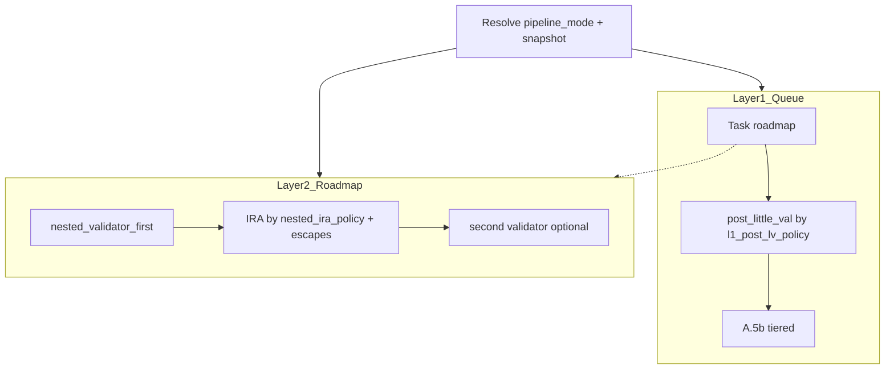

# Speed/quality tiers (validator profiles)

## Design principle

Replace scattered boolean flags with **one resolved setting**: `pipeline_mode` → `validator_profiles[mode]`. Subagents and Queue read **effective** mode after merge:

1. `params.pipeline_mode` on the queue entry (if present and valid: `quality` | `balance` | `speed`)
2. Else `pipeline_mode` from `[3-Resources/Second-Brain-Config.md](3-Resources/Second-Brain-Config.md)` (document nesting in Pipeline-Validator-Profiles + Parameters)

**Layer 1 → Layer 2:** After resolution, set in `layer1_resolver_hints`:

- `effective_pipeline_mode` (string)
- `**effective_profile_snapshot`** — compact JSON-like object (same keys as profile row, fully resolved) e.g. `{ "l1_post_lv_policy": "conditional_nonhard_skip", "nested_ira_policy": "clean_skip", "research_synthesis_depth": "light", "target_nested_validator_passes": 2, "research_full_every_n_runs": 3, "research_full_if_run_confidence_below": 80 }` so agents debug mis-application without re-parsing Config.

**Hard invariants (all modes):** `[Validator-Tiered-Blocks-Spec.md](3-Resources/Second-Brain/Docs/Validator-Tiered-Blocks-Spec.md)` hard-block set, **mandatory little-val** for Success claims, backups/snapshots, ≥85% destructive gate, core-guardrails.

---

## Canonical profile schema (rules parse this only)

Use **these keys** everywhere (Config, snapshot, agent hand-offs) — no mixed legacy names like `ira_after_first_pass` at the profile row (internally rules may still map to existing agent booleans).


| Key                              | Type   | Allowed values                                                                                                                                                                                                                                                                                                                                                                                                                                                                                                                                                                   |
| -------------------------------- | ------ | -------------------------------------------------------------------------------------------------------------------------------------------------------------------------------------------------------------------------------------------------------------------------------------------------------------------------------------------------------------------------------------------------------------------------------------------------------------------------------------------------------------------------------------------------------------------------------- |
| `l1_post_lv_policy`              | string | `always` — run L1 post–little-val (b1) on every eligible roadmap dispatch including Pass 3. `conditional_nonhard_skip` — skip (b1) on `inline` / `inline_forward` when prior L1 for same `project_id` in this EAT-QUEUE run was **non-hard**. `minimal` — skip follow-on L1 unless prior L1 was **hard** (repair path) **or** this is the **first** roadmap dispatch for that `project_id` in the run.                                                                                                                                                                           |
| `nested_ira_policy`              | string | `always` — full Validator → IRA → little val → compare when nested cycle applies. `clean_skip` — legacy path: after first nested validator, skip IRA + second validator when first pass is clean `log_only` with no actionable gaps; otherwise full cycle. `medium_or_higher` — invoke IRA (and downstream compare) **only** if first nested validator has `severity` ≥ `medium` **or** `recommended_action` ≠ `log_only` **or** actionable gaps / non-empty `reason_codes` beyond allowlisted low-noise (exact predicate in Pipeline-Validator-Profiles + queue/roadmap rules). |
| `research_synthesis_depth`       | string | `full`                                                                                                                                                                                                                                                                                                                                                                                                                                                                                                                                                                           |
| `target_nested_validator_passes` | int    | Soft budget / observability target (e.g. quality **4**, balance **2**, speed **1–2**); does not override safety escapes.                                                                                                                                                                                                                                                                                                                                                                                                                                                         |


**Mapping to modes:**


| Mode                  | `l1_post_lv_policy`        | `nested_ira_policy` | `research_synthesis_depth` | `target_nested_validator_passes` (typical) |
| --------------------- | -------------------------- | ------------------- | -------------------------- | ------------------------------------------ |
| **quality**           | `always`                   | `always`            | `full`                     | 4                                          |
| **balance** (default) | `conditional_nonhard_skip` | `clean_skip`        | `light`                    | 2                                          |
| **speed**             | `minimal`                  | `medium_or_higher`  | `fast`                     | 1–2                                        |


---

## Balance mode — force **full** research synthesis (tight triggers)

Default depth is **light**. Escalate to **full** nested `research_synthesis` cycle when **any** of:

1. **Low confidence:** run / hand-off confidence **strictly below** a documented threshold — Config `balance.research_full_if_run_confidence_below` default **80** (tunable **75** for more speed). Numeric source of truth: `[Parameters.md](3-Resources/Second-Brain/Parameters.md)` (not buried in agent prose).
2. **Safety codes:** any `safety_unknown_gap` **or** `safety_critical_ambiguity` present on the triggering research context or immediately preceding validator output (as defined in Pipeline-Validator-Profiles).
3. **Periodic deep pass:** every **N**th successful research run per `project_id` — default **N = 3** in Config (`research_full_every_n_runs`); allow **4** for slightly more speed via Parameters/Config only.
4. **Optional:** preceding **roadmap** nested or L1 hand-off validator flagged anything **stronger** than `log_only` (e.g. `needs_work` / `medium` / non-empty actionable `next_artifacts`) — Config `balance.research_full_if_prior_roadmap_validator_stronger_than_log_only` default **true** (set **false** for slightly more speed; document in Pipeline-Validator-Profiles).

All bullets spelled out in `[Pipeline-Validator-Profiles.md](3-Resources/Second-Brain/Docs/Pipeline-Validator-Profiles.md)`; Parameters holds the **threshold table + links**.

---

## Speed mode — safety escape (non-negotiable)

**Even in `speed` mode:** if any nested or L1 validator returns `severity: high`, `recommended_action: block_destructive`, or `primary_code` / `reason_codes` hit the unconditional hard set from Validator-Tiered-Blocks-Spec (`state_hygiene_failure`, `contradictions_detected`, `incoherence`, `safety_critical_ambiguity`), **do not** continue on the minimal path:

- Force **full re-validation path** for that scope (including **IRA** when the tiered contract requires it, and second/compare validator as today’s full cycle).
- Append **Watcher-Result** (and trace) with a **prominent**, parse-safe lead, e.g. message prefix `speed_escalation_full_validation:` plus `primary_code` / `queue_entry_id` / `pipeline_mode_used` — so aggressive tier never “swallows” hygiene issues (e.g. queue-id mismatch class problems).

Document this block prominently in Pipeline-Validator-Profiles and one bullet in queue/roadmap rules.

---

## Config shape (illustrative YAML)

```yaml
pipeline_mode: balance

validator_profiles:
  quality:
    l1_post_lv_policy: always
    nested_ira_policy: always
    research_synthesis_depth: full
    target_nested_validator_passes: 4
  balance:
    l1_post_lv_policy: conditional_nonhard_skip
    nested_ira_policy: clean_skip
    research_synthesis_depth: light
    target_nested_validator_passes: 2
    research_full_every_n_runs: 3   # or 4 for slightly more speed
    research_full_confidence_max: 80  # force full when confidence < this (or use min confidence field — document one convention)
  speed:
    l1_post_lv_policy: minimal
    nested_ira_policy: medium_or_higher
    research_synthesis_depth: fast
    target_nested_validator_passes: 2
```

Implement confidence threshold naming consistently in Config + Parameters (avoid duplicate conflicting keys).

---

## Implementation map

### Queue (`[.cursor/rules/agents/queue.mdc](.cursor/rules/agents/queue.mdc)`)

- Resolve mode → build `**effective_profile_snapshot**` → merge into `**layer1_resolver_hints**` on roadmap (and research chain) hand-offs.
- **A.5 (b1):** branch on `l1_post_lv_policy`; run memory `last_l1_post_lv_hard_block_by_project_id`; apply **speed hard-block override** if a validator return in this dispatch chain already escalated (see Speed guardrails).
- Watcher: `pipeline_mode_used`, `suppress_reason`, and speed escalation prefix when applicable.

### Roadmap / Research (`[.cursor/agents/roadmap.md](.cursor/agents/roadmap.md)`, `[.cursor/rules/agents/roadmap.mdc](.cursor/rules/agents/roadmap.mdc)`, `[.cursor/agents/research.md](.cursor/agents/research.md)`)

- Read `**effective_profile_snapshot`** from hand-off; map `nested_ira_policy` to effective nested steps (and legacy `ira_after_first_pass` equivalence only inside agent if needed for minimal diff).
- Balance: implement force-full research triggers per § Balance above.
- Speed + any mode: implement **§ Speed guardrails** before skipping IRA/compare.

### Attestation

- `[Nested-Subagent-Ledger-Spec.md](3-Resources/Second-Brain/Docs/Nested-Subagent-Ledger-Spec.md)`: allowlisted `detail.reason_code` for profile skips; new codes for `speed_escalation_full_validation` and `pipeline_mode_`* as needed.

### Documentation (split)

- **Mandatory:** `[3-Resources/Second-Brain/Docs/Pipeline-Validator-Profiles.md](3-Resources/Second-Brain/Docs/Pipeline-Validator-Profiles.md)` — full profile definitions, enum semantics, balance triggers (with defaults), speed escape hatch, `effective_profile_snapshot`, rationale, examples.
- `[3-Resources/Second-Brain/Parameters.md](3-Resources/Second-Brain/Parameters.md)` — **short** summary table + numeric thresholds + single link to Pipeline-Validator-Profiles (do not duplicate long prose).
- `[Subagent-Layers-Reference.md](3-Resources/Second-Brain/Docs/Subagent-Layers-Reference.md)` — add **one paragraph “Why three modes?”**: original goal to cut ~1-hour runs on routine deepen+research while keeping quality acceptable; point to Pipeline-Validator-Profiles for operator detail.
- `[Queue-Pipeline.md](3-Resources/Second-Brain/Docs/Pipelines/Queue-Pipeline.md)`, `[Subagent-Safety-Contract.md](3-Resources/Second-Brain/Subagent-Safety-Contract.md)` — cross-links.

### Sync

- `[.cursor/sync/rules/agents/queue.md](.cursor/sync/rules/agents/queue.md)` and changelog.

---

## Context diagram




---

## Rollout / verification

- Default `pipeline_mode: balance`; `quality` reproduces legacy heavy behavior via profile row.
- Test: same line with `params.pipeline_mode` cycling quality/balance/speed; force a **high** validator outcome in speed and confirm full path + Watcher `speed_escalation_full_validation`.

---

## Out of scope / defer

- Single comparative validator Task — defer.
- Fourth tier — future.
- Persisting “every Nth research run” — minimal store in `queue-continuation.jsonl` or equivalent (spec in Pipeline-Validator-Profiles).

