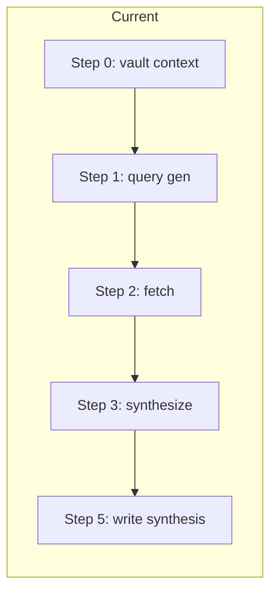
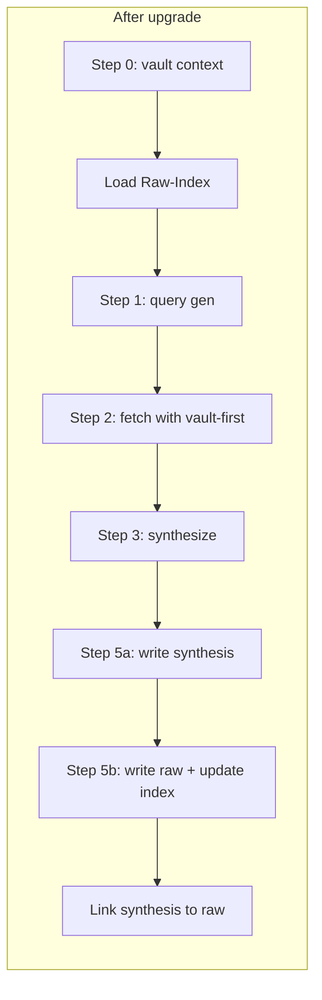

# Research upgrade: raw storage + vault-first at fetch

## Goals

1. **Store raw scraped research** — Persist the extracted content (the `raw_blocks` that feed synthesis) so improper synthesis can be checked against the actual content used and sources survive dead URLs.
2. **Vault-first at fetch** — Before fetching a URL, check if we already have raw content for that URL in the vault; if yes, reuse it and skip external fetch. This prevents duplicate fetches and duplicate raw storage (deduplication is a consequence of vault-first, not a separate feature).
3. **Link synthesis to raw** — Every synthesis note gets a "Raw sources (vault)" section and optional frontmatter linking to the raw note(s) that contributed to it.

## Current flow (unchanged until new steps)

- Step 0: Gather vault context (project/phase, "Do not duplicate") for **query/synthesis** only; no raw lookup.
- Step 2: Fetch: discovery → extraction → build **raw_blocks** in memory; no vault check per URL.
- Step 5: Write only **synthesis** note(s) to `Ingest/Agent-Research/`.

## Architecture

- **Raw storage**: One **run-scoped raw note** per research run in `Ingest/Agent-Research/Raw/`, containing only **newly fetched** blocks (each as `## Source: <url>\n\n<content>`). Same run’s synthesis and raw are linked; reuse from vault does not create a second raw note for that URL.
- **Lookup**: A single **Raw-Index** note (e.g. `Ingest/Agent-Research/Raw/Raw-Index.md`) maps **URL → path** to the raw note that contains that URL. Step 2 reads the index once; for each URL to fetch, if the URL is in the index, read the referenced raw note, extract the section for that URL, add to `raw_blocks`, and skip external fetch. When we write a new run raw note, we **append** rows to the index (url, path, optional date) so we never overwrite the whole index.
- **Linking**: Synthesis note body gets a `## Raw sources (vault)` section with wiki-links to (1) this run’s raw note (if any) and (2) any raw notes used from the vault during Step 2. Optional frontmatter `raw_sources: [path1, path2]` for Dataview.

## Skill changes ([.cursor/skills/research-agent-run/SKILL.md](.cursor/skills/research-agent-run/SKILL.md))

### Step 0 (or new Step 0b) — Load raw index

- After gathering vault context, **read** `Ingest/Agent-Research/Raw/Raw-Index.md` if it exists (create empty structure on first use).
- **Index format**: Markdown table with columns e.g. `| url | path | date |` so we can append rows and parse for lookup. Store in memory for Step 2.
- On read error or missing file: treat index as empty; proceed with fetch only.

### Step 2 — Fetch with vault-first

- **Input**: List of URLs to fetch (from `candidate_urls` + discovery results), plus the in-memory index.
- **Per URL**:
  - If URL exists in index: `obsidian_read_note` on the stored `path`, extract the section whose heading is `## Source: <url>` (or equivalent), append `{ source: url, content: extracted, from_vault: true }` to `raw_blocks`, and record `used_raw_paths` for linking. **Do not** call extraction/fetch for this URL.
  - If URL not in index: run discovery/extraction as today; append to `raw_blocks` with `from_vault: false` (or omit flag). Track that this block was newly fetched.
- **Output**: `raw_blocks` (mix of vault-sourced and newly fetched), plus `used_raw_paths` and the set of URLs that were newly fetched (for Step 5b).
- Existing behavior (discovery ranking, result_limit, never throw, search-only synthesis fallback) is unchanged.

### Step 5 — Write (extend)

- **Step 5a (unchanged)**: Create synthesis note(s) in `Ingest/Agent-Research/` with current frontmatter and body.
- **Step 5b (new)**:
  - If **store_raw** is true (default) and there is at least one newly fetched block:
    - `obsidian_ensure_structure`(folder_path: `"Ingest/Agent-Research/Raw"`).
    - Create **one** raw note for this run: filename per [Naming-Conventions](3-Resources/Second-Brain/Naming-Conventions.md) (slug from `research_query` or `linked_phase` + date-time). Body: for each newly fetched block, section `## Source: <url>\n\n<content>`. Frontmatter: `source_urls: [url1, url2, ...]`, `linked_phase`, `project_id`, `created`, `tags: [research, agent-research, raw]`, `agent-generated: true`.
    - **Update Raw-Index**: Append one row per URL in this raw note: `| <url> | <path to this raw note> | YYYY-MM-DD |`. Read existing index, append, write back (or create index note with header row if missing).
  - Add to **synthesis note** body a section `## Raw sources (vault)` with wiki-links to (a) this run’s raw note (if written) and (b) all notes in `used_raw_paths`. Optionally set frontmatter `raw_sources: [path1, path2, ...]`.
- If **store_raw** is false (new param) or no newly fetched blocks: skip Step 5b; still add "Raw sources (vault)" links when `used_raw_paths` is non-empty (synthesis used vault-only or mix).

### Step 4 (failure/empty)

- No change: when we go to Step 4 we do not write synthesis or raw; no index update.

### New input (optional)

- **params.store_raw** (optional, default `true`): If false, skip writing raw notes and skip updating the index; vault-first lookup still runs (we can still reuse existing raw from index). Enables turning off raw growth without changing fetch behavior.
- **params.raw_max_chars_per_source** (optional): Cap length of each block’s content when writing to raw note (truncate with a one-line note if exceeded). Reduces vault size; document in Parameters.

## Vault layout and docs

- **[Vault-Layout.md](3-Resources/Second-Brain/Vault-Layout.md)**: Add row for `Ingest/Agent-Research/Raw/` — raw scraped content per run; one note per run with sections `## Source: <url>`; not processed by ingest pipeline as PARA content. Add `Ingest/Agent-Research/Raw/Raw-Index.md` — index mapping URL → path for vault-first lookup; append-only table.
- **[Parameters.md](3-Resources/Second-Brain/Parameters.md)**: Document `store_raw` (default true), `raw_max_chars_per_source` (optional), and that vault-first at fetch uses the raw index to avoid re-fetching and duplicate raw storage.
- **[MCP-Tools.md](3-Resources/Second-Brain/MCP-Tools.md)** (if present): Note that research agent reads/writes Raw/ and Raw-Index via `obsidian_read_note`, `obsidian_update_note`, `obsidian_ensure_structure`.

## Research subagent and queue

- **[.cursor/rules/agents/research.mdc](.cursor/rules/agents/research.mdc)**: No change to dispatch or hand-off. Skill still returns “paths of created notes” — these remain the **synthesis** note(s) only. Only synthesis notes are queued for INGEST_MODE (and optional DISTILL); raw notes in `Ingest/Agent-Research/Raw/` are **not** queued for INGEST (they stay as reference material). Document this in the rule or in Vault-Layout so it’s explicit.

## Index format and robustness

- **Raw-Index.md**: First line or frontmatter can describe the table. Body: markdown table `| url | path | date |` with one row per URL. Parsing: read note, split lines, skip header, for each row parse url and path. Append: add new rows, write back. Normalize URL (e.g. strip fragment) when writing and when looking up so duplicates are consistent.
- **Duplicate URL in index**: If the same URL appears in multiple runs, index will have multiple rows with same url, different path. Lookup: use **first** match (or most recent by date column) so we always get one raw note; that note’s section for that URL is the content. No need to dedupe index rows for v1.

## Observability and errors

- **Logging**: When vault-first supplies content for a URL, log one line (e.g. in run context or a Research-Log if added) so we can see “reused from vault: N URLs”.
- **Errors**: No change to Research error entry format in [Logs.md](3-Resources/Second-Brain/Logs.md). If writing the raw note or updating the index fails, log and continue (synthesis was already written); optionally append a short entry to Errors.md with `#research-raw-write-failed` so it’s visible. Skill still returns synthesis paths; caller behavior unchanged.

## Backbone and sync

- **[backbone-docs-sync](.cursor/rules/always/backbone-docs-sync.mdc)**: After skill and Vault-Layout/Parameters changes, update [Rules.md](3-Resources/Second-Brain/Rules.md) or [Pipelines.md](3-Resources/Second-Brain/Cursor-Skill-Pipelines-Reference.md) and [.cursor/sync/](.cursor/sync/) so the research flow and new steps are reflected.

## Out of scope (later)

- **One note per URL**: Possible future refinement for very large Raw/ (avoid large run notes). Would require stable slug from URL and index-only lookup; current design keeps v1 simple.
- **Snapshot before index write**: Optional; index is append-only and small; can be added later if we want full audit trail of index changes.

