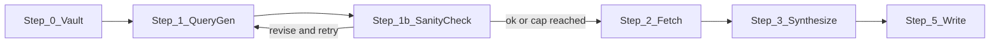

# Research agent: request sanity check and escalation

## Goal

Allow the research agent to **escalate once or twice** when it determines the request does not suit the needed retrievals: a sanity check of "does this request make sense? Was it made correctly? Or were they looking for X but asked for Z?" The agent may **internally revise** (queries, intent, or slot) and re-run query generation, then proceed to fetch. No user interaction; no change to queue or subagent contract. Stays inside Option A (single run, rule-partitioned steps).

---

## Behavior

- **When:** After **Step 1 (Query generation)** and before **Step 2 (Fetch)**. The agent has: vault context (Step 0), current queries (from params or derived), and optional slot/intent/perfer.
- **Sanity check:** Evaluate (in memory):
  - Do the current queries align with what the phase/outline/slots actually need?
  - Could the user have meant X but asked for Z (e.g. asked for "overview" but the slot implies "pseudocode"; or query too vague/broad for the slot)?
  - Are we about to retrieve the wrong kind of content (wrong intent, wrong scope, or mismatched to research_focus)?
- **If mismatch:** Produce a **revision**: revised query set, or revised intent/slot for structured queries, or one added clarifying query. Re-run **Step 1** with the revised intent (and vault context) to get the "corrected" query list. Optionally evaluate again (if escalation budget allows). Then proceed to **Step 2 (Fetch)** with the final query set.
- **Cap:** Max **1 or 2** escalation cycles per run, controlled by param. After the cap, proceed to Fetch even if still uncertain (no infinite loop).

---

## Placement in flow




- **Step 1b (Request sanity check)** runs once after Step 1. It may call Step 1 again (with revised queries/intent) up to `research_max_escalations` times. Then always proceed to Step 2 with the final query set.

---

## New param

- **research_max_escalations** (optional): `0` | `1` | `2`. Default `1` for crafted/manual entries; **default `0` for pre-deepen (auto-roadmap)** unless the phase is marked "research-heavy" (see below).
  - `0` = disabled; skip Step 1b and go straight to Step 2 after Step 1.
  - `1` = one revision allowed (evaluate once; if average rating <4, output one revision; re-run Step 1 once, then proceed).
  - `2` = two revisions allowed (same as above; may evaluate again after first revision if budget allows).
- **Pre-deepen fast path:** Auto-roadmap / roadmap-deepen may **inject research_max_escalations: 0** for the pre-deepen RESEARCH_AGENT entry unless the phase note or project has a marker (e.g. frontmatter `research_heavy: true` or equivalent). Prevents unnecessary loops on shallow runs. Document in Parameters and auto-roadmap.

**Synergy with research_strategy (Phase 2):** When **research_strategy** exists (from researcher upgrade plan):

- `research_strategy: "quick"` → **force** effective `research_max_escalations = 0` (skip Step 1b).
- `research_strategy: "critique_heavy"` or `"deep"` → allow **2** (override param up to 2). Document in Queue-Sources so one strategy param controls depth + sanity aggression.

---

## Skill changes ([.cursor/skills/research-agent-run/SKILL.md](.cursor/skills/research-agent-run/SKILL.md))

### High-priority (ship with Phase 1)

1. **Inputs:** Document **params.research_max_escalations** (0 | 1 | 2, default 1; pre-deepen may inject 0). When 0, skip Step 1b. If research_strategy is "quick", treat as 0; if "critique_heavy" or "deep", cap at 2 when param allows.
2. **New Step 1b (Request sanity check) — stronger persona + explicit criteria:**
  - **Persona (bullet-proof prompt):**  
   "You are the Request Sanity Agent. Your ONLY job is to answer these three questions strictly:
  1. **Alignment:** Do the current queries (and their slot/intent/prefer/tool_hint) clearly match the needs implied by the phase note, outline, linked gaps, and vault 'Do not duplicate' list? Rate 1–5.
  2. **Intent mismatch:** Is there evidence the user requested one thing (e.g. 'overview') but the slot/context screams another (e.g. '## Implementation' needs pseudocode/examples)? Rate likelihood 1–5.
  3. **Risk of wrong retrieval:** If we fetch now, are we likely to get irrelevant/noisy/irreproducible content (too broad/vague, wrong prefer, mismatched research_focus)? Rate 1–5.
    average rating ≥4 → proceed (output: {proceed: true}).
     <4 → output exactly one revision: {proceed: false, revision: {...}}.
    ver invent new slots or tool_hints unless clearly justified by vault. Prefer minimal change."
    Input:** Current query set (normalized), vault context summary, research_focus, slot/intent from structured research_queries.
    Structured JSON output only (no free prose except reason):** Step 1b must emit **JSON only**. Schema:

```json
     {
       "proceed": boolean,
       "revision": {
         "revised_research_queries": [ ... array of normalized objects or strings ... ],
         "reason": "string (max 100 chars)",
         "escalation_trigger": "intent_mismatch | alignment_low | retrieval_risk"
       } | null
     }
     

```

```
 Loop controller in skill: parse this JSON; if `proceed === false` and escalation count < max, set effective research_queries = revision.revised_research_queries → re-run Step 1; increment count; run Step 1b again. If `proceed === true` or count reached, pass final query set to Step 2. Store `escalation_trigger` and `reason` for Step 5 frontmatter.
```

1. **Step 5 (Write):** Always set **research_escalations_used: 0 | 1 | 2**. When >0 set **research_escalation_reason** (reason string, max 100 chars) and optionally **research_escalation_trigger** (intent_mismatch | alignment_low | retrieval_risk). When 0 but Step 1b ran, optionally set **sanity_check_rating** (e.g. "4.3/5 (proceed)") for debugging trends (medium-priority, add after initial tests).

### Medium-priority (add after initial tests)

1. **Post-revision quick self-check (Step 1b lite):** After re-running Step 1 following a revision, run a **single** Step 1b "lite" pass (no loop, no extra revision): only confirm alignment ≥4. If lite pass says proceed, go to Step 2; if not, still go to Step 2 with the revised queries (do not consume another escalation). Catches bad revisions early without extra full escalation.
2. **Escalation reason always in frontmatter:** Even when escalations_used is 0, leave reason/trigger absent; when ≥1, always persist reason (and optionally trigger). Optional: when 0, log **sanity_check_rating** in frontmatter for debugging (e.g. "4.3/5 (proceed)").

### Low-priority (Phase 2 or later)

1. **Lightweight post-fetch sanity:** After Step 2 (fetch), if <30% of extracted blocks match any intent/prefer (e.g. no code when "with_code" heavy), trigger **one final** query revision + extra fetch (budget 1), gated by remaining research_max_escalations or a dedicated param. Document as optional enhancement in skill; implement only if Phase 1 behavior is stable.
2. **Track escalation stats across runs:** When vault write-back (auto_update_vault) is enabled, append to Research-Log or phase-level index: "Escalation used: yes, reason: intent_mismatch" (or equivalent). Builds long-term signal for auto-roadmap to default higher/lower escalations per phase. Phase 2.

---

## Docs and wiring

- **[3-Resources/Second-Brain/Queue-Sources.md](3-Resources/Second-Brain/Queue-Sources.md):** Under RESEARCH_AGENT payload and Research (pre-deepen), add **research_max_escalations** (0 | 1 | 2, default 1; pre-deepen may inject 0). Document **research_strategy** tie-in: quick → force 0; critique_heavy/deep → allow 2. Request-sanity step (Step 1b); agent may revise queries/intent up to this many times before fetch; structured JSON output.
- **[3-Resources/Second-Brain/Parameters.md](3-Resources/Second-Brain/Parameters.md):** Add **research_max_escalations** under research section: default 1 for crafted entries; default 0 for pre-deepen unless phase/project marked research-heavy. Which step consumes it (Step 1b). Optional **research_heavy** (phase frontmatter or project-level) for pre-deepen to allow escalations.
- **[3-Resources/Second-Brain/Docs/Pipelines/Research-Pipeline.md](3-Resources/Second-Brain/Docs/Pipelines/Research-Pipeline.md):** Add bullet: request-sanity step (Step 1b), explicit 1–5 criteria, structured JSON, escalation cap; pre-deepen default 0; link to skill.
- **Prompt crafter:** Optional. Add **research_max_escalations** (A. 0 off | B. 1 once | C. 2 twice) when RESEARCH_AGENT or RESUME_ROADMAP research params are exposed.

---

## Backward compatibility

- Default **research_max_escalations: 1** for crafted/manual queue entries keeps one revision available. Pre-deepen may inject 0 for fast path; to allow escalations on pre-deepen, set param explicitly or mark phase research-heavy.
- No change to queue format beyond an optional param; no change to ResearchSubagent (pass-through params only). research_strategy (Phase 2) overrides escalation cap when present.

---

## Implementation order

**Phase 1 (ship first):**

1. Add **research_max_escalations** to Queue-Sources and Parameters (default 1; note pre-deepen may inject 0).
2. Add **Step 1b** to [research-agent-run SKILL.md](.cursor/skills/research-agent-run/SKILL.md): stronger persona (three questions, rate 1–5, average ≥4 → proceed); **structured JSON output only** (proceed, revision with revised_research_queries, reason, escalation_trigger); loop logic; document param in Inputs.
3. Step 5: **research_escalations_used**, **research_escalation_reason** (when >0), **research_escalation_trigger** (optional). Optionally sanity_check_rating when 0 (medium-priority).
4. Update [Research-Pipeline.md](3-Resources/Second-Brain/Docs/Pipelines/Research-Pipeline.md) and sync skill. Document pre-deepen default 0 in auto-roadmap/Parameters.
5. (Optional) Expose research_max_escalations in crafter (RESUME_ROADMAP).

**After initial tests (medium-priority):**
6. Post-revision Step 1b lite (single pass, confirm alignment ≥4 before Step 2).
7. research_strategy tie-in in Queue-Sources and skill (quick → 0, critique_heavy/deep → 2) when research_strategy exists.

**Phase 2 (low-priority):**
8. Lightweight post-fetch sanity (if <30% blocks match intent/prefer, one extra revision + fetch, gated).
9. Escalation stats in Research-Log / vault write-back when auto_update_vault enabled.

---

## Grok recommendations summary


| Priority | Item                                                                 | Status in plan                                                 |
| -------- | -------------------------------------------------------------------- | -------------------------------------------------------------- |
| High     | Stronger Sanity Agent persona + explicit 1–5 criteria                | Step 1b persona and proceed/revision rule (average ≥4)         |
| High     | Structured JSON output for Step 1b                                   | Mandatory JSON schema; loop parses it                          |
| High     | Default 0 for pre-deepen; expose 0 in auto-roadmap                   | Param default 1; pre-deepen may inject 0 unless research-heavy |
| Medium   | Escalation reason always in frontmatter; sanity_check_rating when 0  | Step 5; optional rating for debugging                          |
| Medium   | Tie escalation to research_strategy (quick→0, critique_heavy/deep→2) | New param section; Queue-Sources; Phase 2 synergy              |
| Medium   | Post-revision quick self-check (Step 1b lite)                        | Medium-priority; single pass after revision                    |
| Low      | Lightweight post-fetch sanity (<30% match → one extra fetch)         | Low-priority / Phase 2                                         |
| Low      | Track escalation stats in Research-Log                               | Phase 2 when vault write-back enabled                          |


---

## Out of scope

- **User-facing escalation:** No Decision Wrapper or user prompt ("Did you mean X?"). Escalation is internal only (revise and retry).
- **Post-fetch sanity:** Included as low-priority Phase 2 (lightweight version: <30% blocks match intent → one revision + fetch, gated).

