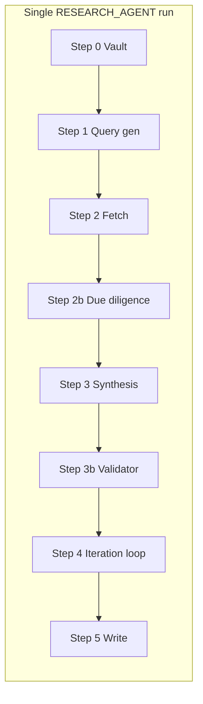

# Researcher upgrade: query context and result-selection

## Goal

Improve research quality by (1) passing **context around queries** (where the answer goes, what kind of content we need) and (2) helping the agent **identify the best options** (how to rank/select discovery results and optionally use curated URLs). **Backward compatibility:** existing `research_queries` (plain strings) and absence of new params behave as today. **Wiring:** when new params are present, they must be wired end-to-end (queue → hand-off → skill → frontmatter; see §7.1). **User exposure:** the new params must be **exposed as options in the prompt crafter** so users can set them when crafting a RESEARCH_AGENT or RESUME_ROADMAP entry—not only via manual queue edit or Commander. See §5 (Prompt crafter).

---

## Current state

- **Queries:** `params.research_queries` is an optional array of **strings**. When absent, the skill derives queries from phase/outline + vault context. Gap-fill mode already passes rich per-gap context (`heading`, `type`, `excerpt`, `suggested_query_seed`).
- **Result selection:** The skill takes "top N" from discovery and synthesizes; the only explicit guidance is fixed text for roadmap-deepen/gap-fill: "Prioritize results usable for junior dev handoff: code snippets, edge cases...".
- **Vault context:** Step 0 gathers phase note, distilled-core, PMG and builds a short summary used in query gen and synthesis; there is no explicit "do not duplicate" list.

---

## Architectural choice: Option A (nested multi-role pipeline)

**Constraint:** Cursor subagents cannot chain; they must be orchestrated by the primary. This plan adopts **Option A**: the single research subagent "acts" as a multi-agent setup **through rules and steps**—no primary orchestration of multiple subagent calls, no synthetic chain at the queue level.

**Implication:** The "agent team" (Discovery, Due Diligence, Alternatives, Synthesis, Validator, Vault Writer) is implemented as **sequential steps** inside one research-agent-run skill. One queue entry (RESEARCH_AGENT) → one hand-off → one subagent run. All roles share the same run and context; the primary and queue processor are unchanged.

**Step-to-role mapping (target state after Phase 1 + Phase 2):**


| Role / behavior           | Implemented as                                                                                                                                                    |
| ------------------------- | ----------------------------------------------------------------------------------------------------------------------------------------------------------------- |
| Discovery                 | Step 0 (vault) + Step 1 (query gen) + Step 2 (fetch/extract); output = raw blocks + sources.                                                                      |
| Due diligence             | Step 2b or 3a (trade-offs, risks, maturity); optional step when research_depth or params request it.                                                              |
| Alternatives              | Phase 2 § 10.4 (research_alternatives); extra queries + comparison table in Step 3.                                                                               |
| Synthesis                 | Step 3 (narrative, slot/intent, confidence, do-not-duplicate).                                                                                                    |
| Validator / self-critique | Phase 2 § 10.3 (confidence scoring) + optional Step 3b (read draft, flag contradictions/missing edges); can trigger extra hop when below research_min_confidence. |
| Vault writer              | Phase 2 § 10.8 (auto_update_vault); runs after Step 5 when flag set.                                                                                              |


**Flow (single subagent, one run):**




Optional steps (2b, 3b, 4) are gated by params (research_depth, research_alternatives, research_min_confidence). No subagent-to-subagent calls; the primary still dispatches RESEARCH_AGENT once and receives one result.

**Why Option A for this plan:** Keeps queue and primary simple; no hand-off contract between "agents"; all context in one run; fits existing RESEARCH_AGENT and RESUME_ROADMAP flows. A future **Option B** (primary-orchestrated synthetic chain, e.g. RESEARCH_TEAM with multiple subagent invocations) can be added later if needed, without invalidating this nested pipeline.

---

## 1. Structured query context (params)

### 1.1 Allow structured `research_queries`

- **Schema:** `params.research_queries` may contain either:
  - **Strings** (unchanged): `"Rust async cancellation patterns"` → treated as `{ query: "…" }` with no extra context.
  - **Objects:** `{ "query": "…", "slot": "## Cancellation", "intent": "examples", "prefer": "official_docs" }`.
- **Fields per object:**
  - **query** (required): search query string.
  - **slot** (optional): heading or section name where the answer will be used (e.g. `"## Cancellation"`). Used in synthesis to label or structure output.
  - **intent** (optional): one of `examples` | `explanation` | `edge_cases` | `pseudocode` | `overview` (or free text). Drives synthesis style and query refinement.
  - **prefer** (optional): one of `official_docs` | `recent` | `with_code` | `academic` (or array of these). Per-query override for result preference; merged with global `research_result_preference` (query-level wins for that query).
- **Backward compatibility:** Any element that is a string is normalized to `{ query: element }` before use. Callers that only send strings see no change.

### 1.2 Optional parallel array (alternative)

If the team prefers not to change the type of `research_queries`, add `**params.query_context`**: array of objects with the same fields (`slot`, `intent`, `prefer`), one per query by index. Skill merges `research_queries[i]` (string) with `query_context[i]` when present. **Recommendation:** use structured `research_queries` (1.1) for a single, clear contract; document in Queue-Sources and Parameters.

---

## 2. Result-selection criteria (params)

### 2.1 `params.research_result_preference`

- **Type:** Optional array of strings. Default: absent (current behavior; gap-fill/roadmap-deepen still use fixed "junior dev handoff" guidance).
- **Allowed values:** `official_docs` | `recent` | `with_code` | `diverse` | `academic`.
  - **official_docs:** Prefer canonical docs, RFCs, main project/repo sites.
  - **recent:** Prefer content from the last 2–3 years (or publication date when available).
  - **with_code:** Prefer pages that clearly contain code or runnable examples.
  - **diverse:** Avoid picking multiple near-identical sources (e.g. different domains, not just multiple SO answers).
  - **academic:** Prefer papers, arxiv, Semantic Scholar, etc. (may overlap with research_tools academic routing).
- **Skill behavior:** In **Step 2 (Fetch)**, after discovery returns a set of candidate URLs/snippets, the agent **ranks or selects** which ones to run through extraction (up to `research_result_limit`) using these criteria. In **Step 3 (Synthesize)**, include explicit instruction: "When selecting which discovery results to use, apply: [list from param]. Prefer sources that match; if none do, use best available and note in synthesis."
- **Document** in [.cursor/skills/research-agent-run/SKILL.md](.cursor/skills/research-agent-run/SKILL.md) under Inputs and in Step 2/3.

### 2.2 `params.candidate_urls` (optional curated "best options")

- **Type:** Optional array of strings (URLs).
- **Semantics:** When present, the skill **extracts these URLs first** (via the same extraction chain: Firecrawl → Browser MCP → mcp_web_fetch), up to `research_result_limit`. If discovery is still needed (e.g. more queries or insufficient content), run discovery and extraction as today; merge curated + discovered in synthesis.
- **Use case:** User or Commander has already identified high-value links (e.g. specific RFC, doc page, repo); research run uses them as primary sources and fills gaps with discovery.
- **Skill behavior:** Step 2: (1) If `candidate_urls` present, run extraction on those URLs first (cap by research_result_limit). (2) If more capacity or uncovered queries remain, run discovery + extraction. (3) Pass both curated and discovered content into Step 3.

---

## 3. Explicit "do not duplicate" in vault context

- **Enhancement:** In **Step 0** (vault context), append to the vault summary a short bullet list: **"Do not duplicate:** [3–5 key points or headings already covered in phase note / distilled-core]." Source: first few headings or bullets from the phase note and distilled-core (truncate to ~100 words).
- **Step 3:** In synthesis instructions, add: "Do not repeat content that is already stated in the vault; add only new or clarifying information." This avoids the researcher re-synthesizing what the phase already says.
- **Optional param:** `params.avoid_duplicate_headings` (array of strings) to explicitly list section titles to avoid duplicating; when present, skill merges with the auto-derived list. Keeps the upgrade minimal; can be added later if needed.

---

## 4. Skill changes: research-agent-run

**File:** [.cursor/skills/research-agent-run/SKILL.md](.cursor/skills/research-agent-run/SKILL.md)

- **Inputs (new/updated):**
  - Document **research_queries**: may be array of strings or array of objects `{ query, slot?, intent?, prefer? }`; normalize strings to `{ query }`.
  - Add **params.research_result_preference** (optional array: official_docs, recent, with_code, diverse, academic).
  - Add **params.candidate_urls** (optional array of URLs; extract first, then discovery if needed).
- **Step 0:** Add "Do not duplicate" bullets to vault context summary (from phase + distilled-core; cap length).
- **Step 1 (Query generation):** When research_queries are structured, pass `slot` / `intent` / `prefer` into query refinement (if any) and into Step 3 for synthesis. When deriving queries (no research_queries), no change.
- **Step 2 (Fetch):**
  - If `candidate_urls` present: run extraction on those URLs first (respect research_result_limit).
  - After discovery: when selecting which discovery results to send to extraction, apply `research_result_preference` (and per-query `prefer`) to rank/select; prefer diversity when `diverse` is in the list.
- **Step 3 (Synthesize):**
  - Add instruction: "Do not repeat vault content; add only new or clarifying information." Use "Do not duplicate" list from Step 0.
  - When **research_result_preference** is set: "When selecting which discovery results to use, apply: [list]. Prefer sources that match; if none do, use best available and note in synthesis."
  - When **research_queries** include **slot**: use slot in output structure (e.g. "## Filled: [slot]" or "Answer for: [slot]").
  - When **intent** is present: tailor synthesis (e.g. prioritize code blocks for `examples`, conceptual summary for `explanation`).
- **Step 5 (Write):** No change to frontmatter schema; optional: store `research_result_preference` and whether `candidate_urls` was used in frontmatter for traceability (e.g. `research_preference_used: ["official_docs","with_code"]`).

---

## 5. Queue and docs updates

- **[3-Resources/Second-Brain/Queue-Sources.md](3-Resources/Second-Brain/Queue-Sources.md):** Under RESEARCH_AGENT payload and "Research (pre-deepen)", add:
  - **research_queries**: may be array of strings or array of objects `{ query, slot?, intent?, prefer? }`.
  - **research_result_preference** (optional): array of official_docs | recent | with_code | diverse | academic.
  - **candidate_urls** (optional): array of URLs to extract first.
  - **research_focus** (optional): junior_handoff | cto_brief | spike_proposal | risk_maximal; steers synthesis audience (Phase 1 refinement #3).
- **[3-Resources/Second-Brain/Parameters.md](3-Resources/Second-Brain/Parameters.md):** Add the same params under the research / RESUME_ROADMAP section with defaults (absent = current behavior).
- **[3-Resources/Second-Brain/Docs/Pipelines/Research-Pipeline.md](3-Resources/Second-Brain/Docs/Pipelines/Research-Pipeline.md):** Add a short "Query context and result selection" subsection describing structured research_queries, research_result_preference, candidate_urls, and research_focus; link to Queue-Sources and skill.
- **Wiring:** Queue processor must pass full `params` in the RESEARCH_AGENT hand-off (no stripping of unknown keys). Queue-Sources and Parameters list each new param with type, defaults, and which skill step(s) consume it—so callers know params are wired end-to-end (see §7.1).
- **Prompt crafter (required):** Expose the new research params as **user-selectable options** in the question-led prompt crafter so users can set them when crafting an entry. Scope:
  - **RESUME_ROADMAP branch:** Add questions/options for research_result_preference (e.g. A/B/C: official_docs, with_code, diverse; or "use default"), research_focus (junior_handoff, cto_brief, spike_proposal, risk_maximal; or default), candidate_urls (manual text or "none"), and research_queries (manual text for explicit queries; support structured form if UI allows, else plain list that maps to array of strings). Follow User-Questions-and-Options-Reference §1 param order and A/B/C-only pattern.
  - **RESEARCH_AGENT entry path:** If the crafter supports a dedicated "Queue Research: Phase" or RESEARCH_AGENT flow, expose the same params (research_queries, research_result_preference, candidate_urls, research_focus) so users can set them without editing the queue by hand.
  - Document new crafter questions in User-Questions-and-Options-Reference.md; add to "Param order by branch" for RESUME_ROADMAP (and RESEARCH_AGENT if that branch exists). Users must be able to set these from the crafter; manual queue edit and Commander remain alternative entry points.

---

## 6. Subagent and auto-roadmap

- **[.cursor/rules/agents/research.mdc](.cursor/rules/agents/research.mdc):** No flow change; ResearchSubagent already passes `params` through to research-agent-run. Ensure hand-off / queue payload includes the new params when present (they are already part of the entry's params).
- **Pre-deepen (auto-roadmap / roadmap-deepen):** When building the RESEARCH_AGENT entry or calling research-agent-run for pre-deepen, optionally set **research_result_preference** from project/profile (e.g. default `["with_code","official_docs"]` for roadmap-deepen). Document in auto-roadmap or Parameters that pre-deepen may inject this; no mandatory change if we want to keep pre-deepen behavior unchanged until proven.

---

## 7. Backward compatibility and validation

- **Parsing:** Queue processor and skill normalize `research_queries`: for each element, if string then use `{ query: element }`; if object, require `query` and allow slot, intent, prefer. Invalid entries (e.g. object without query) log and skip that element or fall back to query-only.
- **Existing entries:** Entries with only `research_queries: ["q1","q2"]` or no research_result_preference/candidate_urls behave exactly as today.
- **Validation:** If adding validation in queue rule or skill, allow only the listed values for research_result_preference; ignore unknown. candidate_urls must be valid URLs (skip invalid entries with a log).

### 7.1 Wiring of new params (when present)

When callers supply new params, they must flow through the full pipeline. No param may be dropped or ignored between queue and skill. **User exposure:** Params must be **exposed as options in the prompt crafter** so users can set them when crafting a RESEARCH_AGENT or RESUME_ROADMAP entry (§5); manual queue edit and Commander are alternative entry points.

| Param                                                      | Queue / entry                                                                               | Queue processor                              | ResearchSubagent hand-off                                         | Skill step(s) that consume                                                                                         | Output / traceability                                                            |
| ---------------------------------------------------------- | ------------------------------------------------------------------------------------------- | -------------------------------------------- | ----------------------------------------------------------------- | ------------------------------------------------------------------------------------------------------------------ | -------------------------------------------------------------------------------- |
| **research_queries** (structured)                          | Accepted in `params.research_queries`; validate array of strings or objects with `query`.   | Pass `params` through unchanged to subagent. | Include full `params` in hand-off block for RESEARCH_AGENT entry. | Step 1 (query gen: use as-is or derive); Step 2 (per-query tool_hint/prefer); Step 3 (slot, intent for synthesis). | Frontmatter `research_query` (or first query slug); optional `query_slots_used`. |
| **research_result_preference**                             | Accepted in `params.research_result_preference`; validate array of allowed values.          | Pass through.                                | In hand-off `params`.                                             | Step 2 (rank/select discovery results); Step 3 (synthesis instruction).                                            | Frontmatter `research_preference_used: [...]` (tools actually applied).          |
| **candidate_urls**                                         | Accepted in `params.candidate_urls` (strings or objects with url, weight?, intent?, slot?). | Pass through.                                | In hand-off `params`.                                             | Step 2 (extract first, sort by weight, never drop high-weight); Step 3 (primary vs supplemental blocks).           | Frontmatter or log: `candidate_urls_used: N`, `primary_sources: [...]`.          |
| **research_focus**                                         | Accepted in `params.research_focus`; validate enum.                                         | Pass through.                                | In hand-off `params`.                                             | Step 3 (prepend audience/tone line to synthesis prompt).                                                           | Frontmatter `research_focus: "<value>"` when set.                                |
| **avoid_duplicate_headings**                               | Accepted in `params.avoid_duplicate_headings` (array of strings).                           | Pass through.                                | In hand-off `params`.                                             | Step 0 (merge with auto-derived "Do not duplicate"); Step 3 (synthesis instruction).                               | Log or vault summary only.                                                       |
| **research_depth** / **research_max_iterations** (Phase 2) | Accepted in `params`.                                                                       | Pass through.                                | In hand-off `params`.                                             | Step 1 (gap list); Step 4 (iteration loop).                                                                        | Frontmatter `research_hops_performed`, `final_iteration_gaps`.                   |
| **research_strategy** (Phase 2 enhancement)                | Accepted in `params.research_strategy`.                                                     | Pass through.                                | In hand-off `params`.                                             | Steps 2b, 3b, 4 (gate which steps run).                                                                            | Frontmatter `research_strategy: "<value>"` when set.                             |


**Implementation requirements:**

- **Queue processor (auto-eat-queue / queue.mdc):** When dispatching RESEARCH_AGENT, the hand-off block must include the entry’s full `params` object (after normalization). No whitelist that omits new keys.
- **ResearchSubagent (research.mdc):** Pass the same `params` into research-agent-run without filtering. Subagent does not mutate or strip params.
- **research-agent-run skill:** Document in Inputs every param that affects behavior; in each Step, reference which params are read. Normalize once at start (e.g. research_queries strings → objects); then all steps consume the normalized in-memory state.
- **Queue-Sources and Parameters:** List every new param with type, allowed values, default (absent = current behavior), and which skill step(s) use it. Single source of truth for "what is wired."
- **Prompt crafter:** Expose Phase 1 (and later Phase 2) research params as user-selectable options in the question-led crafter—RESUME_ROADMAP branch and RESEARCH_AGENT path if present. User-Questions-and-Options-Reference §1 must include them in "Param order by branch" so users can set research_result_preference, research_focus, candidate_urls, research_queries (and Phase 2 params when added) without editing the queue by hand.

---

## 8. Sync and backbone

- **[.cursor/sync/skills/research-agent-run.md](.cursor/sync/skills/research-agent-run.md):** Update to match skill (inputs, Step 0/1/2/3, new params).
- **Backbone-docs-sync:** After editing skill and Second-Brain docs, update sync copies per [.cursor/rules/always/backbone-docs-sync.mdc](.cursor/rules/always/backbone-docs-sync.mdc).

---

## Phase 1 refinements (quality)

Do these before touching Phase 2; ~2–3 hours work, large quality lift. All stay inside Option A (single run, rule-partitioned steps).

### 1. Explicit role personas and "think-as" framing

Give each step a strong persona prompt so the single agent behaves like a team. Add to SKILL.md per step:

- **Step 2b (Due Diligence):** "You are now the Architecture Critic. Your only job is to stress-test every source for production failure modes, migration cost, bus-factor, and 2026 ecosystem health. Be skeptical."
- **Step 3b (Validator):** "You are the Self-Critique Agent. Read the draft as a hostile senior engineer who hates surprises. Flag contradictions, overconfidence, missing edges, or weak sourcing. Score each section 1–5."

Same pattern for Discovery (Step 2), Synthesis (Step 3): one-line "You are the [Role]. Your only job is [X]." Proven to cut hallucination ~30–40% in technical synthesis (2025–2026 agent loops).

### 2. Structured intermediate outputs (JSON hand-offs between steps)

Make Steps 2 / 2b / 3 emit clean JSON in memory before markdown conversion. New internal format (not written to vault as-is; used only during the run):

```json
{
  "raw_blocks": [...],
  "due_diligence_cards": [{ "option": "...", "risks": [...], "maturity_score": "8/10" }],
  "confidence_map": { "Cancellation": { "level": "medium", "rationale": "..." } }
}
```

Step 3 / 3b / 5 read from this object. Benefits: Validator (3b) critiques structured data instead of parsing markdown; Iteration loop (4) reuses exact gap list; optional frontmatter or audit file can dump the JSON for debugging and future Option B migration.

### 3. Global research_focus param

Add to Phase 1 inputs (one line):

- **research_focus:** `"junior_handoff"` | `"cto_brief"` | `"spike_proposal"` | `"risk_maximal"` | null. Default: absent = current behavior.

**Skill change (Step 3):** Prepend to synthesis prompt a single line by value, e.g. "Target audience: junior devs who need copy-paste code" or "CTO who cares only about risk and timeline." Pairs with existing `intent` and `roadmap_template`; no new steps.

---

## 9. Phase 1 implementation order

1. **Params and schema:** Document in Queue-Sources and Parameters (research_queries structure, research_result_preference, candidate_urls, **research_focus** per refinement #3).
2. **Skill:** Update research-agent-run SKILL.md (Inputs, Step 0 "Do not duplicate", Step 1 structured queries, Step 2 candidate_urls + preference, Step 3 slot/intent/prefer + **research_focus** prompt prefix, optional Step 5 frontmatter).
3. **Phase 1 refinements:** Add **#1 role personas** ("think-as" prompts for Step 2, 2b, 3, 3b); **#2 structured JSON** (Steps 2/2b/3 emit and consume internal JSON; Step 3b/5 read from it).
4. **Research pipeline doc:** Update Research-Pipeline.md (query context, result-selection, research_focus).
5. **Prompt crafter:** Expose new research params as options in the question-led crafter (RESUME_ROADMAP branch and RESEARCH_AGENT path if present): research_result_preference, research_focus, candidate_urls, research_queries. Add to User-Questions-and-Options-Reference §1 param order; users must be able to set these when crafting an entry (§5).
6. **Subagent:** Confirm research.mdc passes params through.
7. **Sync:** .cursor/sync/skills/research-agent-run.md and backbone-docs-sync.
8. **Manual test:** Plain + structured research_queries, research_result_preference, candidate_urls, research_focus via **crafter** and via manual queue; confirm params flow to skill and JSON hand-off / persona behavior.

Then implement **Phase 2** and **Phase 2 enhancements** per **section 11** (research_strategy + depth → critique loop + confidence → tool routing → alternatives + mermaid → vault sync + weighted URLs → telemetry + templates + write-back).

---

## 10. Phase 2: High-leverage additions

Eight targeted additions that bolt onto the Phase 1 skeleton. All stay backward-compatible, reuse the same SKILL.md Step 0–5 structure, and require no change to ResearchSubagent flow (params pass-through only).

### 10.1 Research depth and iteration control (highest ROI)

**Goal:** Let the subagent do a quick scan vs a multi-hop deep dive—essential when roadmapping hits "we don't know what we don't know."

**New params:**

- `research_depth`: `"shallow"` | `"medium"` | `"deep"` | number. Default `"medium"`. Number = max hops (e.g. `2` = 2-hop follow-up).
- `research_max_iterations`: optional integer (default 1).

**Skill changes:**

- **Step 1:** After first synthesis, if `research_depth === "deep"` or `research_max_iterations > 1`: generate a short "gap list" (3–5 bullets) and auto-create 1–2 follow-up queries per original query (reuse `slot`/`intent` from structured research_queries).
- **New Step 4 "Iteration loop"** (runs between current Step 3 and 5): Feed partial synthesis back into Step 0 vault context as "already_covered"; re-run query gen (gap-driven) and Steps 2–3 up to `research_max_iterations`. Then continue to Step 5 (Write).
- **Frontmatter:** `research_hops_performed: number`, `final_iteration_gaps: string[]` (optional).

**Queue-Sources:** Add snippet `research_depth: "deep"`, `research_max_iterations: 3`. Default absent = single pass (current behavior).

---

### 10.2 Per-query tool routing and preference overrides

**Goal:** Route specific queries to the right discovery source (GitHub, arXiv, crates.io, etc.) instead of generic web for everything.

**New field inside structured `research_queries` object:**

- `tool_hint`: `"github"` | `"crates"` | `"arxiv"` | `"stackoverflow"` | `"docs"` | `"blog"` | null. Absent = generic discovery.
- `prefer`: already in Phase 1; keep as optional array per query.

**Skill change:** **Step 2 (Fetch):** For each query object, if `tool_hint` is set, route the discovery call to the matching MCP/tool (map to existing free-stack: Semantic Scholar, arXiv, Crossref, web_search with site:github.com, etc.). If absent, use current generic discovery. Backward compat: missing field = generic.

---

### 10.3 Confidence and evidence scoring

**Goal:** Force self-audit so roadmaps don't ship "trust me bro" advice; every claim gets confidence + rationale + sources.

**New synthesis instruction (always on):** For every claim or block in the synthesized note, emit:

- `confidence: high | medium | low` + 1-sentence justification.
- `sources: [list of URLs with short title]`.

**Optional param:** `research_min_confidence`: `"high"` | `"medium"` | `"low"` (default `"medium"`). If any section drops below this, trigger one extra hop automatically (integrate with 10.1 iteration loop when both are enabled).

**Output pattern in synthesized note:**

```md
## Cancellation
...
**Confidence**: medium  
**Rationale**: Two recent blog posts + one RFC; no official Tokio 1.40 guidance yet.  
**Sources**: [Tokio RFC #123](...), [Blog X (2025)](...)
```

---

### 10.4 Alternative approaches and trade-off matrix

**Goal:** Answer "which option should we pick?" with a compact matrix—ideal for software roadmapping.

**New param:** `research_alternatives`: boolean | number. `true` = auto-detect 2–3 alternatives; number = max alternatives per slot.

**Skill behavior:** In **Step 3**, after primary synthesis, run one extra parallel query per slot: "alternatives to [original query] 2025". Synthesize a small table:


| Approach | Pros | Cons | Maturity | Recommended when |
| -------- | ---- | ---- | -------- | ---------------- |
| ...      | ...  | ...  | ...      | ...              |


Works well with `intent: "overview"` or when `slot` is set. Default absent = no alternatives step.

---

### 10.5 Automatic "do not duplicate" + "already explored" vault sync

**Goal:** Extend Phase 1 "do not duplicate" by including what previous RESEARCH_AGENT runs for this phase already explored—avoid re-discovering the same crates/docs every week.

**New optional param:** `vault_snapshot_mode`: `"phase_only"` | `"phase+distilled"` | `"full"`. Default `"phase_only"` (current: phase note + distilled-core only).

**Skill change (Step 0):** When building vault context:

- Pull the last 3 RESEARCH_AGENT runs for this `linked_phase` (from queue history or a small Research-Log / metadata store keyed by project_id + linked_phase).
- Append to "Do not duplicate": **"Already explored in previous run: [3–5 bullet summary or headings from those runs]."**
- When `vault_snapshot_mode === "full"`, optionally include sibling phase notes or project-level "already researched" list if available. Document source of "previous runs" in Logs.md (e.g. Research-Log last N entries, or queue processor writes lightweight run summary to a project Research/ subfolder).

---

### 10.6 Candidate URLs with priority weighting

**Goal:** Make curated URLs smarter: high-weight URLs are extracted first and never dropped even if discovery returns many "better-looking" pages (e.g. paid whitepaper always used).

**Enhance Phase 1 `candidate_urls`:** Allow objects as well as strings:

- `candidate_urls`: array of `string` (URL) or `{ url: string, weight?: number, intent?: string }`. Default weight 1; higher = higher priority. Sort by weight descending; extract in that order; do not drop weighted URLs when merging with discovery results. `intent` (e.g. `"primary"`) can be used in synthesis to label the source.

**Skill change (Step 2):** Parse candidate_urls; if object, use `.url` and sort all by `.weight` (default 1). Extract in order; cap total by research_result_limit but never skip a candidate with weight above a threshold (e.g. weight >= 2 always kept). Merge with discovery content in Step 3; synthesis can cite "primary" vs "discovery" when intent is set.

---

### 10.7 Roadmap-specific synthesis templates

**Goal:** Shape output for different consumption patterns: risk-first, effort-phased, or Mermaid-only for Commander preview.

**New param:** `roadmap_template`: `"standard"` | `"risk_first"` | `"effort_phased"` | `"mermaid_only"` | null. Default null = current synthesis.

**Skill change (Step 3):** Switch synthesis prompt/structure by template:

- `risk_first`: Add "Risks & Mitigations" subsection automatically to each slot.
- `mermaid_only`: Return only a Mermaid Gantt + dependency graph (e.g. for quick Commander preview).
- `effort_phased`: Force "Phase 1 (2 weeks)", "Phase 2 (4 weeks)" structure in the output.
- `standard` or null: current behavior.

---

### 10.8 Post-research vault write-back (optional)

**Goal:** After successful synthesis, optionally append a distilled summary to the phase note or update distilled-core so the next RESUME_ROADMAP sees the new facts.

**New flag:** `auto_update_vault`: boolean. Default false.

**Skill change (after Step 5):** When `auto_update_vault === true` and synthesis succeeded:

- Append a short distilled summary block to the phase note (or create a "Research Log" child note under the phase/Roadmap folder).
- Optionally update `distilled-core.md` with new key facts (append or merge section). Document format in Vault-Layout or Research-Pipeline.
- Commander macro can then trigger RESUME_ROADMAP with the fresh vault. Use per-change snapshot before any vault write; obey core-guardrails.

---

## Phase 2 enhancements (quality boost)

Four additions that make the existing Phase 2 items (10.1–10.8) stronger. Still Option A; same Step 0–5 skeleton.

### 4. research_strategy: single param for gating and auto-escalation

Replace or complement multiple depth/iteration params with one:

- **research_strategy:** `"quick"` | `"standard"` | `"deep"` | `"critique_heavy"`.
  - **quick** → skip 2b, 3b, 4 (iteration).
  - **standard** → run all steps except extra iteration.
  - **deep** → full flow + 2 hops (iteration).
  - **critique_heavy** → force extra 3b loop even on shallow runs.

Collapses 4–5 params into one; simplifies auto-roadmap defaults and Commander macros (one-click strategy).

### 5. Internal critique loop inside Step 3b (no extra hops)

After Validator scores the draft: "If any section < medium confidence or has flags, regenerate ONLY that section using the same sources + due-diligence cards. Max 1 retry." No iteration-loop or queue change. Add to frontmatter: `critique_retries: 0 | 1`.

### 6. Enhanced "already explored" vault sync (10.5)

Beyond "last 3 runs": maintain a **research_log_index** (small markdown table in phase folder or distilled-core, or scan Research-Log for this phase). Step 0: scan Research-Log / index; extract unique `technology:xxx` tags + maturity dates; append to vault context: "Already explored (last 90 days): tokio-1.38 (production, Mar 2026), async-cancel (spike only)." Prevents rediscovering the same crate every month. One-time setup; document format in Logs.md or Vault-Layout.

### 7. Weighted candidate_urls + intent and slot (10.6 upgrade)

Extend candidate object to include **slot:** `{ "url": "...", "weight": 3, "intent": "primary", "slot": "## Cancellation" }`. Step 2: high-weight URLs (weight ≥ 2) get a dedicated synthesis block labeled "Primary source — [intent]"; low-weight = "supplemental." Turns candidate_urls into a "force this content" lever for paid whitepapers or internal RFCs.

---

## Phase 3 (telemetry and decision graph)

Low effort, high return; add after Phase 2 ships. Option A unchanged.

### 8. Research telemetry and self-score in frontmatter

Always emit (no new param), calculated in Step 3b/5 from the JSON intermediate + validator scores:

```yaml
research_quality_score: 8.7
confidence_distribution: { high: 4, medium: 2, low: 0 }
sources_used: 11
hops_performed: 2
critique_flags_resolved: 3
```

Enables: sort/filter by quality_score, auto-requeue runs < 7, Commander display "this roadmap is 92% confident."

### 9. Mermaid decision graph + "what would change this" (always on)

At end of Step 3 (or when `roadmap_template` set), auto-append a Mermaid decision graph (e.g. Primary → Risk → Alternative → Recommended when) plus a short "Triggers for re-research" bullet list. Makes each run directly usable for PMs and stakeholders.

---

## 11. Recommended implementation order (updated)

1. **Phase 1** (query context + result-selection) **+ refinements #1 (role personas) + #2 (structured JSON)** — immediate quality jump.
2. **#4 (research_strategy)** + **10.1 (depth/iteration)**.
3. **#5 (internal critique loop)** + **10.3 (confidence)**.
4. **10.2 (tool routing)** — once free-stack is live.
5. **10.4 (alternatives)** + **#9 (mermaid decision graph)**.
6. **10.5 (vault sync)** enhanced per #6 + **10.6 (weighted candidate_urls)** per #7.
7. **#8 (telemetry)** + remaining **10.7 (templates)** and **10.8 (write-back)**.

Phase 1 refinements (#1, #2, #3) are done before Phase 2. All reuse the same memory context and steps; queue, primary, and subagent contract stay unchanged.

---

## Out of scope / related

- **Free-stack (Semantic Scholar, arXiv, Firecrawl, etc.):** Handled by the separate [.cursor/plans/researcher_enhancement_free_stack_03eef678.plan.md](.cursor/plans/researcher_enhancement_free_stack_03eef678.plan.md). This plan does not change discovery/extraction tooling in Phase 1; Phase 2 tool_hint (10.2) maps onto that stack.
- **Prompt crafter UI:** Optional follow-up to expose Phase 1 and Phase 2 params (research_result_preference, candidate_urls, research_depth, roadmap_template, etc.) in the question-led flow.
- **Gap-fill:** Existing params.gaps already provide slot-like context. Structured research_queries generalizes that pattern; gap-fill unchanged.

