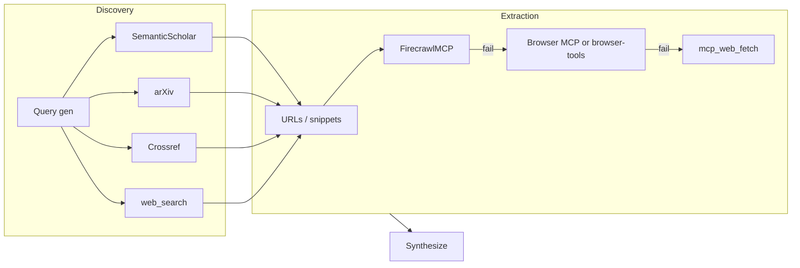

# Researcher Enhancement Plan (Free Stack, No BrowserAct)

## Goal

Replace the current researcher fetch stack (web_search + FreeCrawl MCP, fallback mcp_web_fetch) with a **free-only** stack:

- **Discovery:** Semantic Scholar API, arXiv API, Crossref REST API (+ keep web_search for general).
- **Extraction:** Firecrawl (self-hosted) primary; Browser MCP or browser-tools as fallback when Firecrawl fails or JS/PDF needed; mcp_web_fetch as last resort.

No BrowserAct. All new MCPs are either free APIs (with documented rate limits) or self-hosted (no API caps).

---

## Architecture (fetch flow)

- **Discovery** is chosen from `params.research_tools` and academic detection (research_auto_keywords or explicit academic param). Academic runs prefer Semantic Scholar, arXiv, Crossref when those tools are in the list.
- **Extraction** order: Firecrawl (self-hosted) first; on missing tool or error, Browser MCP (or browser-tools); then mcp_web_fetch. Never throw; keep snippet + "full page unavailable" if all fail.

---

## 1. Prerequisites (user / env)

User must install and configure in Cursor (`~/.cursor/mcp.json` or project MCP config):

| MCP server                       | Role                | Notes                                                                                                                                |
| -------------------------------- | ------------------- | ------------------------------------------------------------------------------------------------------------------------------------ |
| **Semantic Scholar MCP**         | Discovery           | e.g. akapet00/semantic-scholar-mcp; run locally (uvx/Python/Docker). Optional API key for higher rate limit (100 req/s vs 100/5min). |
| **arXiv MCP**                    | Discovery           | e.g. andybrandt/mcp-simple-arxiv; run locally. Rate ~3 req/s.                                                                        |
| **Crossref**                     | Discovery           | Polite pool (mailto in request); or Academic Search MCP aggregating Semantic Scholar + Crossref.                                     |
| **Firecrawl MCP (self-hosted)**  | Extraction          | firecrawl/firecrawl-mcp-server; run Firecrawl locally (no hosted credit limit).                                                      |
| **Browser MCP or browser-tools** | Extraction fallback | One of: browsermcp.io repo or AgentDeskAI/browser-tools-mcp; run locally. Pick one.                                                  |

### 1.1 Setup (install and configure each MCP)

Implement setup so the new tools are installable and documented. Document the following in [3-Resources/Second-Brain/MCP-Tools.md](3-Resources/Second-Brain/MCP-Tools.md) under "Research agent" (or in a dedicated **Research-Stack-Setup** section / note) and ensure each MCP is addable to Cursor `~/.cursor/mcp.json` (or project MCP config).

- **Semantic Scholar MCP**
  - Install: e.g. clone/install from a chosen repo (e.g. `akapet00/semantic-scholar-mcp` or equivalent); run via `uvx`, Python, or Docker per that repo’s README.
  - Config: Add server block to `mcp.json` with the appropriate `command` (and args) or `url` if stdio/server.
  - Optional: Env var for API key (e.g. `SEMANTIC_SCHOLAR_API_KEY`) for higher rate limit (100 req/s vs 100/5min); document in rate limits and setup.
  - Verify: Tool(s) such as `search_paper` (or repo’s tool names) appear in Cursor and respond.
- **arXiv MCP**
  - Install: e.g. `andybrandt/mcp-simple-arxiv` or similar; run via `uvx`/pip/npx/Docker per repo.
  - Config: Add to `mcp.json` with the repo’s required `command` (and working directory if needed).
  - No API key required; respect ~3 req/s in usage.
  - Verify: Search tool returns arXiv results.
- **Crossref (or Academic Search MCP)**
  - Option A — Standalone Crossref: If using a Crossref MCP server, install per its repo; add to `mcp.json`; set polite pool (e.g. `mailto` in request or User-Agent) per Crossref docs.
  - Option B — Aggregator: If using an “Academic Search MCP” that aggregates Semantic Scholar + Crossref, install that server; add to `mcp.json`; document which tools map to Crossref.
  - Verify: DOI lookup or list/query tools work.
- **Firecrawl MCP (self-hosted)**
  - Install: Run Firecrawl backend locally (per Firecrawl self-host / Docker docs); install **firecrawl/firecrawl-mcp-server** (or equivalent) and point it at local Firecrawl instance.
  - Config: Add to `mcp.json` with `command` (and env for Firecrawl URL if needed). Ensure no dependency on hosted Firecrawl credits.
  - Verify: Scrape (or equivalent) tool returns content for a test URL.
- **Browser MCP or browser-tools (pick one)**
  - **Browser MCP:** Install from browsermcp.io / GitHub repo (e.g. npm/pip per repo); add to `mcp.json` with repo’s `command`; ensure browser runtime (e.g. Chromium) is available.
  - **browser-tools-mcp:** Install from `AgentDeskAI/browser-tools-mcp` per its README; add to `mcp.json`.
  - Verify: Navigate/scrape or equivalent tool can fetch a page; document chosen option in MCP-Tools.md so skill references the right tool names.
- **Deliverable:** MCP-Tools.md (or a dedicated setup note in `3-Resources/Second-Brain/`) contains a “Research stack setup” subsection with: (1) list of required/supported MCPs, (2) per-server install and `mcp.json` snippet or reference, (3) optional env (e.g. Semantic Scholar API key), (4) link to rate limits reference. Implementation can add this as part of the first implementation step (docs + setup) before skill changes.
- Document in [3-Resources/Second-Brain/MCP-Tools.md](3-Resources/Second-Brain/MCP-Tools.md) under "Research agent": required/supported MCPs, tool names per server, **setup steps (install + mcp.json)** per above, and link to rate limits reference.
- Add rate limits: in Parameters.md or new [3-Resources/Second-Brain/Research-Stack-Rate-Limits.md](3-Resources/Second-Brain/Research-Stack-Rate-Limits.md) with table (Semantic Scholar 100/5min no key, 100/s with key; arXiv ~3 req/s, 1000 results/query; Crossref polite 10 req/s single DOI, 3 req/s list; Firecrawl self-hosted none; Browser MCP none; mcp_web_fetch not documented). Skill does not enforce numbers; only respects research_result_limit and avoids burst; doc is for operator awareness.

---

## 2. Params and routing

### 2.1 research_tools extension

- **Current:** default `["web", "freecrawl"]`; normalize `browse` → `freecrawl`, `x` → academic.
- **New allowed values:** `web`, `semantic-scholar`, `arxiv`, `crossref`, `firecrawl`, `browser`.
- **Normalization (backward compatible):** `freecrawl` or `browse` → treat as `firecrawl` (use Firecrawl MCP; if unavailable, fall back to mcp_web_fetch and record in research_tools_used). `x` → academic. Unknown keys ignored.
- **Default:** `["web", "firecrawl"]`. When academic is detected (research_auto_keywords or param), prefer discovery tools in research_tools that are scholarly (semantic-scholar, arxiv, crossref).

### 2.2 Discovery routing (skill Step 2)

- `semantic-scholar` in research_tools and (academic or paper-suited queries): call Semantic Scholar MCP; cap total discovery calls (e.g. 3–5).
- `arxiv` in research_tools and academic/preprint: call arXiv MCP; same cap.
- `crossref` in research_tools and DOI/citation need: call Crossref/aggregator; same cap.
- `web` in research_tools or non-academic: use web_search. Respect research_result_limit (default 3–5, up to 5–7 when util-driven).
- Academic with only `web`: keep current behavior (web_search with site:arxiv.org etc.).

### 2.3 Extraction routing (skill Step 2)

For each URL from discovery: (1) if `firecrawl` in research_tools, call Firecrawl MCP; (2) on missing/error and `browser` in research_tools, call Browser MCP or browser-tools; (3) on missing/error, mcp_web_fetch; (4) if all fail, keep URL + snippet, note "full page unavailable". No BrowserAct; no FreeCrawl in new flow (freecrawl/browse → firecrawl).

---

## 3. Skill changes: research-agent-run

**File:** [.cursor/skills/research-agent-run/SKILL.md](.cursor/skills/research-agent-run/SKILL.md)

- **Inputs:** params.research_tools — default `["web", "firecrawl"]`; allowed `web`, `semantic-scholar`, `arxiv`, `crossref`, `firecrawl`, `browser`. Normalize freecrawl/browse → firecrawl, x → academic. Remove FreeCrawl as default scrape tool.
- **Fetch stack:** Replace section with: **Discovery:** web_search; Semantic Scholar MCP (when semantic-scholar in research_tools + academic); arXiv MCP (when arxiv); Crossref/aggregator (when crossref). Limit discovery calls (3–5); respect rate limits per Research-Stack-Rate-Limits. **Extraction:** Firecrawl MCP when firecrawl in research_tools; on missing/error → Browser MCP or browser-tools when browser in research_tools; on missing/error → mcp_web_fetch. If all fail for a URL, snippet + "full page unavailable". **Academic:** prefer Semantic Scholar/arXiv/Crossref when in research_tools; else web_search site:arxiv.org etc. No BrowserAct.
- **Step 2 (Fetch):** (1) Run discovery per research_tools + academic routing; (2) for each chosen URL, extraction chain Firecrawl → Browser MCP → mcp_web_fetch; (3) respect research_result_limit and total fetch cap; (4) never throw; at least search-only synthesis when discovery returned results.
- **Step 5 (Write) – research_tools_used:** Include semantic_scholar, arxiv, crossref, web_search, firecrawl, browser_mcp (or browser_tools), mcp_web_fetch. Record tools actually used (e.g. `["semantic_scholar", "firecrawl"]` or `["web_search", "firecrawl", "firecrawl_fallback_mcp_web_fetch"]`).
- **MCP tools (skill summary):** List Semantic Scholar MCP, arXiv MCP, Crossref/academic-search, Firecrawl MCP, Browser MCP or browser-tools, web_search, mcp_web_fetch. Remove FreeCrawl.
- **Reference:** Add link to Research-Stack-Rate-Limits (or Parameters § rate limits) and MCP-Tools.md § Research agent.

---

## 4. Documentation updates

- **[3-Resources/Second-Brain/MCP-Tools.md](3-Resources/Second-Brain/MCP-Tools.md)** — "Research agent (external fetch)": Replace FreeCrawl with Firecrawl (self-hosted) and Browser MCP/browser-tools; add Semantic Scholar, arXiv, Crossref as discovery; fallback order Firecrawl → Browser MCP → mcp_web_fetch; remove BrowserAct. Note setup requires these MCPs in Cursor config and point to rate limits doc.
- **[3-Resources/Second-Brain/Parameters.md](3-Resources/Second-Brain/Parameters.md)** — research_tools: default `["web", "firecrawl"]`; allowed values and normalization (freecrawl/browse → firecrawl, x → academic). Add subsection or link for Research stack rate limits.
- **[3-Resources/Second-Brain/Queue-Sources.md](3-Resources/Second-Brain/Queue-Sources.md)** — Research (pre-deepen): research_tools "default [web, firecrawl]; discovery: web_search, Semantic Scholar, arXiv, Crossref per research_tools; extraction: Firecrawl MCP then Browser MCP or mcp_web_fetch fallback; no BrowserAct."
- **[3-Resources/Second-Brain/Vault-Layout.md](3-Resources/Second-Brain/Vault-Layout.md)** — Ingest/Agent-Research: research_tools_used includes semantic_scholar, arxiv, crossref, firecrawl, browser_mcp, mcp_web_fetch; legacy web, browse, freecrawl valid for reads.
- **[3-Resources/Second-Brain/Logs.md](3-Resources/Second-Brain/Logs.md)** — Research error / Ingest-Log: allow new tool names (semantic_scholar, arxiv, crossref, firecrawl, browser_mcp) alongside existing.
- **New (optional):** [3-Resources/Second-Brain/Research-Stack-Rate-Limits.md](3-Resources/Second-Brain/Research-Stack-Rate-Limits.md) — rate limits table + one-line guidance (skill respects research_result_limit and avoids burst; operators use for capacity planning).

---

## 5. Backward compatibility

- Entries with `["web", "freecrawl"]` or `["web", "browse"]`: normalize to firecrawl; use Firecrawl MCP when available; when not configured, fall back to mcp_web_fetch only, record e.g. research_tools_used: `["web_search", "mcp_web_fetch"]`.
- Entries with only `["web"]`: no extraction tool; discovery snippets only; optional mcp_web_fetch for top N URLs or document firecrawl/browser recommended for full-page content.
- No changes to ResearchSubagent rule ([.cursor/rules/agents/research.mdc](.cursor/rules/agents/research.mdc)); it still calls research-agent-run with params; only skill fetch implementation and param semantics change.

---

## 6. Sync and backbone

- [.cursor/sync/skills/research-agent-run.md](.cursor/sync/skills/research-agent-run.md): Update to match skill (fetch stack, research_tools, research_tools_used).
- Per [.cursor/rules/always/backbone-docs-sync.mdc](.cursor/rules/always/backbone-docs-sync.mdc): after editing skill and Second-Brain docs, update sync copies (.cursor/sync/skills/; sync rules if any research rule lists tools).

---

## 7. Implementation order

1. **Setup and docs:** Add rate limits doc (or Parameters subsection); update MCP-Tools.md Research agent section with prerequisite table, **Research stack setup (§1.1)** — install and mcp.json steps for each MCP (Semantic Scholar, arXiv, Crossref/aggregator, Firecrawl self-hosted, Browser MCP or browser-tools), and link to rate limits. User performs actual install and mcp.json config per that section before or during testing.
2. Update research-agent-run skill: inputs, fetch stack, Step 2, Step 5 research_tools_used, MCP tools list, references.
3. Update Parameters, Queue-Sources, Vault-Layout, Logs as in §4.
4. Update .cursor/sync/skills/research-agent-run.md and any backbone sync.
5. Manual test: RESEARCH_AGENT with research_tools `["web", "firecrawl"]` and optionally `["semantic-scholar", "arxiv", "firecrawl"]` for an academic phase; confirm discovery/extraction use new stack and research_tools_used is recorded.

---

## Out of scope (no BrowserAct)

- No BrowserAct integration, credits, or config.
- GPT Researcher MCP not part of this plan (synthesis stays in research-agent-run).
- No code changes to Queue subagent or prompt crafter UI (only param semantics and docs; crafter can keep offering research_tools, with new options in follow-up if desired).

