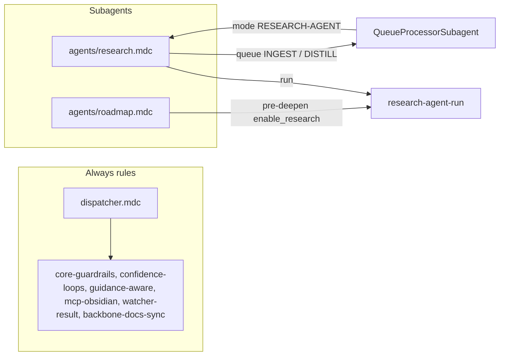

# ResearchSubagent Refactor Plan

This plan follows the pattern in [queue-dispatcher-subagent-refactor](.cursor/plans/Rule-Refactor/queue-dispatcher-subagent-refactor_54b07695.plan.md), [queueprocessorsubagent_refactor](.cursor/plans/Rule-Refactor/queueprocessorsubagent_refactor_793d8e05.plan.md), and [expresssubagent_refactor](.cursor/plans/Rule-Refactor/expresssubagent_refactor_fc1a51e5.plan.md), and aligns with the subagent architecture from the Grok output (dispatcher + dedicated subagents under `.cursor/rules/agents/`).

---

## 1. Goals

- **Isolate research logic** into a single **ResearchSubagent** so only that context + shared core guardrails are loaded when processing queue mode **RESEARCH-AGENT** (and aliases such as "Queue Research: Phase", RESEARCH-GAPS).
- **Preserve behavior**: No change to research-agent-run semantics (vault-first → query gen → fetch → synthesize → write to `Ingest/Agent-Research/`; Research error entry format; gap-fill mode; INGEST MODE queue append for new notes; optional DISTILL; Watcher-Result; Errors.md backstop when 0 notes).
- **Single subagent context rule** `agents/research.mdc` that encapsulates the **RESEARCH-AGENT** queue path: resolve `project_id` + `linked_phase`, run research-agent-run, post-process (queue INGEST/DISTILL, Watcher-Result, caller backstop to Errors.md).
- **Clear boundary**: **Pre-deepen research** (RESUME-ROADMAP with enable_research) remains invoked **inline by RoadmapSubagent** (or current auto-roadmap) by calling the **research-agent-run** skill directly with the same params contract. ResearchSubagent does **not** own the pre-deepen flow; it owns only the **standalone RESEARCH-AGENT** queue entry path.

---

## 2. Current state (source of truth)

- **Skill**: [.cursor/skills/research-agent-run/SKILL.md](.cursor/skills/research-agent-run/SKILL.md) — vault-first → query gen → fetch (web_search, FreeCrawl, mcp_web_fetch fallback) → synthesize (citations, caps) → write to `Ingest/Agent-Research/`; gap-fill mode when `params.gaps`; failure/empty → Errors.md (Research error entry format); returns paths/summaries and optionally `gap_fills`.
- **Queue dispatch**: [.cursor/rules/context/auto-eat-queue.mdc](.cursor/rules/context/auto-eat-queue.mdc) — **RESEARCH-AGENT** (order 4b): resolve project_id + linked_phase from `source_file` or payload; require both; on missing skip entry and Watcher-Result failure; run research-agent-run; for each new note append INGEST MODE (and optionally DISTILL if params.research_distill); after return, if 0 notes and skill did not log, caller appends Errors.md backstop; Watcher-Result; re-read before write to preserve pipeline appends.
- **Pre-deepen (inline)**: [.cursor/rules/context/auto-roadmap.mdc](.cursor/rules/context/auto-roadmap.mdc) — RESUME-ROADMAP action deepen: enable_research conditions (util-based, gap-aware, explicit); resolve linked_phase from workflow_state; call research-agent-run **inline** with project_id, linked_phase, queries, low_util/gap hints; failure/empty → Errors.md (skill or caller backstop); queue INGEST (and DISTILL if params.research_distill); inject into roadmap-deepen. This path stays with RoadmapSubagent; it does **not** route through ResearchSubagent.
- **References**: [Queue-Sources.md](3-Resources/Second-Brain/Queue-Sources.md) (RESEARCH-AGENT, RESEARCH-GAPS alias), [Logs.md](3-Resources/Second-Brain/Logs.md) § Research error entry format, [Parameters.md](3-Resources/Second-Brain/Parameters.md) (research_*, enable_research), [Cursor-Skill-Pipelines-Reference.md](3-Resources/Second-Brain/Cursor-Skill-Pipelines-Reference.md), [Queue-Alias-Table.md](3-Resources/Second-Brain/Queue-Alias-Table.md).

---

## 3. Target architecture

- **Queue mode RESEARCH-AGENT**: QueueProcessorSubagent dispatches to **ResearchSubagent** (`agents/research.mdc`). ResearchSubagent: resolve project_id + linked_phase; run **research-agent-run**; append INGEST MODE (and optionally DISTILL) for new notes; Errors.md backstop when 0 notes and skill did not log; append Watcher-Result.
- **Pre-deepen research**: **RoadmapSubagent** (or auto-roadmap until refactor) continues to call **research-agent-run** directly with the same contract (project_id, linked_phase, queries, low_util, gaps, etc.). No change to that flow; ResearchSubagent is not in the call path for pre-deepen.
- **Shared core**: ResearchSubagent obeys core-guardrails, confidence-loops, guidance-aware, mcp-obsidian-integration, watcher-result-append, backbone-docs-sync. Research error entry format and Research-Log remain as today.

---

## 4. Concrete refactor steps

### 4.1 Create ResearchSubagent file

- Ensure `.cursor/rules/agents/` exists (from QueueProcessorSubagent or earlier refactor).
- Create `**.cursor/rules/agents/research.mdc`** with:
  - **Header**: Title "ResearchSubagent"; short description: responsible for queue mode **RESEARCH-AGENT** (resolve project_id + linked_phase, run research-agent-run, write to Ingest/Agent-Research/, queue INGEST/DISTILL for new notes, Watcher-Result, Errors.md backstop). Pre-deepen research is invoked by RoadmapSubagent/auto-roadmap by calling research-agent-run directly; ResearchSubagent does not own that path.
  - **Globs / trigger**: Loaded when dispatcher or QueueProcessorSubagent routes **RESEARCH-AGENT** (or RESEARCH-GAPS alias). No file globs; queue-mode only.
  - **Content**: Move from auto-eat-queue the RESEARCH-AGENT block verbatim:
    - Resolve **project_id** and **linked_phase** from `source_file` (e.g. phase note under `1-Projects/<project_id>/Roadmap/`) or from payload `project_id` + `params.phase` / `params.linked_phase`. Require **both** present; if either missing → skip entry, Watcher-Result failure, do not run skill, do not mark success.
    - Run **research-agent-run** with project_id, linked_phase, params (research_queries, research_tools, research_max_tokens, gaps, origin, research_verify, etc. per skill and Queue-Sources).
    - For each new note path created, append **INGEST MODE** to queue (or in-memory for same run) with `source_file: "<path>"`. If `params.research_distill === true`, also append **DISTILL MODE** for each.
    - **After** research-agent-run returns: if it returned 0 notes and the skill did **not** already add an Errors.md entry for this run, **caller backstop** — append one entry to Errors.md per Research error entry format ([Logs.md](3-Resources/Second-Brain/Logs.md) § Research error entry format), e.g. `#research-empty`, pipeline `research-agent-run`, linked_phase, project_id, reason "caller backstop: 0 notes returned, no skill log". If research-agent-run threw or timed out, append entry with `#research-failed`, reason "exception" or "tool unavailable".
    - Append Watcher-Result line for this queue entry (success or failure).
  - **Safety**: State that ResearchSubagent obeys Error Handling Protocol and Research error entry format via shared always rules and Logs.md; snapshot before overwrite per research-agent-run (new-file creates use pipeline backup only).

### 4.2 Skill and MCP usage

- **research-agent-run** remains the single skill under `.cursor/skills/research-agent-run/` (optional later: mirror or move under `skills/research/` for consistency; not required for this refactor).
- ResearchSubagent **only** runs research-agent-run for **RESEARCH-AGENT** queue entries. It does not duplicate fetch/synthesis logic.
- MCP: obsidian_list_notes, obsidian_read_note, obsidian_global_search, obsidian_ensure_structure, obsidian_update_note (or create) — as specified inside research-agent-run. ResearchSubagent does not add new MCP usage; it only orchestrates resolution + skill call + queue append + Errors backstop + Watcher-Result.

### 4.3 Wire dispatcher and QueueProcessorSubagent

- **RESEARCH-AGENT** (and RESEARCH-GAPS alias when normalized to RESEARCH-AGENT with params.gaps): QueueProcessorSubagent dispatches to **ResearchSubagent** (`agents/research.mdc`) instead of inlining RESEARCH-AGENT logic in auto-eat-queue.
- **Pre-deepen**: No routing change. RoadmapSubagent (or auto-roadmap) continues to call research-agent-run **directly** when enable_research conditions are met; it does **not** send a RESEARCH-AGENT queue entry to ResearchSubagent for that case.
- Update [system-funnels.mdc](.cursor/rules/always/system-funnels.mdc) (or dispatcher) so RESEARCH-AGENT is documented as routing to "ResearchSubagent (agents/research.mdc)".

### 4.4 Retire or slim queue logic in auto-eat-queue

- In **auto-eat-queue.mdc** (or the queue processor rule that holds the mode table): replace the inline RESEARCH-AGENT block with a short pointer: "RESEARCH-AGENT → ResearchSubagent (agents/research.mdc). Resolve project_id + linked_phase, run research-agent-run, queue INGEST/DISTILL, Errors backstop, Watcher-Result are defined there."
- Ensure canonical order and mode list still include RESEARCH-AGENT so ordering and validation remain correct; only the **implementation** of the RESEARCH-AGENT branch moves to ResearchSubagent.

### 4.5 Documentation and sync

- **Queue-Sources.md**: State that RESEARCH-AGENT is handled by ResearchSubagent (agents/research.mdc); keep payload and params description (source_file, project_id, params.phase / linked_phase, research_queries, research_distill, gaps, etc.).
- **Cursor-Skill-Pipelines-Reference.md**: Add a short "Research" line: RESEARCH-AGENT → ResearchSubagent; research-agent-run used by ResearchSubagent (queue path) and by RoadmapSubagent (pre-deepen path).
- **Pipelines.md / Backbone**: Note ResearchSubagent as owner of RESEARCH-AGENT queue path; pre-deepen remains with roadmap.
- **.cursor/sync/rules/agents/** (if present): Add or update `research.md` mirror of `agents/research.mdc`. Changelog entry in `.cursor/sync/changelog.md`.

---

## 5. Cross-subagent contract

- **RoadmapSubagent** (or auto-roadmap): When RESUME-ROADMAP action is deepen and research is enabled (enable_research or util/gap auto-detect), it **calls research-agent-run** with project_id, linked_phase, queries, low_util, gaps, etc. It does **not** enqueue RESEARCH-AGENT for pre-deepen. ResearchSubagent is **not** invoked for pre-deepen.
- **ResearchSubagent**: Handles only **queue entries** with mode RESEARCH-AGENT. Same skill, same Error and Log contract; different entry point.

---

## 6. Rollout and validation

- **Phase 1 (design / implement)**: Add `agents/research.mdc` with the RESEARCH-AGENT behavior moved from auto-eat-queue; update QueueProcessorSubagent (or auto-eat-queue) to route RESEARCH-AGENT to ResearchSubagent. Keep auto-roadmap pre-deepen unchanged (still calls research-agent-run directly).
- **Regression checklist**:
  - **RESEARCH-AGENT queue**: Add a RESEARCH-AGENT entry with source_file or project_id + linked_phase; run EAT-QUEUE. Confirm: project_id and linked_phase resolved; research-agent-run runs; notes created in Ingest/Agent-Research/; INGEST MODE appended for each; Watcher-Result line; on 0 notes, Errors.md entry (skill or caller backstop).
  - **RESEARCH-AGENT missing params**: Entry with missing project_id or linked_phase → skip, Watcher-Result failure, no skill run, entry not marked success.
  - **Pre-deepen**: Run RESUME-ROADMAP with enable_research on a project with workflow_state; confirm research still runs inline before roadmap-deepen and injects into deepen; no RESEARCH-AGENT queue entry created for that path.
- **Optional**: RESEARCH-GAPS (Commander "Queue Research: Gaps") — ensure alias still produces RESEARCH-AGENT with params.gaps and that ResearchSubagent passes gaps through to research-agent-run.

---

## 7. Summary

| Item                   | Action                                                                                               |
| ---------------------- | ---------------------------------------------------------------------------------------------------- |
| New file               | `.cursor/rules/agents/research.mdc` (RESEARCH-AGENT queue path only)                                 |
| Skill                  | `research-agent-run` unchanged; still used by ResearchSubagent and by RoadmapSubagent for pre-deepen |
| QueueProcessorSubagent | Dispatch RESEARCH-AGENT → ResearchSubagent                                                           |
| auto-eat-queue         | Remove inline RESEARCH-AGENT block; replace with route to ResearchSubagent                           |
| Pre-deepen             | No change; RoadmapSubagent/auto-roadmap calls research-agent-run directly                            |
| Docs                   | Queue-Sources, Cursor-Skill-Pipelines-Reference, Pipelines/Backbone, .cursor/sync                    |

This keeps the research skill single and the ResearchSubagent thin (queue resolution + skill run + post-processing), while clarifying ownership of the two entry points (queue vs pre-deepen).