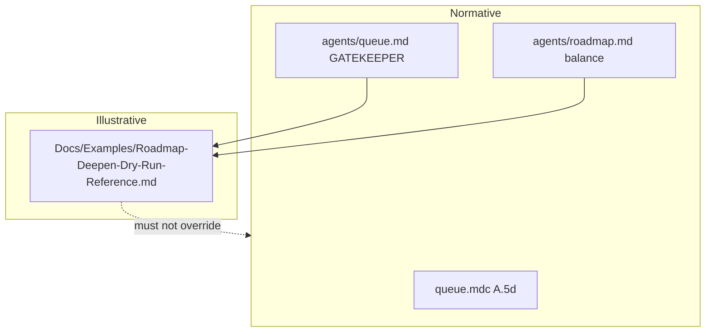

# Roadmap deepen dry-run “railroad” (exemplar doc)

## Path and naming (vault-correct)

Grok’s `Docs/Examples/...` at repo root does **not** match this vault. Use the official docs tree:

- **New file:** [3-Resources/Second-Brain/Docs/Examples/Roadmap-Deepen-Dry-Run-Reference.md](3-Resources/Second-Brain/Docs/Examples/Roadmap-Deepen-Dry-Run-Reference.md)
- Create `Docs/Examples/` under [3-Resources/Second-Brain/Docs/](3-Resources/Second-Brain/Docs/) if missing.

**Precedence block** at the top should cite paths that actually exist here:

- [.cursor/agents/queue.md](.cursor/agents/queue.md) (FINAL GATEKEEPER)
- [.cursor/rules/agents/queue.mdc](.cursor/rules/agents/queue.mdc) (normative A.5d / dispatch)
- [3-Resources/Second-Brain/Docs/Safety-Invariants.md](3-Resources/Second-Brain/Docs/Safety-Invariants.md)
- [3-Resources/Second-Brain/Docs/Roadmapping-System.md](3-Resources/Second-Brain/Docs/Roadmapping-System.md)

Obsidian wikilinks in the body can use `[[3-Resources/Second-Brain/Docs/...]]` style to match existing notes.

## Content: merge “dry run” + fix balance-mode drift

The conversation narrative is useful, but one part is **misaligned** with this repo’s **RoadmapSubagent** contract:

- [.cursor/agents/roadmap.md](.cursor/agents/roadmap.md) top block requires **balance mode** deepen to **attempt real nested `Task` calls** for **Validator** and **IRA** (not “likely skipped”), with `nested_subagent_ledger` attestation.

**Plan for the exemplar body:**

1. Paste the full dry-run narrative (Layer 0 → Layer 1 resolver → Layer 2 deepen → `queue_followups` / high-util `recal` → back to Layer 1 A.5c / A.6 / A.7) as the main sections.
2. Add a short **“Alignment note (this vault)”** subsection that states:
  - Balance-mode nested helper obligations follow **roadmap.md** first.
  - The narrative’s “minimal nested helpers” language is **non-normative**; actual runs must match `roadmap.md` + [Subagent-Safety-Contract](3-Resources/Second-Brain/Subagent-Safety-Contract.md).
3. Keep the exemplar **scenario-specific** (e.g. `genesis-mythos-master`, `current_subphase_index: "5.1.1"`, stale `user_guidance` vs resolver) so it reads as one concrete trace, not a second ruleset.

## Patch 2: Queue agent file

Insert the Grok **Runtime reference guidance** paragraph **immediately after** the FINAL GATEKEEPER block that ends at line 39 (“This block overrides…”) in [.cursor/agents/queue.md](.cursor/agents/queue.md) — i.e. **before** `# Queue subagent (Layer 1)` at line 45.

**Adjust the path** in that paragraph to:

`3-Resources/Second-Brain/Docs/Examples/Roadmap-Deepen-Dry-Run-Reference.md`

(No edits to [.cursor/rules/agents/queue.mdc](.cursor/rules/agents/queue.mdc) unless you later want the same one-liner duplicated there; Grok asked to avoid rule bloat.)

## Patch 3: Examples index

Add one bullet under **RESUME-ROADMAP deepen** (or a new **“Deepen exemplar”** sub-bullet) in [3-Resources/Second-Brain/Docs/Examples.md](3-Resources/Second-Brain/Docs/Examples.md):

- Link to `[[3-Resources/Second-Brain/Docs/Examples/Roadmap-Deepen-Dry-Run-Reference]]` with a one-line description.

## Optional Patch 4 (recommended): RoadmapSubagent pointer

Add a parallel **one-paragraph** “may consult exemplar” note near the top of [.cursor/agents/roadmap.md](.cursor/agents/roadmap.md) (after the balance-mode block or after frontmatter), same precedence language as Queue — so Layer 2 also has an explicit on-ramp without reading the whole Examples.md.

## Backbone / sync

- **Do not** mirror `.cursor/agents/*.md` into `.cursor/sync/` (sync tree here mirrors `rules/agents/*.md`, not `agents/*.md`).
- If you add a cross-link from [3-Resources/Second-Brain/Rules.md](3-Resources/Second-Brain/Rules.md) or [3-Resources/Second-Brain/Docs/Subagent-Layers-Reference.md](3-Resources/Second-Brain/Docs/Subagent-Layers-Reference.md), do it only if you want discoverability; not required for the railroad to work.

## Verification (manual)

- Open the new doc in Obsidian: wikilinks resolve, precedence block is visible.
- Grep: no stale path `Docs/Examples/Roadmap` without `3-Resources/Second-Brain/` prefix unless you intentionally add a short redirect note (not planned).

