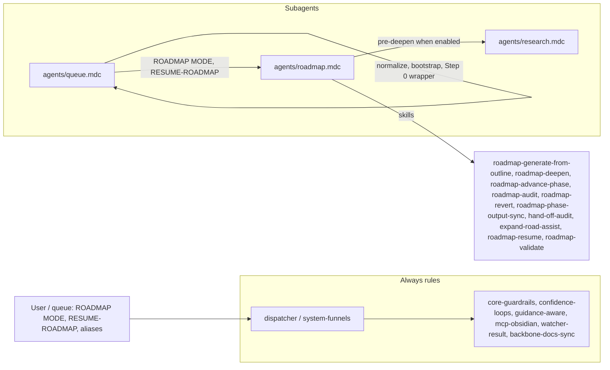

# RoadmapSubagent Refactor Plan

This plan follows the pattern in [queue-dispatcher-subagent-refactor](.cursor/plans/Rule-Refactor/queue-dispatcher-subagent-refactor_54b07695.plan.md), [ingestsubagent_refactor](.cursor/plans/Rule-Refactor/ingestsubagent_refactor_a0cadca0.plan.md), and [distillsubagent_refactor](.cursor/plans/Rule-Refactor/distillsubagent_refactor_e38df484.plan.md), and aligns with the high-level [agent-subagents-refactor](.cursor/plans/Rule-Refactor/agent-subagents-refactor_5367ea6a.plan.md). It adds a **dedicated** roadmap subagent plan to the Rule-Refactor set (queue-dispatcher, queue-processors, ingest, distill, express, research, archive, organize).

---

## 1. Goals

- **Isolate roadmap logic** into a single **RoadmapSubagent** so only that context + shared core guardrails are loaded when processing ROADMAP MODE, RESUME-ROADMAP, or any roadmap alias (RECAL-ROAD, REVERT-PHASE, SYNC-PHASE-OUTPUTS, HANDOFF-AUDIT, RESUME-FROM-LAST-SAFE, EXPAND-ROAD).
- **Preserve behavior**: No change to ROADMAP MODE (setup only: Phase 0, workflow_state, roadmap-generate-from-outline), RESUME-ROADMAP single-action flow (params.action: deepen, recal, revert-phase, sync-outputs, handoff-audit, resume-from-last-safe, expand, advance-phase, compact-depth, or "auto" smart dispatch); pre-deepen research (util-based/gap-aware enable, research-agent-run, inject into deepen); context-tracking default-on and postcondition check; roadmap-next-step wrapper pre-dispatch and Decision Wrapper creation; state ownership (roadmap-state.md, workflow_state.md); snapshot-before/after state updates; Error Handling and Watcher-Result.
- **Introduce** `agents/roadmap.mdc` encapsulating [auto-roadmap](.cursor/rules/context/auto-roadmap.mdc) and the **roadmap execution** portions currently in [auto-eat-queue](.cursor/rules/context/auto-eat-queue.mdc) (normalization and bootstrap stay in queue processor; "run auto-roadmap" becomes "run RoadmapSubagent").
- **Optional skills layout**: Group roadmap skills under `.cursor/skills/roadmap/` (or keep under `.cursor/skills/` with unchanged paths; plan documents both options). Skills: roadmap-generate-from-outline, roadmap-resume, roadmap-deepen, roadmap-advance-phase, roadmap-audit, roadmap-revert, roadmap-phase-output-sync, roadmap-validate, hand-off-audit, expand-road-assist; research-agent-run remains shared (ResearchSubagent) and is **invoked** by RoadmapSubagent for pre-deepen.

---

## 2. Current state (source of truth)

- **Main roadmap rule**: [.cursor/rules/context/auto-roadmap.mdc](.cursor/rules/context/auto-roadmap.mdc) — ROADMAP MODE = setup only; RESUME-ROADMAP = single continue by params.action; persona (Senior Roadmap Architect); resolve project_id; Phase 0 creation; workflow_state; roadmap-generate-from-outline; pre-deepen research (util-based, gap-aware, research-agent-run, INGEST/DISTILL queue); roadmap-deepen (with queue_next, context-tracking postcondition); advance-phase, recal, revert-phase, sync-outputs, handoff-audit, resume-from-last-safe, expand, compact-depth; smart dispatch (wrapper scan, stall protection, target reached, next-step decision + Decision Wrapper); one-shot deprecated.
- **Queue processor roadmap branches**: [.cursor/rules/context/auto-eat-queue.mdc](.cursor/rules/context/auto-eat-queue.mdc) — Canonical order (ROADMAP MODE 7a, RESUME-ROADMAP 8, aliases 8b–11b); roadmap mode normalization (RECAL-ROAD → RESUME-ROADMAP + action recal, etc.); RESUME-ROADMAP + approved roadmap-next-step (pre-dispatch: inject params.action from wrapper); RESUME-ROADMAP context-tracking (set enable_context_tracking true when deepen); RESUME-ROADMAP bootstrap (when state missing, run ROADMAP MODE first from same queue); match: ROADMAP MODE → auto-roadmap setup, RESUME-ROADMAP → auto-roadmap continue, ROADMAP-ONE-SHOT → deprecation + classic generate.
- **Queue/alias contract**: [3-Resources/Second-Brain/Queue-Sources.md](3-Resources/Second-Brain/Queue-Sources.md), [3-Resources/Second-Brain/Queue-Alias-Table.md](3-Resources/Second-Brain/Queue-Alias-Table.md) — Mode list, validation, remove-stale on RESUME-ROADMAP append, alias → RESUME-ROADMAP mapping.
- **Skills**: All under `.cursor/skills/` today: roadmap-generate-from-outline, roadmap-resume, roadmap-deepen, roadmap-advance-phase, roadmap-audit, roadmap-revert, roadmap-phase-output-sync, roadmap-validate, hand-off-audit, expand-road-assist; research-agent-run (shared). [Roadmap-Quality-Guide](3-Resources/Second-Brain/Roadmap-Quality-Guide.md), [Vault-Layout](3-Resources/Second-Brain/Vault-Layout.md) § Roadmap state artifacts.

All behavior to preserve lives in auto-roadmap.mdc and the roadmap-specific branches of auto-eat-queue.mdc; the refactor moves **execution** into RoadmapSubagent and keeps **routing + normalization + bootstrap + Step 0** in the queue processor, which then invokes RoadmapSubagent.

---

## 3. Target architecture

- **Dispatcher (always-on)**  
When trigger is ROADMAP MODE, Resume roadmap, RESUME-ROADMAP, or any roadmap alias → route to **QueueProcessorSubagent** (for queue) or directly to **RoadmapSubagent** (for phrase). Queue processor retains: canonical order, roadmap mode normalization, RESUME-ROADMAP bootstrap (run ROADMAP MODE first when state missing), RESUME-ROADMAP + roadmap-next-step pre-dispatch (inject params.action), context-tracking default (set enable_context_tracking true for deepen). Then **invoke RoadmapSubagent** with merged params.
- **RoadmapSubagent (context)**  
New file: `.cursor/rules/agents/roadmap.mdc`.  
Encapsulates:
  1. **Entry**: Run when (a) queue processor dispatches ROADMAP MODE (setup) or RESUME-ROADMAP (continue), or (b) user says "ROADMAP MODE" / "Resume roadmap" and dispatcher routes here.
  2. **ROADMAP MODE**: Resolve project_id/source_file; Phase 0 if missing (roadmap-state.md, decisions-log.md, distilled-core.md); workflow_state creation; roadmap-generate-from-outline; one-shot deprecation path unchanged.
  3. **RESUME-ROADMAP**: Params merge (queue + Config + profile); effective enable_context_tracking; validate params.action; branch by action (deepen with optional pre-deepen research → research-agent-run → roadmap-deepen + context-tracking postcondition; advance-phase, recal, revert-phase, sync-outputs, handoff-audit, resume-from-last-safe, expand, compact-depth); smart dispatch when action missing or "auto" (wrapper scan, stall protection, target reached, next-step Decision Wrapper).
  4. **State ownership**: RoadmapSubagent is the only component that mutates roadmap-state.md, workflow_state.md, and phase roadmap notes; all via existing skills; snapshot before/after every state update per mcp-obsidian-integration.
- **Shared core (unchanged)**  
core-guardrails, confidence-loops, guidance-aware, mcp-obsidian-integration (including Roadmap state invariants), watcher-result-append, backbone-docs-sync. RoadmapSubagent depends on these; no duplication of safety logic.

---

## 4. Concrete refactor steps

### 4.1 Create RoadmapSubagent file

- Ensure `.cursor/rules/agents/` exists (from QueueProcessorSubagent or earlier refactor).
- Create `**.cursor/rules/agents/roadmap.mdc`** with:
  - **Header**: Title "RoadmapSubagent"; description: responsible for ROADMAP MODE (setup) and RESUME-ROADMAP (single action per run); owns roadmap-state.md, workflow_state.md, and phase notes for the project; depends on shared always rules for safety.
  - **Globs**: Loaded when dispatcher or queue processor routes ROADMAP MODE or RESUME-ROADMAP (and aliases already normalized to RESUME-ROADMAP); scope: `1-Projects/**/Roadmap/**/*.md`, `1-Projects/**/*Master*Goal*.md`, `1-Projects/**/*Roadmap*.md` (match current auto-roadmap globs).
  - **Content source**: Migrate the **full** behavior of [auto-roadmap.mdc](.cursor/rules/context/auto-roadmap.mdc) into this file (sections: How to activate, Behavior, ROADMAP MODE, RESUME-ROADMAP with all action branches, pre-deepen research, context-tracking postcondition, smart dispatch, One-shot deprecated, Skills list). No behavior change; only ownership moves from context rule to subagent rule.
  - **Persona and references**: Keep the "Senior Roadmap Architect" persona block and references to Queue-Sources, Parameters, Roadmap-Quality-Guide, Vault-Layout, and skill paths (or `skills/roadmap/` if step 4.2 is done).
  - **Safety section**: State that RoadmapSubagent obeys Error Handling Protocol, snapshot-before/after state updates, confidence bands, and Watcher-Result via shared always rules; no new safety logic.

### 4.2 Skills layout (optional)

- **Option A (minimal)**: Leave all roadmap skills under `.cursor/skills/<name>/` (e.g. `roadmap-deepen/`, `roadmap-resume/`). RoadmapSubagent references them by current path. No file moves.
- **Option B (Grok-style)**: Create `.cursor/skills/roadmap/` and **move** (or symlink/copy) roadmap-specific skills into it, e.g. `roadmap/roadmap-generate-from-outline.md`, `roadmap/roadmap-deepen.md`, … so that `skills/roadmap/` is the single skill folder for the RoadmapSubagent. Update references in `agents/roadmap.mdc` and in Cursor-Skill-Pipelines-Reference / Skills.md. **Recommendation**: Option A for this refactor to avoid unnecessary file moves; Option B can be a follow-up.

### 4.3 Queue processor: invoke RoadmapSubagent instead of auto-roadmap

- In **agents/queue.mdc** (or, until it exists, in [auto-eat-queue.mdc](.cursor/rules/context/auto-eat-queue.mdc)): Where the queue currently says "Run **auto-roadmap** setup path" and "Run **auto-roadmap** (single roadmap continuation path)", replace with "Run **RoadmapSubagent** (agents/roadmap.mdc)": same payload (project_id, source_file, merged params, requestId). Do **not** move normalization, bootstrap, or Step 0 (roadmap-next-step) out of the queue processor; those stay. Only the **execution** of the roadmap pipeline is delegated to RoadmapSubagent.
- Ensure RESUME-ROADMAP context-tracking (default-on for deepen) and RESUME-ROADMAP bootstrap (run ROADMAP MODE first when state missing) remain in the queue processor so that the entry passed to RoadmapSubagent already has correct mode and params.

### 4.4 Dispatcher routing

- Update [system-funnels.mdc](.cursor/rules/always/system-funnels.mdc) (or future `dispatcher.mdc`) so that:
  - **ROADMAP MODE**, **ROADMAP MODE – generate from outline**, **Resume roadmap**, **RESUME-ROADMAP**, and aliases (RECAL-ROAD, REVERT-PHASE, SYNC-PHASE-OUTPUTS, HANDOFF-AUDIT, RESUME-FROM-LAST-SAFE, EXPAND-ROAD) are documented as routing to **RoadmapSubagent** (`agents/roadmap.mdc`). When the trigger is from the queue, the queue processor does normalization/bootstrap/Step 0 then calls RoadmapSubagent; when the trigger is a direct phrase, the dispatcher loads RoadmapSubagent and passes context (e.g. current file, project_id).

### 4.5 Retire or slim auto-roadmap (after validation)

- Once RoadmapSubagent is implemented and tested, **slim** [.cursor/rules/context/auto-roadmap.mdc](.cursor/rules/context/auto-roadmap.mdc) to a short stub that says "Roadmap behavior has moved to RoadmapSubagent (agents/roadmap.mdc); see that rule. This file is kept for glob/backward reference only." and points to `agents/roadmap.mdc`. Alternatively remove globs from auto-roadmap so it is never auto-loaded and only `agents/roadmap.mdc` is used (preferred once dispatcher explicitly routes by mode).

### 4.6 Cross-subagent: research pre-deepen

- RoadmapSubagent **calls** [research-agent-run](.cursor/skills/research-agent-run/SKILL.md) for pre-deepen when enabled (util-based, gap-aware, or explicit params.enable_research). No change to that contract. When ResearchSubagent exists as a context rule, "call research-agent-run" remains an invocation of the skill (or the ResearchSubagent can be invoked with a minimal payload). No duplication of research logic inside RoadmapSubagent.

---

## 5. Documentation and sync

- **Backbone / pipelines**: Update [3-Resources/Second-Brain/Cursor-Skill-Pipelines-Reference.md](3-Resources/Second-Brain/Cursor-Skill-Pipelines-Reference.md) and, if present, [3-Resources/Second-Brain/Backbone.md](3-Resources/Second-Brain/Backbone.md) or [3-Resources/Second-Brain/Pipelines.md](3-Resources/Second-Brain/Pipelines.md) to state that ROADMAP MODE and RESUME-ROADMAP are handled by **RoadmapSubagent** (`agents/roadmap.mdc`); queue processor performs normalization, bootstrap, and Step 0 then invokes RoadmapSubagent.
- **Queue-Sources**: In [3-Resources/Second-Brain/Queue-Sources.md](3-Resources/Second-Brain/Queue-Sources.md), add a one-line note that roadmap execution is delegated to RoadmapSubagent; mode list and validation rules remain unchanged.
- **Sync folder**: When `agents/roadmap.mdc` is created, add `.cursor/sync/rules/agents/roadmap.md` (or equivalent) per [backbone-docs-sync](.cursor/rules/always/backbone-docs-sync.mdc). If skills are moved to `skills/roadmap/`, sync those under `.cursor/sync/skills/roadmap/`.

---

## 6. Validation and rollout

- **Regression checklist** (run after implementation):
  - **ROADMAP MODE** (new project): No roadmap-state → Phase 0 + workflow_state + roadmap-generate-from-outline; no RESUME-ROADMAP appended after setup.
  - **ROADMAP MODE** (existing state): roadmap-state exists → ensure workflow_state exists only; no resume/continue.
  - **RESUME-ROADMAP** (action deepen): Params merge; optional pre-deepen research when enabled; roadmap-deepen; context-tracking postcondition (last log row check); queue_next append when not false.
  - **RESUME-ROADMAP** (actions recal, revert-phase, sync-outputs, handoff-audit, advance-phase, expand): Correct skill per action; Watcher-Result and Errors.md on failure.
  - **Smart dispatch**: action missing or "auto" → wrapper scan, stall protection, target reached, or next-step Decision Wrapper under Roadmap-Decisions.
  - **Aliases**: RECAL-ROAD, REVERT-PHASE, etc. normalized in queue then one run of RoadmapSubagent with correct params.action.
  - **RESUME-ROADMAP bootstrap**: State missing + ROADMAP MODE in same queue → ROADMAP MODE runs first, then RESUME-ROADMAP.
  - **Step 0**: Approved roadmap-next-step wrapper → params.action injected, then RoadmapSubagent runs that action.
- **Rollback**: Keep [auto-roadmap.mdc](.cursor/rules/context/auto-roadmap.mdc) loadable (stub or full) until RoadmapSubagent is validated; queue processor can be reverted to "run auto-roadmap" if needed.

---

## 7. Summary

| Item                 | Action                                                                                                                                                |
| -------------------- | ----------------------------------------------------------------------------------------------------------------------------------------------------- |
| New rule             | `.cursor/rules/agents/roadmap.mdc` (content from auto-roadmap.mdc)                                                                                    |
| Queue processor      | Replace "run auto-roadmap" with "run RoadmapSubagent (agents/roadmap.mdc)" for ROADMAP MODE and RESUME-ROADMAP; keep normalization, bootstrap, Step 0 |
| Dispatcher / funnels | Document roadmap triggers → RoadmapSubagent                                                                                                           |
| Skills               | Keep under `.cursor/skills/<name>/` (Option A); optional later: `skills/roadmap/`                                                                     |
| auto-roadmap.mdc     | Stub or remove globs after validation                                                                                                                 |
| Docs                 | Cursor-Skill-Pipelines-Reference, Queue-Sources, sync folder                                                                                          |
| State ownership      | RoadmapSubagent is sole mutator of roadmap-state.md, workflow_state.md, phase notes                                                                   |

This plan makes the RoadmapSubagent the single place for roadmap execution and state mutations while the queue processor keeps routing, normalization, bootstrap, and wrapper pre-dispatch, giving the "biggest immediate win" (smaller context per run for non-roadmap work, clearer ownership of roadmap state and actions).