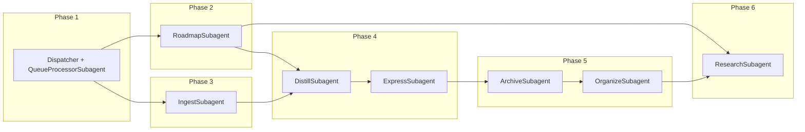

# Rule-Refactor Master Rollout Plan

This plan triggers the existing Rule-Refactor plans **in strict order**. Each phase depends on the previous one; do not skip. The foundation is Phase 1 (Dispatcher + QueueProcessorSubagent); all other subagents are swapped in after that.

---

## Scope and boundaries

- **Prompt-Crafter unchanged:** The refactor applies only to **secondary** (manual/queue) triggers. **Prompt-Crafter** ("We are making a prompt" / question-led flow in [plan-mode-prompt-crafter.mdc](.cursor/rules/context/plan-mode-prompt-crafter.mdc)) remains the **primary entry** and is **not** replaced by a subagent. It continues to write validated payloads to the queue; only the **handler** of those payloads (dispatcher → subagent) changes.
- **Triggers with no subagent (yet):** **GARDEN REVIEW** and **CURATE CLUSTER** (and any other manual triggers not in the six phases) keep routing to their **existing context rules** ([auto-garden-review.mdc](.cursor/rules/context/auto-garden-review.mdc), [auto-curate-cluster.mdc](.cursor/rules/context/auto-curate-cluster.mdc)). The dispatcher routes **only** modes that have a dedicated subagent. This avoids confusion when looking for a "garden" or "curate" phase in the rollout.
- **Global invariants:** Error Handling Protocol, Decision Wrapper creation, CHECK_WRAPPERS, exclusions, and Watcher-Result contract live in **always** rules and shared contracts. **Invariant:** Subagents **depend on** these; they must **not** duplicate or relax them. **Source of truth** remains: [core-guardrails.mdc](.cursor/rules/always/core-guardrails.mdc), [mcp-obsidian-integration.mdc](.cursor/rules/always/mcp-obsidian-integration.mdc), [confidence-loops.mdc](.cursor/rules/always/confidence-loops.mdc), [watcher-result-append.mdc](.cursor/rules/always/watcher-result-append.mdc).
- **Shared config:** [Queue-Sources](3-Resources/Second-Brain/Queue-Sources.md), [Parameters](3-Resources/Second-Brain/Parameters.md), and [Second-Brain-Config](3-Resources/Second-Brain-Config.md) are **single source of truth**. When multiple phases change them, merge carefully and avoid conflicting defaults or mode lists.
- **Mobile and Commander:** Flows are unchanged: same triggers and queue; only the **handler** (subagent vs old context rule) changes. Mobile still observes and fills Ingest; Commander macros still invoke the same modes.

---

## Pre-coding polish (do before Phase 1)

Apply these once before starting Phase 1 so all subsequent plans align.

| Item                          | Action                                                                                                                                                                                                                                                                                                      |
| ----------------------------- | ----------------------------------------------------------------------------------------------------------------------------------------------------------------------------------------------------------------------------------------------------------------------------------------------------------- |
| **Canonical dispatcher name** | Use `always/dispatcher.mdc` (not only extending system-funnels). Keep [system-funnels.mdc](.cursor/rules/always/system-funnels.mdc) as documentation; dispatcher holds routing logic.                                                                                                                       |
| **Skill folder structure**    | **Do not** move skills into `skills/ingest/`, `skills/roadmap/`, etc. in this first pass. Keep every skill under `.cursor/skills/<name>/`. Move/group in a later cleanup sprint.                                                                                                                            |
| **Research boundary**         | In ResearchSubagent header (Phase 6), add: *"Pre-deepen research (RESUME-ROADMAP with enable_research) is invoked directly by RoadmapSubagent via the research-agent-run skill. ResearchSubagent only handles standalone RESEARCH-AGENT queue entries."*                                                    |
| **Subagent template**         | Create [.cursor/rules/agents/_template.mdc](.cursor/rules/agents/_template.mdc) with standard header, safety section, and "depends on shared always rules" boilerplate. Copy for each new subagent for consistency.                                                                                         |
| **Shared config**             | [Queue-Sources](3-Resources/Second-Brain/Queue-Sources.md), [Parameters](3-Resources/Second-Brain/Parameters.md), and [Second-Brain-Config](3-Resources/Second-Brain-Config.md) are single source of truth; when multiple phases change them, merge carefully and avoid conflicting defaults or mode lists. |

---

## Rollout order (execute in this sequence)

### Phase 1 — Dispatcher + QueueProcessorSubagent (foundation)

**Why first:** Single point of truth for routing. Everything else routes through it.

- **Plans to execute (in order):**
  1. [queue-dispatcher-subagent-refactor_54b07695.plan.md](.cursor/plans/Rule-Refactor/queue-dispatcher-subagent-refactor_54b07695.plan.md) — concrete steps (agents folder, `agents/queue.mdc`, thin `always/dispatcher.mdc`, wire triggers, docs, smoke tests).
  2. [queueprocessorsubagent_refactor_793d8e05.plan.md](.cursor/plans/Rule-Refactor/queueprocessorsubagent_refactor_793d8e05.plan.md) — reference/spec; use to validate behavior and target architecture.
- **Deliverables:** `always/dispatcher.mdc`, `agents/queue.mdc`, routing so EAT-QUEUE and PROCESS TASK QUEUE hit the queue subagent; `system-funnels.mdc` and Queue-Sources/Pipelines docs updated.
- **Effort:** 1–2 days. **Risk:** Very low.

---

### Phase 2 — RoadmapSubagent

**Why second:** Highest complexity and payoff; state-heavy; largest context reduction.

- **Plan to execute:** [roadmapsubagent_refactor_47af3605.plan.md](.cursor/plans/Rule-Refactor/roadmapsubagent_refactor_47af3605.plan.md)
- **Reference:** [agent-subagents-refactor_5367ea6a.plan.md](.cursor/plans/Rule-Refactor/agent-subagents-refactor_5367ea6a.plan.md) for contract/design if needed.
- **Deliverables:** `agents/roadmap.mdc`; roadmap execution moved out of auto-eat-queue/auto-roadmap; dispatcher/queue route ROADMAP MODE and RESUME-ROADMAP (and aliases) to RoadmapSubagent. Do **not** move roadmap skills into `skills/roadmap/` in this pass.
- **Effort:** 2–3 days. **Risk:** Medium (state mutations).

---

### Phase 3 — IngestSubagent

**Why third:** High volume; touches non-MD, embedded images, Phase 1/2, Decision Wrappers.

- **Plan to execute:** [ingestsubagent_refactor_a0cadca0.plan.md](.cursor/plans/Rule-Refactor/ingestsubagent_refactor_a0cadca0.plan.md)
- **Deliverables:** `agents/ingest.mdc`; always-ingest-bootstrap, ingest-processing, para-zettel-autopilot, non-markdown-handling behavior moved into IngestSubagent; INGEST MODE (and related triggers) routed to it by dispatcher/queue.
- **Effort:** 1–2 days. **Risk:** Low.

---

### Phase 4 — DistillSubagent + ExpressSubagent (together)

**Why together:** SCOPING MODE runs both; doing them back-to-back avoids temporary breakage.

- **Plans to execute (order):**
  1. [distillsubagent_refactor_e38df484.plan.md](.cursor/plans/Rule-Refactor/distillsubagent_refactor_e38df484.plan.md)
  2. [expresssubagent_refactor_fc1a51e5.plan.md](.cursor/plans/Rule-Refactor/expresssubagent_refactor_fc1a51e5.plan.md)
- **Deliverables:** `agents/distill.mdc`, `agents/express.mdc`; DISTILL MODE / BATCH-DISTILL and EXPRESS MODE (and related triggers) routed to respective subagents; Step 0 distill-apply-from-wrapper and express-apply-from-wrapper still invoked by queue processor.
- **Effort:** ~1 day each. **Risk:** Very low.

---

### Phase 5 — ArchiveSubagent + OrganizeSubagent

**Why last among pipelines:** Lower volume; self-contained. Archive has ghost-folder sweep; Organize has name-enhance.

- **Plans to execute (order):**
  1. [archivesubagent_refactor_1922c9dd.plan.md](.cursor/plans/Rule-Refactor/archivesubagent_refactor_1922c9dd.plan.md)
  2. [organizesubagent_refactor_2b5a0180.plan.md](.cursor/plans/Rule-Refactor/organizesubagent_refactor_2b5a0180.plan.md)
- **Deliverables:** `agents/archive.mdc`, `agents/organize.mdc`; ARCHIVE MODE and ORGANIZE MODE (and related triggers) routed to respective subagents.
- **Effort:** ~1 day each. **Risk:** Very low.

---

### Phase 6 — ResearchSubagent

**Why last:** Smallest scope; only owns standalone RESEARCH-AGENT queue path. Pre-deepen stays in RoadmapSubagent.

- **Plan to execute:** [researchsubagent_refactor_7db28f97.plan.md](.cursor/plans/Rule-Refactor/researchsubagent_refactor_7db28f97.plan.md)
- **Deliverables:** `agents/research.mdc` with the **research boundary sentence** in the header (see Pre-coding polish). Queue mode RESEARCH-AGENT dispatched to ResearchSubagent; pre-deepen research still invoked by RoadmapSubagent via research-agent-run skill.
- **Effort:** ~½ day. **Risk:** Very low.

---

## Validation strategy (after each phase)

For **every** subagent you finish, run this checklist before considering the phase done:

1. **Old trigger phrase** — Run the same trigger (e.g. "DISTILL MODE") and confirm behavior matches pre-refactor.
2. **EAT-QUEUE** — Run the same flow via a queue entry; confirm identical outcome.
3. **Step 0 wrapper-apply** — For pipelines that have it (distill, express, ingest apply-mode), run a wrapper-apply path and confirm it works.
4. **Logs** — Check Pipeline-Log.md (or the relevant log), Backup-Log.md, and Watcher-Result.md for expected entries and no regressions.
5. **Context** — Confirm the old monolithic rule is no longer loaded for that pipeline (grep or inspect context).
6. **Sync and backbone** — Update the sync mirror (`.cursor/sync/rules/...`, `.cursor/sync/skills/...`) for any rule or skill touched by that phase, update backbone docs (e.g. [Cursor-Skill-Pipelines-Reference](3-Resources/Cursor-Skill-Pipelines-Reference.md), [Queue-Sources](3-Resources/Second-Brain/Queue-Sources.md), [Rules](3-Resources/Second-Brain/Rules.md)) as needed, and append a line to [.cursor/sync/changelog.md](.cursor/sync/changelog.md) so the refactor is traceable.

If any check fails, revert the one-line route in the dispatcher (or the subagent inclusion) and fix before proceeding. Old context rules are **kept in place (slimmed)**, not deleted. Rollback = **point the dispatcher back at the old rule**; no need to restore deleted files, so revert is fast and safe.

---

## Dependency summary

Phase 1 is the only hard dependency for Phases 2–6. Phases 2 and 3 can run after Phase 1 in either order; Phase 4 (Distill+Express) should follow so SCOPING MODE is consistent. Phase 5 and 6 can follow Phase 4; Research (Phase 6) can be done anytime after Phase 2 (Roadmap) since it only needs the RESEARCH-AGENT queue path and the research boundary clarification.

---

## How to use this master plan

1. **Before Phase 1:** Apply the five pre-coding polish items.
2. **For each phase:** Open the linked plan file(s), execute the steps (and todos in that plan), then run the validation checklist.
3. **On failure:** Revert the dispatcher/subagent wiring for that phase, fix, and re-validate before continuing.
4. **After all phases:** All triggers route through the dispatcher to the appropriate subagent; context size per run is reduced; safety contracts (snapshots, confidence bands, Step 0, CHECK_WRAPPERS, ghost-folder sweep) are unchanged.

---

## Post-rollout (optional)

After all phases, optional follow-ups: move skills into domain folders (e.g. `skills/roadmap/`), slim [system-funnels.mdc](.cursor/rules/always/system-funnels.mdc) to pure documentation, add a short **Subagent index** (e.g. in Pipelines or Rules.md) listing `agents/*.mdc` and their triggers.