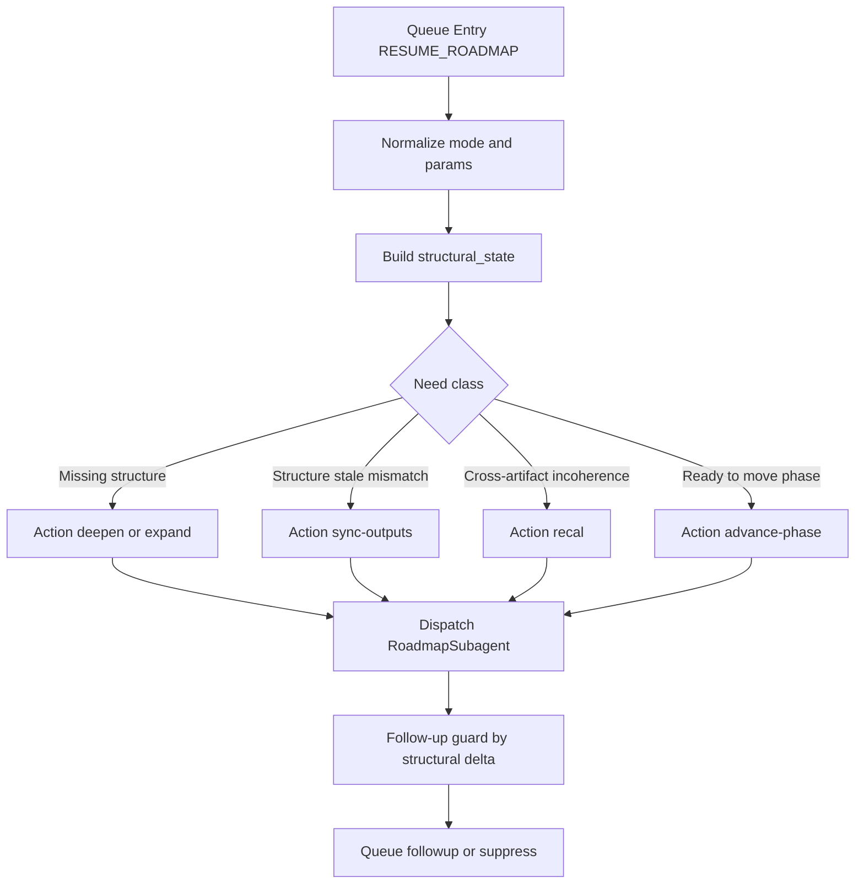

# Draft Anti-Spin Plan (State-Driven, No Hard Caps)

## Objective

Stop roadmap tire-spinning by choosing next actions from **structural need** (missing nodes, stale outputs, link integrity, gate deficits), while keeping `RESUME_ROADMAP` as the only continuation funnel.

## Current leverage points

- Queue already centralizes per-project serial dispatch and roadmap normalization in [/.cursor/rules/agents/queue.mdc](/home/darth/Documents/Second-Brain/.cursor/rules/agents/queue.mdc).
- RoadmapSubagent already branches by `params.action` and supports smart dispatch in [/.cursor/agents/roadmap.md](/home/darth/Documents/Second-Brain/.cursor/agents/roadmap.md).
- Queue contracts and params already model `RESUME_ROADMAP` action semantics in [/3-Resources/Second-Brain/Queue-Sources.md](/home/darth/Documents/Second-Brain/3-Resources/Second-Brain/Queue-Sources.md) and [/3-Resources/Second-Brain/Parameters.md](/home/darth/Documents/Second-Brain/3-Resources/Second-Brain/Parameters.md).

## Design

Create a **Next-Need Resolver** step that computes a compact structural state and picks one best action per project per run.

## Implementation plan

- Add a resolver stage in queue dispatch:
  - In [/.cursor/rules/agents/queue.mdc](/home/darth/Documents/Second-Brain/.cursor/rules/agents/queue.mdc), after roadmap mode normalization and before Task dispatch, compute `structural_state` for roadmap entries and derive `effective_action` when incoming action is `auto`, missing, or repeatedly non-productive.
  - Resolver outputs:
    - `effective_action`
    - `effective_target` (phase/subphase/note path)
    - `need_class` (`missing_structure` | `stale_outputs` | `incoherence` | `phase_gate_ready`)
    - `delta_basis` summary for telemetry.
- Add roadmap-side branch contract for resolver hints:
  - In [/.cursor/agents/roadmap.md](/home/darth/Documents/Second-Brain/.cursor/agents/roadmap.md), accept resolver-provided hints (`effective_action`, `effective_target`, `need_class`) and prioritize them over weak default recal paths.
  - In [/.cursor/rules/agents/roadmap.mdc](/home/darth/Documents/Second-Brain/.cursor/rules/agents/roadmap.mdc), document this precedence and preserve existing safety/validator invariants.
- Define structural_state rubric (no iteration caps):
  - Inputs (read-only): roadmap-state, active workflow_state log, current phase note tree, phase-output sync state, counterpart/link integrity signals.
  - Derived checks:
    - Missing node decomposition depth for current target.
    - Output freshness mismatch (phase note vs phase output).
    - Link/counterpart integrity gaps.
    - Gate evidence completeness (roll-up/checklist presence).
  - Decision policy:
    - Missing decomposition => `deepen` or `expand`.
    - Freshness mismatch => `sync-outputs`.
    - Structural complete but contradictory artifacts => `recal`.
    - All gates complete => `advance-phase`.
- Add follow-up guard based on structural delta:
  - In queue follow-up synthesis path in [/.cursor/rules/agents/queue.mdc](/home/darth/Documents/Second-Brain/.cursor/rules/agents/queue.mdc), require non-trivial `delta_basis` to auto-append same-class action repeatedly.
  - If delta is flat, pivot follow-up to the next best need class instead of repeating recal.
- Add minimal config knobs (not loop caps):
  - In [/3-Resources/Second-Brain/Parameters.md](/home/darth/Documents/Second-Brain/3-Resources/Second-Brain/Parameters.md) and [/3-Resources/Second-Brain-Config.md](/home/darth/Documents/Second-Brain/3-Resources/Second-Brain-Config.md), add selector settings such as:
    - `roadmap_next_need_enabled`
    - `roadmap_next_need_prefer_track_when_sparse` (e.g., conceptual first)
    - `roadmap_next_need_min_structural_delta`
  - Avoid `max_iterations`/`max_recal_streak` style controls.
- Document the behavior and operator visibility:
  - Update [/3-Resources/Second-Brain/Queue-Sources.md](/home/darth/Documents/Second-Brain/3-Resources/Second-Brain/Queue-Sources.md) with resolver semantics under `RESUME_ROADMAP`.
  - Update [/3-Resources/Second-Brain/Cursor-Skill-Pipelines-Reference.md](/home/darth/Documents/Second-Brain/3-Resources/Second-Brain/Cursor-Skill-Pipelines-Reference.md) with a short “Next-Need Resolver” subsection.
  - Mirror rule updates in `/.cursor/sync/**` and append changelog in [/.cursor/sync/changelog.md](/home/darth/Documents/Second-Brain/.cursor/sync/changelog.md).

## Validation plan

- Replay a project queue snapshot with repeated recal entries (like your current queue) and verify:
  - Resolver picks non-recal structural actions when gaps exist.
  - Follow-up lines pivot action based on `need_class` + `delta_basis`, not repeated recal churn.
  - `RESUME_ROADMAP` remains the only continuation mode.
- Confirm telemetry includes resolver rationale per run so action choices are auditable.

