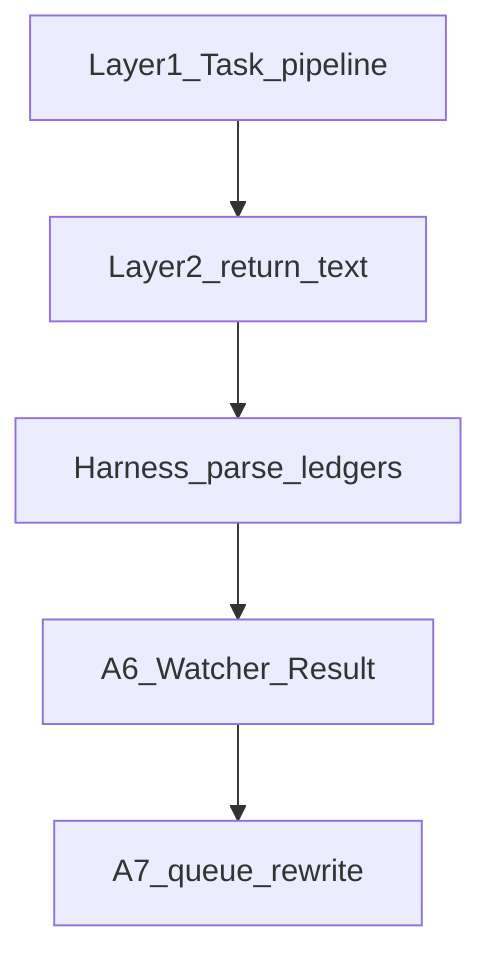

# Structure harness (docs + queue alignment)

## Context from the repo

- **Entry point:** [3-Resources/Second-Brain/Docs/README.md](3-Resources/Second-Brain/Docs/README.md) already maps subagents, Queue-Pipeline, Safety-Invariants, etc.
- **Creating subagents is split:** two near-duplicate files exist: [3-Resources/Second-Brain/Docs/Creating-Subagents.md](3-Resources/Second-Brain/Docs/Creating-Subagents.md) (linked from Docs README) and [3-Resources/Second-Brain/Docs/Subagents/Creating-Subagents.md](3-Resources/Second-Brain/Docs/Subagents/Creating-Subagents.md) (linked from [Docs/Subagents/README.md](3-Resources/Second-Brain/Docs/Subagents/README.md)). Any harness section must be **applied to both** or one file should become a short stub pointing to the canonical copy to stop drift.
- **Index target:** Canonical “where is everything” is [3-Resources/Second-Brain/Docs/Reference/Where-to-Find.md](3-Resources/Second-Brain/Docs/Reference/Where-to-Find.md) (not `Reference--Where-to-Find.md`).
- **Ledger / primary_code today:** [3-Resources/Second-Brain/Docs/Nested-Subagent-Ledger-Spec.md](3-Resources/Second-Brain/Docs/Nested-Subagent-Ledger-Spec.md) already normatively requires `nested_subagent_ledger` for listed queue-dispatched pipelines; [3-Resources/Second-Brain/Docs/Subagent-Layers-Reference.md](3-Resources/Second-Brain/Docs/Subagent-Layers-Reference.md) references `queue.strict_nested_ledger_all_pipelines` and missing-ledger handling in `[.cursor/rules/agents/queue.mdc](.cursor/rules/agents/queue.mdc)` **A.6**. [3-Resources/Second-Brain/Docs/Validator-Tiered-Blocks-Spec.md](3-Resources/Second-Brain/Docs/Validator-Tiered-Blocks-Spec.md) defines `primary_code` precedence and “Block scope” in prose (§4)—`blocked_scope` is the new **return-field** formalization.
- **Queue step numbering:** [3-Resources/Second-Brain/Docs/Pipelines/Queue-Pipeline.md](3-Resources/Second-Brain/Docs/Pipelines/Queue-Pipeline.md) must match **queue.mdc** exactly: **A.0–A.7 only** (remove phantom **A.8**). New harness step documents as **after dispatch, before Watcher-Result** (see below).

## 1. New canonical doc: `Harness-Patterns-and-Guidelines.md`

**Path:** [3-Resources/Second-Brain/Docs/Harness-Patterns-and-Guidelines.md](3-Resources/Second-Brain/Docs/Harness-Patterns-and-Guidelines.md)

**Style (non-negotiable):** Same density as [Writing-Style-Guidelines.md](3-Resources/Second-Brain/Docs/Writing-Style-Guidelines.md): **purpose first**, **version line**, **tables**, **heavy cross-links**, **minimal prose** (no tutorial voice).

**Section outline:**

1. **Pipeline skeleton template** — Ordered phases: hand-off gate (queue-dispatched) → backup → classify/enrich (as applicable) → primary signal + confidence band table (high/mid/low) → at most one mid-band loop → snapshot-before-destructive → destructive MCP only when gates pass → pipeline logs → Run-Telemetry → mandatory return blocks (summary + structured YAML per [Subagent-Safety-Contract](3-Resources/Second-Brain/Subagent-Safety-Contract.md)). Link [Safety-Invariants](3-Resources/Second-Brain/Docs/Safety-Invariants.md) snapshot triggers.
2. **Subagent return contract extensions** — **Required** fenced YAML on final return: `nested_subagent_ledger` ([Nested-Subagent-Ledger-Spec](3-Resources/Second-Brain/Docs/Nested-Subagent-Ledger-Spec.md)); `task_harden_result` footer where Task harden pass applies ([Subagent-Safety-Contract](3-Resources/Second-Brain/Subagent-Safety-Contract.md)).
  `**blocked_scope`:** **Optional on the wire**, but **normative (MUST emit)** when a **hard block** or **tiered validator** outcome fires (e.g. high / `block_destructive`, or scoped freeze per [Validator-Tiered-Blocks-Spec](3-Resources/Second-Brain/Docs/Validator-Tiered-Blocks-Spec.md) §4). Cross-link **§4 (Scoped block contract)** and [Queue-Sources](3-Resources/Second-Brain/Queue-Sources.md) **repair-first** ordering for `allowed_pivots`.
   **Minimal shape (example):**

```yaml
   blocked_scope:
     project_id: "..."
     validation_type: "roadmap_handoff_auto"
     primary_code: "contradictions_detected" # closed set per Validator-Tiered-Blocks-Spec
     freeze_deepen_advance: true
     allowed_pivots: ["recal", "handoff-audit"]
   

```

1. **Skill-level harness rules** — Template block for `.cursor/skills/<name>/SKILL.md`: `vault_mutations`, `primary_confidence_signal`, `snapshot_trigger`, `destructive_actions`, `exclusions`. Read-only skills: `vault_mutations: false`. **New skills required**; legacy skills opportunistic migration.
2. **Queue (Layer 1) harness telemetry** — Parseable checks on **Layer 2 return text**: `nested_subagent_ledger` (presence + parse + attestation invariants), optional `blocked_scope` when block path, `task_harden_result` when mandatory.
  **Config:** `queue.harness_validation_mode`: `advisory` | `strict` — document in [Second-Brain-Config](3-Resources/Second-Brain/Second-Brain-Config.md) and [Parameters](3-Resources/Second-Brain/Parameters.md). **Default: `advisory`.**
   **Three outcomes (document explicitly in a table):**

  | Outcome         | Meaning                                                                                                                                                                                           |
  | --------------- | ------------------------------------------------------------------------------------------------------------------------------------------------------------------------------------------------- |
  | **pass**        | Required blocks parse; attestation OK; proceed to Watcher-Result / queue rewrite as today.                                                                                                        |
  | **advisory**    | Harness gap (e.g. unparseable ledger) logged—Errors.md and/or Watcher `trace` tags—**do not** change consume/clear semantics (default mode).                                                      |
  | **strict_fail** | Treat as harness contract failure: align with existing strict nested-ledger / queue.mdc gates when `harness_validation_mode: strict` (and `strict_nested_ledger_all_pipelines` where applicable). |

   **Mermaid (place in this section of the doc, not only in the plan):**




## 2. Extend `Creating-Subagents.md` (both copies or dedupe)

Add **“Harness requirements (mandatory scaffolding)”**: new `.cursor/agents/*.md` → numbered steps, TodoWrite ([Subagent-Layers-Reference](3-Resources/Second-Brain/Docs/Subagent-Layers-Reference.md)), checklist (backup, snapshot, confidence table, ledger, `blocked_scope` when block path), links to Safety-Invariants, Subagent-Safety-Contract, Nested-Subagent-Ledger-Spec, Validator-Tiered-Blocks §4, Queue-Sources repair-first, **Harness-Patterns-and-Guidelines**. New vault-mutating skills → skill harness block (§3).

**Dedup:** Prefer canonical body in **Docs/Subagents/Creating-Subagents.md** + stub **Docs/Creating-Subagents.md**, or dual-edit.

## 3. Cross-links (discovery)

- [Docs/README.md](3-Resources/Second-Brain/Docs/README.md) — document map row for Harness-Patterns-and-Guidelines.
- [Docs/Subagents/README.md](3-Resources/Second-Brain/Docs/Subagents/README.md) — same.
- [Docs/Reference/Where-to-Find.md](3-Resources/Second-Brain/Docs/Reference/Where-to-Find.md) — pipelines/rules/skills index.

## 4. Tighten existing specs (wording + Queue-Pipeline numbering)

- **[Subagent-Layers-Reference.md](3-Resources/Second-Brain/Docs/Subagent-Layers-Reference.md):** Harness gates framing; conditional obligations unchanged.
- **[Nested-Subagent-Ledger-Spec.md](3-Resources/Second-Brain/Docs/Nested-Subagent-Ledger-Spec.md):** Core contract language; `strict_nested_ledger_all_pipelines`.
- **[Validator-Tiered-Blocks-Spec.md](3-Resources/Second-Brain/Docs/Validator-Tiered-Blocks-Spec.md):** Subsection **Return metadata: `blocked_scope`** → pointer to Harness doc + §4 narrative unchanged.
- **[Queue-Pipeline.md](3-Resources/Second-Brain/Docs/Pipelines/Queue-Pipeline.md):**
  - Align step list **exactly** with queue.mdc: **A.0–A.7 only**; **remove any phantom A.8** (e.g. cleanup bullet should reference the real step that invokes queue-cleanup, likely post–A.7 per queue.mdc).
  - Insert **Harness validation** as its own step **after A.5 dispatch (and nested post-dispatch work for that entry), before A.6 Watcher-Result**—label consistently with queue.mdc (e.g. **A.5h** or **A.5.9** if queue.mdc uses sub-ids; if queue.mdc introduces **A.5.x** harness, mirror that id exactly in both files).

## 5. Rule change: `queue.mdc` + sync

- After pipeline `Task` returns, **before** assembling **A.6** lines: run harness parse; honor `**queue.harness_validation_mode`** (`advisory` default vs `strict`). Surface `**blocked_scope`** in `trace` / `message` when present for operator visibility.
- Mirror to `[.cursor/sync/rules/agents/queue.md](.cursor/sync/rules/agents/queue.md)` per backbone-docs-sync.

**Reality check:** On-disk template lint for `.cursor/agents/*.md` remains a **future** optional script; v1 is return-text + Config only.

## 6. Implementation order

1. Harness doc + Mermaid in §4 + cross-links.
2. Second-Brain-Config + Parameters (`harness_validation_mode`).
3. Creating-Subagents + spec tweaks + Queue-Pipeline (A.0–A.7 + harness step before A.6).
4. queue.mdc + sync.

