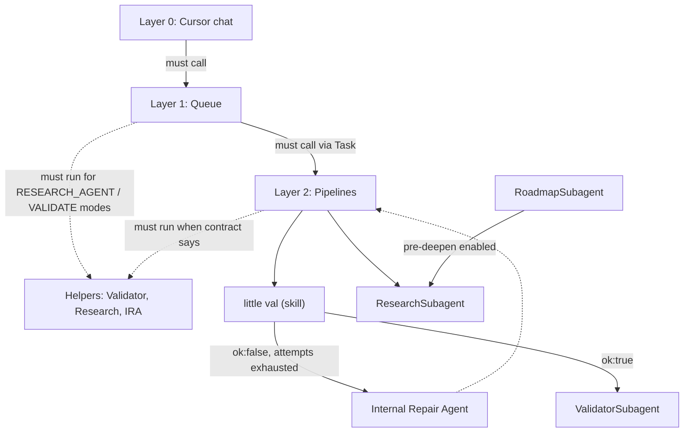

# Subagent prompt plan: indexed layering and prescriptive language

This plan defines the **indexed layer model** and **prescriptive language framework** for all subagent prompts. Pipelines follow hard layering; Validator, Research, and Repair are **helpers** callable by any subagent. The Queue and pipelines **must** run helpers **only when** the contract applies (e.g. when there is a research queue item being eaten). All "must" is **conditional**—explicit and tied to a scenario, not run without purpose.

---

## 1. Indexed layer model

### 1.1 Conditional obligation (all layers)

Every **must** is conditional on the scenario:

- **Queue (Layer 1):** Must run ResearchSubagent **only when** the current queue entry has mode RESEARCH-AGENT or RESEARCH-GAPS. Must run ValidatorSubagent **only when** the current queue entry has mode VALIDATE or ROADMAP_HANDOFF_VALIDATE. Must run a Layer 2 pipeline **only when** the entry is a pipeline mode (INGEST_MODE, ARCHIVE MODE, etc.).
- **Pipelines (Layer 2):** Must call little-val, IRA, or Validator **only when** the contract for that run/step specifies (e.g. after little val ok:true, must call Validator; when little val remains ok:false after attempts, must call IRA). Be **explicit** about when each helper runs; do **not** run helpers without purpose.
- **Layer 2 is the only exception in tone:** Pipeline prompts are **explicit and conditional**, not unconditionally forceful. Use "must" when the condition holds; do not imply that helpers run on every run regardless of context.

### 1.2 Hard layering (pipelines only)

| Layer       | Role                                                                      | Calls                                                                                                                                                                                                                                                                                                                                                                                       | Never does                                                                                                                               |
| ----------- | ------------------------------------------------------------------------- | ------------------------------------------------------------------------------------------------------------------------------------------------------------------------------------------------------------------------------------------------------------------------------------------------------------------------------------------------------------------------------------------- | ---------------------------------------------------------------------------------------------------------------------------------------- |
| **Layer 0** | Cursor chat (user-facing)                                                 | **Must** call Layer 1 only when user triggers EAT-QUEUE, PROCESS TASK QUEUE, or a direct mode.                                                                                                                                                                                                                                                                                              | Never calls pipelines or helpers directly.                                                                                               |
| **Layer 1** | Queue / Dispatcher                                                        | For each queue entry: **must** call the matching Layer 2 pipeline via Task when the entry is a pipeline mode; **must** run ResearchSubagent **only when** the entry has mode RESEARCH-AGENT or RESEARCH-GAPS; **must** run ValidatorSubagent **only when** the entry has mode VALIDATE or ROADMAP_HANDOFF_VALIDATE.                                                                         | Never inlines pipeline or helper logic; never calls Layer 2 as nested agents.                                                            |
| **Layer 2** | Pipeline executors (Ingest, Archive, Organize, Distill, Express, Roadmap) | **When** the contract for this run requires: **must** run little-val (skill); **when** little val remains ok:false after attempts, **must** run IRA; **when** little val returns ok:true, **must** run ValidatorSubagent with the correct validation_type. **When** pre-deepen research is enabled, Roadmap **must** run ResearchSubagent. Be explicit; do not run helpers without purpose. | Never read or write queue files, Watcher-Result, or Decision Wrappers; destructive work only after backup + snapshot + confidence gates. |

### 1.3 Helper family (no strict layer index)

**Validator, Research, Internal Repair Agent** are **helper subagents**. They:

- Are **callable by any subagent** (Queue or any pipeline) when the scenario requires them.
- **Must be invoked** (not reimplemented) **only when** the contract specifies—e.g. when little val returns ok:true for the run, the pipeline **must** call ValidatorSubagent with the appropriate validation_type; when the Queue is eating a RESEARCH-AGENT or RESEARCH-GAPS entry, it **must** run ResearchSubagent; when the entry is VALIDATE or ROADMAP_HANDOFF_VALIDATE, it **must** run ValidatorSubagent.
- Are read-only on caller-owned artifacts (except writing their own report/telemetry notes).
- Never read or write queue files, Watcher-Result, or Decision Wrappers unless explicitly scoped in the contract.

**Research** in particular:

- **Must** be run by Layer 1 (Queue) **only when** there is a RESEARCH-AGENT or RESEARCH-GAPS queue item being eaten.
- **Must** be run by Layer 2 (Roadmap) **only when** pre-deepen research is enabled for that RESUME_ROADMAP run.
- When Research produces synthesized notes, the caller (Queue or Roadmap) is responsible for any downstream validation (e.g. calling ValidatorSubagent with research_synthesis) per contract; Research does not decide Success for the overall run.

---

## 2. Prescriptive language framework

All prompts use **obligation language** for required behavior, with **conditional phrasing** so helpers run only when the scenario applies:

- **Queue:** "When the queue entry has mode RESEARCH-AGENT or RESEARCH-GAPS, you **must** run ResearchSubagent for that entry." Not "you must run Research" unconditionally.
- **Pipelines (Layer 2 exception):** Wording is **explicit and conditional**, not unconditionally forceful. Use "must" only when the condition holds (e.g. "When little val returns ok:true for this run, you **must** call ValidatorSubagent…"). Do not run helpers without purpose; state the guard explicitly.

| Context                     | Use                                                                                                                   | Do not use                                       |
| --------------------------- | --------------------------------------------------------------------------------------------------------------------- | ------------------------------------------------ |
| Queue dispatching a mode    | "**When** entry has mode X, you **must** run Y for that entry."                                                       | "Can run" / "May run" / unconditional "must run" |
| Pipeline calling little val | "**Must** call little val once per run…" (per-run requirement; condition is "this run").                              | "Can call" / "You may call"                      |
| Pipeline calling IRA        | "**When** little val remains ok:false after attempts, you **must** call IRA."                                         | "May call" / unconditional "must call IRA"       |
| Pipeline calling Validator  | "**When** little val returns ok:true for this run, you **must** call ValidatorSubagent with validation_type X."       | "Can call" / "Optionally call"                   |
| Success gating              | "**Must not** return Success unless…"                                                                                 | "Should not" / "Do not" (prefer "must not")      |
| TodoWrite                   | "**Must** use TodoWrite to create phase todos… **Must not** return Success while any todo is pending or in_progress." | "Should" / "Consider"                            |

Optional behavior stays as "may" or "optional"—e.g. "May call research-scope when note is PMG."

---

## 3. TodoWrite requirement (callout in every prompt)

Every **pipeline** and **helper** subagent prompt **must** include a clear callout:

- **Must** use **TodoWrite** to define run-scoped phase todos (e.g. prepare-and-backup, core-pipeline, validator-and-telemetry).
- **Must** set each phase to `in_progress` when starting and `completed` or `cancelled` when done or skipped.
- **Must not** return Success while any todo for that run is `pending` or `in_progress`; on early exit, **must** mark remaining todos `cancelled` with a short reason and return failure or #review-needed.

This applies to: Queue (for its own orchestration phases if desired), Ingest, Archive, Organize, Distill, Express, Roadmap, Research, Validator, Internal Repair Agent.

---

## 4. Implementation steps

### 4.1 Document the model

- Add or update a doc under `3-Resources/Second-Brain/Docs/` (e.g. `Subagent-Layering.md`) that:
  - Defines Layer 0, 1, 2 and the helper family.
  - States that Queue **must** run Research **only when** eating a RESEARCH-AGENT or RESEARCH-GAPS entry, and **must** run Validator **only when** eating a VALIDATE or ROADMAP_HANDOFF_VALIDATE entry; pipelines **must** run little-val, IRA, and Validator **only when** the contract for that run/step specifies; Roadmap **must** run Research **only when** pre-deepen is enabled.
  - Links to each agent file and to little-val / IRA skills.

### 4.2 Queue prompt (agents/queue.md)

- Declare Layer 1 and that it **must** call Layer 2 only via Task for pipeline-mode entries.
- Use **conditional must**: "**When** the queue entry has mode RESEARCH-AGENT or RESEARCH-GAPS, you **must** run ResearchSubagent for that entry." "**When** the entry has mode VALIDATE or ROADMAP_HANDOFF_VALIDATE, you **must** run ValidatorSubagent."
- Add the TodoWrite callout for queue orchestration phases.

### 4.3 Pipeline prompts (ingest, archive, organize, distill, express, roadmap)

- Declare Layer 2; state they **must not** read/write queue or Watcher-Result.
- Use **explicit, conditional must** (Layer 2 exception): e.g. "**When** little val returns ok:true for this run, you **must** call ValidatorSubagent with validation_type X." "**When** little val remains ok:false after attempts, you **must** call IRA." Do not run helpers without purpose; state the guard in the prompt.
- Add the TodoWrite callout with phase names matching the pipeline (e.g. select-candidates, archive-check-phase, snapshot-and-move, ghost-folder-sweep, log-and-telemetry for Archive).
- Roadmap: "**When** pre-deepen research is enabled for this run (params or config), you **must** run ResearchSubagent."

### 4.4 Helper prompts (research, validator, internal-repair-agent)

- Frame as **helpers callable by any subagent**; no layer number required.
- Use **must** for invariant behavior when invoked: e.g. "When invoked, you **must** return a structured verdict; you **must not** write to queue or Watcher-Result."
- Research: state that Queue **must** run Research **only when** eating a RESEARCH-AGENT or RESEARCH-GAPS entry, and Roadmap **must** run Research **only when** pre-deepen is enabled; Research **must** return validator_context when synthesis exists so the caller can run research_synthesis validation.
- Add the TodoWrite callout for multi-step runs (e.g. Research: resolve project_id, research-agent-run, queue INGEST/DISTILL, validator call).

### 4.5 Consistency and sync

- Cross-check each updated prompt against the corresponding `rules/agents/*.mdc`; keep phases and confidence bands aligned.
- Update `.cursor/sync/rules/agents/*.md` if rule content changes.
- Ensure the overview doc and this plan stay in sync.

---

## 5. Diagram (layers + helpers)

---

## 6. Summary

- **Indexed layers**: L0 → L1 → L2 (hard). Helpers are a family, callable by any subagent.
- **Conditional obligation**: Every **must** is tied to a scenario. Queue **must** run Research **only when** there is a research queue item being eaten; **must** run Validator **only when** the entry is VALIDATE or ROADMAP_HANDOFF_VALIDATE. Pipelines **must** call helpers **only when** the contract for that run/step specifies. Layer 2 prompts are **explicit and conditional**, not unconditionally forceful—do not run helpers without purpose.
- **Prescriptive language**: Use **must** / **must not** with conditional phrasing ("When X, you must Y"); reserve "may" for optional behavior.
- **TodoWrite**: Every pipeline and helper prompt **must** include the callout to use TodoWrite and to forbid Success while todos are pending or in_progress.
- **Research**: **Must** be run by Queue **only when** eating a RESEARCH-AGENT or RESEARCH-GAPS entry, and by Roadmap **only when** pre-deepen is enabled; validation of research output is the caller’s responsibility (ValidatorSubagent with research_synthesis when applicable).

