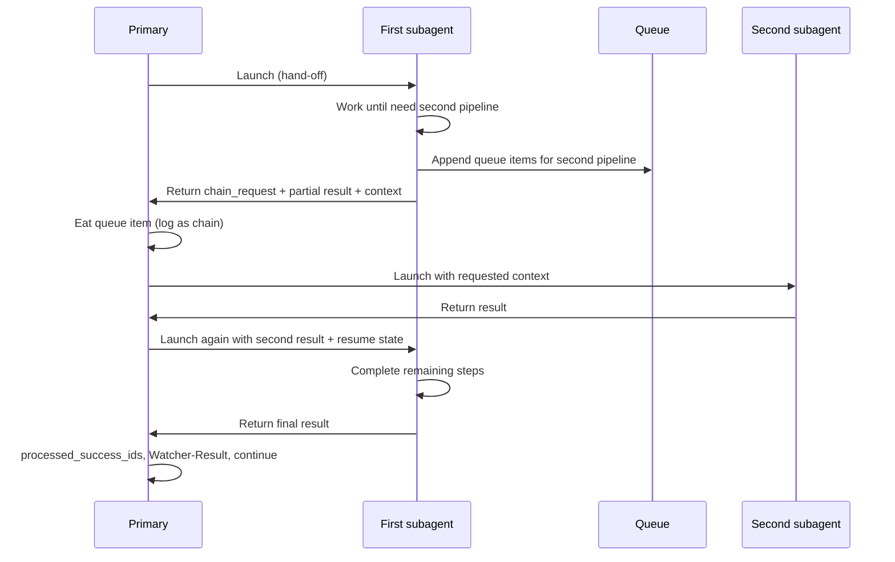

# Subagent chaining and mode underscore migration

## Scope

1. **Phase 1 — Underscore migration**: Replace all hyphenated and space-bearing mode strings with underscores so that hyphens can be reserved exclusively for chain segments (e.g. `RESUME_ROADMAP-RESEARCH-INGEST`).
2. **Phase 2 — Chaining contract**: Document and implement the rule that subagents never run another pipeline; they create queue items, return a “chain request” to the primary, and the primary runs the requested subagent(s) then re-launches the first subagent with results.
3. **Phase 3 — Chain mode syntax**: Extend the alias table and queue processor so that chained commands like `RESUME_ROADMAP-RESEARCH` and `RESUME_ROADMAP-RESEARCH-INGEST` are supported and executed in the correct order.

---

## Phase 1: Mode name migration (hyphen/space → underscore)

**Goal:** All canonical modes and aliases use underscores only. Hyphens are used only as separators in chain modes (Phase 3).

**Canonical mode renames (prompt-queue and Task-Queue):**


| Current                | New                                  |
| ---------------------- | ------------------------------------ |
| INGEST MODE            | INGEST_MODE                          |
| ROADMAP MODE           | ROADMAP_MODE                         |
| RESUME-ROADMAP         | RESUME_ROADMAP                       |
| DISTILL MODE           | DISTILL_MODE                         |
| EXPRESS MODE           | EXPRESS_MODE                         |
| ARCHIVE MODE           | ARCHIVE_MODE                         |
| ORGANIZE MODE          | ORGANIZE_MODE                        |
| RESEARCH-AGENT         | RESEARCH_AGENT                       |
| NORMALIZE-MASTER-GOAL  | NORMALIZE_MASTER_GOAL                |
| FORCE-WRAPPER          | FORCE_WRAPPER                        |
| SCOPING MODE / SCOPING | SCOPING_MODE                         |
| AUDIT-CONTEXT          | AUDIT_CONTEXT                        |
| SEEDED-ENHANCE         | SEEDED_ENHANCE                       |
| BATCH-DISTILL          | BATCH_DISTILL                        |
| BATCH-EXPRESS          | BATCH_EXPRESS                        |
| ASYNC-LOOP             | ASYNC_LOOP                           |
| NAME-REVIEW            | NAME_REVIEW                          |
| GARDEN-REVIEW          | GARDEN_REVIEW                        |
| CURATE-CLUSTER         | CURATE_CLUSTER                       |
| TASK-ROADMAP           | TASK_ROADMAP                         |
| TASK-COMPLETE          | TASK_COMPLETE                        |
| ADD-ROADMAP-ITEM       | ADD_ROADMAP_ITEM                     |
| EXPAND-ROAD            | EXPAND_ROAD (alias → RESUME_ROADMAP) |
| REORDER-ROADMAP        | REORDER_ROADMAP                      |
| DUPLICATE-ROADMAP      | DUPLICATE_ROADMAP                    |
| MERGE-ROADMAPS         | MERGE_ROADMAPS                       |
| EXPORT-ROADMAP         | EXPORT_ROADMAP                       |
| PROGRESS-REPORT        | PROGRESS_REPORT                      |
| TASK-TO-PLAN-PROMPT    | TASK_TO_PLAN_PROMPT                  |
| ROADMAP-ONE-SHOT       | ROADMAP_ONE_SHOT                     |


**Alias normalization (already mapped to a canonical mode):** RECAL-ROAD, REVERT-PHASE, SYNC-PHASE-OUTPUTS, HANDOFF-AUDIT, RESUME-FROM-LAST-SAFE, EXPAND-ROAD, DEEPEN-AGGRESSIVE, RESEARCH-GAPS → normalize to `RESUME_ROADMAP` or `RESEARCH_AGENT` with appropriate `params`; the **canonical** mode string in the queue file and in code is the underscored form (RESUME_ROADMAP, RESEARCH_AGENT). Trigger phrases and alias table still list “what you say” but map to the new canonical names.

**Key files to update:**

- [3-Resources/Second-Brain/Queue-Sources.md](3-Resources/Second-Brain/Queue-Sources.md) — All mode lists, examples, “Remove stale on RESUME-ROADMAP” → RESUME_ROADMAP, routing table.
- [3-Resources/Second-Brain/Queue-Alias-Table.md](3-Resources/Second-Brain/Queue-Alias-Table.md) — Canonical mode column and alias → mode mapping.
- [.cursor/rules/agents/queue.mdc](.cursor/rules/agents/queue.mdc) — Canonical order (A.4), mode → subagent_type table (A.5), roadmap normalization (RECAL-ROAD etc. → RESUME_ROADMAP), “Remove stale” semantics (A.7, CHECK_WRAPPERS), bootstrap and context-tracking.
- [.cursor/rules/context/auto-eat-queue.mdc](.cursor/rules/context/auto-eat-queue.mdc) — CHECK_WRAPPERS mode string (INGEST MODE → INGEST_MODE), Step 8 CHECK_WRAPPERS entry format, dispatch table, any mode checks.
- [.cursor/rules/context/auto-queue-processor.mdc](.cursor/rules/context/auto-queue-processor.mdc) — Task-Queue modes (TASK-ROADMAP → TASK_ROADMAP, etc.).
- [.cursor/rules/context/plan-mode-prompt-crafter.mdc](.cursor/rules/context/plan-mode-prompt-crafter.mdc) — “Remove stale” condition `parsed.mode === "RESUME-ROADMAP"` → `RESUME_ROADMAP`; routing table (Task-Queue vs prompt-queue) mode list; any emitted mode strings.
- [.cursor/rules/always/dispatcher.mdc](.cursor/rules/always/dispatcher.mdc) — Any mode or trigger phrases.
- [.cursor/rules/always/system-funnels.mdc](.cursor/rules/always/system-funnels.mdc) — Mode names in trigger list.
- All [.cursor/rules/agents/*.mdc](.cursor/rules/agents/) and [.cursor/rules/legacy-agents/*.mdc](.cursor/rules/legacy-agents/) — Ingest CHECK_WRAPPERS `"INGEST MODE"` → `INGEST_MODE`; any “RESUME-ROADMAP”, “ROADMAP MODE”, “RESEARCH-AGENT”, etc.
- [3-Resources/Second-Brain/User-Questions-and-Options-Reference.md](3-Resources/Second-Brain/User-Questions-and-Options-Reference.md) — Mode options and payload mapping (RESUME-ROADMAP, ROADMAP MODE, etc.).
- [3-Resources/Second-Brain/Prompt-Crafter-Param-Table.md](3-Resources/Second-Brain/Prompt-Crafter-Param-Table.md) — Mode references.
- [3-Resources/Second-Brain/Parameters.md](3-Resources/Second-Brain/Parameters.md) — Queue mode / RESUME_ROADMAP params references.
- [3-Resources/Second-Brain/Cursor-Skill-Pipelines-Reference.md](3-Resources/Second-Brain/Cursor-Skill-Pipelines-Reference.md) — Mode → pipeline table.
- [3-Resources/Second-Brain/Pipelines.md](3-Resources/Second-Brain/Pipelines.md) — Mode lists.
- [3-Resources/Second-Brain/Triggers-Quick-Reference.md](3-Resources/Second-Brain/Triggers-Quick-Reference.md) — Mode strings.
- [.cursor/agents/*.md](.cursor/agents/) — Descriptions and mode references.
- [3-Resources/Second-Brain/Subagent-Safety-Contract.md](3-Resources/Second-Brain/Subagent-Safety-Contract.md) — No mode list today; add note that queue mode names use underscores (chain format in Phase 3).
- Docs under `3-Resources/Second-Brain/Docs/` — Queue-Pipeline, EAT-QUEUE-Flow, Subagent-List, etc.
- Sync copies under `.cursor/sync/` — Mirror all rule/skill changes.
- Tests: [3-Resources/Second-Brain/tests/sb_contracts/queue.py](3-Resources/Second-Brain/tests/sb_contracts/queue.py) if it asserts on mode strings.

**Backwards compatibility:** Existing queue files (`.technical/prompt-queue.jsonl`) and Task-Queue.md may contain old mode strings. Queue processor should **normalize on read**: when parsing, map known old forms (e.g. `RESUME-ROADMAP`, `INGEST MODE`) to the new canonical name so one migration pass can be done without breaking in-flight queue files. Document in Queue-Sources that “legacy mode names are normalized to underscored form at read time” and list the mapping; after a transition period, support for legacy names can be removed.

---

## Phase 2: Subagent chaining contract and flow

**Chaining rule (one-line summary):** Subagents never call other subagents. They append queue entries + return chain_request. Primary continues eating queue, runs dependencies, then re-launches original subagent with results + resume flag. One logical chain = one Watcher-Result group via chain_id. (Add this at the top of the “Subagent chaining” section in Subagent-Safety-Contract.md or Subagent-Chain-Contract.md.)

**Rule (Cursor limitation):** No subagent ever runs another pipeline or “calls” another subagent. If it needs work from another pipeline, it (1) creates the queue items that will produce the required results, (2) pauses and returns a **chain request** to the primary with current pipeline results up to the request and requested context, (3) primary runs the requested subagent(s), (4) primary re-launches the first subagent with the second agent’s results so it can complete its steps, (5) primary continues execution (clear entry, Watcher-Result, next entry).

**Flow (mermaid):**




**chain_request schema (authoritative)**

Define the exact contract so subagents and primary stay in sync. Add to [3-Resources/Second-Brain/Subagent-Safety-Contract.md](3-Resources/Second-Brain/Subagent-Safety-Contract.md) (or a dedicated [3-Resources/Second-Brain/Subagent-Chain-Contract.md](3-Resources/Second-Brain/Subagent-Chain-Contract.md)):

```yaml
chain_request:
  type: object
  properties:
    requested_pipelines: array of strings   # e.g. ["RESEARCH_AGENT", "INGEST_MODE"]; ordered list to run
    context: object                         # arbitrary JSON-safe data to pass forward (project_id, linked_phase, params, etc.)
    partial_result: string | object          # summary or structured data for resume (roadmap state up to request, etc.)
    queue_items_appended: boolean | array   # true = subagent already wrote queue lines; array = optional ids of appended entries
  required: [requested_pipelines, context]
```

**Primary parsing rules:** Primary MUST treat `requested_pipelines` as the **ordered list of dependencies** to run; it does not rely on `queue_items_appended` for *what* to run. If `queue_items_appended` is true, primary assumes the subagent already wrote the corresponding lines to `.technical/prompt-queue.jsonl` and **continues eating from the current position** (next entries in queue are those appended). Otherwise primary can synthetically dispatch using `context` (build hand-offs and call the Task tool for each requested pipeline in order). Preferred path: subagents append real queue entries (see “Preferred implementation” below).

---

**Contract and implementation:**

1. **Subagent-Safety-Contract** ([3-Resources/Second-Brain/Subagent-Safety-Contract.md](3-Resources/Second-Brain/Subagent-Safety-Contract.md))
  - Add section **“Subagent chaining”** with the **one-line summary at the top** (see Phase 2 opening), then the **chain_request schema** (or reference Subagent-Chain-Contract.md).
  - Rule: No subagent invokes another pipeline or subagent. If it needs work from another pipeline, it MUST: (a) append the necessary queue line(s) to `.technical/prompt-queue.jsonl` so the required results will be produced, (b) pause and return to the primary with a **chain_request** conforming to the schema, (c) not assume the other pipeline runs in the same process.
  - Primary is the only actor that launches subagents. On receiving a chain_request, primary runs the requested pipelines (in order per `requested_pipelines`), then re-invokes the **first** subagent with a hand-off that includes all collected results and `resume_from_chain_request: true` so the first agent can complete.
  - Extend **return format** in the hand-off template: in addition to summary, Decision Wrapper, and Success/failure, the subagent MAY return a **chain_request** object. Primary MUST interpret it and run the chaining flow instead of treating the run as “done.”
2. **Preferred implementation (Option A — canonical):** Subagents append **real** queue entries to `.technical/prompt-queue.jsonl`. Primary does **not** synthetic-dispatch. On chain_request: primary **continues normal queue eating** (next entries in the file are the ones the first subagent appended); after each of those entries is processed and their subagents return, primary **re-dispatches the original chain entry** to the **first** subagent with a hand-off containing **all collected results** from the dependency runs and a **resume_from_chain_request: true** flag. Only after the first subagent’s **second** return does primary add the original entry’s id to processed_success_ids and clear at A.7. This leverages existing queue machinery and avoids synthetic-dispatch complexity.
3. **Queue processor** ([.cursor/rules/agents/queue.mdc](.cursor/rules/agents/queue.mdc))
  - **A.5 (Dispatch):** When the Task tool returns and the return includes a **chain_request**:
    - Do **not** add the current entry’s `id` to `processed_success_ids` yet.
    - Store the original entry and the first subagent’s identity for re-dispatch. If `queue_items_appended === true`, **continue the loop** (re-read queue if needed so newly appended lines are visible) and process the **next** queue entry(ies) — these are the dependency pipeline(s). Collect each dependency’s return. When all dependencies for this chain have completed, **re-dispatch the original entry** to the **first** subagent via the Task tool with a hand-off that includes: original queue entry, `resume_from_chain_request: true`, and **all collected results** from the dependency subagent(s). After the first subagent’s second return, add the original entry’s id to processed_success_ids and proceed to A.6/A.7.
  - Document: “On chain_request, primary processes the appended queue entries (in order), then re-invokes the first subagent with hand-off containing the second agent’s result and resume_from_chain_request: true; only after the first subagent’s second return does primary add the original entry id to processed_success_ids and clear at A.7.”
4. **Idempotency / duplicate prevention:** If a subagent crashes mid-chain and the queue entry is re-processed, it might append duplicate dependency entries (e.g. RESEARCH_AGENT again). Add to the Phase 2 contract: **Subagents SHOULD append queue items with a unique idempotency key** (e.g. in params or a dedicated field: `idempotency_key: "<original_entry_id>-research-pre-deepen"`). The queue processor **deduplicates on read** for the current logical run: if an entry’s idempotency_key matches one that was already processed in this run (or that is already in processed_success_ids for this chain), skip or merge instead of running again. Document in Queue-Sources and queue.mdc A.2/A.3 so implementers apply it consistently.
5. **Watcher-Result chain visibility — chain_id and segment format:** For a chained run, Watcher-Result gets one line per queue entry; to group them as one logical request, extend the line format with optional **chain_id** and **segment**. Define in [always/watcher-result-append.mdc](.cursor/rules/always/watcher-result-append.mdc) and in the plan:
  - **chain_id** = the **original queue entry id** (the one that triggered the chain).
  - **segment** = the **mode of the current entry being processed** (e.g. RESEARCH_AGENT, INGEST_MODE, RESUME_ROADMAP).
  - Example line: `requestId: abc123 | chain_id: queue-456 | segment: RESEARCH_AGENT | status: success | message: "..." | trace: "" | completed: <ISO8601>`
   When the current entry is part of a chain (original chain entry or an appended dependency), primary appends a Watcher-Result line that includes `chain_id: <original_entry_id>` and `segment: <mode_of_this_entry>`. Parsers and UIs group lines by chain_id for a single logical request.
6. **Roadmap subagent** ([.cursor/rules/agents/roadmap.mdc](.cursor/rules/agents/roadmap.mdc))
  - **Remove** “call research-agent-run **inline**” (pre-deepen research). Replace with:
    - When research is enabled (same conditions as today): (1) Append one or more queue entries so the required work will happen: e.g. append RESEARCH_AGENT with `project_id`, `linked_phase`, `params`; if research results must be ingested before roadmap uses them, append INGEST_MODE for each expected new note (or one INGEST_MODE and document that Research will append INGEST_MODE per note). (2) Return to primary with **chain_request** per schema: `requested_pipelines: ["RESEARCH_AGENT"]` (and `["RESEARCH_AGENT", "INGEST_MODE"]` if ingest was appended), context (project_id, linked_phase, params, source_file), partial_result (roadmap state up to “need research”), queue_items_appended: true. (3) Do **not** run research-agent-run inside the Roadmap subagent.
  - Primary will then run the RESEARCH_AGENT entry (and any INGEST_MODE entries), then re-launch Roadmap with hand-off that includes research results (paths, summaries) so Roadmap can run roadmap-deepen with injected_research_summary / injected_research_paths and complete.
7. **Subagent-Safety-Contract “Queue clearing”** — Unchanged: only primary removes processed entries. For a chained run, the “processed” entry is the **original** chain entry; it is only added to processed_success_ids after the first subagent has been re-invoked and has returned successfully the second time.
8. **Funnel to queue:** All cross-pipeline requests go through the queue. Subagents never call another pipeline directly; they only append lines and return chain_request. Primary is the single point of entry for launching any subagent.

**Files to add/change for Phase 2:**

- [3-Resources/Second-Brain/Subagent-Safety-Contract.md](3-Resources/Second-Brain/Subagent-Safety-Contract.md) — New “Subagent chaining” section; chain_request schema (or reference Subagent-Chain-Contract); extended return format (chain_request).
- **New (optional):** [3-Resources/Second-Brain/Subagent-Chain-Contract.md](3-Resources/Second-Brain/Subagent-Chain-Contract.md) — Dedicated doc for chain_request schema, primary parsing rules, idempotency, and Watcher-Result chain_id/segment format; Subagent-Safety-Contract can reference it.
- [.cursor/rules/agents/queue.mdc](.cursor/rules/agents/queue.mdc) — A.5: handle chain_request (Option A: continue eating appended entries, then re-dispatch first with results + resume_from_chain_request: true); A.2/A.3: idempotency_key dedup for current logical run.
- [.cursor/rules/agents/roadmap.mdc](.cursor/rules/agents/roadmap.mdc) — Pre-deepen: stop calling research-agent-run inline; append RESEARCH_AGENT (and INGEST_MODE as needed), return chain_request.
- [.cursor/rules/legacy-agents/roadmap.mdc](.cursor/rules/legacy-agents/roadmap.mdc) — Same as roadmap.mdc.
- [.cursor/rules/agents/research.mdc](.cursor/rules/agents/research.mdc) / [.cursor/rules/legacy-agents/research.mdc](.cursor/rules/legacy-agents/research.mdc) — Note that pre-deepen is now handled by chain (Roadmap returns chain_request; primary runs Research); ResearchSubagent still handles standalone RESEARCH_AGENT queue entries.
- [.cursor/rules/always/watcher-result-append.mdc](.cursor/rules/always/watcher-result-append.mdc) — Watcher-Result format: when entry is part of a chain, include optional chain_id and segment (see “Watcher-Result chain visibility” above).
- [3-Resources/Second-Brain/Subagent-Queue-Contract-Audit.md](3-Resources/Second-Brain/Subagent-Queue-Contract-Audit.md) — Optional: short note on chaining (primary runs second agent then re-launches first; queue items from first agent are part of same logical run).

---

## Phase 3: Chain mode alias syntax and processor

**Status:** Phase 3 is **optional / deferred** until Phase 2 is rock-solid. Chain parsing and expansion in the queue processor add another layer of logic that must be bullet-proof; if chain parsing fails silently, execution order can break. If Phase 3 is implemented before Phase 2 is fully validated, **limit initial support to two-segment chains only** (primary + one dependency), e.g. `RESUME_ROADMAP-RESEARCH`. Parsing is then trivial: `split('-')` → `[primary, dep]`. Multi-segment chains (e.g. RESUME_ROADMAP-RESEARCH-INGEST) can be added later once two-segment chains are stable.

**Goal:** Support user- and crafter-facing commands that express a chain: run dependency pipeline(s) then the primary pipeline. Hyphen separates segments; first segment is the primary mode; remaining segments are dependency pipeline names run in order before the primary.

**Format:** `PRIMARY_CHAIN-DEP1-DEP2-...`  
Examples:

- `RESUME_ROADMAP-RESEARCH` — Run RESEARCH_AGENT, then RESUME_ROADMAP (with research results in hand-off).
- `RESUME_ROADMAP-RESEARCH-INGEST` — Run RESEARCH_AGENT, then INGEST_MODE (e.g. for each new research note), then RESUME_ROADMAP (with research + ingest context).

**Semantics:** When the queue processor sees a mode string that contains a hyphen, parse it as a chain: split on hyphen; first token = primary mode (RESUME_ROADMAP); remaining tokens = dependency pipeline modes in execution order (RESEARCH, INGEST). Execution: for each dependency in order, dispatch that pipeline (with same source_file/params as the chain entry); collect results; then dispatch the primary pipeline with a hand-off that includes the collected results. The single queue entry is then cleared after the primary completes (one id in processed_success_ids).

**Implementation:**

1. **Queue-Sources** — New subsection “Chain modes”: format `PRIMARY_CHAIN-DEP1-DEP2`, examples, execution order (DEP1 → DEP2 → PRIMARY). List allowed segment names (RESUME_ROADMAP, RESEARCH_AGENT, INGEST_MODE, etc.).
2. **Queue-Alias-Table** — New table or rows: trigger phrases and canonical chain modes:
  - “Resume roadmap with research”, `RESUME_ROADMAP-RESEARCH` → chain: RESEARCH_AGENT then RESUME_ROADMAP.
  - “Resume roadmap with research and ingest”, `RESUME_ROADMAP-RESEARCH-INGEST` → chain: RESEARCH_AGENT, INGEST_MODE, RESUME_ROADMAP.
3. **Queue rule (queue.mdc)** — In A.2/A.4/A.5: when `mode` contains a hyphen, parse as chain; normalize to internal representation (primary + deps). In A.5: for a chain entry, (1) for each dep in order, build hand-off and call the Task tool for that subagent (reuse source_file/params from chain entry); (2) collect each return; (3) build hand-off for primary that includes all dep results; (4) call the Task tool for primary; (5) on success, add chain entry’s id to processed_success_ids. No need to “append” queue lines for deps — the chain entry itself encodes the sequence; primary expands it into multiple Task-tool calls.
4. **Prompt crafter** — If the crafter offers “Resume roadmap” and “with research” / “with research and ingest”, emit mode `RESUME_ROADMAP-RESEARCH` or `RESUME_ROADMAP-RESEARCH-INGEST`; otherwise leave crafter mode list as single-segment modes only and add chain modes as optional advanced options in User-Questions or Queue-Alias-Table.

**Files for Phase 3:**

- [3-Resources/Second-Brain/Queue-Sources.md](3-Resources/Second-Brain/Queue-Sources.md) — Chain mode format, examples, execution order.
- [3-Resources/Second-Brain/Queue-Alias-Table.md](3-Resources/Second-Brain/Queue-Alias-Table.md) — Chain command aliases (RESUME_ROADMAP-RESEARCH, RESUME_ROADMAP-RESEARCH-INGEST).
- [.cursor/rules/agents/queue.mdc](.cursor/rules/agents/queue.mdc) — Parse chain mode; dispatch deps in order then primary; single processed_success_ids for the chain entry.
- [.cursor/rules/always/system-funnels.mdc](.cursor/rules/always/system-funnels.mdc) — If trigger phrases for chain commands are added, list them.
- Sync and docs: Queue-Pipeline, EAT-QUEUE-Flow, Triggers-Quick-Reference.

---

## Order of execution

1. **Phase 1** (underscore migration): Rename all mode strings and alias normalizations; update all referenced files and sync copies; add read-time normalization for legacy mode names in queue processor.
2. **Phase 2** (chaining contract): Subagent-Safety-Contract “Subagent chaining” and return format; queue.mdc chain_request handling; roadmap.mdc (and legacy) switch to “append queue + return chain_request” instead of inline research-agent-run.
3. **Phase 3** (chain mode syntax): Queue-Sources and Queue-Alias-Table chain format; queue.mdc parse and expand chain mode (deps then primary); optional crafter/trigger additions.

---

## Testing and validation

- After Phase 1: Run EAT-QUEUE with a queue file containing both old and new mode strings; confirm normalization and dispatch.
- After Phase 2: Run RESUME_ROADMAP with enable_research; confirm Roadmap appends RESEARCH_AGENT (and optional INGEST_MODE), returns chain_request; primary runs Research then re-launches Roadmap with results.
- After Phase 3: Enqueue RESUME_ROADMAP-RESEARCH and RESUME_ROADMAP-RESEARCH-INGEST; confirm execution order and that a single queue entry is cleared after the full chain.

---

## Notes

- **Backups and logs:** Existing backup and log files (e.g. workflow_state, roadmap-state, Ingest-Log) may contain old mode strings; optional one-time doc note that “mode” in logs may be legacy; new writes use underscored modes.
- **Watcher / Commander:** If they append fixed mode strings, update to underscored (and optionally chain) modes per Queue-Alias-Table.
- **Second-Brain-Starter-Kit:** If it duplicates Queue-Sources or alias table, update in sync or document as reference-only.

 optionally chain) modes per Queue-Alias-Table.

- **Second-Brain-Starter-Kit:** If it duplicates Queue-Sources or alias table, update in sync or document as reference-only.

