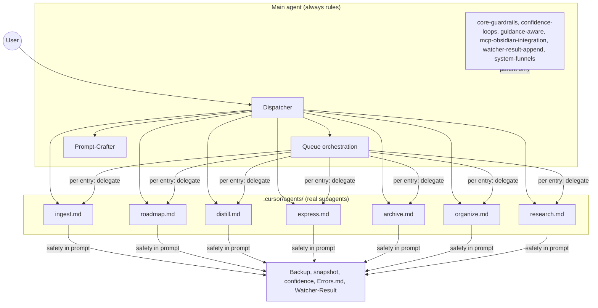

# SUBAGENT MIGRATION PLAN – Second Brain Vault

Migrate from rule-based pipeline "subagents" to **official Cursor subagents** ([https://cursor.com/docs/subagents](https://cursor.com/docs/subagents)): each major pipeline becomes a `.cursor/agents/*.md` file with YAML frontmatter and prompt body, runs in its own context window, and returns a summary to the parent. Queue orchestration stays in the main agent; the main agent delegates execution to pipeline subagents per entry.

---

## 1. High-level architecture




**Design decisions**

- **No nested subagents:** Cursor does not support subagents launching subagents. Therefore the **queue processor does not become a subagent**. It remains in the **main agent**: Step 0 (always-check wrappers), read/parse/validate/order `.technical/prompt-queue.jsonl` (or Task-Queue.md), then **for each entry** the main agent **delegates** to the appropriate pipeline subagent (ingest, roadmap, distill, etc.) with a prompt that includes the queue entry and the safety contract. After each subagent returns, the main agent continues (log Watcher-Result, clear/tag queue, next entry).
- **Shared safety:** Always rules (core-guardrails, mcp-obsidian-integration, confidence-loops, watcher-result-append, etc.) apply only to the **main** agent. Subagents run in a **clean context**; they do not auto-load those rules. So each subagent’s **prompt body** (and/or the **delegation prompt** from the parent) must include an explicit **safety contract**: backup before destructive steps, per-change snapshot when confidence ≥85%, confidence bands, Error Handling Protocol, Watcher-Result one-line append when `requestId` is provided. Option: one shared doc (e.g. `3-Resources/Second-Brain/Subagent-Safety-Contract.md`) that subagent prompts reference and the parent can paste key bullets into the delegation prompt.
- **Stateful artifacts:** `roadmap-state.md` and `workflow_state.md` live under `1-Projects/<project_id>/Roadmap/`. Only the **Roadmap subagent** reads/writes them. The main agent does not hold roadmap state; it passes `project_id`, `params`, and `source_file` in the delegation prompt. Same for queue file and Task-Queue: only the **main agent** reads/writes those; subagents receive the single-entry payload and optional `requestId` for Watcher-Result.

---

## 2. File-by-file migration plan

### 2.1 New files to create (real subagents)


| New file                                                 | Purpose                                                    | State files owned                                               | Source of content                                                                                                                                                                            |
| -------------------------------------------------------- | ---------------------------------------------------------- | --------------------------------------------------------------- | -------------------------------------------------------------------------------------------------------------------------------------------------------------------------------------------- |
| [.cursor/agents/ingest.md](.cursor/agents/ingest.md)     | Ingest pipeline in isolated context                        | None                                                            | Condense [.cursor/rules/agents/ingest.mdc](.cursor/rules/agents/ingest.mdc) + non-MD handling, Phase 1/2, apply-mode; add inline safety contract or reference to Subagent-Safety-Contract.md |
| [.cursor/agents/roadmap.md](.cursor/agents/roadmap.md)   | ROADMAP MODE (setup) + RESUME-ROADMAP (one action per run) | `1-Projects/<id>/Roadmap/roadmap-state.md`, `workflow_state.md` | Condense [.cursor/rules/agents/roadmap.mdc](.cursor/rules/agents/roadmap.mdc); keep params merge, action branching, roadmap-state/workflow_state read/write, snapshot-before/after state     |
| [.cursor/agents/distill.md](.cursor/agents/distill.md)   | Autonomous-distill pipeline                                | None                                                            | Condense [.cursor/rules/agents/distill.mdc](.cursor/rules/agents/distill.mdc); layers, highlight, layer-promote, confidence bands, Decision Wrappers                                         |
| [.cursor/agents/express.md](.cursor/agents/express.md)   | Autonomous-express pipeline                                | None                                                            | Condense [.cursor/rules/agents/express.mdc](.cursor/rules/agents/express.mdc); related-content-pull, mini-outline, version-snapshot, CTA                                                     |
| [.cursor/agents/archive.md](.cursor/agents/archive.md)   | Autonomous-archive pipeline                                | None                                                            | Condense [.cursor/rules/agents/archive.mdc](.cursor/rules/agents/archive.mdc); archive-check, resurface-candidate-mark, summary-preserve, ghost-folder sweep                                 |
| [.cursor/agents/organize.md](.cursor/agents/organize.md) | Autonomous-organize pipeline                               | None                                                            | Condense [.cursor/rules/agents/organize.mdc](.cursor/rules/agents/organize.mdc); classify, subfolder-organize, name-enhance, confidence bands                                                |
| [.cursor/agents/research.md](.cursor/agents/research.md) | RESEARCH-AGENT queue mode only                             | None                                                            | Condense [.cursor/rules/agents/research.mdc](.cursor/rules/agents/research.mdc); project_id + linked_phase, research-agent-run, queue INGEST/DISTILL, Errors backstop                        |


**Format (each subagent):** YAML frontmatter per Cursor docs:

- `name`: lowercase-with-hyphens (e.g. `ingest`, `roadmap`, `distill`, `express`, `archive`, `organize`, `research`)
- `description`: When to use this subagent (used by Agent for automatic delegation and for `/name` invocation). Be specific so the main agent and Cursor can match queue `mode` and direct triggers.
- `model`: `inherit` (default) or `fast` for research/verification-heavy runs if desired
- `background: false` — set explicitly so delegation is foreground (wait for result); avoids ambiguity with Cursor defaults.
- Optional: `readonly: false`

Then the **body** of the file: concise pipeline steps, skill references, and the **safety contract** (backup, per-change snapshot, confidence bands, Errors.md, Watcher-Result). Keep prompts focused; long procedural text can live in `3-Resources/Second-Brain/` and be referenced by path in the subagent body.

### 2.2 What moves from rules into each subagent

- **From** [.cursor/rules/agents/ingest.mdc](.cursor/rules/agents/ingest.mdc) **into** `.cursor/agents/ingest.md`: Full flow (list Ingest, non-MD handling, embedded image normalization, Phase 1 full-autonomous-ingest, Phase 2 apply-mode), Decision Wrapper creation, Cursor-agent direct move conditions, CHECK_WRAPPERS append. Omit “Depends on always rules”; replace with inline safety contract in the prompt.
- **From** [.cursor/rules/agents/roadmap.mdc](.cursor/rules/agents/roadmap.mdc) **into** `.cursor/agents/roadmap.md`: ROADMAP MODE setup (Phase 0, roadmap-state, workflow_state, roadmap-generate-from-outline), RESUME-ROADMAP branch by action (deepen, recal, revert-phase, sync-outputs, handoff-audit, advance-phase, expand, etc.), smart dispatch, pre-deepen research (util-based, gap-aware), context-tracking postcondition, persona. State read/write and snapshot-before/after state updates stay in this subagent.
- **From** [.cursor/rules/agents/distill.mdc](.cursor/rules/agents/distill.mdc) **into** `.cursor/agents/distill.md`: Pipeline steps (backup, auto-layer-select, distill layers, distill-highlight-color, layer-promote, distill-perspective-refine, callout-tldr-wrap, readability-flag), confidence bands, mid/low Decision Wrappers, loop logging.
- **From** [.cursor/rules/agents/express.mdc](.cursor/rules/agents/express.mdc) **into** `.cursor/agents/express.md**: Version-snapshot, related-content-pull, research-scope (PMG), express-mini-outline, express-view-layer, call-to-action-append, confidence bands, Decision Wrappers.
- **From** [.cursor/rules/agents/archive.mdc](.cursor/rules/agents/archive.mdc) **into** `.cursor/agents/archive.md**: archive-check, mid/low bands, resurface-candidate-mark, summary-preserve, move, post-move frontmatter, ghost-folder sweep.
- **From** [.cursor/rules/agents/organize.mdc](.cursor/rules/agents/organize.mdc) **into** `.cursor/agents/organize.md**: Classify, frontmatter-enrich, subfolder-organize, name-enhance, confidence bands, Decision Wrappers.
- **From** [.cursor/rules/agents/research.mdc](.cursor/rules/agents/research.mdc) **into** `.cursor/agents/research.md**: RESEARCH-AGENT flow only (resolve project_id + linked_phase, research-agent-run, queue INGEST/DISTILL, caller backstop for 0 notes, Watcher-Result).

### 2.3 What stays in always/ (main agent only)

- [.cursor/rules/always/core-guardrails.mdc](.cursor/rules/always/core-guardrails.mdc) — Persona, PARA, confidence bands, MCP & filesystem safety, exclusions, Error Handling Protocol.
- [.cursor/rules/always/confidence-loops.mdc](.cursor/rules/always/confidence-loops.mdc) — Loop invariants, decay rule, loop logging fields.
- [.cursor/rules/always/guidance-aware.mdc](.cursor/rules/always/guidance-aware.mdc) — user_guidance / prompt loading, guidance_conf_boost.
- [.cursor/rules/always/mcp-obsidian-integration.mdc](.cursor/rules/always/mcp-obsidian-integration.mdc) — Backup/snapshot/dry_run, post-move frontmatter, Error Handling Protocol, roadmap state invariants.
- [.cursor/rules/always/watcher-result-append.mdc](.cursor/rules/always/watcher-result-append.mdc) — Watcher-Result line format and when to append.
- [.cursor/rules/always/system-funnels.mdc](.cursor/rules/always/system-funnels.mdc) — Prompt-Crafter vs manual/advanced, trigger→pipeline mapping (updated to “delegate to subagent X”).
- [.cursor/rules/always/dispatcher.mdc](.cursor/rules/always/dispatcher.mdc) — Routing: EAT-QUEUE / PROCESS TASK QUEUE → run queue orchestration in main agent; other triggers → delegate to the corresponding subagent.
- [.cursor/rules/context/plan-mode-prompt-crafter.mdc](.cursor/rules/context/plan-mode-prompt-crafter.mdc) — Unchanged; no subagent.
- [.cursor/rules/context/auto-eat-queue.mdc](.cursor/rules/context/auto-eat-queue.mdc) — Becomes the **reference** for queue orchestration logic that lives in the **main agent** (Step 0, read, parse, validate, dedup, order, **delegate per entry**, Watcher-Result, clear/tag). Either the main agent’s dispatcher/queue logic is expanded inline in a new always/ or context rule, or the main agent is instructed to “follow auto-eat-queue flow but delegate pipeline execution to subagents.”

### 2.4 Stateful pieces (roadmap-state, workflow_state, queue files)

- **roadmap-state.md / workflow_state.md:** Read and written **only by the Roadmap subagent**. The main agent never mutates them. When dispatching a RESUME-ROADMAP or ROADMAP MODE entry, the main agent passes `project_id`, `source_file`, `params` (merged with Config/profile per existing rules), and optionally `requestId`. The Roadmap subagent loads state, runs the action, updates state (with snapshot-before/after per mcp-obsidian-integration), and returns a summary; the main agent then appends Watcher-Result and clears the queue entry.
- **.technical/prompt-queue.jsonl** and **3-Resources/Task-Queue.md:** Read and written **only by the main agent** (queue orchestration). Subagents never read or write the queue files. They receive one entry at a time via the delegation prompt and return a result; the main agent is responsible for re-read, merge, write (clear passed / tag failed) and for CHECK_WRAPPERS requeue semantics.

---

## 3. Delegation strategy

### 3.1 When the main agent delegates

- **Queue-driven:** After Step 0 and ordering, for each queue entry the main agent **delegates** to the subagent whose `name` matches the mode (e.g. `mode: "INGEST MODE"` → delegate to `ingest`; `mode: "RESUME-ROADMAP"` → delegate to `roadmap`). The delegation prompt includes: the queue entry (id, mode, source_file, params, prompt), and the **safety contract** (backup first, per-change snapshot when confidence ≥85%, confidence bands, log to Errors.md and pipeline log, append one line to Watcher-Result with `requestId: <entry.id>`, status, message, trace, completed).
- **Direct trigger:** When the user says “INGEST MODE”, “DISTILL MODE”, “Resume roadmap”, etc. (and it is not EAT-QUEUE / PROCESS TASK QUEUE), the dispatcher instructs the main agent to **delegate** to the corresponding subagent with a prompt that includes: scope (e.g. “current file”, “Ingest folder”, or a path), any relevant params, and the same safety contract. No queue entry id is needed unless the run is considered part of a queue run for Watcher-Result.

### 3.2 Description quality and automatic delegation

- Each subagent’s `description` should be specific so that Cursor’s automatic delegation (and the human-written dispatcher) can match:
  - Queue modes: e.g. “Run full-autonomous-ingest (Phase 1 propose + Decision Wrapper, or Phase 2 apply-mode). Use when mode is INGEST MODE or queue entry is ingest apply.”
  - Direct triggers: e.g. “Run autonomous-distill on a note or batch. Use when user says DISTILL MODE, distill this note, or queue mode is DISTILL MODE / BATCH-DISTILL.”
- Include phrases like “Use when” and “Use for” with the exact mode names and trigger phrases from [system-funnels.mdc](.cursor/rules/always/system-funnels.mdc) so the main agent (and Cursor) can reliably choose the right subagent.

### 3.3 Explicit `/name` syntax examples

- `/ingest process Ingest folder` — main agent invokes ingest subagent with scope “Ingest folder”.
- `/roadmap deepen for project genesis-mythos` — main agent invokes roadmap subagent with params.action deepen, project_id resolved.
- `/distill this note with lens beginner` — main agent invokes distill subagent with current file and distill_lens.
- `/queue` or **EAT-QUEUE** — main agent runs queue orchestration (no subagent for queue), then for each entry delegates to `/ingest`, `/roadmap`, etc. as above.

### 3.4 Parallelism – conservative start

- **Phase 1 (first 4–6 weeks):** Use **foreground / sequential delegation only**. Do **not** attempt parallel roadmap + anything else until: state consistency is proven rock-solid in sequential mode; there is a reliable way to serialize roadmap state updates across parallel calls (not yet possible without external locking).
- **Do not** parallelize queue processing: queue order is canonical (CHECK_WRAPPERS, then INGEST, then ROADMAP, etc.); process entries **sequentially** to avoid state races. Roadmap is extremely stateful — sequential deepen steps depend on previous state.
- **Future:** Parallelize only independent work (e.g. distill multiple unrelated notes, research + express on different projects). For "research + deepen": pre-deepen research runs **inside** the Roadmap subagent (same as today). RESEARCH-AGENT **queue mode** is the only case that uses the Research subagent.

---

## 4. Safety hand-off

### 4.1 Mandatory hand-off prompt structure

Subagents start with **no** parent conversation history. When the main agent delegates, it **MUST** use a consistent structured prompt prefix so context and safety are explicit. This template is the **single source of truth** for safety hand-off — copy-paste it into every delegation.

```
You are now the {subagent-name} subagent.
Task: {clear one-sentence goal}

Original request / queue entry: {full queue JSON or user prompt excerpt}

Critical invariants you MUST enforce:
• Always create backup + per-change snapshot before any destructive MCP action (move, rename, write, append, split, etc.)
• Respect confidence gates exactly as defined in Parameters.md
• Use shared Error Handling Protocol on failure
• Write to Watcher-Result.md in the exact one-line format with requestId
• For roadmap: read roadmap-state.md and workflow_state.md first; append log row before returning

Relevant state files (read them now):
{list of 2–5 most important paths, e.g. roadmap-state.md, Task-Queue.md, ...}

Vault layout reference: [[3-Resources/Second-Brain/Vault-Layout]]

Execute the task. Return only:
• One-paragraph summary of what you did
• Any new Decision Wrapper path or queue entry created
• Success / #review-needed / failure status
```

### 4.2 How each subagent enforces safety

- Subagents do **not** load always rules. So each subagent’s **prompt body** (and the **delegation prompt** from the parent) must state the **safety contract**:
  - **Backup:** Before any destructive operation, ensure backup (obsidian_ensure_backup or obsidian_create_backup). If backup fails, abort destructive steps for that note, log with #review-needed.
  - **Per-change snapshot:** Before move, rename, split, structural distill, append_to_hub, call obsidian-snapshot (or the MCP/skill equivalent) with type per-change when confidence ≥85%. If snapshot fails, skip the destructive action, log #review-needed.
  - **Confidence bands:** High (≥85%): allow destructive action after snapshot. Mid (68–84%): at most one non-destructive refinement loop; then snapshot + proceed only if post_loop_conf ≥85%; else Decision Wrapper. Low (<68%): no destructive action; create Decision Wrapper.
  - **Error Handling Protocol:** On failure, append to 3-Resources/Errors.md (heading, table, Trace, Summary), one-line ref in pipeline log, create error Decision Wrapper under Ingest/Decisions/Errors/ when appropriate.
  - **Watcher-Result:** When the delegation prompt includes `requestId`, append one line to 3-Resources/Watcher-Result.md: `requestId: <id> | status: success|failure | message: "..." | trace: "..." | completed: <ISO8601>`.
- Recommended: add a short **Subagent-Safety-Contract.md** under `3-Resources/Second-Brain/` with the above bullets; each subagent file can say “Obey the safety contract in 3-Resources/Second-Brain/Subagent-Safety-Contract.md” and the main agent can paste the same bullets (or a link) into the delegation prompt.

### 4.3 How the parent ensures Watcher-Result and queue processing

- **Watcher-Result:** The main agent is responsible for the **queue run** and for ensuring one line per processed entry. When it delegates to a subagent, it passes `requestId: <entry.id>`. The subagent’s contract is to append that one line before returning. The main agent can also append a fallback line if the subagent returns without appending (e.g. on timeout or error), using the subagent’s return message as `message` and `trace`.
- **Queue processing:** The main agent performs Step 0, read, parse, validate, dedup, order. It then iterates entries; for each, it delegates to the right subagent, waits for the result, appends Watcher-Result (if not already done by subagent), and continues. After all entries, it re-reads the queue file, removes processed_success_ids, adds back CHECK_WRAPPERS if approved_wrappers_remaining, writes back. Subagents never touch the queue file.

---

## 5. Testing and rollout plan

### 5.1 Step-by-step test suite

1. **Create .cursor/agents/ and one subagent (ingest)**
  Add [.cursor/agents/ingest.md](.cursor/agents/ingest.md) with frontmatter and body; add [3-Resources/Second-Brain/Subagent-Safety-Contract.md](3-Resources/Second-Brain/Subagent-Safety-Contract.md). Do **not** remove or change [.cursor/rules/agents/ingest.mdc](.cursor/rules/agents/ingest.mdc) yet.
2. **Dispatcher: direct trigger only**
  Update dispatcher (and system-funnels) so that “INGEST MODE” (and equivalent) **delegates** to the `ingest` subagent when the main agent chooses delegation. Keep a **fallback**: if the main agent does not delegate (e.g. Cursor doesn’t support subagents in this context), follow the existing rule and run ingest logic from agents/ingest.mdc. Test: “INGEST MODE” with one note in Ingest; confirm one run, backup/snapshot/move or wrapper as expected, Watcher-Result if applicable.
3. **Queue path for one mode**
  Update queue orchestration (in main agent) so that when the next entry to process is `mode: "INGEST MODE"`, the main agent **delegates** to the `ingest` subagent with the entry + requestId + safety contract. Test: EAT-QUEUE with a single INGEST MODE entry; confirm Step 0, one delegation, Watcher-Result line, queue entry cleared.
4. **Add remaining subagents one by one**
  roadmap → distill → express → archive → organize → research. After each: test direct trigger and one queue entry of that mode; confirm no regression.
5. **Integration**
  EAT-QUEUE with a short queue: e.g. CHECK_WRAPPERS (no-op), INGEST MODE, RESUME-ROADMAP. Confirm order, delegation to ingest then roadmap, two Watcher-Result lines, queue cleared correctly.
6. **Rollback path**
  If delegation fails or behavior regresses: in dispatcher and queue flow, **switch back** to “run pipeline from rule” (load agents/ingest.mdc etc. and execute in main context). Keep [.cursor/rules/agents/*.mdc](.cursor/rules/agents/) and [.cursor/rules/context/auto-eat-queue.mdc](.cursor/rules/context/auto-eat-queue.mdc) until the migration is validated.

### 5.2 Keeping old rules as fallback

- Leave all existing rules in place during migration. **Keep the old rules folder as `.cursor/rules/legacy-agents/`** during migration (move or copy from `.cursor/rules/agents/` so the dispatcher can fall back to rule-based execution). The dispatcher (or a small “delegation” flag in config) can choose: “delegate to subagent” vs “run pipeline from rule”. Once real subagents are stable, deprecate the legacy rules (e.g. move to `.cursor/rules/legacy-agents/` or remove references from dispatcher) and rely only on `.cursor/agents/*.md`.

### 5.3 Per-subagent smoke tests (run before widening scope)

Run these **before** widening scope to full batches or production queues:


| Subagent    | Smoke test                                                                                                                                                 |
| ----------- | ---------------------------------------------------------------------------------------------------------------------------------------------------------- |
| **ingest**  | Put a dummy note in Ingest/ → run `/ingest process` → confirm Decision Wrapper created and logged (or direct move if high confidence).                     |
| **roadmap** | On a test project that has roadmap-state → `/roadmap deepen` → confirm new workflow_state log row + RESUME-ROADMAP re-queued (when queue_next not false).  |
| **distill** | On a test note → `/distill lens beginner` → confirm TL;DR callout + highlights added.                                                                      |
| **queue**   | Add a single fake queue entry (e.g. INGEST MODE with one source_file) → EAT-QUEUE → confirm entry dispatched, Watcher-Result line appended, entry cleared. |


### 5.4 Fallback / rollback triggers

**Immediately revert to rule-based mode** (e.g. comment out or rename `.cursor/agents/*.md` so Cursor stops using them; route dispatcher to `.cursor/rules/legacy-agents/`) if **any** of these occur during testing:

- Watcher-Result line missing or malformed after queue dispatch.
- Roadmap state log row not appended after deepen/advance.
- Decision Wrapper not archived after apply (still under Ingest/Decisions/).
- Any MCP action executed without snapshot/backup (audit Backup-Log.md).
- Subagent returns empty or hallucinated path (e.g. non-existent note path).

Keep old rules as `.cursor/rules/legacy-agents/` during migration so rollback is a config/routing change, not a restore from backup.

---

## 6. Gotchas and vault-specific best practices

- **Roadmap state:** Only the Roadmap subagent mutates roadmap-state.md and workflow_state.md. Snapshot before and after every state update. If the Roadmap subagent fails mid-run, the main agent should not retry the same entry without re-reading state (or the subagent returns “blocked” and the main agent logs failure and leaves the entry for manual retry).
- **Decision Wrappers:** Creating wrappers (Ingest, Refinements, Low-Confidence, Roadmap-Decisions, Errors) and moving them to 4-Archives/Ingest-Decisions/ after apply is unchanged. Subagents that create or apply wrappers must do so with the same paths and frontmatter; the safety contract should mention “create Decision Wrapper under Ingest/Decisions/ when …” and “after apply, move wrapper to 4-Archives/Ingest-Decisions/ with ensure_structure and per-change snapshot.”
- **Ingest Phase 1 vs 2:** Phase 1 = propose + Decision Wrapper (no move/rename except Cursor-agent direct move). Phase 2 = apply-mode from approved wrapper. The Ingest subagent’s prompt must clearly distinguish: “If this run is triggered by an approved wrapper with hard_target_path, run apply-mode (move/rename after snapshot); else run Phase 1 (propose, create wrapper, append CHECK_WRAPPERS if needed).”
- **CHECK_WRAPPERS and Step 0:** Step 0 (always-check wrappers) runs in the **main agent** before any delegation. So approved wrappers are applied (or re-wrap/re-try handled) in the main context; only the “run pipeline for this one note” part is delegated. When the queue entry is CHECK_WRAPPERS, the main agent treats it as no-op (already done in Step 0) and removes it at clear.
- **RESUME-ROADMAP bootstrap:** When the queue has RESUME-ROADMAP but the project has no roadmap-state.md, the main agent (queue orchestration) should run the “bootstrap” logic: if a ROADMAP MODE entry for the same project_id exists in the same run’s queue and is not yet processed, dispatch that ROADMAP MODE entry first (by delegating to the roadmap subagent), then dispatch the RESUME-ROADMAP entry. Ordering already puts ROADMAP MODE before RESUME-ROADMAP; the main agent must not skip ROADMAP MODE when it appears earlier in the list.
- **Pre-deepen research:** Stays inside the Roadmap subagent (research-agent-run skill). The Research subagent is only for **standalone** RESEARCH-AGENT queue entries. Do not delegate from Roadmap subagent to Research subagent (nested subagents not supported).
- **GARDEN REVIEW / CURATE CLUSTER:** No subagent in this migration. Keep routing to [auto-garden-review.mdc](.cursor/rules/context/auto-garden-review.mdc) and [auto-curate-cluster.mdc](.cursor/rules/context/auto-curate-cluster.mdc) in the main agent.
- **Subagents cannot nest:** Cursor does not support sub-subagents today. The Roadmap subagent cannot delegate to the Research subagent; pre-deepen research runs inline via the research-agent-run skill.
- **Background subagents:** Background subagents write output to `~/.cursor/subagents/` — do not rely on this for vault files or for queue/Watcher-Result. Use foreground delegation only in Phase 1; if background is used later, treat that directory as ephemeral logs, not source of truth for vault state.

---

## Summary


| Item               | Action                                                                                                                                                                                               |
| ------------------ | ---------------------------------------------------------------------------------------------------------------------------------------------------------------------------------------------------- |
| **Real subagents** | Create `.cursor/agents/ingest.md`, `roadmap.md`, `distill.md`, `express.md`, `archive.md`, `organize.md`, `research.md` with YAML frontmatter and prompt body; include or reference safety contract. |
| **Queue**          | Remain in main agent: Step 0, read/parse/order, **delegate** per entry to the right subagent; re-read queue, clear passed, tag failed, write back.                                                   |
| **Safety**         | Encode in Subagent-Safety-Contract.md and in each subagent prompt; parent includes key bullets in delegation prompt.                                                                                 |
| **State**          | roadmap-state / workflow_state only in Roadmap subagent; queue files only in main agent.                                                                                                             |
| **Rollout**        | One subagent first (ingest), test direct + queue; then add rest; keep rule-based agents as fallback until stable.                                                                                    |


This plan prioritizes zero behavioral regression on ingest (Phase 1/2, wrappers), roadmap multi-run (state, bootstrap, context-tracking), decision wrappers (Step 0, apply, archive), and queue processing (order, clear, Watcher-Result).