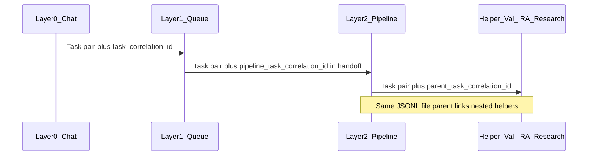

# Canonical Task hand-off and agent comms log

## Goal

Introduce a **single canonical contract** for recording **all** orchestration-relevant **Cursor `Task` invocations**:

- **Layer 0 → Layer 1** (dispatcher `Task(queue)`).
- **Layer 1 → Layer 2** (Queue → pipeline subagents; post–little-val Validator; PromptCraft).
- **Layer 2 → nested helpers** (pipeline → Validator, IRA, Research, or any other **whitelisted** nested `Task` per [Subagent-Safety-Contract](3-Resources/Second-Brain/Subagent-Safety-Contract.md)).

Each Task gets a **paired** `handoff_out` + `return_in` record (verbatim after sanitization). **Helper** rows **must** include `parent_task_correlation_id` (the `task_correlation_id` of the **caller’s** pipeline Task for that run) so the JSONL can be replayed as a tree, not only a flat list. This complements (does not replace) `nested_subagent_ledger` in returns and Run-Telemetry: ledger stays structured/attestation-focused; **task-handoff-comms** is the **full transcript** of Task prompts and returns.

## What already exists (positioning)

| Artifact                                                                                         | Role                                                       | Gap vs your ask                                                                             |
| ------------------------------------------------------------------------------------------------ | ---------------------------------------------------------- | ------------------------------------------------------------------------------------------- |
| [Subagent-Safety-Contract.md](3-Resources/Second-Brain/Subagent-Safety-Contract.md)              | Mandatory hand-off **shape** in prose; telemetry block     | No durable unified store of full text                                                       |
| [.technical/Run-Telemetry/](.technical/Run-Telemetry/)                                           | Per-run note + optional `## Nested subagent ledger`        | Per-run file, not a single append-only Task transcript                                      |
| [Nested-Subagent-Ledger-Spec](3-Resources/Second-Brain/Docs/slop/Nested-Subagent-Ledger-Spec.md) | Layer 2 nested Task steps inside pipeline **return**       | Not Layer 1 outbound prompts; not verbatim L1↔L2 Task bodies                                |
| `queue.mdc`                                                                                      | Says generate `parent_run_id`, build hand-off, call `Task` | **SHOULD** `dispatch_ledger` is mentioned in Safety Contract but not formalized as one file |

The new artifact **formalizes** the `dispatch_ledger` idea into a **named canonical log + spec**, aligned with your choice of **full verbatim** bodies.

## Design

### 1. Normative spec (canonical “what and how”)

Add `**[3-Resources/Second-Brain/Docs/Task-Handoff-Comms-Spec.md](3-Resources/Second-Brain/Docs/Task-Handoff-Comms-Spec.md)`** (official system doc location per [backbone-docs-sync](.cursor/rules/always/backbone-docs-sync.mdc)) defining:

- **Purpose:** Append-only audit of **Task** boundaries for orchestration (not a replacement for Run-Telemetry metrics or Watcher-Result UX).
- **Storage path:** `**.technical/task-handoff-comms.jsonl`** (machine-only, Obsidian-excluded, same family as `[prompt-queue.jsonl](.technical/prompt-queue.jsonl)` / `[queue-continuation.jsonl](.technical/queue-continuation.jsonl)`).
- **Write model:** **Two JSON objects per Task call** (same line or adjacent lines), linked by a shared `task_correlation_id` (UUID):
  - `record_type: "handoff_out"` — full verbatim **Task `prompt`** (after sanitization).
  - `record_type: "return_in"` — full verbatim **subagent return** message as seen by the caller (after sanitization).
- **Required fields (both):** `schema_version`, `task_correlation_id`, `record_type`, `iso_timestamp`, `from_actor`, `to_actor` (e.g. `layer0_chat` | `layer1_queue` | `layer2_roadmap` | `layer2_ingest` | `helper_validator` | `helper_ira` | `helper_research` …), `subagent_type` (Task enum value), `queue_entry_id`, `parent_run_id`, `project_id` (or `"-"`), `vault_root` (path string for portability).
- **Nested helpers:** `parent_task_correlation_id` **required** on both records of a helper Task pair — value = `**pipeline_task_correlation_id`** from the Layer 1 hand-off (the L1→L2 dispatch for this pipeline run). Omit or `null` for L0→L1 and L1→L2 top-level dispatches.
- **Sanitization:** Reuse the spirit of [Nested-Subagent-Ledger-Spec § Sanitization](3-Resources/Second-Brain/Docs/slop/Nested-Subagent-Ledger-Spec.md) (strip secrets, optional home paths); set `sanitization_rules_applied: string[]` on each record.
- **Large payloads:** Document soft cap (e.g. 512KiB per body); if exceeded, **still write the record** but set `body_truncated: true`, `body_sha256` of full pre-truncation content, and optional `overflow_path` under `.technical/Task-Comms-Overflow/` — so the canonical JSONL remains parseable even for huge hand-offs.
- **Scope of Task calls to log (normative):** **Every** `Task` in the goal list above — **including all nested helper Tasks** (Validator, IRA, Research, and any future whitelisted nested types). **No helper opt-out.** Relationship to `nested_subagent_ledger`: both may describe the same steps; ledger remains required for attestation and queue gates; comms log holds **verbatim** prompts and returns.

### 2. Registry updates (so the vault “knows” the file)

- **[Vault-Layout.md](3-Resources/Second-Brain/Vault-Layout.md)** — Add `.technical/task-handoff-comms.jsonl` (and overflow dir if used) to the `.technical` bullet list with one-line purpose.
- **[Logs.md](3-Resources/Second-Brain/Logs.md)** — New row in the logging table alongside Run-Telemetry / queue-continuation: path, writer (which layer), append-only, link to the spec.
- **[Subagent-Safety-Contract.md](3-Resources/Second-Brain/Subagent-Safety-Contract.md)** — Replace the vague “SHOULD maintain `dispatch_ledger`” with a **normative link** to `Task-Handoff-Comms-Spec` and the JSONL path; extend the **Telemetry** block in the mandatory hand-off to include `pipeline_task_correlation_id` (UUID generated by Layer 1 when dispatching this pipeline) so Layer 2 can set `parent_task_correlation_id` on every nested helper comms row. Keep the rest of the hand-off template as-is aside from this additive field.
- **[queue.mdc](.cursor/rules/agents/queue.mdc)** — In every Layer 1 `Task` dispatch (pipelines, post–little-val validator, PromptCraft): generate `task_correlation_id`, append `handoff_out` **before** `Task`, append `return_in` **after** return (or on failure, body = sanitized host/tool error). Mirror to `[.cursor/sync/rules/agents/queue.md](.cursor/sync/rules/agents/queue.md)`.
- **[dispatcher.mdc](.cursor/rules/always/dispatcher.mdc)** — When Layer 0 launches `Task(queue)`, same two-record pattern for L0↔L1.
- **Layer 2 pipeline agents** — **[.cursor/agents/*.md](.cursor/agents/)** and **[.cursor/rules/agents/*.mdc](.cursor/rules/agents/)** (at least roadmap, ingest, distill, express, archive, organize, research): wherever the agent **calls nested `Task`**, it must generate a **new** `task_correlation_id` for that helper call, set `parent_task_correlation_id` to the **pipeline run’s** correlation id (the id used when L1 dispatched this pipeline—passed in the hand-off block alongside `parent_run_id`), and append `handoff_out` / `return_in` around the nested `Task`. **PromptCraftSubagent** is only invoked from L0/L1; pipelines do not call it—no change for PromptCraft inside L2.
- Optional: **[Second-Brain-Config.md](3-Resources/Second-Brain/Second-Brain-Config.md)** — `task_handoff_comms.enabled` (default true) and caps for truncation; lets you disable without deleting rules.

### 3. Operational notes (in the spec, not code)

- **Retention:** JSONL grows quickly with verbatim text; document monthly rotate/archive to `4-Archives` or external backup (operator-triggered), similar spirit to [log-rotate skill](.cursor/skills/log-rotate/SKILL.md).
- **Security:** Same as ledger — treat file as sensitive; exclude from sync/publish if needed.
- **Dataview:** If `.technical` is excluded from Obsidian, note that queries won’t see the file unless you duplicate an index note in `3-Resources` (optional follow-up).

## Out of scope (this rollout)

- **Automated enforcement** outside agent instructions (no Cursor API hook); compliance is **rule-driven** like Run-Telemetry.
- Changing the **content** of hand-offs (only adding where to persist them).

## Implementation order

1. Author `**Task-Handoff-Comms-Spec.md`** (schema, examples, sanitization, overflow, scope).
2. Touch **Vault-Layout**, **Logs**, **Subagent-Safety-Contract**, **dispatcher**, **queue** (+ sync copy), optional **Config**.
3. Add a one-line **README** or pointer under `.technical/` if you want local discoverability (optional; spec remains canonical).

