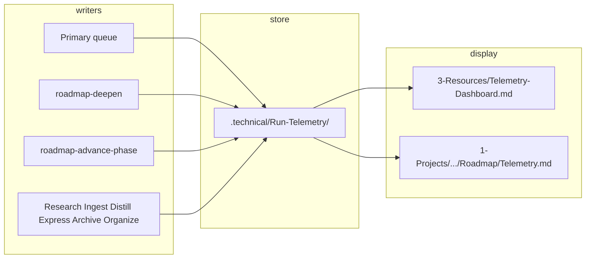

# Telemetry tracking wire plan

## Goal

Implement the wiring so that (1) every queue-dispatched run produces a Run-Telemetry note with required fields and optional fields when available, (2) hand-off explicitly provides `parent_run_id`, `queue_entry_id`, and `project_id` so subagents can write them, (3) success/error are mappable to the telemetry schema, (4) roadmap-deepen (and optionally advance-phase) reuse existing context metrics and Phase 2 cost, and (5) per-project telemetry views exist via Dataview filtered by `project_id`.

---

## 1. Hand-off contract: add telemetry fields

**File:** [3-Resources/Second-Brain/Subagent-Safety-Contract.md](3-Resources/Second-Brain/Subagent-Safety-Contract.md)

The mandatory hand-off template (Mandatory hand-off prompt structure) does not currently list `parent_run_id`, `queue_entry_id`, or `project_id`. Subagents need these in the hand-off to populate the Run-Telemetry required fields.

- Add a dedicated line (or short block) to the hand-off template, e.g.:
  - **Telemetry (copy into your Run-Telemetry note):** `parent_run_id: "<uuid>"`, `queue_entry_id: "<entry.id>"`, `project_id: "<id or '-'>"`, `timestamp: "<ISO8601>"`.
- Require the primary (queue rule) to always populate these in every hand-off so subagents do not have to parse the "Original request / queue entry" JSON to infer them.
- Optionally add one line to the "Return only" list: "Success / failure / #review-needed" so primary can map return to `success` and optional `error_category` / `error_message` when writing the primary Run-Telemetry note.

No change to Run-Telemetry schema; only make the hand-off the single source for these four fields.

---

## 2. Queue processor: parent_run_id and primary Run-Telemetry note

**File:** [.cursor/rules/agents/queue.mdc](.cursor/rules/agents/queue.mdc)

The rule already states: (1) generate `parent_run_id` per entry and include it in the hand-off, (2) write one Run-Telemetry note for primary after the Task tool returns.

- **Explicit hand-off contents:** In the "Build the complete hand-off block" bullet, require that the hand-off text **always includes** the telemetry block: `parent_run_id`, `queue_entry_id`, `project_id` (from entry or "-"), and a `timestamp` (e.g. queue entry timestamp or now in ISO8601). Reference the updated Subagent-Safety-Contract template.
- **Primary Run-Telemetry note:** Keep the current requirement (write one note to `.technical/Run-Telemetry/` with required fields + optional when available). Add: (1) **Ensure folder:** Before writing, ensure `.technical/Run-Telemetry/` exists (e.g. `obsidian_ensure_structure` for that path or parent `.technical/`). (2) **success:** Set `success` from the subagent return: if return says "Success" and no chain_request, use `success: "success"`; if "failure" or "#review-needed", use `success: "failure"` or `"partial"` and optionally set `error_category` / `error_message` (short, truncated). (3) **Naming:** Already `Run-YYYYMMDD-HHMMSS-<project_id>-primary.md`; if project_id is "-", use a slug like `no-project` or keep "-" in filename per Vault-Layout.
- **Chain mode:** Chain flow already generates `parent_run_id` and includes it in hand-offs; add the same "write one Run-Telemetry note for primary" after the primary subagent returns (with chain_id/segment in optional fields).

---

## 3. Roadmap-deepen: Run-Telemetry step and optional fields

**File:** [.cursor/skills/roadmap-deepen/SKILL.md](.cursor/skills/roadmap-deepen/SKILL.md)

The skill already has a Run-Telemetry step (after step 6 / update workflow_state). Tighten and extend:

- **Required fields:** Confirm they come from hand-off: `actor: roadmap`, `project_id`, `queue_entry_id`, `timestamp`, `parent_run_id`. If hand-off omits any, document fallback (e.g. from queue entry in context).
- **Folder:** Already says "Ensure `.technical/Run-Telemetry/` exists (obsidian_ensure_structure or create on first write)". Keep it; ensure the skill (or caller) performs this before writing.
- **Optional from existing data:** Explicitly map: `estimated_tokens`, `context_window_tokens`, `util_pct` (from context_util_pct just written), `chain_segment` (from hand-off or params), `workflow_state_link` (wikilink to workflow_state ## Log or last row). Optional: `tool_calls` (counts), `internals` (confidence, duration_sec, freeform).
- **Phase 2 (cost):** Document that when a rate table exists (e.g. Config or `3-Resources/Second-Brain/Telemetry-Model-Rates.md`), set `input_tokens` = estimated_tokens, `output_tokens` = 0 or rough estimate, `total_tokens`, and `cost_estimate_usd` from rate table; write to the Run-Telemetry note. No new computation; reuse existing workflow_state numbers.

---

## 4. Roadmap-advance-phase: add Run-Telemetry step

**File:** [.cursor/skills/roadmap-advance-phase/SKILL.md](.cursor/skills/roadmap-advance-phase/SKILL.md)

The skill does not currently mention Run-Telemetry.

- Add a step (e.g. after step 6 "Update workflow_state" and before or as part of step 7 "Log"): **Run-Telemetry:** Write one note to `.technical/Run-Telemetry/` with **required** fields only: `actor: roadmap`, `project_id`, `queue_entry_id`, `timestamp`, `parent_run_id` (from hand-off). Optional: `chain_segment`; context/token fields can be omitted (advance-phase does not compute context metrics). Naming: `Run-YYYYMMDD-HHMMSS-<project_id>-roadmap.md`. Ensure `.technical/Run-Telemetry/` exists before write. Reference Logs § Run-Telemetry and Vault-Layout.
- Hand-off: Caller (auto-roadmap) must pass `parent_run_id`, `queue_entry_id`, `project_id`, and `timestamp` in the context when invoking this skill so the skill can write the note.

---

## 5. Roadmap agent rule: pass telemetry fields to skills

**File:** [.cursor/rules/agents/roadmap.mdc](.cursor/rules/agents/roadmap.mdc)

- Ensure the roadmap subagent (when building context for roadmap-deepen and roadmap-advance-phase) **passes through** from the hand-off: `parent_run_id`, `queue_entry_id`, `project_id`, and a `timestamp` (e.g. from queue entry or now). These are already in the hand-off once queue includes the telemetry block; the roadmap rule should state that when invoking roadmap-deepen or roadmap-advance-phase, the agent provides these so the skills can write the Run-Telemetry note.
- No new steps; only an explicit requirement that these fields are available to the skills (from hand-off).

---

## 6. Other subagents: ensure folder and required fields from hand-off

**Files:** [.cursor/rules/agents/ingest.mdc](.cursor/rules/agents/ingest.mdc), [.cursor/rules/agents/distill.mdc](.cursor/rules/agents/distill.mdc), [.cursor/rules/agents/express.mdc](.cursor/rules/agents/express.mdc), [.cursor/rules/agents/archive.mdc](.cursor/rules/agents/archive.mdc), [.cursor/rules/agents/organize.mdc](.cursor/rules/agents/organize.mdc), [.cursor/rules/agents/research.mdc](.cursor/rules/agents/research.mdc)

Each already has a "Run-Telemetry" step before return. Standardize:

- **Required fields:** Come from hand-off: `parent_run_id`, `queue_entry_id`, `project_id` (or "-"), `timestamp`. Add one line: "Read `parent_run_id`, `queue_entry_id`, and `project_id` from the hand-off block for this run; use them in the Run-Telemetry note."
- **Ensure folder:** Add: "Before writing, ensure `.technical/Run-Telemetry/` exists (e.g. obsidian_ensure_structure)." So the first writer in a session creates the folder.
- **Optional:** Keep "optional: context, tool_calls, internals when available". No schema change.

---

## 7. Success and error mapping (primary and subagents)

**File:** [3-Resources/Second-Brain/Logs.md](3-Resources/Second-Brain/Logs.md) (Run-Telemetry section) or [3-Resources/Second-Brain/Subagent-Safety-Contract.md](3-Resources/Second-Brain/Subagent-Safety-Contract.md)

- In **Logs § Run-Telemetry** (or a short "Success mapping" subsection), document:
  - Subagent return "Success" → `success: "success"`.
  - "failure" or "#review-needed" → `success: "failure"` or `"partial"`; when not success, primary (or subagent) may set `error_category` (e.g. "tool_error", "confidence-below-threshold", "parse_error") and truncated `error_message`.
- In **Subagent-Safety-Contract** "Return only" bullet, optionally add: "Use exact phrases **Success** or **failure** or **#review-needed** so the queue processor can set Run-Telemetry `success` and optional `error_category`." This keeps parsing simple for the primary.

---

## 8. Per-project telemetry view

**Option A — Dedicated note per project (recommended)**

- **New template or doc:** Add a short reference in [3-Resources/Second-Brain/Vault-Layout.md](3-Resources/Second-Brain/Vault-Layout.md) (or a small "Per-project telemetry" note under Second-Brain): per-project view = a note at `1-Projects/<project_id>/Roadmap/Telemetry.md` with frontmatter `project_id: <project_id>` and a Dataview block that queries `.technical/Run-Telemetry` with `WHERE project_id = this.project_id`, sorted by `file.mtime DESC`. Columns: actor, success, util_pct, total_tokens, cost_estimate_usd (when present), file.mtime.
- **Creation:** Document that when a new project (or its Roadmap) is created (e.g. roadmap-generate-from-outline or manually), the project may include a `Telemetry.md` with the above content; or the user can add it once. No mandatory auto-creation in this plan unless you want roadmap-generate-from-outline to create an empty Telemetry.md stub.

**Option B — Section in workflow_state**

- Document in Vault-Layout (or Run-Telemetry plan): Alternatively, a project may embed in `workflow_state.md` a "## Run telemetry (this project)" section with a Dataview table: `FROM ".technical/Run-Telemetry" WHERE project_id = split(this.file.folder, "/")[1] SORT file.mtime DESC`. No new file; path-derived project_id.

Recommend **Option A** for clarity (one note = one view) and **Option B** as optional for projects that prefer a single Roadmap doc.

---

## 9. Phase 2: cost and rate table (optional, follow-up)

- **Rate table:** Add a small reference doc (e.g. `3-Resources/Second-Brain/Telemetry-Model-Rates.md`) or a subsection in Config: model id → input $/1K tokens, output $/1K tokens (or single rate). roadmap-deepen (and any subagent that has estimated_tokens) can then compute `cost_estimate_usd` and write it to the Run-Telemetry note.
- **Scope:** Document in Logs § Run-Telemetry and in roadmap-deepen that when the rate table exists, populate `input_tokens`, `output_tokens` (0 or estimate), `total_tokens`, and `cost_estimate_usd`. Implementation can be a follow-up task after required-field wiring is done.

---

## 10. Summary: what gets written where

| Writer                                                    | When                                                        | Required fields                                                                         | Optional (when available)                                                                                                                                           |
| --------------------------------------------------------- | ----------------------------------------------------------- | --------------------------------------------------------------------------------------- | ------------------------------------------------------------------------------------------------------------------------------------------------------------------- |
| **Primary**                                               | After each queue dispatch (and after chain primary returns) | actor: primary, project_id, queue_entry_id, timestamp, parent_run_id                    | success, error_category, error_message, chain_segment, model                                                                                                        |
| **Roadmap (deepen)**                                      | After updating workflow_state                               | From hand-off: project_id, queue_entry_id, timestamp, parent_run_id; actor: roadmap     | estimated_tokens, context_window_tokens, util_pct, chain_segment, workflow_state_link, tool_calls, internals; Phase 2: input/output/total_tokens, cost_estimate_usd |
| **Roadmap (advance-phase)**                               | After updating workflow_state                               | Same required from hand-off; actor: roadmap                                             | chain_segment                                                                                                                                                       |
| **Research, Ingest, Distill, Express, Archive, Organize** | Before return                                               | From hand-off: parent_run_id, queue_entry_id, project_id, timestamp; actor per pipeline | context, tool_calls, internals, success                                                                                                                             |

All notes: YAML frontmatter only; path `.technical/Run-Telemetry/`; naming `Run-YYYYMMDD-HHMMSS-<project_id>-<actor>.md`. Ensure `.technical/Run-Telemetry/` exists before first write in a run.

---

## 11. Data flow (high level)

Hand-off (from primary) supplies `parent_run_id`, `queue_entry_id`, `project_id`, `timestamp` to all subagents so they can write required fields without parsing the queue entry.

---

## Implementation order

1. **Subagent-Safety-Contract:** Add telemetry block to mandatory hand-off template.
2. **Queue (queue.mdc):** Explicit hand-off contents (telemetry fields); primary Run-Telemetry note with folder ensure and success/error mapping; chain mode primary note.
3. **Logs.md:** Success/error mapping for Run-Telemetry.
4. **roadmap-deepen:** Confirm Run-Telemetry step and optional fields; document Phase 2 cost.
5. **roadmap-advance-phase:** Add Run-Telemetry step; document hand-off requirements.
6. **Roadmap agent rule:** Pass telemetry fields from hand-off to skills.
7. **Other subagent rules (ingest, distill, express, archive, organize, research):** Required from hand-off; ensure folder.
8. **Vault-Layout (or Second-Brain doc):** Per-project view (Telemetry.md template + optional workflow_state section).
9. **Phase 2 (later):** Rate table and cost_estimate_usd in roadmap-deepen and any other actor with token estimates.

