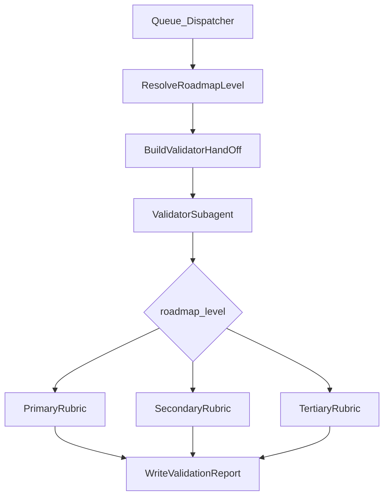

## Goal

Teach the ValidatorSubagent a clear “roadmap altitude” mental model so its `recommended_action` doesn’t jump straight to low-level implementation detail when it’s validating a primary (highest-level) roadmap.

## Current state (evidence)

- Phase roadmap notes already carry frontmatter `roadmap-level: primary|secondary|tertiary` (example: `1-Projects/genesis-mythos-master/Roadmap/Phase-1-conceptual-foundation-and-core-architecture/Phase-1-conceptual-foundation-and-core-architecture-Roadmap-2026-03-18-0412.md`).
- The validator’s `roadmap_handoff` logic does not currently have an explicit altitude model; it runs a generic hostile pass and tends to recommend implementation-oriented artifacts (interfaces/tests/risk register) regardless of altitude.

## Design: “Altitude-aware hostile review”

- **Signal**: derive a canonical `roadmap_level` for a validation run.
  - Primary source: phase note frontmatter `roadmap-level` (hyphen key) on the phase(s) being validated.
  - Secondary sources (fallbacks): `roadmap-state.md` frontmatter (if you later add it), or explicit queue params for the validation entry.
  - Normalize to a single internal string: `primary | secondary | tertiary`.
- **Behavior change**: in `validation_type: roadmap_handoff` (and optionally `roadmap_handoff_auto`), branch the hostile-review rubric and the `recommended_action` template by `roadmap_level`.

### Level-specific rubrics (what “good” looks like)

- **Primary (highest altitude)**
  - Hostile checks focus on: decomposition boundaries, dependency roadmap stubs, roll-up gates, decision loci, terminology consistency, and “what gets validated where.”
  - Acceptable outputs: “secondary roadmap stubs + deliverables + phase gates + decision log anchors,” not detailed API signatures.
  - `recommended_action` should typically instruct: create/define secondary workstreams and their contracts back to primary; only require interface specs when they are explicitly delegated to a secondary.
- **Secondary (workstream/subsystem altitude)**
  - Hostile checks focus on: subsystem boundary definition, interface sketches, acceptance criteria, risk register v0, and mapping to primary phase outcomes.
  - `recommended_action`: refine interface specs + testable acceptance criteria for the subsystem boundary.
- **Tertiary (implementation slice altitude)**
  - Hostile checks focus on: concrete task breakdown, test plan, explicit decisions, and readiness-to-execute artifacts.
  - `recommended_action`: implementation-ready details (interfaces, tests, risk register, sequencing).

## Implementation approach (minimal, coherent changes)

1. **Extend validator hand-off schema for roadmap validations**
  - Update docs and contracts so `ROADMAP_HANDOFF_VALIDATE` / `VALIDATE(roadmap_handoff_auto)` hand-offs may include:
    - `roadmap_level` (canonical) and/or raw detected `roadmap-level` values from phase notes.
  - Keep backward compatibility: if absent, infer from phase note frontmatter; if still unknown, default to `secondary` (or “unknown” with conservative recommendations).
2. **Teach Queue/Dispatcher to pass `roadmap_level` when it can**
  - In `/.cursor/rules/agents/queue.mdc`, when building the validator hand-off for `ROADMAP_HANDOFF_VALIDATE` and for post–little-val `roadmap_handoff_auto`, add a small “resolve roadmap_level” step:
    - If queue entry has `params.roadmap_level`, use it.
    - Else, read the target phase note(s) (already identified via project_id/state) and pull `roadmap-level` from frontmatter, then pass canonical `roadmap_level` in the hand-off.
  - This ensures the validator subagent gets the altitude signal even when the user didn’t explicitly pass it.
3. **Update ValidatorSubagent logic to use altitude model**
  - In `/.cursor/rules/agents/validator.mdc` (and mirrored `/.cursor/agents/validator.md`), add:
    - A short section defining the three roadmap levels and what artifacts are expected at each.
    - Branching behavior in `validation_type: roadmap_handoff` (and optionally `roadmap_handoff_auto`) to generate:
      - Level-specific findings headings
      - Level-specific “missing edges” definitions
      - Level-specific `recommended_action` templates
4. **Documentation updates (source of truth)
  - Update `3-Resources/Second-Brain/Validator-Reference.md` with:
    - The new `roadmap_level` field for roadmap hand-offs.
    - The altitude-aware rubric summary (primary/secondary/tertiary expectations).
  - Optionally add a short note in `3-Resources/Second-Brain/Queue-Sources.md` under ROADMAP_HANDOFF_VALIDATE about optional `params.roadmap_level`.
5. **(Optional) Add a lightweight “secondary roadmap stubs” recommendation format**
  - Provide a canonical snippet the validator can request for primary-level next steps, e.g. a “Secondary Roadmaps” section with:
    - `Name`, `Owner`, `Outputs`, `Gate back to primary`, `Decision anchors`.
  - This is purely recommendation text; it doesn’t require that secondary roadmaps already exist.

## Acceptance criteria

- When validating a phase note with `roadmap-level: primary`, the validator’s `recommended_action` prioritizes **decomposition + secondary roadmap stubs + roll-up gates** over demanding immediate interface specs/tests.
- When validating `roadmap-level: secondary` or `tertiary`, the validator’s current “interfaces/acceptance criteria/risk register” recommendations remain appropriate and become more targeted.
- Backward compatibility: existing validation entries without `roadmap_level` still work (validator infers from frontmatter when present; otherwise defaults conservatively).

## Files likely to change

- `.cursor/rules/agents/validator.mdc`
- `.cursor/agents/validator.md`
- `.cursor/rules/agents/queue.mdc` (hand-off enrichment)
- `3-Resources/Second-Brain/Validator-Reference.md`
- (Optional) `3-Resources/Second-Brain/Queue-Sources.md` (document `params.roadmap_level`)

## Data flow (high level)

