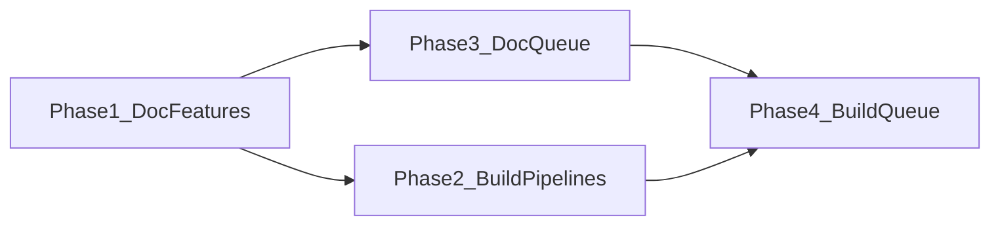

# Phased rollout: tiered validator blocks and queue pivots

This plan supersedes the conversational “tiered_validator_block_handling” intent as an **execution roadmap**. It incorporates: **reason-code–aware handling**, **split safety codes**, **contradiction follow-ups via queue**, **bounded incoherence handling**, **hard blocks for severe state**, and **scoped blocks with pivot to non-blocked loops** (a block in one slice does not freeze unrelated work).

### Repair-first queue policy (cross-cutting)

When a validator hard block or surviving **contradiction** applies to a **scoped** area, Layer 1 must **not** imply “stop the whole vault,” but **within the same blocked scope** it **must prefer reconciliation before more deepen** on that spine.

- **Same blocked scope** (same `project_id` and any phase/slice ids in `blocked_scope` / validator report): **repair-first** — schedule **targeted** follow-up entries (e.g. `RESUME_ROADMAP` with `action: recal` or `handoff-audit`, optional `sync-outputs`) **before** any further `RESUME_ROADMAP` **deepen** (or other advancing actions) for that scope. Rationale: contradictions and severe truth forks should not be buried under new narrative.
- **Orthogonal work:** **continue** — other `project_id`s, or entries with **no dependency** on the blocked contract, may run in normal canonical order without waiting for repair of project A.
- **Implementation note:** Today, `RECAL-ROAD` normalizes to `RESUME_ROADMAP`, so **deepen** and **recal** share the same canonical mode bucket; **file order alone does not guarantee repair-before-deepen**. Phase 3/4 must define **explicit tie-breaking** (e.g. `queue_priority` / `validator_repair_followup: true` / sub-sort by `params.action` for same `project_id`, or a pinned meta-entry pattern analogous to `CHECK_WRAPPERS`).

---

## Phase 1 — Document the plan features

**Goal:** Single source of truth in vault docs before any rule/skill edits.

**Deliverables (under [3-Resources/Second-Brain/Docs/](3-Resources/Second-Brain/Docs/) or [3-Resources/Second-Brain/](3-Resources/Second-Brain/) as appropriate):**

1. **Feature spec note** (new), e.g. `Docs/Validator-Tiered-Blocks-Spec.md`:
  - Definitions: **incoherence** (restated-boundary test), **contradiction**, **safety-critical vs safety-unknown**, **severe state hygiene**.
  - **Closed-set `reason_codes`** (extend [Validator-Reference.md](3-Resources/Second-Brain/Validator-Reference.md) by reference): `contradictions_detected`, `state_hygiene_failure`, `safety_critical_ambiguity`, `safety_unknown_gap`, `incoherence` (or equivalent stable id), plus **primary_code** rule when multiple codes appear.
  - **Action matrix:** each code → `recommended_action` (block vs needs_work), pipeline Success gate, and **allowed pivot** (non-blocked loop).
  - **Scoped block contract:** block applies to `(project_id, phase/slice scope, validation_type)`; what may still run (other projects, other phases, recal/handoff-audit/sync-outputs, resource ingest/distill) and what must not (e.g. deepen **downstream of** a contradicted spine without explicit scope).
  - **Repair-first (same scope):** document the rule above; list **allowed repair actions** and that they **preempt** further deepen for the same `project_id` (and slice when specified) until repair completes or human overrides.
  - **Chained queue entries:** behavior when primary is hard-blocked (abort chain vs allow completed deps).
2. **Update [Validator-Reference.md](3-Resources/Second-Brain/Validator-Reference.md)** — “True BLOCK” section aligned with the matrix (split safety; incoherence vs contradiction; pointer to full spec).
3. **Update [Subagent-Layers-Reference.md](3-Resources/Second-Brain/Docs/Subagent-Layers-Reference.md)** (or [Backbone](3-Resources/Second-Brain/Backbone.md) pointer) — one diagram or bullet flow: nested validator → IRA → final pass → **tiered outcome** → optional pivot.
4. **Backbone sync note** in plan: after Phase 1, optionally add a short entry to [Rules.md](3-Resources/Second-Brain/Rules.md) / [Pipelines.md](3-Resources/Second-Brain/Pipelines.md) “see Validator-Tiered-Blocks-Spec” (minimal pointer only in Phase 1).

**Exit criteria:** Spec is reviewable; no implementation dependency beyond reading existing Validator-Reference and queue contracts.

---

## Phase 2 — Build the features designed in the docs

**Goal:** Pipeline and validator **behavior** matches Phase 1 spec (no queue file rewrite logic yet except what already exists).

**Deliverables:**

1. **[.cursor/rules/agents/validator.mdc](.cursor/rules/agents/validator.mdc)** — Hostile pass instructions: map findings to **correct** `reason_codes` and **recommended_action** per spec (e.g. `safety_unknown_gap` → medium / needs_work; `safety_critical_ambiguity` → high / block_destructive).
2. **Pipeline subagent rules + agents** ([roadmap.mdc](.cursor/rules/agents/roadmap.mdc), [roadmap.md](.cursor/agents/roadmap.md), and parallel ingest/distill/express/archive/organize/research as in spec):
  - Final Success gate uses **tiered rules**: hard block only for codes flagged in spec; `needs_work` does not block Success where spec says so.
  - **Incoherence:** `#review-needed` and/or **one guided retry** path per Parameters (decrement counter in return metadata or frontmatter—exact mechanism per Phase 1 spec).
  - **Scoped block:** return metadata includes `blocked_scope` (project_id, paths or phase ids) so downstream consumers (and future queue) know what is frozen vs what remains allowed.
3. **[internal-repair-agent.md](.cursor/agents/internal-repair-agent.md)** / rule — Hand-off fields if new codes need different repair priors (optional; only if spec requires).
4. **[Tests-Validator.md](3-Resources/Second-Brain/Tests-Validator.md)** — Examples for each tier (contradiction vs incoherence vs safety_unknown vs state_hygiene).
5. **Parameters / Config** — e.g. `max_incoherence_retries`, `validator.tiered_blocks_enabled` (if you want a kill-switch), in [Second-Brain-Config.md](3-Resources/Second-Brain-Config.md) / [Parameters.md](3-Resources/Second-Brain/Parameters.md) as decided in Phase 1.
6. `**.cursor/sync/`** per [backbone-docs-sync.mdc](.cursor/rules/always/backbone-docs-sync.mdc) for every touched rule/skill.

**Exit criteria:** A human (or test checklist) can run a roadmap/deepen path and see tiered outcomes match the Phase 1 doc.

---

## Phase 3 — Document queue behavior changes

**Goal:** Exact Layer 1 contract **before** code/rule changes to dispatch.

**Deliverables:**

1. **[Queue-Sources.md](3-Resources/Second-Brain/Queue-Sources.md)** — New optional queue entry fields: e.g. `blocked_scope`, `validator_followup`, `queue_priority` (or equivalent tie-break field), `incoherence_retries_remaining`; JSON examples for **follow-up lines** (recal, handoff-audit) after `contradictions_detected`.
2. **[queue.mdc](.cursor/rules/agents/queue.mdc)** + **[auto-eat-queue.mdc](.cursor/rules/context/auto-eat-queue.mdc)** — Authoritative text for:
  - Post–little-val validator: **per reason_code** — append follow-up vs mark `queue_failed` vs **consume + append** (resolve prior ambiguity with A.7).
  - **Repair-first ordering:** after appending a repair follow-up for `(project_id, scope)`, define how sort/dispatch ensures it runs **before** other `RESUME_ROADMAP` lines for the **same** project (and scope when applicable). Document the **RECAL → RESUME_ROADMAP** normalization tie and the chosen fix (`queue_priority`, sub-sort, meta-entry, or in-run inject).
  - **Scoped block:** processing entry B is allowed when A is blocked if **no dependency** (and chain rules).
  - **Pivot loop:** on hard block, append **explicit** next entry (from spec whitelist: recal, handoff-audit, sync-outputs, alternate `params.phase`, etc.).
3. **[Logs.md](3-Resources/Second-Brain/Logs.md)** / Watcher — What gets logged when a pivot is scheduled vs hard-stop.
4. **Subagent-Safety-Contract** — Queue processor responsibilities for appending follow-ups (if not already implied).

**Exit criteria:** Another agent could implement Phase 4 from these docs alone.

---

## Phase 4 — Build the new queue behavior

**Goal:** Queue/Dispatcher implements Phase 3.

**Deliverables:**

1. **queue.mdc / auto-eat-queue.mdc** — Implement branching after pipeline return and after post–little-val Task return: read `severity`, `recommended_action`, `reason_codes` / `primary_reason_code` from validator return or telemetry; execute **append follow-up**, **processed_success_ids** policy, **chain** behavior.
2. **Repair-first sort** — Implement Phase 3 ordering so repair follow-ups for project P dispatch **before** other `RESUME_ROADMAP` deepen (or advancing) lines for P.
3. **Resolve A.7 tension** — Implement the chosen policy: e.g. **consume** primary entry on contradiction + append recal line, or **retain** with `queue_failed` until ack; document final behavior in Phase 3 doc if adjusted during build.
4. **Chained modes** — Implement “primary hard-blocked → …” per Phase 1 chained contract.
5. **Regression checks** — Repair-before-deepen scenario (same `project_id`) + Tests-Validator cross-checks + optional “Queue pivot examples” in Docs.
6. **Sync** `.cursor/sync/` and **changelog** for queue rules.

**Exit criteria:** End-to-end: queue entry → pipeline → validator → Layer 1 pivot or scoped stop matches Phase 3 doc.

---

## Dependency graph

Phase 4 depends on Phase 3 (queue contract) and should align with Phase 2 outputs (`blocked_scope`, reason_code surface in returns).

---

## Risk notes

- **Downstream deepen on a contradicted spine:** Keep the scoped-block / dependency rule prominent in Phase 1 spec to avoid silent debt.
- **Repair-first without sort changes:** Appending a recal line does not help if deepen stays ahead in the sort bucket; Phase 4 must implement Phase 3 tie-break.
- **Validator non-determinism:** Tiering assumes stable `reason_codes`; regression tests in Phase 2 reduce drift.

