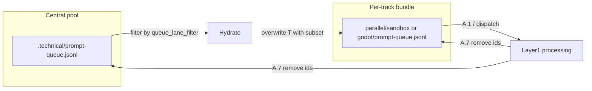

# Central pool fan-out for dual-track EAT-QUEUE

## Phases

- **Phase 1 (this plan, high-leverage):** Central pool hydration + dual A.7 pool cleanup — fixes empty per-track PQ / Prompt Crafter mismatch only.
- **Phase 2a (recommended next):** **Lane-scoped project root** — each track’s queue and agents resolve to a **single `1-Projects/<lane-project-id>/` tree** so roadmap truth (`roadmap-state.md`, `workflow_state.md`, `decisions-log.md`, MOC, phase notes) cannot cross-bleed between sandbox and godot chats.
- **Phase 2b (optional, heavier):** **Per-track technical artifacts** under `.technical/parallel/<track>/` (Watcher-Result, Errors mirror, GitForge lock sidecar, todo-orchestrator state if introduced) — reduces contention on global `3-Resources/`* and `.technical/.gitforge.lock` without moving PARA notes out of Projects.

---

## What Phase 1 does not solve (explicit)

Dual-track remains vulnerable where artifacts are still **global** or **shared**:

| Gap                             | Why hydration is insufficient                                                                                                                                                                                                   |
| ------------------------------- | ------------------------------------------------------------------------------------------------------------------------------------------------------------------------------------------------------------------------------- |
| **Roadmap / workflow truth**    | Same filenames under two different **project** folders (`sandbox-genesis-mythos-master` vs `godot-genesis-mythos-master`) still confuse operators; if `project_id` or hand-off is wrong, Layer 2 can still edit the wrong tree. |
| **Canonical Watcher-Result.md** | Best-effort interleaving; two chats append the same file.                                                                                                                                                                       |
| **Global logs / Errors.md**     | Shared; races = noisy or merged entries.                                                                                                                                                                                        |
| **GitForge**                    | Single vault `.git`; branch prefix helps commits but lock/temp paths may still contend unless per-track (Phase 2b).                                                                                                             |
| **Task(tool) injection**        | Cursor session variance is environmental; rules can only tighten hand-off contracts and scoping prompts.                                                                                                                        |

**Conclusion:** Phase 1 makes **queue input** correct. **Phase 2a** addresses the main **semantic** collision (wrong project folder). **Phase 2b** addresses **technical** collisions (telemetry, locks, logs).

---

## Problem (Phase 1)

With `[parallel_execution.enabled](3-Resources/Second-Brain/Second-Brain-Config.md)` and lane-filtered runs, **PQ** resolves to `[.technical/parallel/<track>/prompt-queue.jsonl](.cursor/rules/agents/queue.mdc)` while Prompt Crafter and many flows still append to `[.technical/prompt-queue.jsonl](.cursor/rules/context/plan-mode-prompt-crafter.mdc)`. There is no sync step, so track files stay empty and lane EAT-QUEUE no-ops.

## Target behavior

- **Pool** = legacy `.technical/prompt-queue.jsonl` (fixed path; optional future Config key if needed).
- **When**: `parallel_execution.enabled` is true, `default_to_legacy` is not true, and `**queue_lane_filter` matches a `parallel_execution.tracks[].lane`** (e.g. `sandbox`, `godot`). Skip when using legacy PQ (no lane, `default_to_legacy`, or lane not a configured parallel track).
- **Hydrate**: Read pool, parse JSONL lines into the same shape as `[QueueEntry](scripts/eat_queue_core/models.py)`, apply **the same lane subset rules** as `[filter_entries_by_lane](scripts/eat_queue_core/lanes.py)` / queue.mdc **A.2a** (track lane ∪ `shared`; exclude other tracks’ lines).
- **Write**: **Replace** the entire track **PQ** file with the serialized filtered lines (one JSON object per line, stable order e.g. pool order). This avoids duplicate accumulation and makes the track file a pure “inbox snapshot” derived from the pool.
- **Consumption (A.7)**: When removing consumed (and failed-as-consumed per existing rules) entry **`id`s from **PQ**, **also remove those ids from the pool file** so the next hydrate does not resurrect finished work. Implement as shared helper (extend `[apply_queue_cleanup](scripts/eat_queue_core/full_cycle.py)` or add `remove_ids_from_queue_file(pool_path, ids)` used from both Python bridge and documented Layer 1 behavior).

## Implementation

### 1. Python: `pool_sync` (CLI + library)

- Add e.g. `[scripts/eat_queue_core/pool_sync.py](scripts/eat_queue_core/pool_sync.py)` with:
  - `hydrate_track_pq_from_pool(*, vault_root: Path, lane_filter: str, target_pq: Path, pool_path: Path | None = None) -> PoolSyncResult` (counts, copied ids, optional dry-run).
  - Reuse `parse_queue_jsonl` / `load_queue_file` patterns from `[plan.py](scripts/eat_queue_core/plan.py)` (consider extracting a shared “lenient pool load” that skips bad lines with stderr warning vs strict CLI load — **pool read should be lenient** so one bad line does not block fan-out).
  - `python -m scripts.eat_queue_core.pool_sync --vault-root ... --lane sandbox --target-pq .technical/parallel/sandbox/prompt-queue.jsonl [--pool .technical/prompt-queue.jsonl] [--dry-run]`
  - Exit non-zero on I/O errors; stdout JSON summary for Layer 1 to cite in PQAUD / Watcher message.

### 2. Python: wire `full_cycle`

- At the start of `[run_full_eat_queue_cycle](scripts/eat_queue_core/full_cycle.py)`, when `lane_filter` is set, `target_pq != pool`, and new Config flag is enabled (see below), call `hydrate_track_pq_from_pool` **before** the first `load_queue_file(qpath)`.
- Pass the same `--lane` / paths Layer 1 already uses for **A.0.6** so orchestrator and LLM path stay aligned.

### 3. Layer 1 rules and agent doc

- In `[.cursor/rules/agents/queue.mdc](.cursor/rules/agents/queue.mdc)`, add **A.0.4 Central pool hydration (optional)** immediately after **A.0x** path resolution (before **A.0.5**):
  - Conditions (parallel track **PQ**, flag on).
  - **Mandatory** shell step from vault root: `python3 -m scripts.eat_queue_core.pool_sync ...` with `--lane` = `queue_lane_filter`, `--target-pq` = resolved **PQ**, `--pool` default legacy path.
  - On success: append **PQAUD** event (e.g. `pool_hydrate_applied`, `copied_count`, `lane`) per [Queue-Audit-Log-Spec](3-Resources/Second-Brain/Docs/Queue-Audit-Log-Spec.md) if audit enabled.
  - On script failure: log Errors.md + Watcher-Result **failure** and **stop** prompt-queue processing for that run (fail-closed).
- Extend **A.7** text: when this hydration applied (or whenever **PQ** is a parallel track path and flag is on), **remove consumed ids from both `PQ` and the central pool**.
- Mirror the same bullets in `[.cursor/agents/queue.md](.cursor/agents/queue.md)` “read/process prompt queue” preamble so the subagent instruction set matches the rule.
- Update `[.cursor/sync/rules/agents/queue.md](.cursor/sync/rules/agents/queue.md)` per backbone-docs-sync.

### 4. Config and docs

- Add under `queue:` in [Second-Brain-Config](3-Resources/Second-Brain/Second-Brain-Config.md) machine-readable YAML, e.g. `central_pool_fanout_enabled: true` (default **false** for safe rollout, or **true** if you want immediate fix — call out in plan for user choice).
- Optional: `central_pool_path: .technical/prompt-queue.jsonl` defaulting to legacy path.
- Update:
  - [Queue-Sources.md](3-Resources/Second-Brain/Queue-Sources.md) — parallel section: pool vs track PQ, hydrate step, A.7 dual removal.
  - [Python-Queue-Orchestrator.md](3-Resources/Second-Brain/Docs/Python-Queue-Orchestrator.md) — `pool_sync` + `full_cycle` precondition.
  - [Dual-track-EAT-QUEUE-Operator.md](3-Resources/Second-Brain/Docs/Dual-track-EAT-QUEUE-Operator.md) — “queue lines” bullet: prefer appending to **pool**; track file is hydrated, not manually curated when fan-out is on.

### 5. Tests

- Add tests under `[scripts/eat_queue_core/tests/](scripts/eat_queue_core/tests/)`: pool with sandbox+godot lines → hydrate sandbox → track file contains only sandbox∪shared; pool unchanged; second test A.7-style id removal removes from both files when helper is called twice.

## Risks and mitigations

| Risk                                           | Mitigation                                                                                                                                                                                                                                                                      |
| ---------------------------------------------- | ------------------------------------------------------------------------------------------------------------------------------------------------------------------------------------------------------------------------------------------------------------------------------- |
| Concurrent dual-track A.7 rewrites on **pool** | Document: last writer wins on rare collision; optional follow-up: file lock on pool during read-modify-write.                                                                                                                                                                   |
| Hydrate **overwrites** track PQ                | By design: do not hand-edit track `prompt-queue.jsonl` when fan-out is enabled; use pool only.                                                                                                                                                                                  |
| Lenient pool parse hides bad JSON              | Log warning + skip line; consider Errors.md only when count > 0 of skipped lines.                                                                                                                                                                                               |
| `shared` entries visible to **both** lanes     | Existing A.2a semantics: both hydrates copy `shared`; first successful A.7 removes id from pool — **second track may miss that entry** if it already consumed. Document: use `**shared`** only for idempotent or explicitly coordinated work, or serialize `shared` processing. |

## Phase 2a — Lane-scoped project root (A.0z) — spec only until Phase 1 ships

**Intent:** Enforce **spatial isolation** in PARA: for `queue_lane_filter` matching a parallel track, all roadmap-class work uses **one** project directory (e.g. sandbox lane → `1-Projects/sandbox-genesis-mythos-master/`, godot → `1-Projects/godot-genesis-mythos-master/`). Avoids “same-looking” `roadmap-state.md` / `workflow_state.md` / `decisions-log.md` paths being resolved to the wrong sibling.

**Design:**

1. **Config:** Extend each `parallel_execution.tracks[]` row with `**lane_project_id`** (slug matching folder under `1-Projects/`) or `**lane_project_root`** (vault-relative path). Resolver: `lane_project_root = 1-Projects/<lane_project_id>/`.
2. **Hand-off (queue.mdc new A.0z, after A.0.4 pool hydration):** Every `Task` hand-off for pipeline modes includes `**## parallel_context`** (existing) plus:
  - `lane_project_root` (vault-relative)
  - `lane_project_id`
  - Optional `roadmap_dir` default `{{lane_project_root}}/Roadmap/`
3. **Downstream rules:** `[.cursor/agents/roadmap.md](.cursor/agents/roadmap.md)`, [validator](.cursor/rules/agents/validator.mdc), IRA, GitForge preamble: **operate only under `lane_project_root`** for state mutations; reject or `#review-needed` if `project_id` from queue entry **≠** configured `lane_project_id` for that lane (hard gate when parallel + track lane).
4. **Python:** `full_cycle` / enriched plan may emit `lane_project_root` into manifest metadata for operator visibility (optional).
5. **Docs:** [Dual-track-EAT-QUEUE-Operator.md](3-Resources/Second-Brain/Docs/Dual-track-EAT-QUEUE-Operator.md) — strengthen “one active project per track” into **mandatory Config mapping**; [Subagent-Safety-Contract](3-Resources/Second-Brain/Subagent-Safety-Contract.md) — telemetry paths may stay under `.technical/Run-Telemetry/<track>/` (already) but **state files** are under `lane_project_root`.

**Explicit non-decision for Phase 2a:** No copying `roadmap-state.md` into `.technical/parallel/` as source of truth — that forks human-visible truth. Canonical roadmap files stay in **1-Projects**.

---

## Phase 2b — Per-track technical isolation (A.0y-lite) — spec only

**Intent:** Remove last-writer-wins on **non-PARA** globals when both chats run.

**Candidate moves (each behind `parallel_execution.full_technical_isolation_enabled` or similar, default false):**

- **Watcher-Result:** Primary append target = `.technical/parallel/<track>/watcher-result.md` (canonical plugin path would need Config switch in `parallel_execution.watcher` — today canonical is single file; either per-track-only mirrors become primary for lane runs, or keep canonical + add aggregator doc).
- **Errors / pipeline logs:** Optional mirror under track bundle for lane runs, or prefix entries with `parallel_track` (lighter weight).
- **GitForge lock:** Per-track lock file under `.technical/parallel/<track>/gitforge.lock` (or subpath) so two tracks never block each other on the same inode; **vault still has one `.git`** — commits remain serialized by git itself; this only reduces tool-level lock starvation.

**Not required for “viable dual-track” if Phase 2a is strict:** Many teams accept shared Watcher + Errors if project roots never overlap.

**Staggering / global lock:** Document as **optional emergency** (`parallel_execution.global_stagger_seconds`) — defeats parallelism; prefer 2a + selective 2b.

---

## Non-goals

**Phase 1 non-goals:**

- Changing Prompt Crafter append path (pool remains correct target; no dynamic PQ resolution needed for MVP).
- Auto-splitting writes from Crafter into track files.
- Git worktrees / second checkout (still out of scope unless explicitly scheduled).

**Phase 2 non-goals (unless later approved):**

- Moving canonical Roadmap markdown out of `1-Projects/` into `.technical/`.
- Promising “100%” elimination of Cursor Task flakiness (host-dependent).
- Automatic merge / sync from track bundles back to a “master” roadmap (adds third truth).

