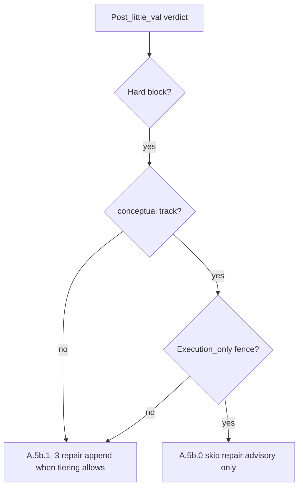

# Conceptual repair + execution-gap fence (corrected intent)

**Erratum (2026-03-30):** An earlier draft inverted the ask. It proposed “allow repair **only when** execution gap” — that is **the opposite** of the operator intent.

**Correct intent:**

- **Repair churn on conceptual is acceptable** — you want **room** for repair queue lines on conceptual when tiering allows, not a blanket “never repair because `missing_roll_up_gates`.”
- **“Gated around the execution gaps”** means: put a **fence** **around** **execution-only** debt (rollup/registry/CI-style, execution-deferred advisory) so those signals **do not** force the wrong outcome on conceptual — i.e. **execution gaps stay on the outside** of “real” conceptual repair churn, **not** that execution gaps **unlock** repair.

## Current behavior (unchanged facts)

1. **Config** `[3-Resources/Second-Brain-Config.md](3-Resources/Second-Brain-Config.md)`: `queue.conceptual_skip_auto_repair_primary_codes` lists `missing_roll_up_gates`, `safety_unknown_gap`, pseudo-code family codes.
2. **Rules** `[queue.mdc](.cursor/rules/agents/queue.mdc)` **A.5b.0**: On conceptual + listed `primary_code` + not unconditional hard block → **no** A.5b.1–3 append.
3. **A.5b.1–3** still require **hard block** first (~258); `**needs_work` alone** never triggers deterministic repair append today.

## Target policy (aligned with operator)

- **Conceptual:** Allow **repair churn** where post–little-val and tiering say repair — **except** when the validator outcome is **only** / **primarily** **execution-gap** advisory (fence those: **no** conceptual auto-repair chase for **execution-only** closure; defer to execution track or advisory Watcher copy).
- **Execution gaps** = **gated** = **quarantined** from driving **conceptual** auto-repair — **opposite** of “repair allowed iff execution gap.”

## Recommended design (corrected)

### Layer A — **Narrow** A.5b.0: fence **execution-only**, not blanket skip

- **Rename / split semantics** in Config (exact names TBD):
  - `**conceptual_execution_only_advisory_codes`** (or similar): when post–little-val is **needs_work** / tiered non-hard and **only** these codes (or dominant reason is execution-deferred), **apply** A.5b.0-style **skip** (advisory only; no repair append on conceptual for **that** shape).
  - **Remove** or **shrink** the current blanket list so **non–execution-only** conceptual outcomes (e.g. coherence / structural / non-rollup) **are not** blocked from repair path when **hard block** + A.5b.1 would otherwise run.
- **A.5b.0** text in `[queue.mdc](.cursor/rules/agents/queue.mdc)`: rewrite so **skip** applies when **execution-only fence** matches, **not** “any primary in a fat skip list.”

### Layer B — Optional **needs_work** path

- If you still want queue lines without hard block: branch only for **non–execution-only** conceptual cases (caps, config flag) — **not** “execution-gap allowlist triggers repair.”

### Layer C — **A.5b.5** remains optional

- Structural repeated-gap escalation; **forbidden** list for execution rollup on conceptual stays per existing **A.5b.5** spirit.

## Mermaid — decision flow (corrected)

## Documentation and config touchpoints

| Artifact                                                                                                                   | Change                                                                                            |
| -------------------------------------------------------------------------------------------------------------------------- | ------------------------------------------------------------------------------------------------- |
| `[Second-Brain-Config.md](3-Resources/Second-Brain-Config.md)`                                                             | Replace fat `conceptual_skip_auto_repair_primary_codes` with **fence** semantics + migration note |
| `[Parameters.md](3-Resources/Second-Brain/Parameters.md)`, `[Queue-Sources.md](3-Resources/Second-Brain/Queue-Sources.md)` | Document **execution-only fence** vs **conceptual repair allowed**; erratum on inverted draft     |
| `[queue.mdc](.cursor/rules/agents/queue.md)` + sync                                                                        | **A.5b.0** rewrite                                                                                |
| `[changelog](.cursor/sync/changelog.md)`                                                                                   | Entry                                                                                             |

## Implementation order

1. Document current contract + **erratum** (inverted draft).
2. Design **execution-only fence** detection (reason_codes dominance vs primary_code-only — needs one design pass).
3. Implement Config + **A.5b.0** rewrite + sync.
4. Optional needs_work branch **only** if still needed after hard-block path is fixed.

## What we will not do without explicit approval

- **Allow repair only when execution gap** (rejected — was the inversion).
- Remove all guards and reopen unbounded recal on conceptual without a fence.

