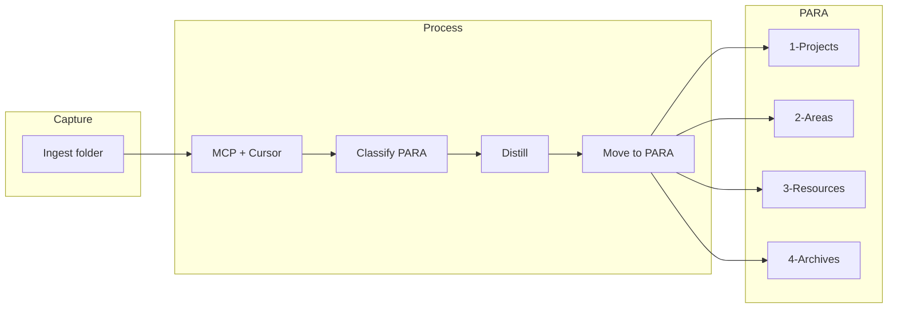

# Enhanced Holistic Tutorial for Curator Starter Kit

## Codebase context (main vault – post–massive changes)

The **main vault** (not the Starter Kit) now includes the following; the tutorial and Starter Kit should align or reference them where relevant.

- **Queue systems**
  - **EAT-QUEUE** ([auto-eat-queue.mdc](.cursor/rules/context/auto-eat-queue.mdc)): Reads `3-Resources/prompt-queue.jsonl` (or pasted EAT-CACHE YAML); dispatches by mode (INGEST, ORGANIZE, TASK-ROADMAP, DISTILL, EXPRESS, ARCHIVE, TASK-COMPLETE, ADD-ROADMAP-ITEM) in canonical order; appends to Watcher-Result; clears passed entries only; tags failed with `queue_failed: true`.
  - **PROCESS TASK QUEUE** ([auto-queue-processor.mdc](.cursor/rules/context/auto-queue-processor.mdc)): Reads `3-Resources/Task-Queue.md`; dispatches TASK-ROADMAP, TASK-COMPLETE, ADD-ROADMAP-ITEM, etc.; updates [Mobile-Pending-Actions.md](3-Resources/Mobile-Pending-Actions.md) and Watcher-Result; banner cleanup on affected notes.
- **Canonical docs**
  - [Workflows-Pipelines-Skills-Report.md](3-Resources/Workflows-Pipelines-Skills-Report.md) — single trigger → rule → pipeline table (includes EAT-QUEUE and PROCESS TASK QUEUE).
  - [3-Resources/Second-Brain/](3-Resources/Second-Brain/) — backbone docs (Rules, Skills, Pipelines, Queue-Sources, Vault-Layout, etc.); [backbone-docs-sync.mdc](.cursor/rules/always/backbone-docs-sync.mdc) keeps these and `.cursor/sync/` in sync when rules/skills change.
  - [Queue-Sources.md](3-Resources/Second-Brain/Queue-Sources.md) — prompt-queue.jsonl vs Task-Queue.md, modes, queue-cleanup.
- **Mobile**
  - [Mobile-Pending-Actions.md](3-Resources/Mobile-Pending-Actions.md), [Mobile-Toolbar-Task-Commands.md](3-Resources/Mobile-Toolbar-Task-Commands.md) — post-process status and toolbar commands; banner cleanup in auto-queue-processor.

**Starter Kit** will include mobile setup, sync, and toolbar (see § Mobile inclusion); queue and full Mobile-Pending-Actions remain in main vault until kit is extended. The tutorial can stay focused on core triggers (Process Ingest, ORGANIZE MODE, DISTILL MODE, etc.) for the 30–45 min path; **Advanced-Utilization** and **How-It-Works** should mention or link to queue and mobile as “next steps” when users move to the full main vault or when the Starter Kit is later extended with queue docs.

---

## Status assessment & polish (prioritized)

**Strengths:** Path corrections enforced (Ingest/ root, 1-Projects/, etc.); four-phase flow + seeds + archive automation preserved; separation of concerns (Starter Kit lightweight, queue/advanced mobile forward-linked); **mobile included as first-class** (Mobile-Setup, sync, toolbar, verify-on-mobile); Tutorial-Archive revisit mechanism; 30–45 min estimate; no breaking changes to rules/MCP/onboarding-archive.

**Intent:** Signposting should feel **aspirational** ("there's more power waiting") rather than "missing features." Community interest in autonomous second-brain setups makes this a good time to polish the tutorial as an entry point.

**Prioritized recommendations** (to implement with the content):

- **High-impact, low-effort (do first):** Warm forward-references in How-It-Works and Advanced-Utilization; "What's next after onboarding?" callout in Welcome-to-Curator; seed file realism (Project-Template frontmatter + Hands-On explanation).
- **Medium-impact, medium-effort:** Mini table in How-It-Works (Starter Kit vs Full Vault stages); Troubleshooting expansion with queue-adjacent gotchas.
- **Lower-priority:** Packaging README blurb; future stub files (prompt-queue.jsonl, Task-Queue.md) if queue/mobile merge into Starter Kit v2.

---

## Mobile (first-class inclusion)

Mobile is **in-scope** for the tutorial, not an afterthought. Include the following so the plan is not mobile-sterile.

- **Starter Kit mobile deliverables**
  - **Mobile-Setup.md** in `0-Onboarding/` (or a dedicated **Mobile** subsection inside Install-and-Setup.md): step-by-step for Obsidian mobile (iOS/Android), sync (iCloud, Obsidian Sync, or Git with a simple guide), and **mobile toolbar config** so users can trigger "Quick capture to Ingest" or "Process Ingest" from the phone. Link to or copy essentials from main vault's [Mobile-Toolbar-Task-Commands](3-Resources/Mobile-Toolbar-Task-Commands.md); if the kit has no toolbar config yet, add a minimal example (e.g. one button: new note in Ingest/).
  - **Sync guidance**: Short paragraph or callout: "Use iCloud, Obsidian Sync, or Git so the same vault is available on desktop (Cursor) and mobile. Desktop runs pipelines; mobile captures into Ingest/ and can trigger processing when you open Cursor later (or via Watcher if configured)."
  - **Mobile-Pending-Actions** in Starter Kit: either a **stub note** `3-Resources/Mobile-Pending-Actions.md` with a one-line description and "Updated by queue processors in the full vault; use this note to see pending actions once you upgrade," or a link from Mobile-Setup to the main-vault doc. Ensures mobile users have a clear place to look for status.
  - **Verify on mobile** checkpoint in Install-and-Setup (or Mobile-Setup): "Open the vault on your phone → create a note in Ingest/ (or use the toolbar) → confirm it appears in the vault. Process it later from Cursor (Process Ingest)."
- **Where it appears in the flow**
  - **Phase 2 (Setup)**: After desktop steps (Obsidian, plugins, MCP, Cursor), add step (7) **Mobile (optional but recommended)**: "Follow [[Mobile-Setup]]: install Obsidian mobile, set up sync, configure toolbar. Verify: capture a note to Ingest/ from your phone."
  - **Welcome / Why-Curator**: One line: "Capture on the go: set up mobile once (sync + toolbar) and send notes to Ingest/ from your phone."
  - **Troubleshooting**: Dedicated **Mobile** subsection: "Vault not showing on mobile?" → check sync (iCloud/Sync/Git); "Toolbar button missing?" → re-apply mobile toolbar config from Mobile-Setup; "Note stuck in Ingest?" → run Process Ingest from Cursor when back at desktop.
- **Not in scope for Starter Kit (remain forward-linked)**
  - Full queue processing (EAT-QUEUE, Task-Queue.md) and Mobile-Pending-Actions post-process updates from Cursor; one-tap "Process Ingest" from mobile (would require Watcher/backend). Tutorial makes clear: "Capture on mobile; process when you're at Cursor."

**Mobile-Setup.md content blueprint (core deliverable – write first)**  
Standalone, ~300–500 words. Structure:

- **H1:** Mobile Setup – Capture on the Go  
- Intro: Curator works cross-device; capture to `Ingest/` on phone, process later via Cursor/MCP on desktop (or when synced back).
- **Step 1: Install Obsidian Mobile** — iOS: App Store → Obsidian; Android: Google Play → Obsidian. Open same vault (via sync).
- **Step 2: Set Up Sync (choose one)** — iCloud (iOS/Mac, free): move vault to iCloud Drive on Mac → open in Obsidian iOS. Obsidian Sync (paid, cross-platform): Settings → Sync → Enable. Git (free, advanced): Obsidian Git plugin → repo → pull/push on mobile (or a-shell/iSH for auto on iOS). Test: create note on phone → confirm on desktop.
- **Step 3: Configure Mobile Toolbar** — On phone: Settings → Mobile → Manage toolbar options (gear at bottom when editing). Configure mobile toolbar (wrench) → Add: **New note** → folder `Ingest/`; **Command palette**; **Search**, **Graph view**. Optional: Commander/Note Toolbar for "Process Ingest" (see main vault Mobile-Toolbar-Task-Commands later).
- **Verify on Mobile** — Create test note in Ingest/ via toolbar → sync → on desktop run "Process Ingest" → watch move to PARA. Closing line: "Mobile captures → desktop processes. Full one-tap queue dispatch (Mobile-Pending-Actions) comes in the main vault upgrade."
- **See also:** [[Troubleshooting#Mobile]].

**Stub Mobile-Pending-Actions.md (3-Resources/)** — Use this exact wording:

```markdown
# Mobile-Pending-Actions (Placeholder)

This note tracks pending mobile-triggered actions (e.g., queued Process Ingest from toolbar).

**In the Starter Kit:** Not auto-updated yet — manually check `Ingest/` after capture.

**In full main vault:** Auto-updated by PROCESS TASK QUEUE / auto-queue-processor.mdc + banner cleanup.

**Upgrade path:** See Mobile-Toolbar-Task-Commands.md and Queue-Sources.md when ready.
```

---

## Scope and location

- **Primary target**: [Second-Brain-Starter-Kit/0-Onboarding/](Second-Brain-Starter-Kit/0-Onboarding/) (existing onboarding lives here; no `0-Onboarding` at main vault root).
- **Path conventions** (align with rules and [3-Resources/Cursor-Skill-Pipelines-Reference.md](3-Resources/Cursor-Skill-Pipelines-Reference.md)):
  - **Ingest** at **root**: `Ingest/` (not `1-Areas/Ingest/`).
  - **PARA**: `1-Projects/`, `2-Areas/`, `3-Resources/`, `4-Archives/`.
- **Branding**: Use "Curator" for user-facing tutorial titles (Welcome-to-Curator, Why-Curator). Keep "Second Brain" where it describes the system concept. Optional: rename zip to `Curator-Starter-Kit.zip` in packaging docs.
- **Existing flow**: [Second-Brain-Starter-Kit/.cursor/rules/context/onboarding-archive.mdc](Second-Brain-Starter-Kit/.cursor/rules/context/onboarding-archive.mdc) already handles "Onboarding complete" → archive `0-Onboarding/`** to `4-Archives/Onboarding-Complete/`. No change to that rule; new content will reference it.

---

## 1. Folder and file structure in `0-Onboarding/`

**Keep, then rename/expand:**


| Current                    | Action                                                                                                     |
| -------------------------- | ---------------------------------------------------------------------------------------------------------- |
| Welcome-to-Second-Brain.md | Replace with **Welcome-to-Curator.md** (entry point; link to Why-Curator).                                 |
| Install-Steps.md           | Expand and save as **Install-and-Setup.md**; keep or remove Install-Steps.md (redirect link from Welcome). |
| Basic-Examples.md          | Expand into **Hands-On-Examples.md**; keep Basic-Examples as thin redirect or merge.                       |
| Troubleshooting.md         | Expand in place (mobile, MCP, Cursor, logs).                                                               |


**Add new:**

- **Why-Curator.md** — Philosophy, benefits, PARA in plain language, why MCP/Cursor (safety, autonomy).
- **How-It-Works.md** — Ingest pipeline (drop in `Ingest/` → process), distill, Projects vs Areas, links to [Cursor-Skill-Pipelines-Reference](Second-Brain-Starter-Kit/3-Resources/Cursor-Skill-Pipelines-Reference.md).
- **Advanced-Utilization.md** — Batch distills, customization (e.g. `.cursor/skills/`), real-world scenarios (business, learning, personal), link to Resources-Hub and external tools.
- **Onboarding-Complete.md** — Single page: "You’re ready. Say **Onboarding complete** in Cursor to archive this folder to `4-Archives/Onboarding-Complete/`. Revisit anytime: [[Tutorial Archive]]" (or similar). Serves as the explicit trigger page.
- **Mobile-Setup.md** — First-class mobile: Obsidian mobile install, sync (iCloud / Obsidian Sync / Git), toolbar config (quick capture to Ingest/), verify-on-mobile checkpoint. Link or copy from main vault Mobile-Toolbar-Task-Commands; minimal example if kit has no config.
- **Seeds/** (subfolder):
  - **Test-Note.md** — Simple ingest test (e.g. short grocery list or "Learn Python" stub).
  - **Project-Template.md** — Pre-filled "Learn Python" (goals, tasks, frontmatter) for copy to `1-Projects/`. **Polish:** Include realistic frontmatter users will see processed, e.g. `type: project`, `status: active`, `priority: medium`, `tags: [learning, coding]`, `related_areas: [[2-Areas/Skill-Development]]`.
  - **Health-Notes.md** — Short Area-style seed (e.g. fitness/article summary) for distill demo.
  - **Config-Defaults.md** — Copy of or link to `3-Resources/Config-Defaults.md` (confidence bands, Highlightr) for reference.

**Tutorial Archive link (post-archive):**

- In **3-Resources**: add a short note (e.g. **Tutorial-Archive.md** or a section in [Resources-Hub](Second-Brain-Starter-Kit/3-Resources/README.md) / Resources-Hub if present) that links to `4-Archives/Onboarding-Complete/` with text like "Revisit the onboarding tutorial (archived)." The "Onboarding complete" flow does not create this link automatically; the plan includes adding this once, so the link exists after the first archive.

---

## 2. Phase-by-phase content (what each file must cover)

### Phase 1: Discovery (5–10 min) — Why

- **Welcome-to-Curator.md**
  - One-paragraph intro: Curator = Second Brain on Obsidian (capture, organize, distill).
  - PARA one-liner: Projects (time-bound), Areas (ongoing), Resources (reference), Archives (inactive).
  - "First step: write your Master Goal in a new note" (interactive).
  - One line on mobile: "Capture on the go: set up mobile once (sync + toolbar) and send notes to Ingest/ from your phone — see [[Mobile-Setup]]."
  - Next: "Read [[Why-Curator]] then [[Install-and-Setup]]."
  - **Polish (micro):** At the end, after the checkpoint, add **two** callouts: (1) *"What's next after onboarding? …"* (unchanged). (2) `**[!mobile] Mobile-first capture`** — *"Set up sync + toolbar once (see [[Mobile-Setup]]) and drop ideas into Ingest/ from anywhere. Process on desktop — your Second Brain works where you do."*
- **Why-Curator.md**
  - Benefits: less cognitive overload, productivity, "chaotic notes → AI-assisted knowledge base."
  - Philosophy: Tiago Forte PARA; AI (Cursor) + MCP for autonomous ingest, safety (backups, dry runs), scalability.
  - One line on mobile: "Capture on the go: set up mobile once (sync + toolbar) and send notes to Ingest/ from your phone."
  - Checkpoint: "Ready to set up? Go to [[Install-and-Setup]] (and [[Mobile-Setup]] when you want phone capture)."

### Phase 2: Setup (10–15 min) — Get it running

- **Install-and-Setup.md** (expand from current [Install-Steps.md](Second-Brain-Starter-Kit/0-Onboarding/Install-Steps.md))
  - Steps with short "Why" each: (1) Obsidian + open vault, (2) Plugins (Dataview, Highlightr, Local REST API, Watcher; optional Templater, etc.), (3) `.obsidian/` and **mobile toolbar** (see [Mobile-Setup](0-Onboarding/Mobile-Setup.md) for config + screenshot placeholder), (4) MCP config (`~/.cursor/mcp.json`: VAULT_PATH, BACKUP_DIR, SNAPSHOT_DIR, BATCH_SNAPSHOT_DIR), (5) Cursor + `.cursor/rules` and `.cursor/skills`, (6) Verify: `health_check`, `ensure_backup`, dry_run ingest test. (7) **Mobile (optional but recommended):** Follow [[Mobile-Setup]] — install Obsidian mobile, set up sync (iCloud / Obsidian Sync / Git), configure toolbar. Verify: capture a note to Ingest/ from your phone; process it later from Cursor (Process Ingest).
  - Reference **Seeds/Config-Defaults.md** for confidence bands / Highlightr.
  - Checkpoint: "All green? Put a note in `Ingest/` and run **Process Ingest** in Cursor. On mobile? Complete step (7) and capture once from your phone."

### Phase 3: Learning (10–15 min) — How + practice

- **How-It-Works.md**
  - Ingest: drop files in **Ingest/** → MCP/Cursor tags, organizes, distills.
  - Distill: summarize, link to projects; use "distill" for insights.
  - Projects vs Areas (temporary vs evergreen).
  - Point to `3-Resources/Cursor-Skill-Pipelines-Reference.md` and (in main vault) [Workflows-Pipelines-Skills-Report.md](3-Resources/Workflows-Pipelines-Skills-Report.md); MCP logs.
  - **Polish (warm forward-reference):** *"Once you're comfortable with single-note ingests, the full system adds powerful batch processing via EAT-QUEUE (prompt-queue.jsonl) and task queues — see Workflows-Pipelines-Skills-Report in the main vault for the complete picture. Mobile users get one-tap toolbar commands too (Mobile-Toolbar-Task-Commands)."*
  - **Optional (medium-effort):** Add a small table below the main ingest flowchart: | Stage | Starter Kit (Now) | Full Vault (Next) | — Single ingest: Drop → Process Ingest / Same + EAT-QUEUE dispatch; Batch/tasks: Manual triggers / prompt-queue.jsonl + Task-Queue.md; Mobile: Basic toolbar / Mobile-Pending-Actions + cleanup.
- **Hands-On-Examples.md**
  - **Basic Ingest**: Use `Seeds/Test-Note.md` → drop in **Ingest/** → "Process Ingest" → note moves to `1-Projects/…` or appropriate PARA.
  - **Project**: Copy `Seeds/Project-Template.md` to `1-Projects/`, run "ORGANIZE MODE." **Polish:** Explain *"After ORGANIZE MODE, watch how frontmatter helps Cursor/MCP classify and link — this is the foundation for smarter queues later."*
  - **Area distill**: Use `Seeds/Health-Notes.md` → trigger distill → result under `2-Areas/`.
  - **Resource**: Manual drop → distill into `3-Resources/`.
  - Checkpoint: "Try customizing the Python project and distilling a note. Then see [[Advanced-Utilization]] or [[Onboarding-Complete]]."

### Phase 4: Activation (5–10 min) — Go live

- **Advanced-Utilization.md**
  - Batch distills, weekly review, custom rules in `.cursor/skills/`, scenarios (business client pipeline, learning area, personal finance).
  - **Beyond the tutorial (main vault) — warm, motivational copy:** Subsection *"Ready for more automation?"* with bullet list: Batch & queued workflows → [[Workflows-Pipelines-Skills-Report]]; Mobile one-tap actions → Mobile-Pending-Actions & Mobile-Toolbar-Task-Commands; Queue sources explained → Queue-Sources. Closing line: *"These live in the main vault (or will be added to future Starter Kit versions). Start simple here — the core flow already gives you 80% of the magic."*
  - Ongoing: [[Resources-Hub]], external integrations (e.g. email → Ingest).
- **Onboarding-Complete.md**
  - "Say **Onboarding complete** in Cursor" → archives `0-Onboarding/` to `4-Archives/Onboarding-Complete/`.
  - "Revisit later: [[Tutorial Archive]]" (link to 3-Resources note that points to the archive path).

---

## 3. Implementation tasks (ordered)

1. **Create new files in `0-Onboarding/`**
  - Why-Curator.md, How-It-Works.md, Advanced-Utilization.md, Onboarding-Complete.md, **Mobile-Setup.md** (Obsidian mobile, sync, toolbar config, verify-on-mobile).
2. **Create `0-Onboarding/Seeds/`**
  - Test-Note.md, Project-Template.md (Learn Python), Health-Notes.md, Config-Defaults.md (or symlink/copy instructions to `3-Resources/Config-Defaults.md`).
3. **Replace Welcome and expand Setup/Learning**
  - Welcome-to-Curator.md (replace Welcome-to-Second-Brain.md or add and redirect; add mobile line + link to Mobile-Setup).
  - Install-and-Setup.md (expand from Install-Steps; add step (7) Mobile per § Mobile inclusion; link to Mobile-Setup).
  - Hands-On-Examples.md (expand Basic-Examples; reference Seeds and correct paths: Ingest/, 1-Projects/, 2-Areas/, 3-Resources/).
  - **Starter Kit 3-Resources:** Add stub **Mobile-Pending-Actions.md** using the exact wording in § Mobile (first-class inclusion) — "Placeholder" note with In Starter Kit / In full main vault / Upgrade path.
4. **Expand Troubleshooting**
  - Add: MCP/connection, Cursor rules, backup/snapshot paths, link to log files and Errors.md.
  - **Mobile (dedicated subsection):** "Vault not showing on mobile?" → check sync (iCloud / Obsidian Sync / Git). "Toolbar button missing?" → re-apply mobile toolbar config from [[Mobile-Setup]]. "Note stuck in Ingest?" → run Process Ingest from Cursor when back at desktop.
  - **Polish (queue-adjacent gotchas):** "Note didn't move after Process Ingest?" → Check MCP health_check; ensure ~/.cursor/mcp.json VAULT_PATH is correct. "Cursor not responding?" → Restart Cursor; verify .cursor/rules & .cursor/skills exist. "Want batch processing?" → That's in the full vault — start with single ingests here.
5. **Add Tutorial Archive link in 3-Resources**
  - New note `3-Resources/Tutorial-Archive.md` (or section in hub): "Archived onboarding: [[4-Archives/Onboarding-Complete/]]" (or equivalent path inside Starter Kit). Ensure cross-references in Onboarding-Complete.md and Welcome/Advanced point to this.
6. **Update internal links**
  - Welcome → Why-Curator, Install-and-Setup, **Mobile-Setup**; Install-and-Setup → Seeds/Config-Defaults, health_check, **Mobile-Setup** (step 7); How-It-Works → Pipelines Reference; Hands-On → Seeds; Advanced → Resources-Hub; Onboarding-Complete → Tutorial Archive; Troubleshooting → **Mobile** subsection + Mobile-Setup. Fix any incorrect paths (e.g. 1-Areas/Ingest → Ingest/, 2-Projects → 1-Projects/).
7. **Optional: Virginal testing.md**
  - Short note that the holistic tutorial extends the existing four-phase flow (Discovery → Setup → Learning → Activation), adds Why/How/Examples/Advanced and Seeds, 30–45 min target, and Tutorial Archive link. No obligation to change the rest of the virginal doc unless you want one source of truth.
8. **Optional: Queue/mobile and backbone**
  - In **Advanced-Utilization** (or a “Beyond the tutorial” subsection), add links to Workflows-Pipelines-Skills-Report, Queue-Sources, EAT-QUEUE, PROCESS TASK QUEUE, Mobile-Pending-Actions, Mobile-Toolbar-Task-Commands for users on the main vault or when the Starter Kit is extended. If the Starter Kit gains queue/mobile docs later, mirror or link to main-vault paths.
  - **backbone-docs-sync**: Adding or editing 0-Onboarding content does not require changes to backbone-docs-sync or 3-Resources/Second-Brain/; onboarding is user-facing. If rules or skills in the Starter Kit are modified, ensure .cursor/sync/ (or equivalent) is updated if the kit uses that pattern.

**Implementation order (final checklist – ready to ship)**  

1. Create **Mobile-Setup.md** (use blueprint in § Mobile (first-class inclusion)).
2. Add step (7) + links in **Install-and-Setup.md**.
3. Insert mobile one-liners in **Welcome-to-Curator.md** & **Why-Curator.md** (including `[!mobile] Mobile-first capture` callout).
4. Create/update **Seeds/Project-Template.md** with polished frontmatter + note in **Hands-On-Examples.md**.
5. Add stub **Mobile-Pending-Actions.md** in **3-Resources/** (exact wording in § Mobile).
6. Expand **Troubleshooting.md** mobile subsection + queue-adjacent gotchas.
7. Add **Tutorial-Archive.md** in **3-Resources/**.
8. Polish forward-references in **How-It-Works.md** (table + warm text) & **Advanced-Utilization.md** (incl. "Mobile power users" sentence).
9. Update repo **README** with suggested blurb.
10. Test full flow (desktop + simulated mobile capture via sync).

---

## 4. Packaging and docs

- **README / packaging**: If distributing as zip, document as "Curator-Starter-Kit.zip" and that onboarding is in `0-Onboarding/` with estimated 30–45 min. Link to GitHub for updates if applicable.
- **Polish (lower-priority):** README blurb: *"Curator-Starter-Kit.zip – Quick-start Obsidian vault for an AI-powered Second Brain. Follow 0-Onboarding/ for 30–45 min setup to your first autonomous ingest. Designed to grow: core flow here; advanced queues/mobile in the evolving main system. Issues / ideas → GitHub."*
- **Time estimate**: State in Welcome or Install-and-Setup: "About 30–45 minutes total, with optional deeper dives."
- **Future (Starter Kit v2):** If queue/mobile merge into Starter Kit later: add stub empty files (e.g. prompt-queue.jsonl, Task-Queue.md) with comment headers like "Placeholder – see main vault Workflows-Pipelines-Skills-Report for setup"; or defer until v2.

---

## 5. Diagram (optional for How-It-Works.md)




---

## 6. What not to change

- **onboarding-archive.mdc**: Keep as-is; it already scopes "Onboarding complete" to `0-Onboarding/`** and moves to `4-Archives/Onboarding-Complete/`.
- **PARA and pipeline rules**: No changes to globs or paths in `.cursor/rules` or pipeline reference; tutorial text only.
- **MCP or Cursor config**: Tutorial documents existing config (VAULT_PATH, BACKUP_DIR, etc.); no new env vars or tool contracts.
- **auto-eat-queue, auto-queue-processor, backbone-docs-sync**: No edits to these rules for the tutorial; the tutorial only references or links to queue/mobile docs and Workflows-Pipelines-Skills-Report where appropriate.

---

## 7. Summary


| Deliverable                   | Location                                                                                                                                                                          |
| ----------------------------- | --------------------------------------------------------------------------------------------------------------------------------------------------------------------------------- |
| New onboarding pages          | 0-Onboarding/Why-Curator, How-It-Works, Advanced-Utilization, Onboarding-Complete, **Mobile-Setup**                                                                               |
| Renamed/expanded              | Welcome-to-Curator, Install-and-Setup, Hands-On-Examples                                                                                                                          |
| Mobile (first-class)          | Mobile-Setup.md (sync, toolbar, verify-on-mobile); step (7) in Setup; Welcome/Why line; Troubleshooting Mobile subsection; stub Mobile-Pending-Actions in 3-Resources             |
| Seeds                         | 0-Onboarding/Seeds/ (Test-Note, Project-Template, Health-Notes, Config-Defaults)                                                                                                  |
| Tutorial Archive link         | 3-Resources/Tutorial-Archive.md (or hub section) → 4-Archives/Onboarding-Complete/                                                                                                |
| Expanded                      | Troubleshooting (mobile, MCP, Cursor, logs)                                                                                                                                       |
| Paths in all new/updated copy | Ingest/, 1-Projects/, 2-Areas/, 3-Resources/, 4-Archives/                                                                                                                         |
| Ready-to-ship micro-polish    | Mobile-Setup blueprint + stub wording in § Mobile; `[!mobile] Mobile-first capture` in Welcome; "Mobile power users" in Advanced-Utilization; implementation order checklist 1–10 |


This keeps the existing automation and archive flow, corrects path references, and turns the starter kit into a single, coherent 30–45 minute tutorial (why → setup → how → examples → advanced → complete) with a clear way to revisit the tutorial after it’s archived.