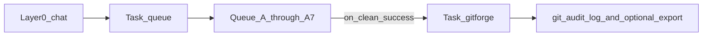

# GitForge (“Git Mastery”) — implementation plan

## Architecture placement (resolve GROK vs vault contract)

The GROK brief labels GitForge as **“Layer 2 class.”** In this vault, **[Subagent-Layers-Reference](3-Resources/Second-Brain/Docs/Subagent-Layers-Reference.md)** defines **Layer 2** as **queue-dispatched pipeline executors** (ingest, roadmap, …) that **must not** read/write queue files or own orchestration after dispatch.

**GitForge does not process a queue entry.** It runs **once** **after** [queue.mdc](.cursor/rules/agents/queue.mdc) **A.7** (and associated A.6 logging for the run) when the **overall** prompt-queue run is a **clean success** (no blocking failures, hygiene gates satisfied per existing queue rules). Therefore:

- **Document GitForge as a “Layer 1 post-run specialist”** (or “L1 tail hook”) invoked via `Task` from the Queue subagent — **not** as a new RESUME_ROADMAP-style Layer 2 pipeline.
- Optionally add a one-line note in the agent file: *“GROK ‘Layer 2 Git’ = operational class; vault index = L1 post-queue.”*




## 1. Agent artifact layout (shipping decision)

- **Single file, all lowercase:** `[.cursor/agents/gitforge.md](.cursor/agents/gitforge.md)` — YAML frontmatter (`name`, `description`, `model`, `background`) plus full contract (trigger payload, mode table, clarifier rules, branch policy, safety).
- **No subfolder** under `.cursor/agents/` for now; Cursor agent discovery is flaky with nested folders. Refactor to a folder **only after** the pattern is proven in production.
- **Optional:** `[.cursor/rules/agents/gitforge.mdc](.cursor/rules/agents/gitforge.mdc)` as a thin context rule (`globs: []`, `alwaysApply: false`) pointing at the agent file, consistent with other subagents.

## 2. Task tool / harden pass wiring

- **Subagent type string:** Use `**gitforge`** (lowercase, matches `roadmap`, `prompt_craft`, etc.).
- **[dispatcher.mdc](.cursor/rules/always/dispatcher.mdc)** and **[Subagent-Safety-Contract.md](3-Resources/Second-Brain/Subagent-Safety-Contract.md):** Extend the documented list of `subagent_type` values and the Task harden pass narrative so **Layer 1** may call `**Task(subagent_type: "gitforge")`** **after** queue success (same “attempt-before-skip” pattern as other types).
- **Fallback:** If the host rejects unknown enum values, document `**generalPurpose`** preamble fallback (GitForge contract in prompt) — same pattern as PromptCraft when enum is missing.

**Important:** Only **Queue (Layer 1)** invokes GitForge — not Layer 0 on every chat, not Layer 2 pipelines.

## 3. Queue rule hook (nervous system) — trigger scope

**Granularity (normative):** Invoke GitForge **exactly once** at the end of a **successful full prompt-queue run**, **after A.7** (queue rewrite) completes and the run is judged a clean success. **Do not** invoke GitForge:

- After each Python orchestrator pass, each Pass 1 / Pass 2 / Pass 3 wave, or each individual queue entry dispatch (“per eat pass”).
- Mid-run between A.6 and A.7.

Rationale: per-pass or per-entry hooks produce **noisy partial commits** and fight the mental model of “one EAT-QUEUE completion → one git tail.”

In **[queue.mdc](.cursor/rules/agents/queue.mdc)** and **[agents/queue.md](.cursor/agents/queue.md)**:

- **Scope:** **Prompt-queue flow only** by default (PROCESS TASK QUEUE parity only if explicitly added later).
- **Gate:** `gitforge.enabled` from Config (default `false` for safe rollout).
- **Inputs:** `effective_pipeline_mode` / `pipeline_mode` from hand-off or Config — map `**speed` → fast**, `**balance` → balance**, `**extreme` → extreme** ([Second-Brain-Config.md](3-Resources/Second-Brain/Second-Brain-Config.md)).
- **Payload:** Hand-off YAML/JSON matching GROK contract (`agent`, `mode`, `queue_success`, `changes_summary`, `branch_context`, `clarifier_input`).
- **Order:** `**Task(gitforge)`** after **A.7** and after Watcher-Result for the run is in good shape (Git state matches consumed queue).
- **Failure:** GitForge failure → **Errors.md** + optional Watcher-Result advisory; **do not** roll back queue consumption.

## 4. GitForge agent behavior (executable contract)

Implement in `**gitforge.md`** (normative):


| Mode    | Commit                                              | Tag                           | Push                | Export rsync                      | Clarifier                                                                                                                                                                                                                   |
| ------- | --------------------------------------------------- | ----------------------------- | ------------------- | --------------------------------- | --------------------------------------------------------------------------------------------------------------------------------------------------------------------------------------------------------------------------- |
| fast    | minimal `[fast] eat-queue pass` + optional one-word | no                            | yes if clean        | skip unless Config                | optional                                                                                                                                                                                                                    |
| balance | conventional + pass/mode                            | optional semver tag if Config | yes                 | optional per Config               | **required** if absent → subagent must **stop and ask** (return pending state) — note: **asking requires user turn**; document that balance/extreme may **return `status: pending_clarifier`** to Layer 1 for re-invocation |
| extreme | same as balance + changelog entry                   | as balance                    | yes + safety checks | **yes** (gmm-roadmap-export path) | **required** + explicit confirmation text in hand-off                                                                                                                                                                       |


**Rule-sterile engine branches** (from prior Cursor discussion):

- Treat `**iteration-2-roadmap-rules`** as canonical for `**.cursor/`** and spine `**Docs/`** sync in export workflow.
- On **engine** `branch_context`: **never** rsync `.cursor/` or core spine from a dirty tree; **refresh spine from iteration-2 tip** (git checkout paths or rsync from a dedicated clean worktree) before export — spell out exact commands in the agent doc referencing [git-push-workflow-2026-04-02-0446.md](3-Resources/Second-Brain/Docs/git-push-workflow-2026-04-02-0446.md).

**Audit:** Append structured lines to `**3-Resources/Second-Brain/Docs/git-audit-log.md`** (new note with frontmatter `created`, `tags`).

**Reality check for acceptance criteria:** Fully automated push requires **git credentials**, **network**, and often **non-sandbox** execution. The plan should state: *automation is “required attempt”; human may still need to approve push in hostile environments.* Semantic versioning tags and PR drafts may require **GitHub CLI** (`gh`) — gate behind Config.

## 5. Configuration

Add to **[Second-Brain-Config.md](3-Resources/Second-Brain/Second-Brain-Config.md)** (machine-readable block):

```yaml
gitforge:
  enabled: false
  export_repo_root: "/home/darth/Documents/gmm-roadmap-export"   # example
  vault_repo_remote: "origin"   # or document setup when missing
  integration_branch: "iteration-2-roadmap-rules"
  modes:
    fast: { tag: false, export_sync: false }
    balance: { tag: true, export_sync: false }
    extreme: { tag: true, export_sync: true, require_confirmation: true }
```

**Parameters.md** cross-link for keys.

## 6. Documentation updates

- **[git-push-workflow-2026-04-02-0446.md](3-Resources/Second-Brain/Docs/git-push-workflow-2026-04-02-0446.md):**  
  - New section **“GitForge contract (v1)”** — all post–EAT-QUEUE git/export attempts route through GitForge when enabled; no ad-hoc git from other agents.  
  - **Rule-sterile engine branches:** conditional Step 1 — on engine branch, omit or **only** copy `.cursor/` / spine `Docs/` from **integration tip** (document exact operator sequence).
- **[GitHub-Export-Repository-README.md](3-Resources/Second-Brain/Docs/GitHub-Export-Repository-README.md):** Short **clone expectations** (engine branches may omit or lag spine; use `iteration-2-roadmap-rules` for full rules).
- **[Rules.md](3-Resources/Second-Brain/Rules.md)** / **[Docs/Subagent-List.md](3-Resources/Second-Brain/Docs/Subagent-List.md)** (if present): add GitForge row.
- **backbone-docs-sync:** Mirror **gitforge.mdc** to [.cursor/sync/rules/agents/](.cursor/sync/rules/agents/) and append [.cursor/sync/changelog.md](.cursor/sync/changelog.md).

## 7. “Dual eat-queue” vs trigger (locked)

GROK’s “dual eat-queue” / multi-pass **internal** behavior (e.g. Python [full_cycle](scripts/eat_queue_core/full_cycle.py) Pass 1–3, cleanup pass, inline repair drain) is **one Layer 1 Queue Task** from the user’s perspective. **GitForge fires once** when that **whole** run finishes successfully **after A.7** — not once per internal pass, not once per dispatched entry. A **second** GitForge run only happens if the operator runs **another** EAT-QUEUE (second Queue Task) and that run also ends clean.

## 8. First-run cleanup (scope control)

Acceptance criterion *“first run cleans dirty iteration-2”* is **high risk** (large unstaged deletes in vault). **Phase rollout:**

1. Ship **GitForge disabled** (`enabled: false`); docs + agent + queue hook only.
2. Operator enables after review; **first manual** commit separates vault content from automation.
3. Then GitForge handles **incremental** post-queue sync.

## 9. Doc text deliverable (GROK’s optional ask)

Draft **exact** paragraphs for the two workflow docs **in the same PR** as the agent (no separate “instantiate first” needed) so the contract and clone expectations stay in sync.