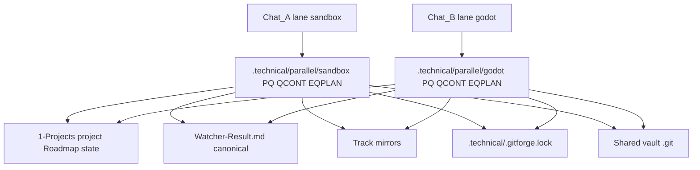

# Close the parallel dual-track gap

## Current state (already in repo)

- `**[.cursor/rules/agents/queue.mdc](.cursor/rules/agents/queue.mdc)**` **A.0x** resolves per-track **PQ**, **EQPLAN**, **QCONT**, **PQAUD**, **TMPR** when `parallel_execution` is on and Layer 0 supplies `**queue_lane_filter`** matching a configured track (or authoritative `**## parallel_context`** in the Task(queue) hand-off).
- `**[.cursor/rules/always/dispatcher.mdc](.cursor/rules/always/dispatcher.mdc)`** documents `**## parallel_context**` and per-track `**task-handoff-comms.jsonl**` paths.
- `**[3-Resources/Second-Brain/Second-Brain-Config.md](3-Resources/Second-Brain/Second-Brain-Config.md)**` holds the `**parallel_execution**` YAML (`tracks`, `gitforge.lock_timeout_seconds`, `watcher` mirrors).
- `**[.cursor/rules/agents/queue.mdc](.cursor/rules/agents/queue.mdc)**` **A.6** requires **canonical** Watcher-Result plus **mirror** append to `Watcher-Result-sandbox.md` / `Watcher-Result-godot.md` when mirrors are enabled.
- `**[.cursor/agents/gitforge.md](.cursor/agents/gitforge.md)`** specifies `**.technical/.gitforge.lock`** and skip-on-timeout behavior; **A.7a** in queue.mdc references it.

## Gap summary

| Area                                            | Risk                                                            | Mitigation in plan                                    |
| ----------------------------------------------- | --------------------------------------------------------------- | ----------------------------------------------------- |
| Per-track technical bundle                      | Low if lane + hand-off correct                                  | Doc + ritual                                          |
| Same `project_id` in both chats                 | **High** — `roadmap-state.md`, `workflow_state.md`, phase notes | **Policy**: one active project per track or serialize |
| Canonical Watcher-Result                        | Best-effort interleaving                                        | Already documented; operator expects it               |
| GitForge / git                                  | Concurrent commit/push                                          | Lock spec exists — **verify behavior**                |
| Global `.technical/control-plane-nightly.jsonl` | **A.5h** explicitly global — cross-track append                 | Optional v1.5: colocate or tag lines                  |
| Step 0 wrappers (`Ingest/Decisions/`**)         | Both chats scan same tree                                       | Optional v1.5: policy or scoping                      |
| Run-Telemetry filenames                         | Possible collisions                                             | Optional v1.5: subdir or prefix                       |

## Phase 1 — Operator contract (docs only)

1. Add `**[3-Resources/Second-Brain/Docs/Dual-track-EAT-QUEUE-Operator.md](3-Resources/Second-Brain/Docs/Dual-track-EAT-QUEUE-Operator.md)`** (name can be adjusted) covering:
  - **Must**: Each parallel chat uses `EAT-QUEUE lane sandbox` or `lane godot` (not bare `EAT-QUEUE` when dual-track is intended).
  - **Must**: Queue JSONL lines use correct `**queue_lane`** / `**shared`** semantics per [Queue-Sources](3-Resources/Second-Brain/Queue-Sources.md).
  - **Must-not**: Same `**project_id`** actively processed by **both** tracks at once (explain why — shared Roadmap files).
  - **Expect**: Canonical Watcher-Result may interleave; use **mirror** files for per-chat tails when debugging.
  - **Expect**: One track may **skip** GitForge with “lock held” — not a failure of the other track.
  - Links: **A.0x** / **A.6** / **A.7a**, dispatcher hand-off, Config `parallel_execution`, [git-push workflow](3-Resources/Second-Brain/Docs/git-push-workflow-2026-04-02-0446.md) if relevant.
2. Cross-link from `**[3-Resources/Second-Brain/Queue-Sources.md](3-Resources/Second-Brain/Queue-Sources.md)`** (queue lanes / parallel section) and `**[3-Resources/Second-Brain/Pipelines.md](3-Resources/Second-Brain/Pipelines.md)`** or `**[3-Resources/Second-Brain/Docs/EAT-QUEUE-Flow](3-Resources/Second-Brain/Docs/)`** (whichever exists as the EAT-QUEUE entry point) so discoverability is one hop.
3. Reconcile `**[.cursor/plans/parallel_dual-track_queue_f5fa4b95.plan.md](.cursor/plans/parallel_dual-track_queue_f5fa4b95.plan.md)**` checklist: mark items **completed** that are already true in rules (e.g. A.0x, A.6 mirrors, dispatcher) vs leave **pending** only for true follow-ups.

## Phase 2 — Verification (no behavior change unless broken)

1. **GitForge lock**: Run a short **two-chat dry ritual** (or single-chat double invoke): confirm the GitForge subagent **creates/releases** `.technical/.gitforge.lock` and on overlap returns `**skipped`** + audit/git log line as specified in [agents/gitforge.md](.cursor/agents/gitforge.md). If the subagent only *documents* lock behavior but does not enforce it in practice, file a **minimal** follow-up to align implementation with the spec (out of scope to guess here without running).
2. **Layer 0 hand-off**: Confirm each EAT-QUEUE with lane includes `**## queue_lane_filter`** and, when parallel is on, `**## parallel_context`** per dispatcher — one manual read of [dispatcher.mdc](.cursor/rules/always/dispatcher.mdc) vs actual Cursor Task prompt template in [.cursor/agents/queue.md](.cursor/agents/queue.md) if needed.

## Phase 3 — Optional v1.5 hardening (only if Phase 1–2 still hurt)

1. **Control-plane nightly ledger**: Extend spec so path defaults to `**dirname(PQ)/control-plane-nightly.jsonl`** when `parallel_track` is non-null, or add `**parallel_track`** to each JSONL row and keep a single file — pick one approach and update **A.5h** + [Control-Plane docs](3-Resources/Second-Brain/Docs/Control-Plane-Heuristics-v2.md) if referenced.
2. **Run-Telemetry**: Update [Subagent-Safety-Contract](3-Resources/Second-Brain/Subagent-Safety-Contract.md) / pipeline agents to write under `.technical/Run-Telemetry/<parallel_track>/` when `parallel_track` is present in the hand-off (otherwise legacy flat dir).
3. **Step 0 wrappers**: Add optional frontmatter key (e.g. `queue_lane: sandbox`) and a queue.mdc note: when `queue_lane_filter` is set, only process wrappers tagged for that lane or untagged (define default). This is the largest behavioral change — treat as last resort.

## Backbone sync

1. Any edits to `.cursor/rules/`** require `**[backbone-docs-sync](.cursor/rules/always/backbone-docs-sync.mdc)`**: mirror under `[.cursor/sync/](.cursor/sync/)` and a line in `[.cursor/sync/changelog.md](.cursor/sync/changelog.md)`.

## Out of scope (v2)

- Git **worktrees** / separate clones for same-project parallel roadmap (explicitly deferred in the existing parallel plan).

